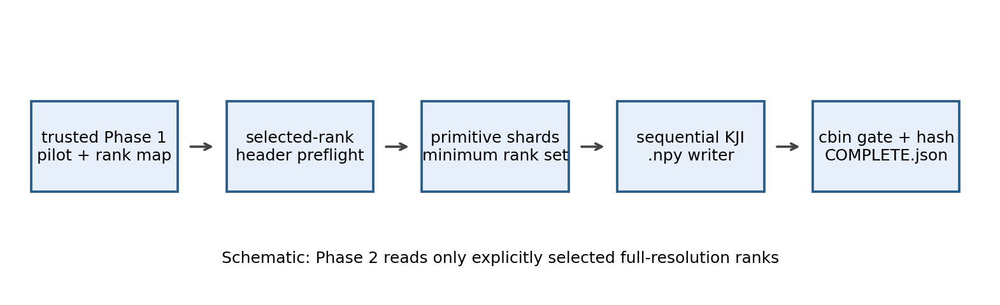
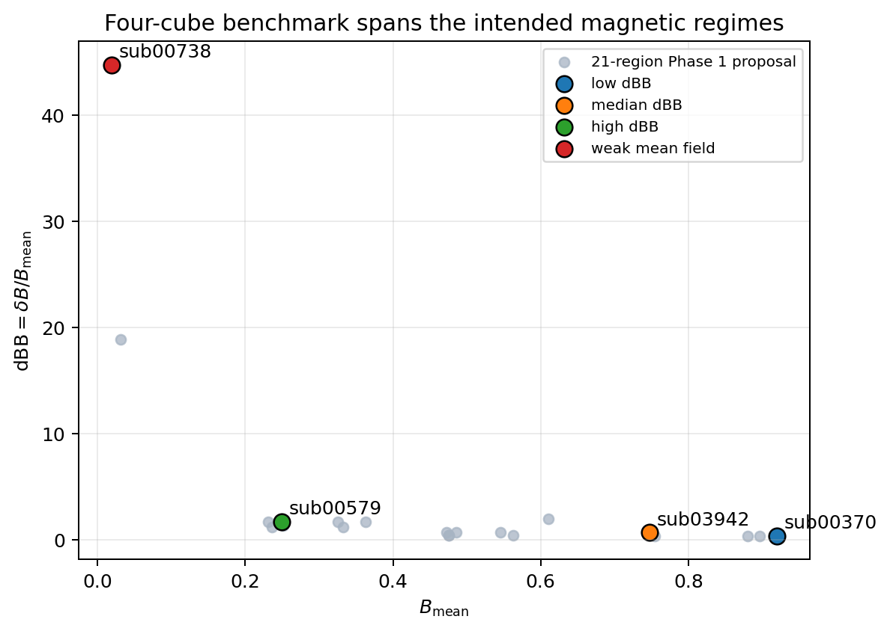
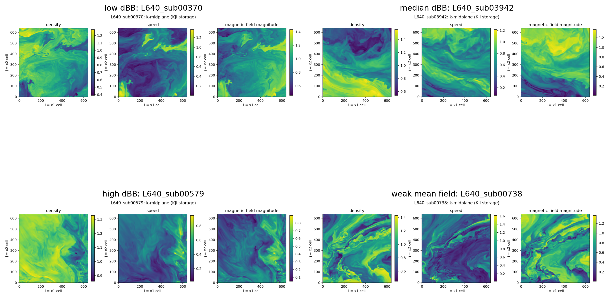
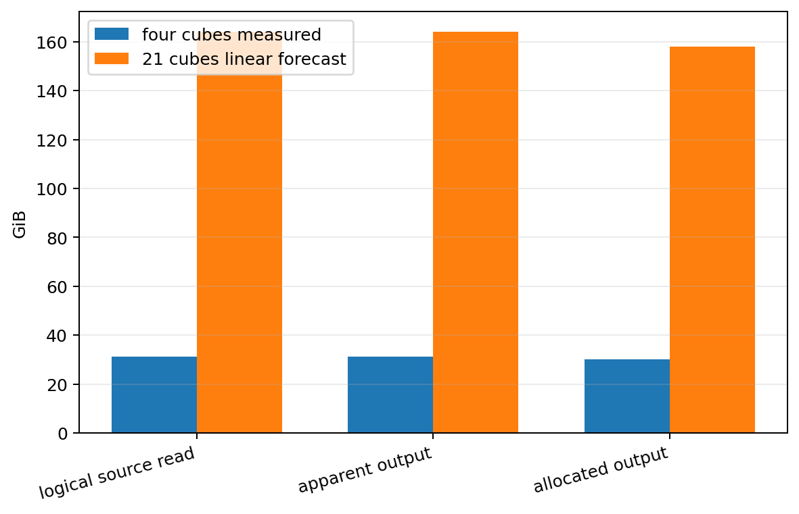
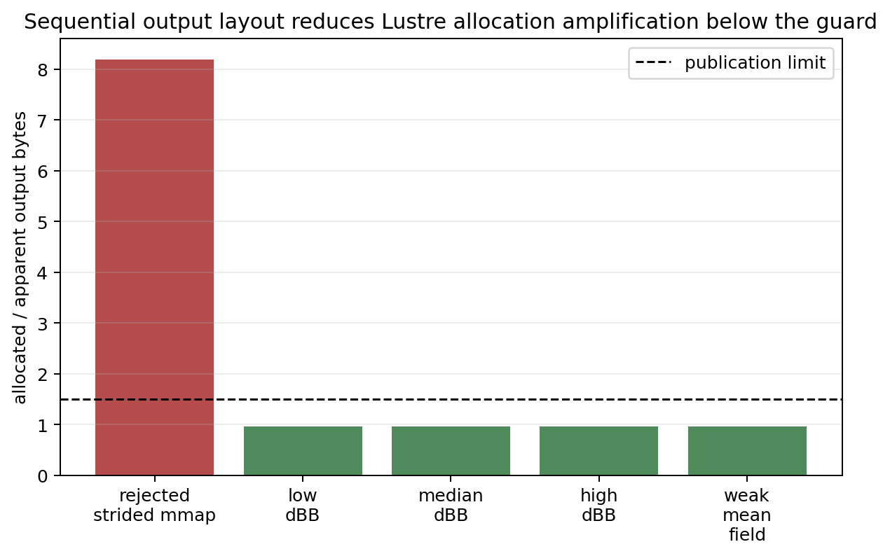
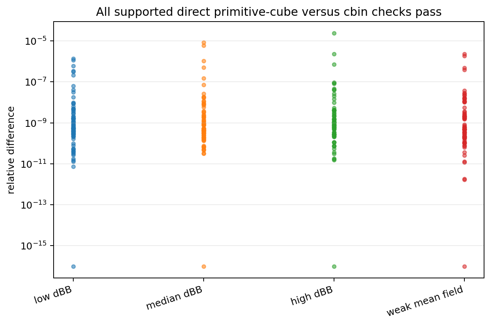
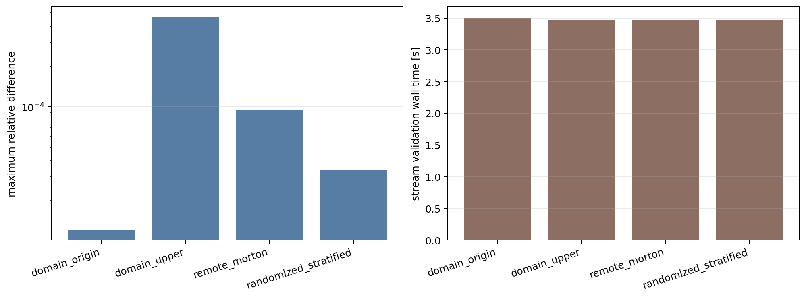
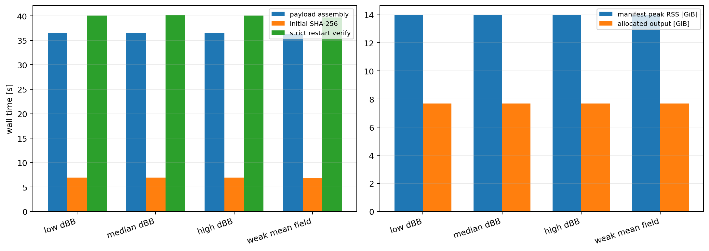

# Project status update: Validated selected-cube extraction and Phase 3 GO

| Field | Value |
|---|---|
| Date | 2026-05-30 |
| Project | `SFunctor` / Phase 2 selected-cube extraction |
| Repository | `/autofs/nccs-svm1_home2/dfielding/SFunctor` |
| Branch | `cleanup/cpu-production` |
| Base git commit | `ad76e866574b90430335cd351c876f6464fc5283` |
| Definitive Phase 2 source inventory | `phase2src-6bf62cfafa543974db2b9652260f43e8198e148ff391409bc1cab2cbcee36ecd` |
| Agent | Codex |
| Simulation analyzed | `Turb_10240_beta25_dedt025_plm`, nonrelativistic MHD snapshot at $t=6.0$, cycle `799945` |
| Compute environment | Andes CPU partition `batch`, account `AST207`, QoS `normal`, one 32-core node |
| Retained benchmark root | `/lustre/orion/ast207/proj-shared/dfielding/Production_plm/phase2_extract/benchmark_verified_release_primary_20260530` |
| Definitive Slurm allocation | `3314786`, completed in `00:20:04` |
| Status | **Phase 2 complete; extractor validated and Phase 3 GO.** |

This report is layered. Tier 0 gives the short scientific and practical story.
Tier 1 explains the method and results. Tier 2 documents implementation and
validation details. Tier 3 is the reproduction and continuation guide.

# Tier 0: What happened and why it matters

Phase 2 asked whether we can safely materialize selected $640^3$ primitive
cubes from the $10240^3$ AthenaK snapshot without scanning or loading the full
domain. The practical goal is to create reliable inputs for later structure
functions while keeping the first production decision bounded.

The extractor is now implemented and validated. It consumes the trusted Phase
1 pilot table, identifies the minimum rank files for one selected cube,
preserves native KJI ordering, writes eight float32 primitive arrays, and
publishes an output only after coverage, provenance, checksum, direct-source,
and supported `cbin` checks pass.



*Figure 0.1: Schematic of the retained Phase 2 workflow. Only explicitly
approved ranks and cubes are read. The reader should notice the validation
gates before publication and the completion marker after checksums. This
matters because later analysis can reuse the cubes without trusting a partial
or stale extraction.*

Exactly four proposed Phase 1 pilot cubes were materialized:

```text
L640_sub00370
L640_sub03942
L640_sub00579
L640_sub00738
```

They intentionally span low, median, high, and weak-mean-field magnetic
environments. No 21-cube campaign and no $L_{\rm sub}=1280$ extraction were
launched.



*Figure 0.2: The four extracted cubes within the 21-region Phase 1 pilot
proposal. The points span distinct magnetic regimes rather than four arbitrary
locations. This matters because the benchmark exercises scientifically useful
cases while remaining bounded.*

The representative slices look physically structured in density, speed, and
magnetic-field magnitude. The axis labels are explicit: arrays are stored as
`array[k, j, i] = field[x3, x2, x1]`.



*Figure 0.3: K-midplane density, speed, and magnetic-field-magnitude views for
the four retained cubes. The visible structures differ among the chosen
environments. The shared orientation makes qualitative inspection easy; the
asymmetric direct probes and exhaustive primitive comparison provide the
axis-order confirmation.*

Every retained cube passed:

- exact shape and cell-count checks;
- zero-hole and zero-overlap assembly checks;
- `640` asymmetric direct cell probes;
- exhaustive voxel-by-voxel comparison against the primitive rank files;
- `79` supported direct `cbin` comparisons;
- `47` trusted Phase 1 catalog comparisons;
- SHA-256 output verification;
- strict restart verification;
- request-bound exhaustive reuse verification after the strict restart gate.

The four materialized cubes contain `31.2500 GiB` of apparent output and
`30.0826 GiB` of allocated storage at the strict-summary verification
snapshot. Their summed before-publish
extraction time is `322.45 s`. A simple linear forecast for 21 cubes is
`164.063 GiB` apparent output, `157.933 GiB` verification-snapshot allocation,
and `0.4702` before-publish extraction node-hours.



*Figure 0.4: Measured four-cube logical selected primitive payload and storage
totals alongside the linear 21-cube forecast. The forecast is useful for
planning, but it is an extraction-only estimate rather than an end-to-end
Slurm runtime prediction.*

One important implementation change came from the smoke tests. Strided output
memmaps interacted badly with the Lustre layout and produced an allocated
storage amplification of about `8.193x`. The retained implementation writes
sequential KJI `.npy` streams and enforces the same `1.5x` storage guard at
publish time and strict restart time.



*Figure 0.5: The rejected strided writer compared with the retained sequential
writer. Sequential output reduces allocation amplification below the
publication guard. The figure does not claim that allocated size is immutable;
the strict verifier checks a later verification-time snapshot again.*

The remaining uncertainty is operational. The benchmark records first-touch
timing within one allocation, but the shared-filesystem cache state was not
controlled. Physical primitive read time is also interleaved with validation,
moment accumulation, SHA-256 passes, and cache effects. It would be incorrect
to call this a controlled cold-read measurement.

This is a descriptive timing caveat, not a blocker. The measured operational
runtime is sufficient for planning the next bounded phase. A separate
cold/warm cache experiment is optional and is not required before proceeding.

The sensible next action is therefore the bounded Phase 3 finite-domain
sampler validation and smallest structure-function smoke test on the four
retained cubes.

# Tier 1: How the analysis works

## 1.1 Objective and scope

The Phase 2 objective was narrow: build and validate a CPU-only selected-cube
extractor. Structure functions remain deferred. The implementation reads the
trusted Phase 1 pilot table directly and permits CLI extraction only for the
four approved benchmark IDs.

The trusted Phase 1 root remains read-only:

```text
/lustre/orion/ast207/proj-shared/dfielding/Production_plm/prompt1_catalog/t6_final_primary_20260530
```

Broken `mhd_sgs` and `mhd_dynamo_ks` products remain excluded. The supported
validation oracle is the retained primary factor-40 `mhd_u_bcc` product.

## 1.2 Primitive data layout

The full snapshot contains $10240^3$ cells. Primitive rank files live under:

```text
/lustre/orion/ast207/proj-shared/dfielding/Production_plm/data/data_Turb_10240_beta25_dedt025_plm/bin
```

The audited primitive basename is:

```text
Turb.full_mhd_w_bcc.00024.bin
```

Each active rank-local block has Cartesian dimensions:

| Axis | Active cells |
|---|---:|
| `x1` / `i` | `160` |
| `x2` / `j` | `320` |
| `x3` / `k` | `320` |

The AthenaK reader removes three recorded ghost zones and exposes active arrays
in KJI order:

$$
\mathrm{array}[k,j,i] = \mathrm{field}[x_3,x_2,x_1].
$$

The materialized primitive field inventory is:

```text
dens velx vely velz eint bcc1 bcc2 bcc3
```

Each field is little-endian float32 in simulation code units.

## 1.3 One-cube extraction

For one $L_{\rm sub}=640$ selection, the extractor:

1. verifies the trusted Phase 1 artifact graph and rank map;
2. reads the pilot-table half-open global IJK bounds;
3. identifies the 16 intersecting primitive rank files;
4. validates headers, logical ownership, physical geometry, time, cycle,
   fields, dtype, and canonical source containment;
5. binds each selected primitive file with stat metadata and SHA-256;
6. crops half-open block intersections;
7. writes eight sequential KJI `.npy` streams;
8. rejects any assembly hole or overlap;
9. compares output voxels exhaustively against primitive sources;
10. computes raw conserved moments and supported diagnostics;
11. compares those diagnostics against trusted `cbin` and Phase 1 catalogs;
12. writes a manifest, atomically publishes the cube directory, and writes
    `COMPLETE.json`;
13. reruns strict restart verification, then request-bound exhaustive reuse
    verification.

Each selected cube contains:

$$
640^3 \times 8 \times 4
=
8{,}388{,}608{,}000
$$

primitive payload bytes, or `7.8125 GiB`, plus `.npy` headers.

## 1.4 Supported oracle comparisons

Primitive fields are converted to the conserved quantities used in Phase 1:

```text
dens mom1 mom2 mom3 ener bcc1 bcc2 bcc3
```

For scalar $q$, raw moments are:

$$
m_n(q) = \left\langle q^n \right\rangle_V.
$$

Central moments are derived only after raw moments are merged. For the magnetic
field:

$$
B_{\rm mean}
=
\left|
\left\langle \mathbf{B} \right\rangle_V
\right|,
$$

$$
B_{\rm rms}
=
\sqrt{\left\langle |\mathbf{B}|^2 \right\rangle_V},
$$

$$
\delta B
=
\sqrt{
\left\langle
\left|
\mathbf{B}
-
\left\langle \mathbf{B} \right\rangle_V
\right|^2
\right\rangle_V
},
$$

and:

$$
\mathrm{dBB}
=
\frac{\delta B}{B_{\rm mean}}.
$$

The gate compares first through fourth raw moments, magnetic summaries,
density summaries, magnetic energy, and coarse mass-weighted mean velocities.
It intentionally does not use primitive velocity dispersion, Mach numbers,
pressure, kinetic partitions, or magnetic-to-kinetic ratios as `cbin` oracle
targets because Phase 1 showed that the retained schema cannot reconstruct
them independently.



*Figure 1.1: Supported direct primitive-cube versus `cbin` relative residuals
for all four materialized cubes. Every supported comparison passes the Phase 1
tolerance policy. Small nonzero residuals reflect retained coarse-product
precision, not an axis mismatch.*

## 1.5 Held-out checks

The retained workflow also streams four bounded held-out regions without
materializing cubes:

| Probe | Role | Comparisons | Failures | Maximum relative difference |
|---|---|---:|---:|---:|
| `stream_domain_origin` | domain edge | `79` | `0` | `1.22e-05` |
| `stream_domain_upper` | opposite domain edge | `79` | `0` | `4.63e-04` |
| `stream_remote_morton` | remote rank | `79` | `0` | `9.39e-05` |
| `stream_randomized_stratified_20260530` | fixed randomized-stratified | `79` | `0` | `3.40e-05` |

The official summary recomputes these rows semantically and compares a
canonical CSV serialization before pinning their hashes.



*Figure 1.2: Maximum supported residual and provenance-bound stream wall time
for four held-out probes. Edge and remote-rank cases pass. The timing panel is
descriptive and cache-sensitive; it is not an independent cold-read
measurement.*

## 1.6 Four-cube resource measurements

| Cube | Before-publish extraction wall time [s] | Payload phase [s] | Sequential write [s] | Initial output SHA-256 [s] | Strict restart verify [s] | Strict-summary allocation snapshot [GiB] |
|---|---:|---:|---:|---:|---:|---:|
| `L640_sub00370` | `80.64` | `36.46` | `7.58` | `6.92` | `40.08` | `7.5208` |
| `L640_sub03942` | `80.58` | `36.43` | `7.56` | `6.93` | `40.13` | `7.5206` |
| `L640_sub00579` | `80.68` | `36.48` | `7.62` | `6.91` | `40.10` | `7.5208` |
| `L640_sub00738` | `80.56` | `36.34` | `7.47` | `6.90` | `39.71` | `7.5207` |
| **Total** | **`322.45`** | **`145.72`** | **`30.23`** | **`27.66`** | **`160.02`** | **`30.0826`** |



*Figure 1.3: Per-cube extraction, hashing, strict-restart time, manifest RSS,
and live allocated storage. Restart verification is intentionally broad: it
includes source binding, hashes, exhaustive comparisons, storage enforcement,
and oracle recomputation.*

The four-cube measured and 21-cube forecast totals are:

| Metric | Four cubes measured | 21 cubes linearly forecast |
|---|---:|---:|
| Logical selected primitive payload | `31.2500 GiB` | `164.0625 GiB` |
| Referenced primitive files including headers | `31.2539 GiB` | `164.0822 GiB` |
| Apparent output | `31.2500 GiB` | `164.0625 GiB` |
| Strict-summary allocated-output snapshot | `30.0826 GiB` | `157.9335 GiB` |
| Before-publish extraction wall time | `322.45 s` | `1692.88 s` |
| Before-publish extraction node-hours | `0.0896` | `0.4702` |

The definitive wrapper allocation completed in `00:20:04`, or `0.3344`
node-hours. Scaling that entire wrapper runtime by $21/4$ gives a conservative
but crude `1.7558` node-hour planning value. It includes bounded benchmark-only
checks and should not be mistaken for a measured production runtime.

## 1.7 Recommendation

The software extractor is validated for the four approved cubes. Phase 3 is a
**GO**. The current allocation does not provide a controlled cold/warm read
comparison or an isolated physical-read timer, but neither measurement is
required for the next bounded phase.

The next-stage plan is:

1. implement the finite-domain 3D pair model;
2. build a slow oracle for sampler validation;
3. validate the optimized sampler against the oracle and invariance checks;
4. run the smallest structure-function smoke test on the four retained cubes.

# Tier 2: Detailed methods, implementation, and validation

## 2.1 Problem definition

The scientific question is whether selected magnetic environments from the
Phase 1 census can be materialized faithfully enough to support later
structure-function calculations. The software task is a restart-safe
full-resolution primitive extractor that reads only required rank-local files.

This phase intentionally defers:

- the full 21-region extraction campaign;
- all $L_{\rm sub}=1280$ extraction;
- production structure functions;
- facility-level cache characterization, which is optional and not required
  for Phase 3;
- diagnostics without an independent retained `cbin` oracle.

## 2.2 Data model and assumptions

| Item | Value |
|---|---|
| Domain | $10240^3$ active cells |
| Primitive local block | `(nx1, nx2, nx3) = (160, 320, 320)` |
| Primitive in-memory order | `(k, j, i) = (x3, x2, x1)` |
| Ghost zones | `3`, removed by the audited reader |
| Primitive fields | `dens velx vely velz eint bcc1 bcc2 bcc3` |
| Primitive dtype | little-endian float32 |
| Snapshot | time `6.0`, cycle `799945` |
| Selected cube shape | `(640, 640, 640)` in KJI storage |
| Selected files per cube | `16` |
| Units | AthenaK simulation code units |
| Periodicity assumption | inherited from the simulation; extraction bounds do not wrap |

The implementation reuses the Phase 1 parser in
[`scripts/phase1/cbin_tools.py`](scripts/phase1/cbin_tools.py). The external
reader `/ccs/home/dfielding/athenak-df/vis/python/bin_convert.py` was audited
for header and array-order behavior before implementation.

## 2.3 Mathematical definitions

The code computes conserved fields from primitive arrays and accumulates
float64 sums for first through fourth raw moments. Derived quantities are
evaluated only after the sums are divided by the exact selected cell count.

For magnetic complements:

$$
\frac{B_{\rm mean}^2}{\left\langle B^2 \right\rangle_V}
+
\frac{\delta B^2}{\left\langle B^2 \right\rangle_V}
=
1.
$$

Standardized moments remain precision-limited when Phase 1 flags say they
cannot be recovered reliably from retained float32 raw moments.

Measured quantities include primitive arrays, raw moments, checksums,
allocated storage, and process wall times. Derived quantities include magnetic
summaries and linear 21-cube forecasts. Physical filesystem read traffic and
controlled cold-cache timing were not reconstructed.

## 2.4 Algorithm and implementation

The reusable API is in
[`sfunctor/io/cube_extract.py`](sfunctor/io/cube_extract.py). The packaged CLI
is [`scripts/phase2/run_phase2_extraction.py`](scripts/phase2/run_phase2_extraction.py).
The Andes wrapper is
[`job_scripts/phase2/run_phase2_extract_andes.sh`](job_scripts/phase2/run_phase2_extract_andes.sh).

Key implementation functions:

| Function | Responsibility |
|---|---|
| `preflight_selection()` | header-only primitive planning and geometry validation |
| `plan_cube_blocks()` | half-open rank intersection plan |
| `extract_cube()` | per-cube lock and restart-safe extraction entry point |
| `_extract_cube_unlocked()` | sequential KJI write, validation, and atomic publish |
| `validate_output_positions()` | asymmetric direct cell probes |
| `validate_output_exact()` | exhaustive voxel comparison and raw-moment recomputation |
| `compare_cbin()` | supported direct primary-oracle comparisons |
| `verify_pilot_cube_output()` | strict current-source restart verification with semantic oracle recomputation |
| `summarize_benchmark()` | exact-four benchmark gate, held-out recomputation, artifact marker |

The writer streams one KJI plane at a time for each field. This avoids the
large allocated-storage amplification observed with strided memmaps. Before
publication, a plane occupancy mask rejects missing or duplicated target
cells.

The provenance chain binds:

- trusted Phase 1 completion graph hashes;
- rank-map hash;
- canonical primitive source paths;
- primitive stat metadata and SHA-256 values;
- selected source-plan digest;
- canonical factor-40 `mhd_u_bcc` source paths;
- parsed cbin snapshot identity;
- output array SHA-256 values;
- code source inventory;
- per-cube completion markers;
- stream-validation artifacts;
- regenerated comparison tables, restart reports, and inspection PNGs.

The Slurm wrapper takes an action lock under the output root. Individual cubes
take per-cube locks. A hard kill can still strand locks or partial directories;
operator cleanup is explicit rather than automatic.

## 2.5 Validation

### Local automated tests

The final repository suite passed:

```text
199 passed
```

The focused extractor suite passed:

```text
35 passed
```

Focused tests cover:

| Test class | Result |
|---|---|
| Contained one-rank plan | passed |
| Cross-rank faces in all directions | passed |
| Cross-rank KJI extraction | passed |
| Missing and wrong rank ownership | rejected as expected |
| Header, geometry, and domain bounds mismatch | rejected as expected |
| Output checksum corruption | rejected as expected |
| Stale completion marker | rejected as expected |
| Output path alias and escape | rejected as expected |
| Negative preflight target slice | rejected as expected |
| Repinned unsampled voxel swap | rejected by exhaustive validation |
| Repinned external primitive path | rejected |
| Absolute basename and escaping symlink | rejected |
| Missing-cell and duplicate-cell assembly | rejected |
| Interrupted partial output | cleaned or blocked until explicit cleanup |
| Stale extraction lock | blocked until explicit operator override |
| Canonical CSV after sorted-key JSON round trip | passed |
| Forged pass counter with failed row | rejected |

### Real-data preflight and direct checks

| Validation | Count | Result |
|---|---:|---|
| Phase 1 pilot rows preflighted | `21` | all passed |
| Header-only edge/remote/random probes | `4` | all passed |
| Held-out streamed probes | `4` | all passed |
| Held-out cbin comparisons | `316` | `0` failures |
| Materialized cubes | `4` | all passed |
| Materialized direct cbin comparisons | `316` | `0` failures |
| Materialized catalog comparisons | `188` | `0` failures |
| Asymmetric direct cell probes | `2560` | `0` failures |
| Exhaustive block-field comparisons | `512` | `0` failures |
| Strict restart checks | `4` | all passed |
| Request-bound exhaustive reuse checks after strict restart | `4` | all passed |

The exhaustive comparisons cover every materialized voxel in every field.
The `512` row count is a compact block-field attestation:

$$
4 \; \mathrm{cubes}
\times
16 \; \mathrm{blocks}
\times
8 \; \mathrm{fields}
=
512.
$$

### Independent review

Independent subagents reviewed:

- rank mapping, bounds, KJI orientation, ghost treatment, and provenance;
- adversarial metadata and completion-marker attacks;
- performance accounting and output-layout behavior.

Review findings led to concrete fixes: source SHA binding, canonical and
resolved path containment, exact cbin basename and identity checks, exhaustive
voxel comparison, source-plan containment, semantic oracle recomputation,
canonical CSV serialization, settled-storage enforcement, output-root action
locking, marker-first figure validation, and strict CLI ID restriction.

Two final independent audits reported no blocker for source inventory
`phase2src-6bf62cfa...`.

## 2.6 Results

The retained extractor is faithful for the four approved cubes. Direct
primitive-to-output comparison is exhaustive, and supported coarsened-oracle
checks pass within the Phase 1 tolerance model.

The final before-publish extraction times are tightly clustered around
`80.6 s` per cube. Strict restart checks are tightly clustered around `40.0 s`
per cube. This regularity is useful, but cache state remains uncontrolled.

Publication-time and strict-summary allocated-size snapshots are both below
the `1.5x` guard. A later live reread found `30.7037 GiB`, or `0.9825x`
apparent output, which also remains below the guard. Lustre allocation should
not be treated as immutable after verification.
The retained sequential writer therefore resolves the output-layout problem
seen during the first smoke.

The resource conclusions are:

- **Robust:** one $640^3$ eight-field cube occupies about `7.8125 GiB`
  apparent output.
- **Robust:** sequential `.npy` writing stays below the allocated-storage
  guard for all four retained cubes.
- **Robust:** strict restart verification and subsequent request-bound
  exhaustive reuse verification work on the retained outputs.
- **Likely:** a 21-cube materialization campaign fits comfortably within the
  storage budget.
- **Suggestive only:** current timing is a useful first-touch planning datum.
- **Open but non-blocking:** facility-level cache characterization and isolated
  physical-read behavior, if tighter runtime attribution is ever needed.

## 2.7 Failures and discarded approaches

The first storage implementation used strided output memmaps. It was discarded
after a real smoke exposed about `8.193x` allocated-storage amplification under
the Lustre layout.

Subsequent bounded runs were intentionally treated as provisional when reviews
found stronger provenance requirements. Several were cancelled early to avoid
wasting compute after they became superseded. The retained result is only
allocation `3314786` and its `benchmark_verified_release_primary_20260530`
root.

One provisional run, `3314782`, failed because the wrapper invoked the newly
strict CLI verifier without its required source arguments. The wrapper now
passes the shared source argument bundle.

Sparse cell probes were retained as a readable diagnostic but are no longer
the primary spatial-integrity argument. Exhaustive voxel comparison closes the
unsampled permutation risk.

## 2.8 Remaining risks

| Risk | Current treatment |
|---|---|
| Shared filesystem cache state is uncontrolled | Retain the timing caveat and use measured operational runtime; this does not block Phase 3 |
| Physical primitive read time is interleaved with validation and hashing | Report payload time and wrapper time separately |
| Hard cancellation can strand locks or partial directories | Require explicit operator audit and cleanup |
| Phase 1 historical source inventory used metadata rather than payload hashes | Treat trusted source root as immutable; Phase 2 binds selected payload SHA-256 values |
| Full 21-cube campaign is forecast, not measured | Keep it deferred until the bounded Phase 3 validation is complete |
| $L_{\rm sub}=1280$ cubes are untested | Explicitly deferred |

## 2.9 Recommended next steps

1. Begin the bounded Phase 3 finite-domain sampler implementation.
2. Build the slow oracle and compare the optimized path against it.
3. Run Phase 3 invariance, convergence, and edge-handling checks.
4. Run the smallest structure-function smoke test on the four retained cubes.
5. Record the Phase 3 GO or NO-GO decision before any 21-cube Phase 4 pilot.

# Tier 3: Reproducibility, audit trail, and handoff

## 3.1 Repository state

| Item | Value |
|---|---|
| Repository path | `/autofs/nccs-svm1_home2/dfielding/SFunctor` |
| Branch | `cleanup/cpu-production` |
| Base commit | `ad76e866574b90430335cd351c876f6464fc5283` |
| Definitive dirty source inventory | `phase2src-6bf62cfafa543974db2b9652260f43e8198e148ff391409bc1cab2cbcee36ecd` |
| Phase 2 status report | `PHASE2_STATUS_UPDATE.md` |
| Phase 2 figures | `figures/phase2_status_update/` |
| Phase 2 data-layout note | `docs/PHASE2_DATA_LAYOUT.md` |

The repository is intentionally dirty because the broader prompt-to-phase
terminology rename and Phase 2 implementation have not yet been committed.
Execution provenance therefore uses both the base commit and a SHA-256 source
inventory. Do not replace the retained benchmark with an untracked rerun.

Phase 2 files created or modified:

```text
PHASE2_STATUS_UPDATE.md
docs/PHASE2_DATA_LAYOUT.md
figures/phase2_status_update/*
job_scripts/phase2/run_phase2_extract_andes.sh
scripts/phase2/generate_phase2_status_figures.py
scripts/phase2/run_phase2_extraction.py
sfunctor/io/cube_extract.py
tests/test_cube_extract.py
```

## 3.2 Commands and scripts

Activate the retained Python environment:

```bash
cd /autofs/nccs-svm1_home2/dfielding/SFunctor
source venv_sfunctor/bin/activate
```

Run local verification:

```bash
pytest -q tests/test_cube_extract.py
pytest -q
python -m py_compile \
  sfunctor/io/cube_extract.py \
  scripts/phase2/run_phase2_extraction.py \
  scripts/phase2/generate_phase2_status_figures.py
bash -n job_scripts/phase2/run_phase2_extract_andes.sh
git diff --check
rg -n '[ \t]+$' \
  PHASE2_STATUS_UPDATE.md \
  docs/PHASE2_DATA_LAYOUT.md \
  job_scripts/phase2 \
  scripts/phase2 \
  sfunctor/io/cube_extract.py \
  tests/test_cube_extract.py
sha256sum \
  sfunctor/io/cube_extract.py \
  scripts/phase2/run_phase2_extraction.py \
  job_scripts/phase2/run_phase2_extract_andes.sh \
  scripts/phase1/cbin_tools.py \
  scripts/phase1/validate_reconstruction.py | sha256sum
```

The definitive Andes submission was:

```bash
sbatch \
  --export=ALL,\
ACTION=benchmark_final_all,\
RUN_DIR=/lustre/orion/ast207/proj-shared/dfielding/Production_plm/phase2_extract/runs/benchmark_verified_release_four_20260530T2102Z,\
OUTPUT_ROOT=/lustre/orion/ast207/proj-shared/dfielding/Production_plm/phase2_extract/benchmark_verified_release_primary_20260530 \
  job_scripts/phase2/run_phase2_extract_andes.sh
```

Generate figures into a fresh staging directory. Replace the retained figure
directory only after the command succeeds and the staged manifest is audited:

```bash
FIGURE_STAGE="$(mktemp -d figures/phase2_status_update.stage.XXXXXX)"
python scripts/phase2/generate_phase2_status_figures.py \
  --trusted-run /lustre/orion/ast207/proj-shared/dfielding/Production_plm/prompt1_catalog/t6_final_primary_20260530 \
  --benchmark-root /lustre/orion/ast207/proj-shared/dfielding/Production_plm/phase2_extract/benchmark_verified_release_primary_20260530 \
  --rejected-storage-log /lustre/orion/ast207/proj-shared/dfielding/Production_plm/phase2_extract/runs/smoke_hardened_L640_sub00370_20260530T1958Z/logs/extract_L640_sub00370.log \
  --output-dir "${FIGURE_STAGE}"
```

## 3.3 Compute accounting

| Item | Value |
|---|---:|
| Workflow budget | `5000 node-hours` |
| Cumulative consumed runtime | `2.800833 node-hours` |
| Remaining budget | `4997.199167 node-hours` |
| Pending exposure | `0 node-hours` |
| Definitive job | `3314786` |
| Definitive job elapsed | `00:20:04` |
| Definitive job node-hours | `0.334444` |
| Nodes | `1` |
| CPUs | `32` |
| Partition | `batch` |
| QoS | `normal` |

The retained ledger is:

```text
/lustre/orion/ast207/proj-shared/dfielding/Production_plm/prompt1_catalog/compute_ledger.csv
```

The workflow ledger includes failed, cancelled, provisional, and retained
allocations. Accounting flags are `0`.

## 3.4 Output inventory

| Output path | Description | Status | Size | Required for continuation | Regenerable |
|---|---|---|---:|---|---|
| `/lustre/orion/ast207/proj-shared/dfielding/Production_plm/phase2_extract/benchmark_verified_release_primary_20260530` | retained four-cube outputs, manifests, comparisons, inspection figures, marker | retained | `31 GiB` allocated by `du` | yes | yes, but do not rerun unnecessarily |
| `/lustre/orion/ast207/proj-shared/dfielding/Production_plm/phase2_extract/runs/benchmark_verified_release_four_20260530T2102Z` | detailed definitive logs | retained | `2.4 MiB` | yes | no |
| `figures/phase2_status_update/` | locally checksummed figures generated from marker-verified benchmark inputs | retained | about `4.5 MiB` | yes | yes |
| `docs/PHASE2_DATA_LAYOUT.md` | operator layout and caveat note | retained | small | yes | source-controlled |
| `PHASE2_STATUS_UPDATE.md` | this report | retained | small | yes | source-controlled |

The definitive marker is:

```text
/lustre/orion/ast207/proj-shared/dfielding/Production_plm/phase2_extract/benchmark_verified_release_primary_20260530/PHASE2_BENCHMARK_COMPLETE.json
```

Its SHA-256 is:

```text
82b0fae4cb8fcc87036d1bde87ebacc3ff708e305edf5928119df6f24621c3dc
```

## 3.5 Known issues

- Shared-filesystem cache state remains uncontrolled, but this is a descriptive
  timing caveat and does not gate Phase 3.
- Physical read time is not isolated from validation and hashing.
- Hard-killed provisional roots can retain lock or partial directories; inspect
  before deletion.
- The retained trusted Phase 1 external path intentionally keeps its historical
  `prompt1_catalog` name.
- Superseded Phase 2 roots exist for audit. Do not confuse them with the
  retained `benchmark_verified_release_primary_20260530` root.

## 3.6 Continuation instructions

Read these files first:

```text
phase0.md
PHASE1_STATUS_UPDATE.md
phase2.md
PHASE2_STATUS_UPDATE.md
docs/PHASE2_DATA_LAYOUT.md
```

Then:

1. reuse the retained trusted Phase 1 tree and retained Phase 2 four-cube root;
2. do not rerun Phase 1, extract all 21 cubes, or extract $L_{\rm sub}=1280$;
3. keep SGS-derived products excluded;
4. run `pytest -q` before changing the extractor;
5. register every nontrivial Andes allocation in the retained ledger before
   submission;
6. keep Slurm stdout and stderr under `logs/`;
7. do not add Slurm email directives;
8. follow the bounded `phase3.md` scope before any 21-cube Phase 4 pilot.

# Appendix A: Figure index

| Figure | Purpose |
|---|---|
| `phase2_extraction_workflow_schematic.png` | intuition-building workflow schematic |
| `phase2_benchmark_selection_context.png` | selected regimes within the Phase 1 pilot |
| `phase2_midplane_inspection_montage.png` | qualitative density, speed, and magnetic slices |
| `phase2_campaign_storage_io_forecast.png` | measured four-cube and forecast 21-cube storage |
| `phase2_storage_layout_fix.png` | rejected strided versus retained sequential writer |
| `phase2_cbin_relative_residuals.png` | materialized-cube supported oracle residuals |
| `phase2_heldout_stream_validation.png` | held-out streamed residual and timing summary |
| `phase2_four_cube_resource_summary.png` | per-cube timing, memory, and allocation summary |

# Appendix B: Explicit gate decision

| Gate item | Result |
|---|---|
| Primitive preflight and snapshot identity | passed |
| Exact cube shape and cell count | passed |
| Hole, overlap, and axis ambiguity rejection | passed |
| Supported extraction-versus-cbin comparisons | passed |
| Deliberate corruption rejection | passed |
| Restart and reuse behavior | passed |
| Allocated storage behavior | measured and passed |
| Repository suite | `199 passed` |
| Ledger-backed four-cube run | passed |
| Ledger-backed 21-cube extraction-only forecast | documented |
| Observed operational runtime | measured |
| Controlled cold/warm read timing | optional; not required for Phase 3 |

**Decision:** the selected-cube extractor is validated and Phase 3 is **GO**.
The shared-filesystem cache caveat remains recorded for planning context.
