# Project status update: Phase 3a parallel finite-domain 3-D estimator remediation

| Item | Value |
| --- | --- |
| Date | 2026-05-31 UTC |
| Repository | `SFunctor` |
| Repository path | `/autofs/nccs-svm1_home2/dfielding/SFunctor` |
| Branch | `cleanup/cpu-production` |
| Retained estimator source commit | `93c166cf339bcdf908cc4d37f385c473f422999d` |
| Retained estimator implementation SHA-256 | `ae3249b2a2c28373a0c2a085411b5419aed578b26b2f6f8d4f6210143e7b1904` |
| Agent | Codex |
| Data analyzed | Four immutable Phase 2 `L_sub = 640` cubes |
| Compute environment | Andes CPU Slurm, account `AST207`, partition `batch`, QoS `normal` |
| Status | **Phase 3a software and bounded four-cube publication complete; scientific NO-GO for the current Phase 4 pilot plan.** |

# Tier 0: What happened and why it matters

Phase 3 showed that the first non-periodic 3-D structure-function sampler was
numerically sound, but it was deliberately too small for science: it used only
seven separations and stopped at $\ell = 128$ cells. Phase 3a replaced that
smoke test with a denser, parallel, uncertainty-aware calculation on the same
four verified $640^3$ cubes.

The revised code measures the 2-point statistic through
$\ell_{\max} = 320 = L_{\rm sub}/2$. It also implements and validates labeled
3-point and 5-point filters through their footprint-bounded limits,
$\ell_{\max} = 160$ and $80$. These filters are intentionally kept separate:
they answer related but distinct questions about scale-dependent fluctuations.

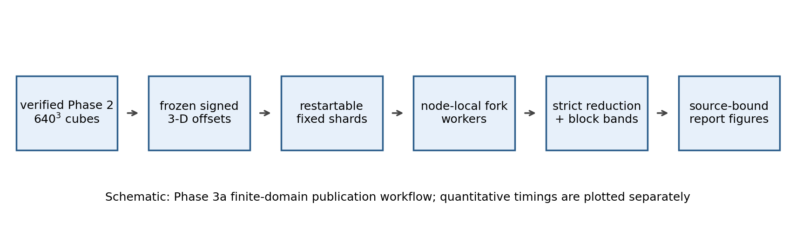

*Figure 0.1: Schematic of the retained workflow. Verified extracted cubes feed
deterministic displacement manifests, restartable shard calculations, exact
additive reduction, block-resampled uncertainty, and strict publication. The
important point is that the science products are bound to source hashes and
can be resumed without recomputing completed shards.*

The four cubes deliberately span different magnetic environments: low
`dBB`, near-median `dBB`, high `dBB`, and a weak-mean-field outlier. Their
density slices look visibly different, so they are a useful bounded test set
for checking whether the estimator survives realistic spatial structure.

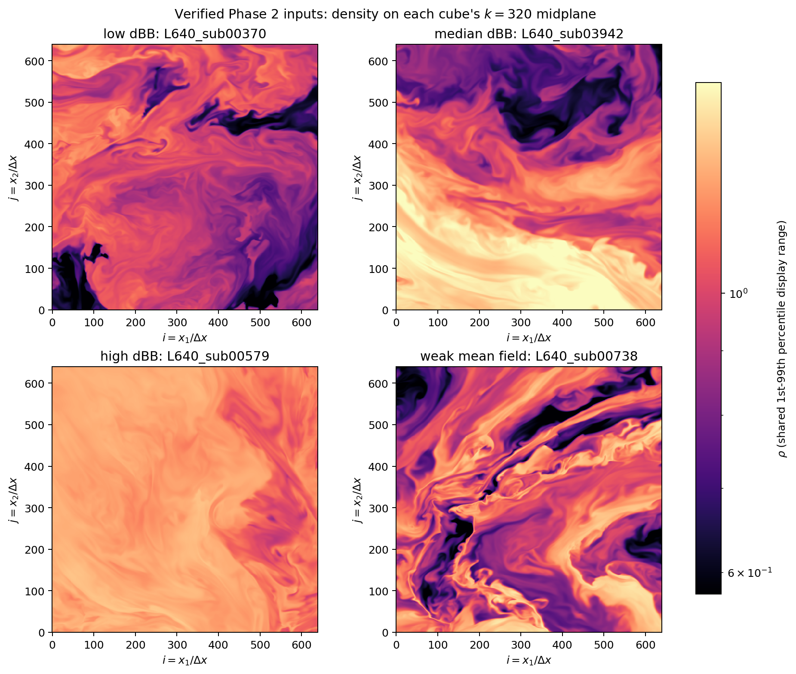

*Figure 0.2: Density on the $k = 320$ midplane of each verified input cube,
shown with one shared percentile display range. The cubes contain materially
different structures. This matters because the Phase 3a gate is based on
realistic fields, not synthetic smooth data alone.*

The code now does what it was supposed to do operationally. It generated
`96` restartable shard products and `24` reduced products for four cubes,
three stencils, and two non-periodic support policies. Strict verification
rechecked every shard and every reduction. A replay published zero new shards
and reused all `96`, which is the expected restart behavior.

The main scientific finding is more cautious. There are two defensible ways
to handle extracted-cube boundaries. `shell_local` uses one common interior
region for all directions in a separation shell, making directional
comparisons spatially fair. `all_valid_origins` keeps every in-domain origin
available for each displacement, retaining more volume but allowing different
offsets to sample different regions. They do not become equivalent at large
separation.

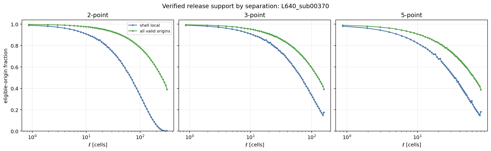

*Figure 0.3: Retained eligible-origin fraction versus separation for the
representative low-`dBB` cube. Shell-local 2-point support collapses near
$\ell = 320$, while all-valid-origins support remains much larger. The
outermost shell-local points therefore cannot carry strong slope claims.*

The structure-function curves themselves are measurable, and their spatial
block uncertainty bands are now explicit. The largest-scale points show the
expected warning signs: turnover, increased uncertainty, and support-policy
sensitivity. The correct response is not to force one power law through the
full curve.

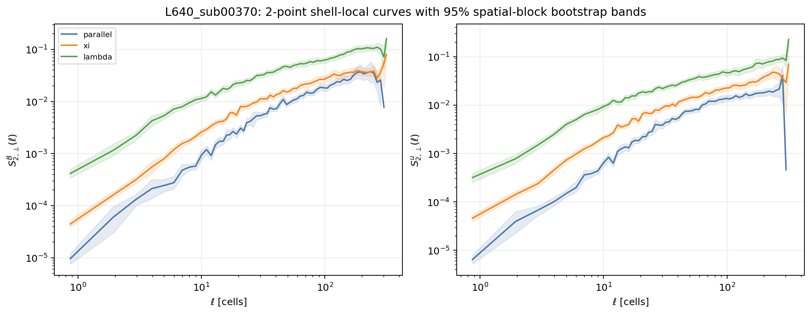

*Figure 0.4: Representative 2-point shell-local magnetic and velocity
structure functions with conditional $95\%$ spatial-block bootstrap bands.
The supported curves are useful, but weak-support outer tails can retain a
reduced valid-resample population and the outermost behavior is not a clean
universal slope. That is a scientific limitation to report, not a software
error.*

The Phase 3a decision is therefore a **NO-GO for launching Phase 4 as
currently written**. The estimator is ready for controlled use, but the
production interpretation is not frozen: the project still needs to decide
which support policy is primary, which scale windows are admissible for each
claim, and whether Phase 4 should emphasize curve-level comparisons instead
of directional slope tables.

The sensible next task is a narrow policy-adjudication pass using the retained
four-cube products. It should freeze an explicit reporting policy, remove
unsupported outer-shell slope claims, and revise the Phase 4 configuration
before any 21-region campaign is submitted.

# Tier 1: How the analysis works

## 1.1 Objective and bounded inputs

Phase 3a addressed the scientific-configuration gap left by Phase 3. The
software objective was to port the displacement-distributed 2-D execution
model into the non-periodic 3-D estimator while preserving explicit boundary
accounting. The scientific objective was to determine whether a defensible
large-scale $L_{\rm sub}=640$ baseline exists for Phase 4.

The calculation reused four immutable, hash-verified Phase 2 cubes:

| Cube | Role | Global IJK half-open bounds | `B_mean` | `B_rms` | `deltaB` | `dBB` | `rho_sigma_over_mean` |
| --- | --- | --- | ---: | ---: | ---: | ---: | ---: |
| `L640_sub00370` | low `dBB` | `[1280,1920,4480,5120,640,1280]` | 0.9196 | 0.9811 | 0.3420 | 0.3719 | 0.1644 |
| `L640_sub03942` | near-median `dBB` | `[3840,4480,3840,4480,9600,10240]` | 0.7470 | 0.9101 | 0.5199 | 0.6959 | 0.2324 |
| `L640_sub00579` | high `dBB` | `[1920,2560,2560,3200,1280,1920]` | 0.2492 | 0.4948 | 0.4274 | 1.7147 | 0.0794 |
| `L640_sub00738` | weak mean field | `[1280,1920,8960,9600,1280,1920]` | 0.0190 | 0.8479 | 0.8477 | 44.7257 | 0.2062 |

The weak-mean-field cube is intentionally retained as an edge case. Its very
large `dBB` is driven by the small denominator and must not be interpreted as
an ordinary high-`dBB` regime point.

## 1.2 Statistics and stencils

For a field $q$, order $p=2$, and displacement $\mathbf{r}$, the baseline
structure function is

$$
S_2^q(\ell)
=
\left\langle
\left|
\delta q(\mathbf{x}, \mathbf{r})
\right|^2
\right\rangle,
\qquad
\ell = |\mathbf{r}|.
$$

Directional bins are conditioned on a stencil-local magnetic field and
reported as `parallel`, `perpendicular`, `xi`, and `lambda` wedges. The
primary Phase 3a matrix measures `B` and `u` with three explicitly labeled
increment filters:

- `parallel`: $\mathbf{r}$ lies within $15^\circ$ of
  $\mathbf{B}_{\rm loc}$.
- `perpendicular`: $\mathbf{r}$ lies at least $75^\circ$ from
  $\mathbf{B}_{\rm loc}$.
- `xi` and `lambda`: within the perpendicular set, the angle between
  $\mathbf{r}_\perp$ and the projected increment
  $\delta\mathbf{q}_\perp$ is used to resolve the two perpendicular wedges
  with the same $15^\circ$ and $75^\circ$ thresholds.

These are directional diagnostics. Phase 3a does not claim a physical
anisotropy law from them.

$$
\delta_2 q
=
q(\mathbf{x}+\mathbf{r}) - q(\mathbf{x}),
$$

$$
\delta_3 q
=
\frac{
q(\mathbf{x}+\mathbf{r}) - 2q(\mathbf{x}) + q(\mathbf{x}-\mathbf{r})
}{
\sqrt{3}
},
$$

$$
\delta_5 q
=
\frac{
q(\mathbf{x}-2\mathbf{r}) - 4q(\mathbf{x}-\mathbf{r}) + 6q(\mathbf{x})
- 4q(\mathbf{x}+\mathbf{r}) + q(\mathbf{x}+2\mathbf{r})
}{
\sqrt{35}
}.
$$

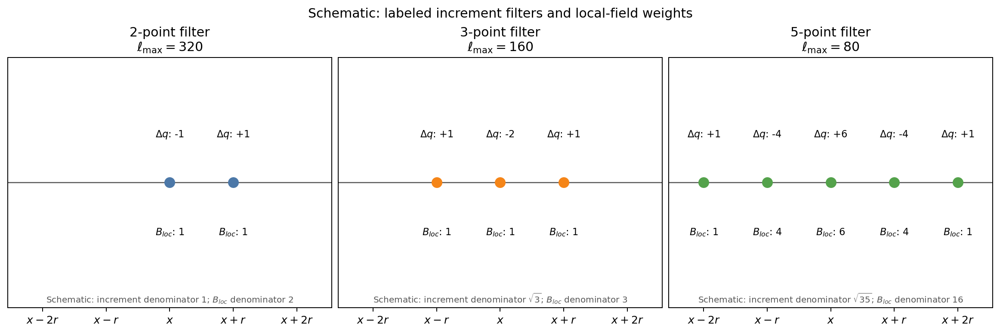

*Figure 1.1: Schematic stencil footprints and normalizations. Wider filters
lose usable boundary volume sooner. They are not higher-accuracy replacements
for the 2-point statistic, so every output and plot retains its stencil label.*

The retained dense design is:

| Stencil | Nominal $\ell_{\max}$ | Bins | Requested directions per bin | Realized offsets | Realized maximum $\ell$ | Empty bins |
| --- | ---: | ---: | ---: | ---: | ---: | ---: |
| 2-point | 320 | 64 | 24 | 1484 | 319.9922 | 0 |
| 3-point | 160 | 64 | 24 | 1480 | 159.9937 | 0 |
| 5-point | 80 | 64 | 24 | 1454 | 79.9875 | 0 |

Integer-grid rounding is recorded, checked, and source-bound. The retained
manifests removed `38`, `48`, and `68` duplicate offsets and `14`, `8`, and
`14` out-of-range offsets for the 2-, 3-, and 5-point designs respectively.

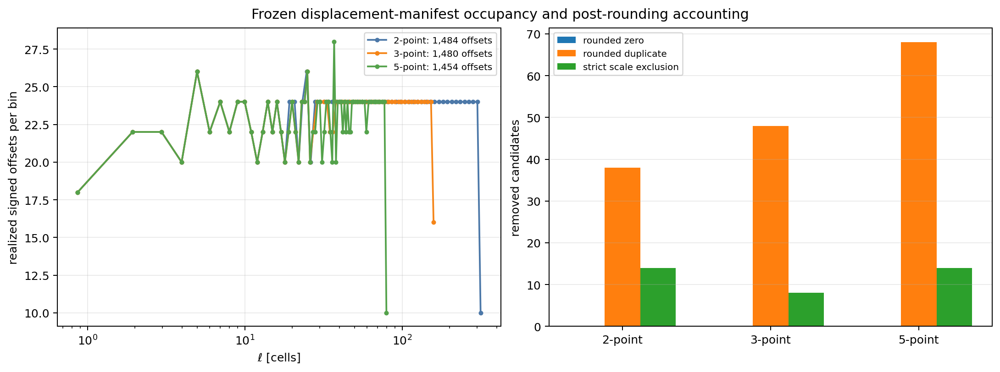

*Figure 1.2: Requested separation centers and realized directional occupancy
after integer-grid rounding, deduplication, and strict scale checks. No
retained bin is empty. The outer bins are visibly sparser and must be treated
with their measured support diagnostics.*

## 1.3 Non-periodic support policies

Extracted cubes cannot wrap. Every stencil point must remain inside the
$640^3$ cube. Phase 3a compares:

| Policy | Definition | Strength | Limitation |
| --- | --- | --- | --- |
| `shell_local` | Intersect valid-origin boxes for all offsets in a shell | Directional comparisons use the same spatial region | Common support can collapse at large $\ell$ |
| `all_valid_origins` | Use each offset's complete in-domain origin box | Retains more usable volume | Different offsets sample different spatial regions |
| `nested_core` | Use one global interior box across all scales | Useful regression diagnostic | Too conservative for the 2-point $\ell_{\max}=320$ science path |

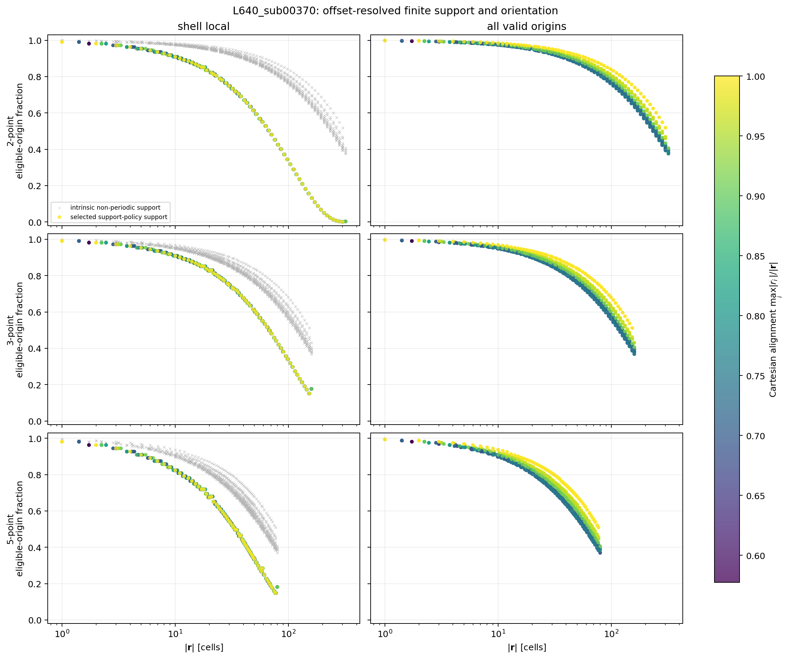

*Figure 1.3: Intrinsic non-periodic support and selected policy support for
individual offsets, colored by Cartesian alignment. The figure makes the
boundary effect visible: support loss is scale-, stencil-, policy-, and
orientation-dependent.*

The minimum retained eligible-origin fractions are geometry-only quantities,
so they are the same across the four cubes:

| Stencil | `shell_local` minimum | `all_valid_origins` minimum |
| --- | ---: | ---: |
| 2-point | 0.000501 | 0.390969 |
| 3-point | 0.150768 | 0.391721 |
| 5-point | 0.148127 | 0.388570 |

The 2-point shell-local minimum is the key warning. It says that the
outermost fair-comparison shell exists numerically but retains only about
$0.05\%$ of the candidate origin volume. That point can be plotted as a
labeled limit; it should not anchor a physical slope. Phase 3a does not
silently mask the raw published curve at one arbitrary threshold. Before
Phase 4, the reporting policy must define and enforce an explicit geometric
support cutoff for science-facing curves and slopes while preserving raw
outer-shell values as labeled diagnostics.

## 1.4 Parallel pipeline and uncertainty

The runner generates displacement manifests once, splits offsets into stable
shards, memory-maps the Phase 2 arrays, and accumulates additive statistics.
The retained production matrix contains

$$
4\ {\rm cubes}
\times
3\ {\rm stencils}
\times
2\ {\rm support\ policies}
\times
4\ {\rm shards}
=
96\ {\rm shards}.
$$

Reduction publishes one product for each cube, stencil, and support-policy
combination:

$$
4 \times 3 \times 2 = 24\ {\rm reductions}.
$$

Each reduction retains counts, sums, sums squared, exclusions, support
diagnostics, offset-resolved accounting, block-resolved accumulators, and
uncertainty products. The production block layout is $80^3$ cells with
stencil-midpoint assignment. A deterministic $200$-replicate spatial-block
bootstrap uses seed `20260531`.

Local slopes use centered five-bin regressions:

$$
\alpha(\ell)
=
\frac{
d\log S_2(\ell)
}{
d\log \ell
}.
$$

A local-slope point estimate is masked unless the full window is present, at
least two spatial blocks contribute, and the Kish effective block count is at
least `8`. Its uncertainty band is published only when at least $90\%$ of
bootstrap slope replicates are valid. Passing these gates means a diagnostic
is numerically supported; it does not prove a single physical power law.
Grid-adjacent slopes remain dissipation-range diagnostics only. No lower
science fitting boundary has been approved yet.

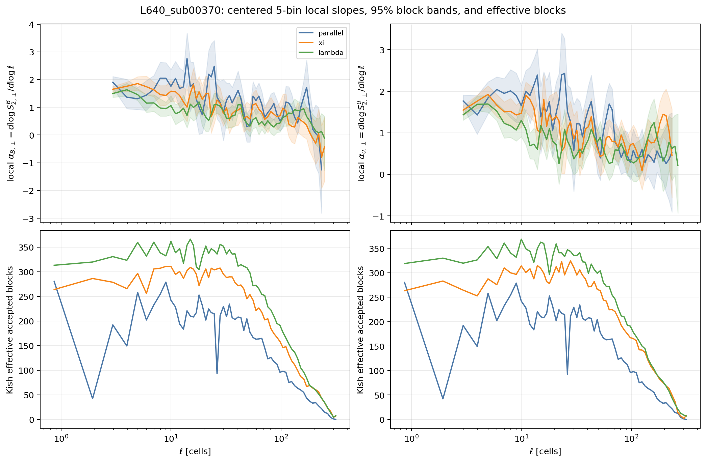

*Figure 1.4: Representative shell-local local slopes with $95\%$ block bands
and Kish effective block counts. The curves are measurable but not perfectly
flat. The intended use is robust uncertainty-aware interpretation, not a
forced universal slope.*

## 1.5 Validation strategy

The retained evidence chain passed the following checks:

| Validation | Method | Result |
| --- | --- | --- |
| Repository tests | Full local suite | `359 passed` |
| Slow-oracle stencil checks | Synthetic and cropped cubes | Passed for 2-, 3-, and 5-point filters |
| Endpoint handling | Non-periodic stencil-aware origin bounds | Passed; no modulo wrapping |
| Serial versus node-local parallel | One cube, all three stencils | Maximum relative difference $\leq 2.83 \times 10^{-16}$ |
| Phase 3 regression anchor | Historical `nested_core` and `all_valid_pairs` replay | Exact moment match; maximum difference `0.0` |
| Multi-node reduction | One- and two-node deterministic shard controls | Maximum relative difference $3.91 \times 10^{-16}$ |
| Missing shard | Deliberately omit required shard | Rejected |
| Reduction order | Forward versus reverse partial ordering | Exact match |
| Cropped exhaustive controls | Enumerate all valid origins for selected offsets | Exact agreement once requested sample count reaches exhaustive coverage |
| Release replay | Rerun completed work stage | `0` published, `96` reused |
| Strict publication verify | Hash and marker verification | `96` shards and `24` reductions verified |

The worker sweep is a useful negative result: more node-local workers did not
speed up this bounded workload. The limiting resource was not independently
profiled. Likewise, the two-node profile did not beat the one-node profile
for the small equivalence workload.

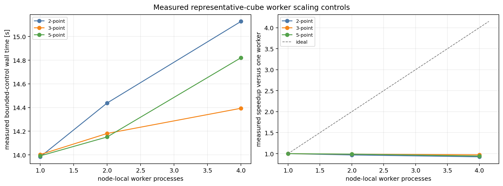

*Figure 1.5: Node-local worker sweep for each stencil. Extra workers do not
improve wall time for this bounded workload. The retained publication
therefore uses one worker per node rather than claiming unsupported CPU
scaling.*

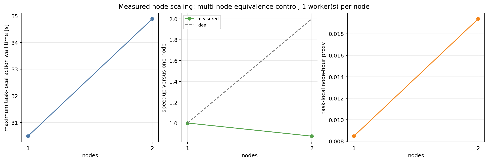

*Figure 1.6: One- and two-node equivalence-control profiles. Two nodes are
slightly slower for this deliberately small workload. Multi-node execution is
validated for correctness and restartability, not claimed as a speedup.*

## 1.6 Main result and Phase 4 decision

The new estimator resolves substantially more of the large-scale curve than
Phase 3 did. It also shows why a single unqualified slope table would be
misleading. Shell-local and all-valid-origins measurements separate at large
$\ell$, with the size and sign of the effect depending on cube, field, and
direction.

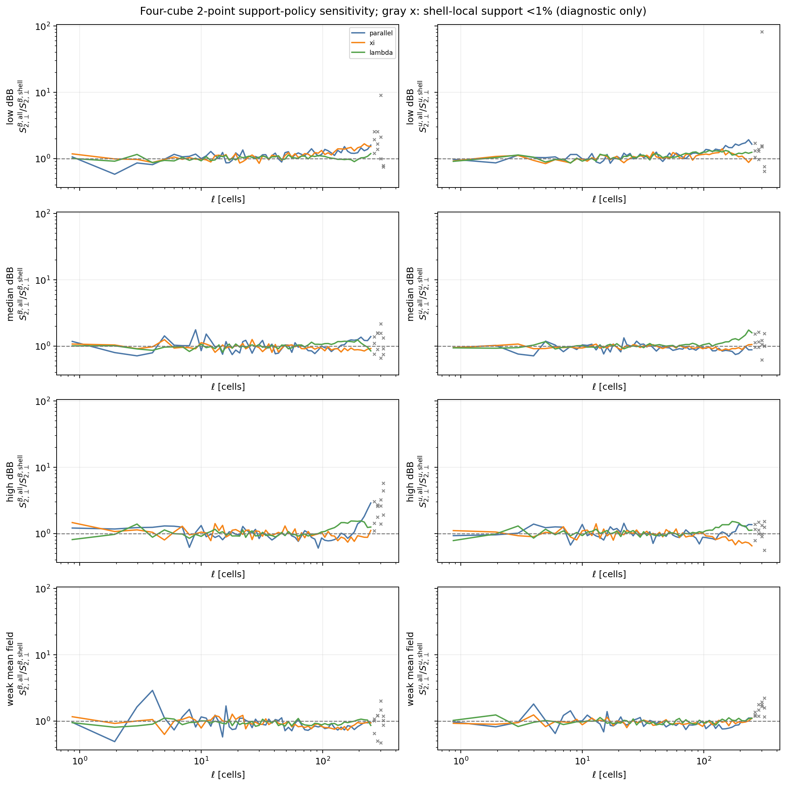

*Figure 1.7: Ratio of all-valid-origins to shell-local 2-point moments across
the four cubes, shown on a logarithmic ratio axis. Gray crosses retain raw
shells with less than $1\%$ shell-local support as diagnostic limits; $1\%$
is a visualization threshold, not the approved Phase 4 cutoff. Ratios are
descriptive policy-plus-sampling sensitivities, not corrections. Their cube-
and direction-dependence is why Phase 4 cannot yet adopt one hidden default.*

The largest shell-local slope-support endpoint depends on field, cube, and
direction. For magnetic 2-point pair-local perpendicular measurements it is
typically in the $\ell \approx 220$ to $282$ cell range, while the
all-valid-origins mask extends to $\ell \approx 282$. These are maximum
admissible diagnostic endpoints, not automatically selected fit intervals.

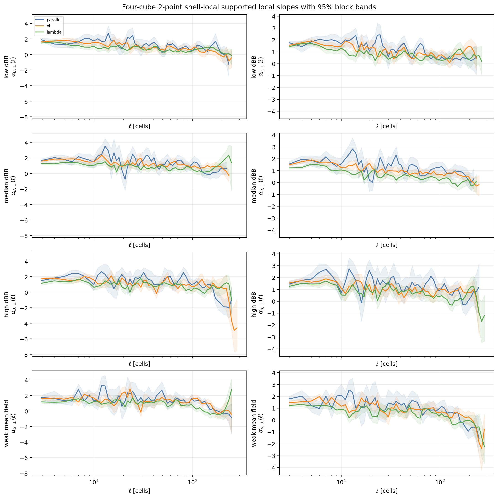

*Figure 1.8: Supported shell-local 2-point magnetic local slopes for all four
cubes with block bands. The plot shows where slope diagnostics exist and how
uncertain they are. It does not support reporting one universal fitted
exponent yet.*

The Phase 3a gate is therefore:

| Gate area | Decision | Reason |
| --- | --- | --- |
| Software correctness | GO | Oracle, regression, serial/parallel, reducer, replay, and strict publication checks passed |
| Bounded four-cube products | GO | All planned 2-, 3-, and 5-point `B`, `u`, $p=2$ products were published |
| Phase 4 launch as currently written | **NO-GO** | Production support policy and admissible science intervals remain unresolved relative to measured support-policy and block-layout sensitivity |

The next stage should revise Phase 4 around explicit curve-level products and
frozen policy choices. It should not launch the full 21-region campaign first
and decide how to interpret the boundaries afterward.

# Tier 2: Detailed methods, implementation, and validation

## 2.1 Problem definition

Phase 3a was scoped to remediate the Phase 3 science configuration without
expanding the scientific matrix. The work intentionally did **not**:

- rerun the Phase 1 census;
- re-extract the four Phase 2 cubes;
- submit the 21-region Phase 4 campaign;
- submit `L_sub = 1280` work;
- use the broken SGS-derived channels;
- add compressible-MHD derived variables;
- add higher structure-function orders beyond $p=2$.

The precise question was whether a hash-bound, restartable, parallel,
non-periodic 3-D pipeline can measure dense 2-point, 3-point, and 5-point
curves on realistic $640^3$ cubes and provide enough uncertainty and support
evidence to authorize a larger campaign.

The answer has two parts:

1. **Software answer:** yes. The implementation and bounded release passed.
2. **Scientific campaign answer:** not yet. The retained products expose a
   support-policy decision that must be frozen before Phase 4.

## 2.2 Data model and assumptions

Each Phase 2 cube stores primitive arrays under `fields/`:

| Quantity | Arrays | Shape | Storage order | Use in Phase 3a |
| --- | --- | --- | --- | --- |
| Magnetic field | `bcc1.npy`, `bcc2.npy`, `bcc3.npy` | `(640,640,640)` each | KJI | Build $\mathbf{B}$ increments and local magnetic directions |
| Velocity | `velx.npy`, `vely.npy`, `velz.npy` | `(640,640,640)` each | KJI | Build $\mathbf{u}$ increments |
| Density | `dens.npy` | `(640,640,640)` | KJI | Retained input provenance and qualitative slice figures; not used in the Phase 3a `B`, `u` baseline |

Displacements are represented as integer IJK vectors. Array slicing remains
KJI. This distinction is explicit in the implementation and tests. Extracted
cubes are finite non-periodic regions: targets are constructed from valid
origin bounds and never by modulo indexing.

The production campaign freezes:

| Parameter | Value |
| --- | --- |
| Cubes | `L640_sub00370`, `L640_sub03942`, `L640_sub00579`, `L640_sub00738` |
| Fields | `B`, `u` |
| Order | $p=2$ |
| Stencils | 2-point, 3-point, 5-point |
| Support policies | `shell_local`, `all_valid_origins` |
| Separation bins | `64` per stencil |
| Requested directions | `24` per separation bin |
| Origin samples | `2048` per displacement |
| Pair batch size | `1024` |
| Spatial block shape | `(80,80,80)` cells |
| Block assignment | Stencil midpoint |
| Bootstrap replicates | `200` |
| Production seed | `20260530` |
| Bootstrap seed | `20260531` |
| Offsets per shard | `480` |

## 2.3 Mathematical definitions

For a stencil $s$, an offset $\mathbf{r}$, and a field $q$, Phase 3a computes
the normalized increment $\delta_s q$ defined in Tier 1. The second-order
moment in a separation and directional bin is

$$
S_{2,s}^q(\ell, d)
=
\frac{
\sum_{(\mathbf{x},\mathbf{r}) \in \mathcal{A}_{s,\ell,d}}
\left|\delta_s q(\mathbf{x},\mathbf{r})\right|^2
}{
\left|\mathcal{A}_{s,\ell,d}\right|
},
$$

where $\mathcal{A}_{s,\ell,d}$ is the accepted set after non-periodic
support, sampling, and directional conditioning.

The stencil-local magnetic fields are

$$
\mathbf{B}_{{\rm loc},2}
=
\frac{
\mathbf{B}(\mathbf{x}+\mathbf{r}) + \mathbf{B}(\mathbf{x})
}{2},
$$

$$
\mathbf{B}_{{\rm loc},3}
=
\frac{
\mathbf{B}(\mathbf{x}+\mathbf{r})
+
\mathbf{B}(\mathbf{x})
+
\mathbf{B}(\mathbf{x}-\mathbf{r})
}{3},
$$

$$
\mathbf{B}_{{\rm loc},5}
=
\frac{
\mathbf{B}(\mathbf{x}-2\mathbf{r})
+4\mathbf{B}(\mathbf{x}-\mathbf{r})
+6\mathbf{B}(\mathbf{x})
+4\mathbf{B}(\mathbf{x}+\mathbf{r})
+\mathbf{B}(\mathbf{x}+2\mathbf{r})
}{16}.
$$

The selected support fraction plotted in this report is

$$
f_{\rm support}(\ell)
=
\frac{
N_{\rm eligible}(\ell)
}{
N_{\rm candidate}(\ell)
}.
$$

For `shell_local`, $N_{\rm eligible}$ uses the common within-shell
intersection. For `all_valid_origins`, it uses each offset's complete
non-periodic valid-origin box. For `nested_core`, it uses one global
intersection across all retained scales.

Spatial-block uncertainty is reported separately from pair-sampling standard
errors. Blocks are assigned using stencil midpoints into a fixed $8^3=512$
geometric layout of $80^3$ cells for the retained production reductions;
edge blocks truncate naturally where relevant. Bootstrap resampling draws
the fixed geometric block population with replacement, including empty
blocks. The delete-one-contributing-block jackknife is retained separately.
The Kish effective block count is

$$
N_{\rm eff}
=
\frac{
\left(\sum_b n_b\right)^2
}{
\sum_b n_b^2
},
$$

where $n_b$ is the accepted-sample count in block $b$. It makes visible when
a nominal layout is dominated by fewer spatial regions. Local-slope point
masking requires at least `8` effective blocks over a complete five-bin
window; slope-band publication additionally requires at least $90\%$ valid
bootstrap slope replicates. Moment bands are conditional on the retained
sampled-origin and displacement census. Weak-support outer tails can retain
fewer than `200` finite moment-bootstrap resamples and must be flagged or
masked by the Phase 4 reporting policy.

## 2.4 Algorithm and implementation

The implementation is split by responsibility:

| Path | Responsibility |
| --- | --- |
| `sfunctor/core/finite_domain.py` | Shared finite-domain geometry and additive result model |
| `sfunctor/core/phase3a.py` | Dense integer displacement manifests and stencil metadata |
| `sfunctor/reference_3d.py` | Slow reference calculations for validation |
| `sfunctor/analysis/finite_domain.py` | Serialization and reduction support |
| `sfunctor/analysis/phase3a.py` | Parallel shard execution, block accumulation, and reduction |
| `scripts/phase3a/run_phase3a_sampler.py` | Source-bound CLI, controls, convergence, release publication, replay, and verification |
| `job_scripts/phase3a/run_phase3a_sampler_andes.sh` | Andes Slurm wrapper with action lock, resource capture, and log routing |
| `scripts/phase3a/generate_phase3a_status_figures.py` | Hash-verified retained-artifact report figures |

The execution sequence is:

1. Verify the Phase 2 completion markers and primitive-array hashes.
2. Generate deterministic displacement manifests with strict post-rounding
   checks and stable offset identifiers.
3. Split each cube/stencil/policy group into displacement shards.
4. Memory-map one cube's primitive arrays per Slurm task.
5. Stream sampled origins in bounded batches and accumulate additive
   statistics, including block-resolved contributions.
6. Write a partial `.npz`, verify its metadata, and publish a completion
   marker atomically.
7. Reject incomplete, overlapping, mixed-source, mixed-manifest,
   mixed-policy, mixed-stencil, mixed-seed, or mixed-block-layout reductions.
8. Publish reduced products and deterministic uncertainty arrays.
9. Strictly verify every retained hash and marker.

The publication uses one worker per Slurm node because the measured
node-local sweep shows no useful multiworker speedup for this bounded
workload. The limiting resource was not independently profiled.

## 2.5 Validation

### 2.5.1 Local and synthetic tests

The full repository test suite passed:

```text
359 passed
```

The local test coverage exercises stencil arithmetic, endpoint assertions,
shell-local intersections, all-valid-origin support, no-wrap behavior,
deterministic manifests, source binding, reducer failures, uncertainty
metadata, and the wrapper contract. Retained Slurm runs provide the
happy-path work and reduction replay evidence.

The slow oracle independently checks accumulation behavior but intentionally
reuses production valid-origin geometry helpers. Hand-calculated origin-bound
tests and no-wrap sentinel tests cover important geometry cases, but a future
hardening pass should add a tiny brute-force coordinate enumerator that is
independent of those helpers for Cartesian and oblique offsets across all
stencils and support policies.

### 2.5.2 Exact-origin and oracle controls

The code does not enumerate every possible pair in an entire $640^3$ cube.
That would be needlessly expensive for the production matrix. Instead, it
uses:

- direct slow-oracle comparisons on synthetic and cropped cubes;
- exhaustive valid-origin enumeration for selected Cartesian and oblique
  offsets;
- sampled-origin ladders on cropped cubes;
- serial-versus-parallel exact reductions.

For the cropped controls, requested sample counts of `2048` and `8192` show
the expected Monte Carlo differences. At `32768`, the request reaches
exhaustive coverage for the selected controls and matches exact counts, sums,
sums squared, and moments.

### 2.5.3 Serial, node-local, and multi-node equivalence

| Control | Stencil | Maximum relative moment difference | Result |
| --- | ---: | ---: | --- |
| Serial versus node-local parallel | 2-point | $2.83 \times 10^{-16}$ | Passed |
| Serial versus node-local parallel | 3-point | $2.18 \times 10^{-16}$ | Passed |
| Serial versus node-local parallel | 5-point | $2.50 \times 10^{-16}$ | Passed |
| Serial versus one-node shard reduction | 2-point control | `0.0` | Passed |
| Serial versus two-node shard reduction | 2-point control | $3.91 \times 10^{-16}$ | Passed |
| Forward versus reverse reduction | One- and two-node controls | `0.0` | Passed |
| Missing required shard | Two-node control | Rejected | Passed |

The one-node equivalence profile took `30.486 s`. The two-node profile took
`34.891 s`, corresponding to a measured speedup of `0.874`, not an
improvement. This small control proves distributed correctness but is not a
scaling benchmark for a large production campaign.

### 2.5.4 Convergence matrix

The clean convergence publication contains `33` bounded scenarios on the
representative low-`dBB` cube. It varies:

- separation bins: `32`, `64`, `128`;
- directions per bin: `12`, `24`, `48`;
- sampled origins: `256`, `1024`, `2048`, `4096`;
- deterministic origin seeds;
- 2-point $\ell_{\max}$: `128`, `192`, `256`, `320`;
- block sides: `80`, `160`, `320`;
- support policies: `shell_local`, `all_valid_origins`, `nested_core`;
- 3-point $\ell_{\max}$: `80`, `160`;
- 5-point $\ell_{\max}$: `40`, `80`.

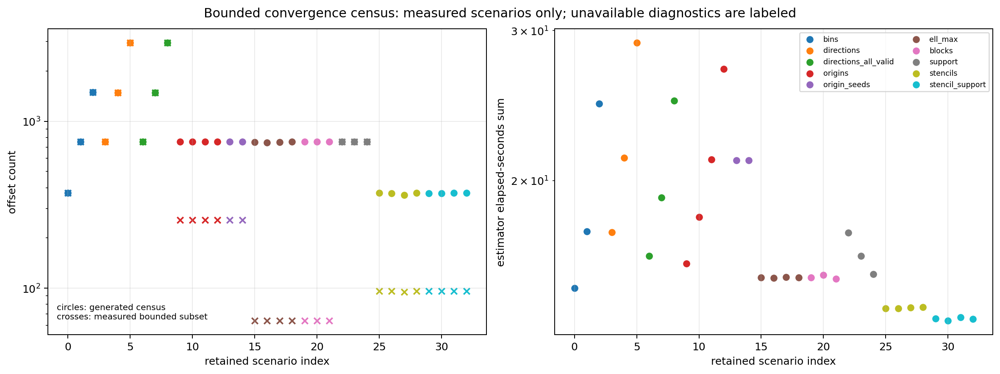

*Figure 2.1: Inventory of the bounded convergence matrix. The selected
production design is measured against alternatives rather than assumed.*

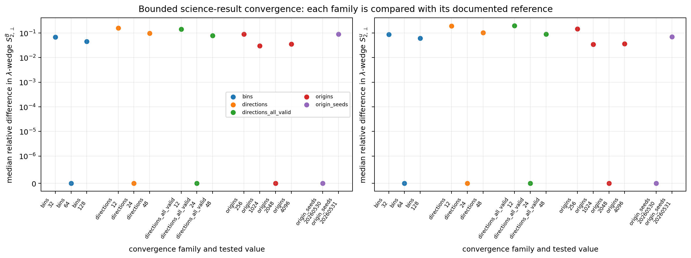

*Figure 2.2: Representative science-difference diagnostics under bin-count,
direction-density, origin-count, and origin-seed changes. The figure takes
medians across shared finite bins and does not apply a science-facing
weak-support cutoff. These are bounded sensitivity measurements, not one
combined error bar or an approved large-scale uncertainty model.*

The bounded block-layout scenarios are deliberately diagnostic: they use at
most `96` offsets and `256` origins per offset. For the representative
$B$ `lambda` wedge over $32 \leq \ell \leq 160$, their median $95\%$
fractional block-band half-widths are `0.665`, `0.761`, and `0.602` for
$80^3$, $160^3$, and $320^3$ blocks. Their median Kish effective block counts
are `6.70`, `4.67`, and `1.65`. The non-monotonic band width and falling
effective block count are reasons to treat block-layout sensitivity as an
open science-policy issue, not to overinterpret one diagnostic bar.

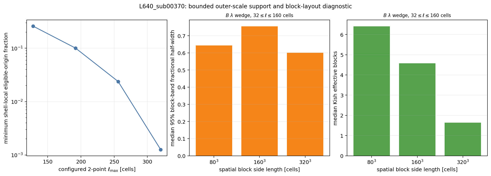

*Figure 2.3: Bounded diagnostic only. Increasing 2-point
$\ell_{\max}$ reduces shell-local support sharply; larger blocks reduce the
number of effective independent regions. This supports cautious
large-scale reporting.*

### 2.5.5 Release, restart, and provenance verification

The clean release publication contains:

| Artifact class | Count | Verification |
| --- | ---: | --- |
| Planned shards | 96 | Complete |
| Published shard completion markers | 96 | Strictly verified |
| Reduced products | 24 | Complete |
| `uncertainty.npz` products | 24 | Stored hashes, schema, metadata, and moment identity verified |
| Work replay publications | 0 | Correct |
| Work replay reuses | 96 | Correct |

The release root records clean source version
`93c166cf339bcdf908cc4d37f385c473f422999d`, `dirty: false`, and the
implementation SHA-256 shown in the report header.

The work replay and reduction replay are retained operational evidence.
Reduction replay conservatively revalidates stored manifests, checksums,
schema, source identity, shard markers, and uncertainty products before
reuse; it is not an independent full re-reduction of every stored array.
Likewise, the CLI `verify` action validates the plan, shards, and reductions.
The report-figure generator additionally verifies the final
`phase3a_summary.json` and `PHASE3A_RELEASE_COMPLETE.json` marker. A future
hardening pass should expose that final marker check as a dedicated CLI
release-verification action and add an optional independent re-reduction
audit mode.

## 2.6 Results

### 2.6.1 Support behavior

The shell-local and all-valid-origins policies answer different finite-domain
questions. Their differences are not bugs and must not be converted into an
unlabeled correction factor.

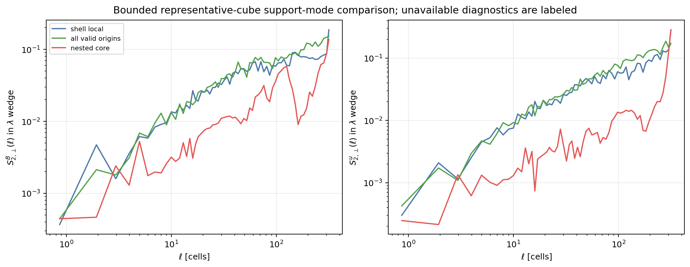

*Figure 2.4: Representative moment curves under three support policies.
`nested_core` is retained only as a regression diagnostic. Its support
collapse is quantified by the retained support diagnostics, not by this
moment-curve panel alone.*

For the four-cube production reductions, the median all-valid-origins to
shell-local 2-point ratio over $32 \leq \ell < 160$ is commonly within tens
of percent of unity, but the outer-scale ratio can move farther and depends
on direction and cube. Examples for $B$ include:

| Cube | Direction | Median ratio, $32 \leq \ell < 160$ | Median ratio, $\ell \geq 160$ |
| --- | --- | ---: | ---: |
| low `dBB` | `parallel` | 1.184 | 1.382 |
| low `dBB` | `xi` | 1.145 | 1.496 |
| high `dBB` | `parallel` | 0.881 | 1.867 |
| high `dBB` | `lambda` | 0.984 | 1.512 |
| weak mean field | `parallel` | 0.830 | 0.945 |

These ratios are descriptive. They show that boundary-support choices can
alter the apparent outer-scale shape in ways that are not uniform across the
sample. They are not controlled boundary-bias estimates: the two policies
also use different deterministic origin schedules. A future policy pass
should use matched-origin comparisons where possible or quantify origin-seed
variation around the ratio.

### 2.6.2 Stencil-filter comparisons

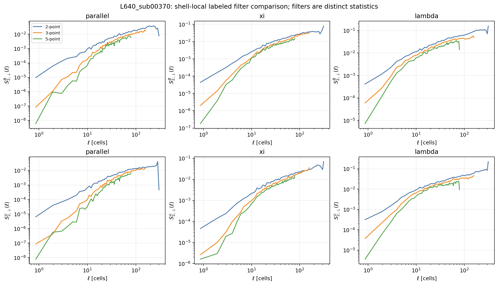

*Figure 2.5: Representative shell-local 2-, 3-, and 5-point curves for
magnetic and velocity fields. Wider stencils are distinct normalized filters
with shorter approved scale ranges. Their labels must remain visible in any
future analysis.*

The measured maximum supported magnetic local-slope endpoints for the
representative low-`dBB` cube are:

| Stencil | Support policy | `parallel` | `xi` | `lambda` |
| --- | --- | ---: | ---: | ---: |
| 2-point | `shell_local` | 234 | 249 | 249 |
| 2-point | `all_valid_origins` | 282 | 282 | 282 |
| 3-point | `shell_local` | 146 | 146 | 146 |
| 3-point | `all_valid_origins` | 146 | 146 | 146 |
| 5-point | `shell_local` | 72.2 | 74.8 | 74.8 |
| 5-point | `all_valid_origins` | 74.8 | 74.8 | 74.8 |

Again, these endpoints only state where the numerical support gate permits a
local-slope diagnostic. They are not recommended fit maxima.

### 2.6.3 Spatial block uncertainty

For the production $80^3$ layout and the $B$ `lambda` wedge over
$32 \leq \ell \leq 160$, the median $95\%$ fractional block-band
half-widths are:

| Cube | `shell_local` | `all_valid_origins` |
| --- | ---: | ---: |
| low `dBB` | 0.127 | 0.099 |
| near-median `dBB` | 0.110 | 0.107 |
| high `dBB` | 0.173 | 0.130 |
| weak mean field | 0.115 | 0.107 |

These are production block-bootstrap diagnostics for one field, geometry,
measurement, direction, and scale window. They should not be generalized into
one universal uncertainty number.

### 2.6.4 Runtime, memory, and storage

The final four-cube production work allocation used `12` Andes nodes for
`00:04:08`, or `0.826667` allocated node-hours. It published all `96` shards.
The parent-process peak RSS across one-worker-per-node work tasks was `23.68`
to `23.70 GiB`. This is directly applicable to the retained publication
layout; it is not process-tree memory accounting for multiworker runs.

The additive estimator elapsed-time sums across all four cubes are:

| Stencil | `shell_local` seconds | `all_valid_origins` seconds |
| --- | ---: | ---: |
| 2-point | 342.831 | 322.505 |
| 3-point | 348.969 | 330.236 |
| 5-point | 363.609 | 337.953 |

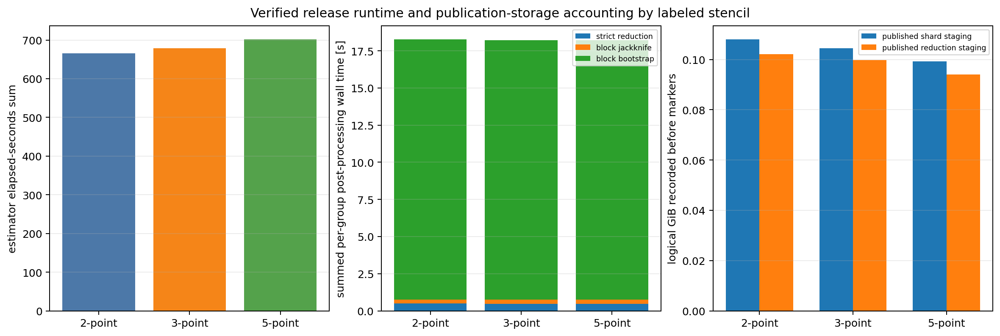

*Figure 2.6: Measured release runtime and storage diagnostics. The bounded
publication is operationally inexpensive relative to the project budget, but
scientific policy, not cost, is the current Phase 4 gate.*

The retained release root occupies about `845 MiB` allocated on Lustre
(`672,242,243` logical bytes). The four reused Phase 2 extracted cubes occupy
about `31 GiB`.

## 2.7 Failures and discarded approaches

Phase 3a intentionally retained only the clean publication roots listed in
Tier 3. Earlier attempts were treated as provisional and were not promoted:

| Issue | Effect | Resolution |
| --- | --- | --- |
| Initial provisional roots | Useful while implementation was still changing | Regenerated clean roots after source freeze |
| Stale anchor marker in job `3314854` | One control job failed | Hardened Phase 3 anchor schema validation and reran |
| Malformed provisional separation grid | Included an unintended sparse jump to `320` | Added strict large-scale coverage checks and replanned |
| Dirty source-bound publication attempts | Helper edits made provisional completion metadata unsuitable for retention | Submitted clean controls, profiles, convergence, and release after commits |
| More node-local workers | No throughput gain in bounded controls | Retained one worker per node |
| Two-node small profile | No wall-time speedup | Reported as equivalence evidence only |
| Global `nested_core` at $\ell_{\max}=320$ | Support collapses | Kept diagnostic-only; not promoted |

The canceled or failed exploratory Slurm jobs remain visible in the compute
ledger and logs. They are not hidden from the accounting.

## 2.8 Remaining risks

1. The production support policy is not frozen. `shell_local` and
   `all_valid_origins` both remain useful, but for different claims.
2. The 2-point outer shell-local points are too weakly supported for slope
   claims near $\ell_{\max}=320$. A science-facing geometric support cutoff
   has not yet been approved or enforced; raw products intentionally retain
   labeled diagnostic points.
3. Candidate fit windows have not been scientifically approved. Local-slope
   support masks are necessary diagnostics, not fit-window selectors.
4. Block-layout sensitivity remains material. The production $80^3$ layout
   is implemented and useful, but larger-block diagnostics reduce effective
   sample counts sharply.
5. Direction-density and origin-seed sensitivity are measured on a bounded
   representative-cube convergence suite, not exhaustively across all four
   cubes.
6. The weak-mean-field cube is an outlier and requires explicit treatment in
   any environmental interpretation.
7. Multi-node correctness is validated, but useful large-workload scaling has
   not been demonstrated.
8. Phase 3a covers only `B`, `u`, and $p=2$. Higher orders and
   compressible-MHD derived channels remain intentionally deferred.
9. The slow oracle shares production finite-support geometry helpers. Existing
   hand-calculated bounds and no-wrap tests are useful, but an independent
   brute-force coordinate enumerator would strengthen geometry validation.
10. The compatibility field `excluded_boundary_pairs` includes both intrinsic
   boundary loss and deliberate policy loss for `shell_local` and
   `nested_core`. New analysis should use the separated
   `boundary_excluded_origins` and `support_policy_excluded_origins` arrays.
11. CLI `verify` checks plans, shards, and reductions but not the later
    release-summary marker. The figure generator checks the final marker for
    this report. Add a dedicated CLI final-release verification action.
12. Reduction replay revalidates the stored chain but does not independently
    recompute all reduced arrays. Add an optional audit re-reduction mode if a
    stronger future release audit is needed.
13. Replay resource records are useful operational evidence but are not
    themselves bound into the final release marker. A future publication
    schema can add replay completion markers.
14. Moment bootstrap bands require at least two contributing blocks and two
    finite resamples. Some weak-support outer tails retain fewer than `200`
    finite bootstrap resamples, so those intervals are conditional
    diagnostics and should be visibly flagged or masked by the Phase 4
    reporting policy.
15. Direction-density sensitivity was measured, but alternate angular phases
    of the deterministic displacement census were not. Test a rotated census
    before promoting fine directional claims.
16. A direct all-valid-origins versus shell-local local-slope comparison is
    not yet published. Until that policy sensitivity is inspected, Phase 4
    should be curve-first and should not promote directional slope tables.

## 2.9 Recommended next steps

1. Use the retained four-cube reductions to write a narrow reporting-policy
   decision: primary support policy by claim type, admissible scale ranges,
   prohibited slope claims, and required sensitivity overlays.
2. Freeze candidate fit intervals only after inspecting local curvature,
   support fractions, block bands, and nearby-window sensitivity.
3. Revise `phase4.md` so Batch A begins with the frozen 2-point curve-level
   baseline and does not imply that every direction needs a slope.
4. Add a bounded policy-confirmation rerun only if the retained artifacts
   cannot answer a specific remaining question. Do not repeat extraction or
   the full Phase 3a release unnecessarily.
5. Launch the 21-region Phase 4 pilot only after the revised gate is reviewed.

# Tier 3: Reproducibility, audit trail, and handoff

## 3.1 Repository state

The retained estimator publication was created from clean source commit:

```text
93c166cf339bcdf908cc4d37f385c473f422999d
```

Its implementation SHA-256 is:

```text
ae3249b2a2c28373a0c2a085411b5419aed578b26b2f6f8d4f6210143e7b1904
```

This is the estimator-binding commit, not the later report-publication
commit. This report, its figures, and audit-driven documentation refinements
are committed after that estimator source freeze. Recover the report commit
with:

```bash
git log -1 --format='%H' -- PHASE3A_STATUS_UPDATE.md
```

At report-generation time the local branch was `12` commits ahead of
`origin/cleanup/cpu-production` before the final report-publication commit.
No push was performed as part of Phase 3a execution.

The Phase 3a implementation changed or added:

| Path | Status | Purpose |
| --- | --- | --- |
| `.gitignore` | Modified | Ignore generated Python cache files and local runtime products |
| `phase3a.md` | Added | Bounded execution plan and gate |
| `phase4.md`, `phase5.md` | Modified | Defer larger campaigns until Phase 3a approval |
| `docs/PHASE3A_PARALLEL_FINITE_DOMAIN.md` | Added | Durable implementation documentation |
| `job_scripts/phase3a/run_phase3a_sampler_andes.sh` | Added | Andes CPU Slurm wrapper |
| `scripts/phase3a/run_phase3a_sampler.py` | Added | Phase 3a CLI and publication pipeline |
| `scripts/phase3a/generate_phase3a_status_figures.py` | Added | Reproducible retained-artifact figure generator |
| `sfunctor/core/finite_domain.py` | Modified | Shared finite-domain extensions |
| `sfunctor/core/phase3a.py` | Added | Dense displacement and stencil definitions |
| `sfunctor/analysis/finite_domain.py` | Modified | Serialization extensions |
| `sfunctor/analysis/phase3a.py` | Added | Parallel analysis and reducer |
| `sfunctor/reference_3d.py` | Modified | Slow stencil-aware oracle |
| `tests/test_finite_domain.py` | Modified | Shared finite-domain regressions |
| `tests/test_phase3a_analysis.py` | Added | Analysis and uncertainty tests |
| `tests/test_phase3a_parallel.py` | Added | Parallel execution tests |
| `tests/test_phase3a_runner.py` | Added | Runner, source-binding, and publication tests |
| `tests/phase3a_wrapper_test.py` | Added | Slurm-wrapper contract tests |
| `PHASE3A_STATUS_UPDATE.md` | Added | This report |
| `figures/phase3a_status_update/` | Added | Report figures and figure manifest |

## 3.2 Retained roots

| Root | Description | Status | Size | Required for continuation | Regenerable |
| --- | --- | --- | ---: | --- | --- |
| `/lustre/orion/ast207/proj-shared/dfielding/Production_plm/phase2_extract/benchmark_verified_release_primary_20260530` | Four immutable Phase 2 cubes | Verified | `31 GiB` | Yes | Expensive but reproducible |
| `/lustre/orion/ast207/proj-shared/dfielding/Production_plm/phase3_sampler/smoke_remediated_verified_release_primary_20260531T001131Z` | Phase 3 regression anchor | Verified historical input | Small | Keep for regressions | Reproducible |
| `/lustre/orion/ast207/proj-shared/dfielding/Production_plm/phase3a_sampler/controls_clean_release_20260531T031107Z` | Clean one-cube controls | Complete | `259 KiB` | Yes | Yes |
| `/lustre/orion/ast207/proj-shared/dfielding/Production_plm/phase3a_sampler/profile_1node_clean_release_20260531T031916Z` | Clean one-node profile | Complete | `2.1 MiB` | Yes | Yes |
| `/lustre/orion/ast207/proj-shared/dfielding/Production_plm/phase3a_sampler/profile_2node_clean_release_20260531T032112Z` | Clean two-node profile | Complete | `2.1 MiB` | Yes | Yes |
| `/lustre/orion/ast207/proj-shared/dfielding/Production_plm/phase3a_sampler/convergence_clean_release_20260531T032332Z` | Clean `33`-scenario convergence publication | Complete | `8.5 MiB` | Yes | Yes |
| `/lustre/orion/ast207/proj-shared/dfielding/Production_plm/phase3a_sampler/release_clean_primary_20260531T033614Z` | Clean four-cube release | Complete | `845 MiB` allocated | Yes | Yes |
| `figures/phase3a_status_update/` | Reproducible report figures | Complete | `5.8 MiB` | Yes | Yes |

Do not delete provisional roots until a collaborator decides whether their
forensic value is exhausted. Do not treat them as retained science inputs.

## 3.3 Representative commands

Environment setup inside the wrapper:

```bash
module reset
module load gcc/9.3.0 python/.3.11-anaconda3
source /ccs/home/dfielding/SFunctor/venv_sfunctor/bin/activate
export PYTHONPATH=/ccs/home/dfielding/SFunctor:${PYTHONPATH:-}
export OMP_NUM_THREADS=1
export OPENBLAS_NUM_THREADS=1
export MKL_NUM_THREADS=1
```

Refresh the compute ledger before every nontrivial submission:

```bash
python scripts/phase1/update_compute_ledger.py \
  --results-dir /lustre/orion/ast207/proj-shared/dfielding/Production_plm/prompt1_catalog
```

Representative Slurm submission template for a **new** unique run:

```bash
OUTPUT_ROOT=/lustre/orion/ast207/proj-shared/dfielding/Production_plm/phase3a_sampler/release_clean_primary_20260531T033614Z
RUN_DIR="${OUTPUT_ROOT}/runs/work_3314889"

sbatch \
  --nodes=12 \
  --time=00:20:00 \
  --export=ALL,ACTION=work,OUTPUT_ROOT="${OUTPUT_ROOT}",RUN_DIR="${RUN_DIR}",PHASE3A_WORKERS=1 \
  job_scripts/phase3a/run_phase3a_sampler_andes.sh
```

The retained clean allocation logs are under:

```text
/lustre/orion/ast207/proj-shared/dfielding/Production_plm/phase3a_sampler/runs/release_plan_clean_primary_20260531T033614Z
/lustre/orion/ast207/proj-shared/dfielding/Production_plm/phase3a_sampler/runs/release_work_clean_primary_20260531T033746Z
/lustre/orion/ast207/proj-shared/dfielding/Production_plm/phase3a_sampler/runs/release_work_replay_clean_primary_20260531T034424Z
/lustre/orion/ast207/proj-shared/dfielding/Production_plm/phase3a_sampler/runs/release_reduce_clean_primary_20260531T034659Z
/lustre/orion/ast207/proj-shared/dfielding/Production_plm/phase3a_sampler/runs/release_reduce_replay_clean_primary_20260531T035039Z
/lustre/orion/ast207/proj-shared/dfielding/Production_plm/phase3a_sampler/runs/release_verify_clean_primary_20260531T035252Z
/lustre/orion/ast207/proj-shared/dfielding/Production_plm/phase3a_sampler/runs/release_summarize_clean_primary_20260531T035503Z
```

The same wrapper supports:

```text
plan
work
reduce
verify
controls
multinode_control
convergence
summarize
```

Regenerate report figures from retained artifacts:

```bash
venv_sfunctor/bin/python scripts/phase3a/generate_phase3a_status_figures.py \
  --phase2-root /lustre/orion/ast207/proj-shared/dfielding/Production_plm/phase2_extract/benchmark_verified_release_primary_20260530 \
  --controls-root /lustre/orion/ast207/proj-shared/dfielding/Production_plm/phase3a_sampler/controls_clean_release_20260531T031107Z \
  --profile-one-node-root /lustre/orion/ast207/proj-shared/dfielding/Production_plm/phase3a_sampler/profile_1node_clean_release_20260531T031916Z \
  --profile-two-node-root /lustre/orion/ast207/proj-shared/dfielding/Production_plm/phase3a_sampler/profile_2node_clean_release_20260531T032112Z \
  --convergence-root /lustre/orion/ast207/proj-shared/dfielding/Production_plm/phase3a_sampler/convergence_clean_release_20260531T032332Z \
  --release-root /lustre/orion/ast207/proj-shared/dfielding/Production_plm/phase3a_sampler/release_clean_primary_20260531T033614Z \
  --output-dir figures/phase3a_status_update
```

Run local verification:

```bash
venv_sfunctor/bin/python -m pytest -q
git diff --check
python -m py_compile \
  scripts/phase3a/run_phase3a_sampler.py \
  scripts/phase3a/generate_phase3a_status_figures.py
bash -n job_scripts/phase3a/run_phase3a_sampler_andes.sh
```

All Slurm standard output and error files are routed under `logs/`. The
wrapper contains no email-notification directives.

## 3.4 Compute accounting

The compute ledger was refreshed after publication:

| Metric | Node-hours |
| --- | ---: |
| Workflow budget | 5000 |
| Consumed allocated runtime | 5.661945 |
| Remaining budget | 4994.338055 |
| Pending maximum additional exposure | 0 |

The final retained ladder used:

| Job | Stage | Nodes | Elapsed | Allocated node-hours | Result |
| ---: | --- | ---: | ---: | ---: | --- |
| `3314883` | Clean controls | 1 | `00:06:47` | 0.1131 | Complete |
| `3314884` | Clean one-node profile | 1 | `00:01:17` | 0.0214 | Complete |
| `3314886` | Clean two-node profile | 2 | `00:01:30` | 0.0500 | Complete |
| `3314887` | Clean convergence | 1 | `00:10:21` | 0.1725 | Complete |
| `3314888` | Release plan | 1 | `00:00:38` | 0.0106 | Complete |
| `3314889` | Release work | 12 | `00:04:08` | 0.8267 | Complete |
| `3314890` | Work replay | 4 | `00:00:11` | 0.0122 | Reused all `96` shards |
| `3314891` | Reduce | 1 | `00:02:45` | 0.0458 | Complete |
| `3314892` | Reduction replay | 1 | `00:00:50` | 0.0139 | Complete |
| `3314893` | Strict verify | 1 | `00:01:00` | 0.0167 | Complete |
| `3314894` | Summarize | 1 | `00:01:08` | 0.0189 | Complete |

The ledger also retains exploratory, canceled, and failed jobs. Important
examples are job `3314854`, which failed on a stale Phase 3 anchor marker,
and job `3314878`, which was canceled before publishing shards from a
provisional release root.

A simple measured allocation-based linear extrapolation of the complete
four-cube, all-stencil, both-policy work stage is:

$$
0.826667\ {\rm node\ hours}
\times
\frac{21}{4}
\approx
4.34\ {\rm node\ hours}.
$$

This is **not** the approved Phase 4 forecast because Phase 4 Batch A should
freeze a narrower 2-point policy first. It only shows that budget is not the
blocking issue.

Using each stencil-policy group's share of the measured additive estimator
time gives the following descriptive allocation proxies for `21` cubes:

| Stencil | Support policy | Four-cube estimator seconds | 21-cube allocation-share proxy [node-hours] |
| --- | --- | ---: | ---: |
| 2-point | `shell_local` | 342.831 | 0.727 |
| 2-point | `all_valid_origins` | 322.505 | 0.684 |
| 3-point | `shell_local` | 348.969 | 0.740 |
| 3-point | `all_valid_origins` | 330.236 | 0.700 |
| 5-point | `shell_local` | 363.609 | 0.771 |
| 5-point | `all_valid_origins` | 337.953 | 0.717 |

These shares inherit the complete-release allocation and are not standalone
benchmarks. Fixed planning, verification, reduction, extraction, and
scheduler costs are additional; cache state and larger campaign scheduling
can be non-linear. A Phase 4 Batch A forecast should be published only after
the 2-point support policy is frozen.

## 3.5 Known issues

| Issue | Current handling |
| --- | --- |
| No approved production support policy | Hold Phase 4; adjudicate with retained reductions |
| Outer 2-point shell-local support collapse | Plot as labeled limits; do not fit unsupported outer points |
| No approved geometric reporting cutoff | Freeze and enforce it before Phase 4 while retaining raw diagnostic values |
| No approved science fit windows | Use local-slope diagnostics and uncertainty; freeze windows before Phase 4 |
| Block-layout sensitivity | Retain $80^3$ production products and report larger-block diagnostics separately |
| Weak-mean-field outlier | Keep explicitly labeled; do not merge blindly into ordinary `dBB` trends |
| No useful node-local or small-profile node scaling | Use one worker per node; do not claim speedup |
| Parent RSS is not multiworker process-tree RSS | Use it for the retained one-worker layout; reconcile Slurm accounting before multiworker extrapolation |
| CLI final-summary verification and independent re-reduction are not exposed | Add optional hardening actions before relying on those stronger audit guarantees |
| Higher orders and derived compressible-MHD channels deferred | Add only after the 2-point baseline policy is approved |
| SGS-derived channels broken | Do not use them |

## 3.6 Continuation instructions

Read these files first:

1. `phase3a.md`
2. `docs/PHASE3A_PARALLEL_FINITE_DOMAIN.md`
3. `PHASE3A_STATUS_UPDATE.md`
4. `phase4.md`

Reuse the clean roots listed in Section 3.2. Do not rerun Phase 1, re-extract
the four Phase 2 cubes, or repeat the complete Phase 3a release merely to
inspect support-policy effects.

Before any Phase 4 submission:

1. Decide which policy is primary for fair directional comparisons and which
   policy is retained as an outer-scale sensitivity overlay.
2. Freeze the science-facing geometric support cutoff and allowed and
   prohibited slope windows by stencil, field, and claim type.
3. State whether Phase 4 is curve-first, slope-first for a restricted subset,
   or curve-only for selected directions.
4. Revise `phase4.md` and obtain collaborator approval.
5. Refresh the compute ledger and verify that pending exposure is zero.

If new code changes are made, rerun the full repository suite and publish a
new unique source-bound root. Never overwrite the clean Phase 3a release.

The current recommendation is **curve-first**. Do not promote directional
slope tables unless the policy-adjudication pass adds a direct
all-valid-origins versus shell-local local-slope comparison and approves
bounded fit windows.

## 3.7 Independent audits and reconciliation

Five read-only independent audits reviewed the retained implementation,
artifacts, figures, and report. No reviewer found a critical estimator or
retained-release correctness defect.

| Audit | Main findings | Reconciliation |
| --- | --- | --- |
| Finite support | Add an explicit future geometric cutoff; ratios include policy and sampling effects; slow oracle shares geometry helpers | Report now states the missing cutoff, labels ratios as policy-plus-sampling sensitivities, and records the independent brute-force enumerator as follow-up |
| Parallel reducer | CLI `verify` does not check the later final-summary marker; replay is stored-chain validation, not independent re-reduction; causal memory wording was too strong | Report and durable docs now narrow the claims and record dedicated final-release verify and audit re-reduction modes as hardening tasks |
| Uncertainty | Weak-support tails can have reduced valid bootstrap populations; point-slope mask and slope-band mask differ; alternate angular phases remain untested | Report now distinguishes point and band gates, marks conditional bands, and records tail masking and rotated-census checks for the Phase 4 policy pass |
| Scientific interpretation | Dissipation-range lower boundary is not approved; anisotropy wedges were underdefined; direct slope-policy comparison is missing | Report now defines the wedges, labels grid-adjacent slopes as diagnostics only, and makes the Phase 4 recommendation curve-first |
| Adversarial handoff | Ratio figure needed weak-tail styling; actual retained run directories and review record were missing; operational evidence is less strongly bound than science artifacts | Figure generator now uses a logarithmic ratio axis and gray weak-support markers; Tier 3 now lists retained run directories and operational-evidence binding as a future schema task |

The audits support the report's final gate: Phase 3a software and bounded
publication are complete, but Phase 4 remains a scientific-policy `NO-GO`.

# Appendix A: Figure index

| Figure | Purpose |
| --- | --- |
| `phase3a_workflow_schematic.png` | Schematic retained workflow |
| `phase3a_input_cube_midplane_montage.png` | Qualitative four-cube density context |
| `phase3a_stencil_schematic.png` | Schematic filter definitions |
| `phase3a_manifest_occupancy.png` | Realized offset occupancy |
| `phase3a_support_by_ell.png` | Support fraction versus separation |
| `phase3a_offset_resolved_support_orientation.png` | Offset-resolved finite support and orientation |
| `phase3a_representative_B_u_curves_with_block_bands.png` | Representative curves and spatial-block bands |
| `phase3a_local_slopes_with_block_bands_and_effective_blocks.png` | Local slopes and effective blocks |
| `phase3a_slope_window_sensitivity.png` | Three-, five-, and seven-bin local-slope window sensitivity |
| `phase3a_four_cube_supported_slope_overview.png` | Four-cube shell-local slope census |
| `phase3a_support_mode_comparison.png` | Bounded policy comparison including nested-core diagnostic |
| `phase3a_four_cube_support_mode_ratios.png` | Four-cube all-valid-origins to shell-local ratios |
| `phase3a_stencil_comparison.png` | Labeled 2-, 3-, and 5-point curves |
| `phase3a_convergence_census.png` | Convergence scenario inventory |
| `phase3a_convergence_science_differences.png` | Convergence sensitivity measurements |
| `phase3a_convergence_scale_and_block_diagnostics.png` | Outer-scale and block-layout bounded diagnostics |
| `phase3a_worker_scaling.png` | Node-local worker scaling |
| `phase3a_node_scaling.png` | One-node and two-node equivalence profile |
| `phase3a_runtime_storage_summary.png` | Runtime and storage summary |

# Appendix B: Additional technical figures

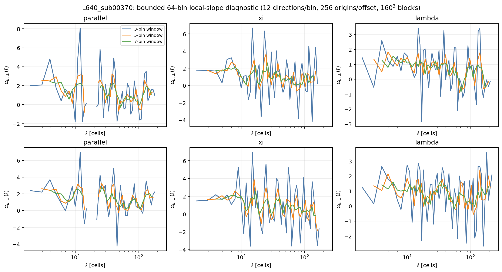

*Figure B.1: Three-, five-, and seven-bin local-slope windows on bounded
representative-cube diagnostics. Slope summaries depend on smoothing scale,
which is why Phase 4 needs a frozen fit policy.*

# Appendix C: Final one-paragraph handoff

Phase 3a is complete as a software and bounded-publication task: the project
now has source-bound, restartable, non-periodic, parallel 3-D 2-point,
3-point, and 5-point estimators with spatial-block uncertainty, verified on
four realistic $640^3$ cubes. The most important result is that the estimator
works while exposing a real large-scale support-policy sensitivity:
shell-local comparisons become weak near the 2-point outer scale, whereas
all-valid-origins curves retain volume but sample offset-dependent regions.
The most important remaining uncertainty is therefore interpretive, not
operational: the project has not yet frozen which policy and scale windows
Phase 4 should use for each claim. The recommended next action is a narrow
four-cube policy-adjudication pass using the retained reductions, followed by
a revision and review of `phase4.md` before any 21-region submission.
