# Project status update: Phase 3 finite-domain sampler validated, Phase 4 science pilot held

| Field | Value |
|---|---|
| Date | 2026-05-30 EDT; final Slurm records published 2026-05-31 UTC |
| Project | `SFunctor` / Phase 3 finite-domain 3-D sampler |
| Repository | `/autofs/nccs-svm1_home2/dfielding/SFunctor` |
| Branch | `cleanup/cpu-production` |
| Base git commit | `ad76e866574b90430335cd351c876f6464fc5283` |
| Definitive implementation inventory | `phase3src-6e57c12d0e254a5f2a6976bfb9d2f14734d57abbaa4835eaf3e2559adb7cb198` |
| Agent | Codex |
| Simulation analyzed | `Turb_10240_beta25_dedt025_plm`, nonrelativistic MHD snapshot at $t=6.0$, cycle `799945` |
| Compute environment | Andes CPU partition `batch`, account `AST207`, QoS `normal`, one 32-core node |
| Phase 2 input root | `/lustre/orion/ast207/proj-shared/dfielding/Production_plm/phase2_extract/benchmark_verified_release_primary_20260530` |
| Retained Phase 3 smoke root | `/lustre/orion/ast207/proj-shared/dfielding/Production_plm/phase3_sampler/smoke_remediated_verified_release_primary_20260531T001131Z` |
| Retained control-profile root | `/lustre/orion/ast207/proj-shared/dfielding/Production_plm/phase3_sampler/control_profile_final_release_20260531T000742Z` |
| Definitive smoke allocation | `3314846`, completed in `00:20:46` |
| Status | **Phase 3 implementation and bounded validation complete. NO-GO for the Phase 4 science pilot until slope-fit stability and finite-support sensitivity are resolved.** |

This report is intentionally layered. Tier 0 gives the short collaborator-level
story. Tier 1 explains the method and results. Tier 2 documents the expert
implementation and validation details. Tier 3 is the reproduction and handoff
guide.

# Tier 0: What happened and why it matters

Phase 3 asked a narrow but important question: can we compute trustworthy
three-dimensional structure functions inside extracted $640^3$ simulation
cubes without accidentally wrapping point pairs across the edges of those
non-periodic cutouts?

The answer is partly yes. The new CPU sampler is implemented, tested, and
operationally bounded. It only samples pairs $\mathbf{x}$ and
$\mathbf{x}+\mathbf{r}$ when both endpoints remain inside the extracted cube.
It never treats a cutout as periodic.

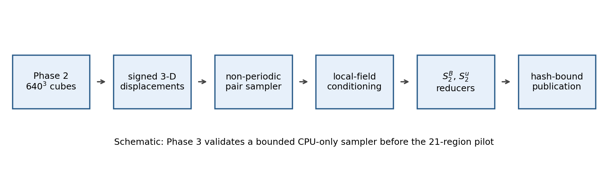

*Figure 0.1: Schematic of the retained Phase 3 workflow. Notice that the
non-periodic pair sampler, local-field conditioning, reducers, and hash-bound
publication are separate steps. This matters because each source of error can
be checked independently.*

The sampler was checked against a slow three-dimensional reference
implementation and against controlled synthetic fields. Those checks passed.
The synthetic cases recover isotropy when expected, recover a guide-field
preferred direction, recover ribbon-like eddy ordering, shrink the nested core
when the maximum separation grows, and exclude undefined magnetic directions.

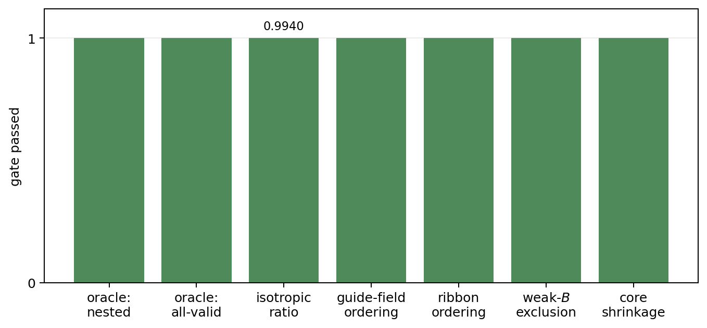

*Figure 0.2: Every retained compute-node synthetic-gate check passed. The
isotropic ratio is close to one. Additional transforms, scope controls, and
provenance checks are covered by the repository suite. This matters because
the sampler should measure directional structure rather than manufacture it.*

The definitive smoke used exactly four approved Phase 2 cubes, chosen to span
different magnetic environments. It ran only the deliberately small matrix:

```text
q = B, u
p = 2
L_sub = 640
ell_max = 128 cells
```

No 21-region pilot, no $L_{\rm sub}=1280$ extraction, and no broken SGS
products were launched.


*Figure 0.3: Density, velocity, and magnetic-field midplanes for the four
retained Phase 2 cubes. The smoke spans low-`dBB`, median-`dBB`, high-`dBB`,
and weak-mean-field environments. This matters because the validation is not
restricted to one unusually easy region.*

The audit-driven rerun made the smoke materially stronger than the first
provisional attempt. It increased the signed displacement census from `152`
to `622`, matched the `nested_core` and `all_valid_pairs` sampling depths at
`32768` origins per offset, retained offset-resolved support, and repeated the
representative all-valid calculation for two additional seeds.

The improved displacement census also fixed the previously missing
subvolume-mean-field `parallel` diagnostic for these four cubes. Every fitted
bin now has at least `65536` accepted fixed-frame parallel pairs for both `B`
and `u`, far above the required count of `100`.

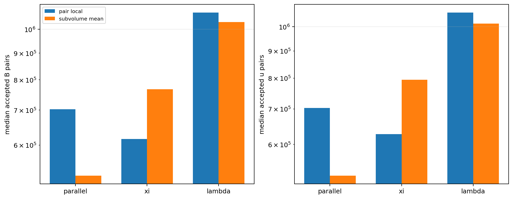

*Figure 0.4: Median accepted counts for pair-local and subvolume-mean magnetic
conditioning. The fixed-frame parallel bar is now populated. This matters
because Phase 3 can compare pair-scale and subvolume-scale magnetic frames
without silently carrying an empty diagnostic.*

The main caution is scientific rather than operational. The primary
directional curves are populated and interesting, but fitted slopes change
too much when the fitted interval changes. Using a screening tolerance of
`0.2` in absolute slope, only `15/24` nested-core pair-local `B` and `u`
directional slopes pass all three tested fit windows.

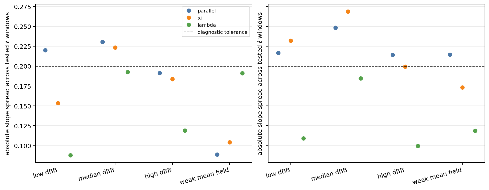

*Figure 0.5: Absolute slope spread across the three tested fit windows. Points
above the dashed `0.2` line fail the bounded screening convention. This
matters because smoke slopes are diagnostics, not yet defensible physical
scaling exponents.*

The finite-support comparison is also material. Even after matching sampling
depth, median nested-core versus all-valid differences range from `0.0478` to
`0.2604` across cubes, with maxima from `0.2326` to `0.5878`. By contrast,
changing only the random seed in the representative all-valid calculation
gives median differences near `0.0033` and maxima near `0.047`. The mode
difference is therefore not explained by sampling noise alone.

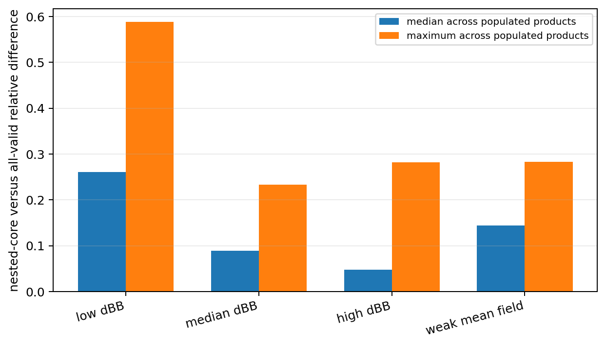

*Figure 0.6: Matched-depth nested-core versus all-valid differences. Notice
that the discrepancy is cube dependent and larger than repeat-seed variation.
This matters because finite support and real spatial inhomogeneity interact.*

Operationally, the path is bounded. Four cube samplers took `823.632 s`,
internal peak RSS was `22,420,640 KiB` or `21.382 GiB`, and the complete
Slurm wrapper took `00:20:46`, consuming `0.346111` node-hours. A linear
21-cube sampler-only forecast is `1.201130` node-hours.

The Phase 3 decision is therefore a documented NO-GO for the Phase 4 science
pilot, not a software failure. The sensible next task is to use the retained
four-cube results to define a stable fitting policy, add spatial block
uncertainty, and decide whether the largest scales or some directional slope
claims should be removed before any 21-region production campaign.

# Tier 1: How the analysis works

## 1.1 Objective, inputs, and outcome

The Phase 3 objective was to build a trusted CPU-only finite-domain 3-D
structure-function path and run the smallest scientifically useful real-data
smoke. The four input cubes are read-only Phase 2 products:

| Cube ID | Phase 1 selection label |
|---|---|
| `L640_sub00370` | low `dBB` |
| `L640_sub03942` | median `dBB` |
| `L640_sub00579` | high `dBB` |
| `L640_sub00738` | weak mean field |

Each cube provides seven KJI-ordered arrays:

```text
dens
velx vely velz
bcc1 bcc2 bcc3
```

The bounded smoke passed numerically and operationally, but its fitted-slope
stability screen failed. Phase 3 is complete with a NO-GO recommendation for
Phase 4 science production.

## 1.2 Smoke configuration

| Quantity | Retained value |
|---|---:|
| Cube side | $L_{\rm sub}=640$ cells |
| Cubes | `4` |
| Fields | `B`, `u` |
| Structure-function order | $p=2$ |
| Maximum configured separation | $\ell_{\max}=128$ cells |
| Nominal radii | `4, 8, 16, 32, 64, 96, 128` cells |
| Signed integer displacements | `622` |
| Directions per nominal radius | `96` before rounding and strict cutoff |
| Nested-core origins per displacement | `32768` |
| All-valid origins per displacement | `32768` |
| Pair batch size | `8192` |
| Base random seed | `20260530` |
| Repeat all-valid seeds | `20260531`, `20260532` |
| Angular wedge width | $15^\circ$ |
| Nominal fitted interval | $8 \le \ell \le 96$ cells |
| Alternate fit intervals | $8 \le \ell \le 64$ and $16 \le \ell \le 96$ cells |
| Minimum accepted count | `100` |

The integer displacement census is generated deterministically, closed under
sign reversal, rounded to the grid, deduplicated, and filtered again after
rounding so that every retained vector obeys $\ell \le 128$ cells.

## 1.3 Non-periodic pair modes

For every displacement $\mathbf{r}$, the sampler uses:

$$
\mathbf{x},
\qquad
\mathbf{x}+\mathbf{r}.
$$

Both endpoints must remain inside the extracted cube.

The primary `nested_core` mode intersects the valid-origin boxes for every
signed displacement. Every sampled direction therefore uses one common
spatial origin region.

The diagnostic `all_valid_pairs` mode uses the largest valid-origin box for
each offset separately. It retains more boundary volume but can mix support
geometry with spatial inhomogeneity.

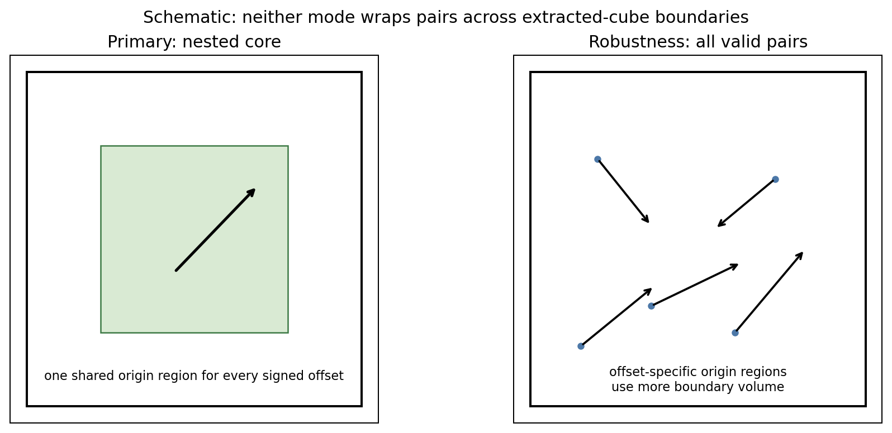

*Figure 1.1: Schematic comparison of `nested_core` and `all_valid_pairs`.
Neither wraps across cube boundaries. The nested core fixes spatial support;
the all-valid diagnostic measures the sensitivity to using more boundary
volume.*

For the retained census, the shared nested-core bounds in KJI order are:

```text
((121, 519), (127, 513), (125, 515))
```

The retained nested-core volume fraction is `0.228557`. In the representative
cube, the all-valid eligible-origin fraction declines from `0.990649` at the
smallest shell to `0.726578` at the largest shell.

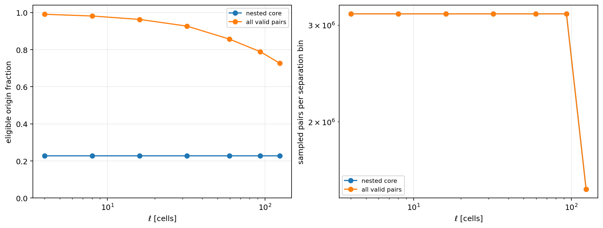

*Figure 1.2: Eligible-origin fraction and sampled-pair census versus
separation. Notice the declining all-valid support at large $\ell$. This
matters because support geometry is scale dependent.*

The retained output also records support for every signed offset, not only
shell totals.

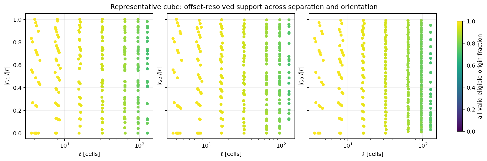

*Figure 1.3: Representative all-valid support versus separation and Cartesian
orientation. Each point is one signed displacement. This matters because
finite-domain support can now be audited as a function of both scale and
direction.*

## 1.4 Structure-function definitions

For vector field $\mathbf{q}$ and positive real order $p$, the total-vector
product is:

$$
S_p^q(\ell)
=
\left\langle
\left|
\delta \mathbf{q}
\right|^p
\right\rangle,
$$

where:

$$
\delta \mathbf{q}
=
\mathbf{q}(\mathbf{x}+\mathbf{r})
-
\mathbf{q}(\mathbf{x}).
$$

The primary eddy-geometry product is the perpendicular-vector increment:

$$
S_{p,\perp}^q(\ell)
=
\left\langle
\left|
\delta \mathbf{q}_{\perp}
\right|^p
\right\rangle.
$$

The implementation stores both labeled products. It does not implement a
scalar longitudinal/transverse decomposition in Phase 3. That extension is
explicitly deferred.

## 1.5 Three-direction magnetic conditioning

The pair-local magnetic frame is:

$$
\mathbf{B}_{\rm loc,pair}
=
\frac{
\mathbf{B}(\mathbf{x})
+
\mathbf{B}(\mathbf{x}+\mathbf{r})
}{2},
$$

$$
\mathbf{e}_{\parallel}
=
\frac{
\mathbf{B}_{\rm loc,pair}
}{
\left|
\mathbf{B}_{\rm loc,pair}
\right|
}.
$$

For each vector increment:

$$
\delta \mathbf{q}_{\perp}
=
\delta \mathbf{q}
-
(\delta \mathbf{q}\cdot\mathbf{e}_{\parallel})
\mathbf{e}_{\parallel},
$$

$$
\mathbf{e}_{\xi}
=
\frac{
\delta \mathbf{q}_{\perp}
}{
\left|
\delta \mathbf{q}_{\perp}
\right|
},
\qquad
\mathbf{e}_{\lambda}
=
\mathbf{e}_{\parallel}
\times
\mathbf{e}_{\xi}.
$$

Angles are folded, so sign choices for $\mathbf{e}_{\xi}$ and
$\mathbf{e}_{\lambda}$ do not change classification. Degenerate local fields,
degenerate perpendicular increments, invalid densities, and non-finite fields
are counted and excluded.

A labeled `subvolume_mean` comparison uses:

$$
\mathbf{B}_{\rm mean,sub}
=
\left\langle
\mathbf{B}
\right\rangle_{\rm sub}.
$$

The denser `96`-direction census makes that fixed-frame comparison usable for
all four retained cubes. Its campaign gate requires at least `100` accepted
parallel pairs in every fitted bin. The observed minimum is `65536`.

## 1.6 Compressible-MHD variants

The API supports:

```text
B
u
vA
vA_ref
z_plus
z_minus
z_plus_ref
z_minus_ref
```

with:

$$
\mathbf{v}_A
=
\frac{\mathbf{B}}{\sqrt{\rho}},
\qquad
\mathbf{z}^{\pm}
=
\mathbf{u}
\pm
\mathbf{v}_A.
$$

Reference-density variants use explicit $\rho_0$ provenance and remain labeled
diagnostics. The retained real-data smoke intentionally evaluates only `B`
and `u`.

## 1.7 Main measurements

The nested-core pair-local directional curves are populated and visibly
different across directions:

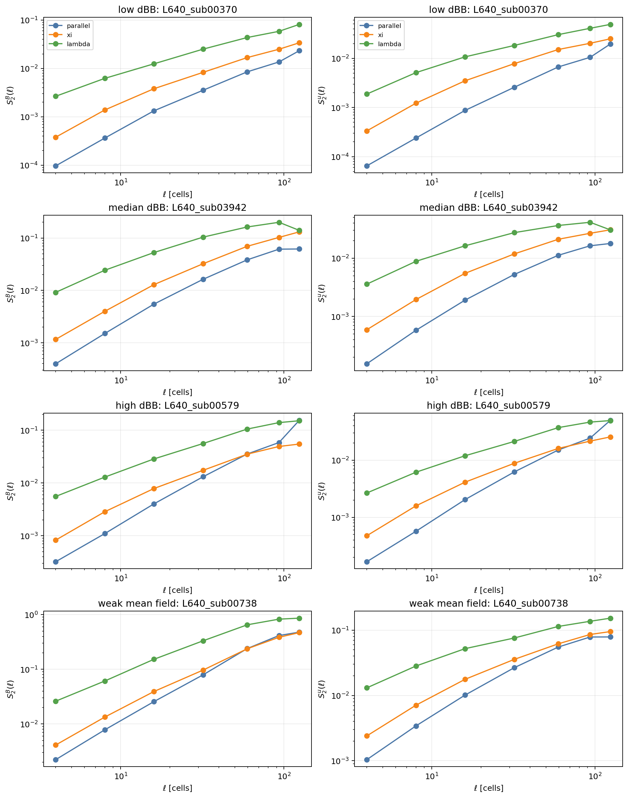

*Figure 1.4: Nested-core pair-local perpendicular-increment $S_2$ curves for
`B` and `u`. Directional separation is measurable, but several curves turn
over or flatten toward the largest scales. This motivates the fit-window
screen.*

Matched-depth aggregate finite-support sensitivity across populated saved
products is:

| Cube | Median nested/all-valid relative difference | Maximum difference |
|---|---:|---:|
| `L640_sub00370` | `0.2604` | `0.5878` |
| `L640_sub03942` | `0.0884` | `0.2326` |
| `L640_sub00579` | `0.0478` | `0.2823` |
| `L640_sub00738` | `0.1441` | `0.2833` |

These are diagnostics of finite support plus real spatial inhomogeneity, not
pure boundary-error estimates.

Repeat-seed variation for representative all-valid sampling is much smaller:

| Repeat seed | Median relative difference versus base | Maximum difference |
|---|---:|---:|
| `20260531` | `0.00363` | `0.04720` |
| `20260532` | `0.00328` | `0.04743` |

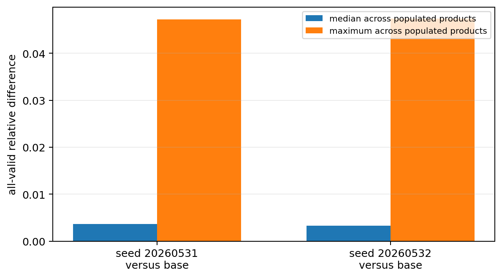

*Figure 1.5: Repeat-seed all-valid differences for the representative cube.
They are much smaller than the nested/all-valid discrepancies. This matters
because support sensitivity cannot be dismissed as random-origin noise.*

The primary slope-screen result is:

| Cube | Stable nested-core pair-local directional slopes | Total tested |
|---|---:|---:|
| `L640_sub00370` | `3` | `6` |
| `L640_sub03942` | `2` | `6` |
| `L640_sub00579` | `5` | `6` |
| `L640_sub00738` | `5` | `6` |
| **Total** | **`15`** | **`24`** |

The absolute-spread threshold of `0.2` is a bounded screening convention, not
a physical uncertainty estimate. Failing it is enough to prevent promotion of
smoke slopes to physical scaling claims.

## 1.8 Runtime and next-stage decision

| Metric | Retained value |
|---|---:|
| Four-cube sampler work | `823.632 s` |
| Complete smoke wrapper | `00:20:46` |
| Smoke node-hours | `0.346111` |
| Peak internal RSS | `22,420,640 KiB` = `21.382 GiB` |
| Four-cube result bytes used for forecast | `5,324,270` |
| Linear 21-cube sampler forecast | `4,324.066 s` = `72.068 min` |
| Linear 21-cube sampler forecast | `1.201130` node-hours |
| Linear 21-cube result forecast | `27,952,418` bytes |

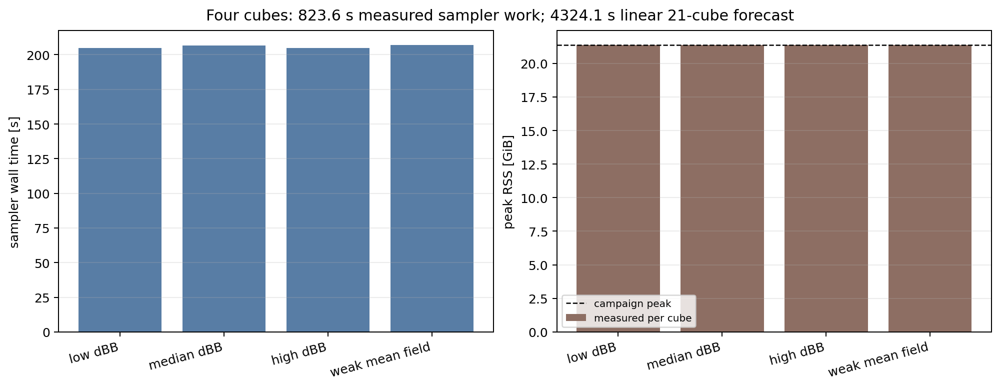

*Figure 1.6: Per-cube sampler wall time and peak RSS. The narrow cube-to-cube
spread supports a bounded operational forecast. It does not override the
scientific NO-GO.*

The next stage should remain on the same four cubes: add spatial block
uncertainty, test reduced scale ranges, and decide which slope claims remain
defensible. Do not launch the 21-region Phase 4 science pilot yet.

# Tier 2: Detailed methods, implementation, and validation

## 2.1 Problem definition

The scientific question is whether directional three-dimensional
structure-function measurements inside extracted, non-periodic cubes can be
interpreted without hidden periodic wrapping or uncontrolled finite-support
bias.

The software task was to implement:

1. a slow explicit non-periodic 3-D oracle;
2. an optimized finite-domain sampler;
3. nested-core and all-valid pair modes;
4. arbitrary positive real $p$;
5. pair-local and subvolume-mean magnetic conditioning;
6. total and perpendicular vector increments;
7. fixed-$S_p$ eddy-dimension reducers;
8. compressible-MHD vector variants;
9. source-bound restartable publications;
10. a bounded four-cube smoke and cost forecast.

Intentionally deferred:

- the 21-region Phase 4 pilot;
- $L_{\rm sub}=1280$ work;
- broken SGS products;
- scalar longitudinal/transverse decomposition;
- spatial block uncertainty;
- promotion of smoke slopes to physical exponents;
- full real-data expansion to all compressible-MHD variants and orders.

## 2.2 Data model and assumptions

Phase 3 consumes the immutable Phase 2 root:

```text
/lustre/orion/ast207/proj-shared/dfielding/Production_plm/phase2_extract/benchmark_verified_release_primary_20260530
```

Each retained array has shape:

```text
(640, 640, 640)
```

with native storage convention:

```text
array[k, j, i] == field[x3, x2, x1]
```

Integer displacements are Cartesian index triplets:

```text
(di, dj, dk)
```

converted to vectors:

$$
\mathbf{r}
=
(d_i \Delta x_1,\ d_j \Delta x_2,\ d_k \Delta x_3).
$$

The extracted cubes are treated as non-periodic. No modulo arithmetic is
allowed. The retained smoke uses unit cell sizes in index-space measurements.
AthenaK code units absorb the usual $4\pi$ factor where appropriate.

Sampling is deterministic for a given seed. Sampling standard errors are
stored, but spatial pairs are correlated, so those errors are not physical
uncertainty bars.

## 2.3 Exact finite-domain geometry

For cube shape $(N_k,N_j,N_i)$ and signed displacement
$(d_i,d_j,d_k)$, each axis uses a half-open valid-origin interval:

$$
\left[
\max(0,-d),
\min(N,N-d)
\right).
$$

The `nested_core` region is the intersection over every retained signed
displacement. The `all_valid_pairs` region is computed separately for each
offset.

Every sampled endpoint is checked before indexing. Out-of-range offsets are
excluded before nested-core construction. Exported geometry helpers reject
fractional, non-finite, and boolean integer-like inputs rather than silently
truncating them.

Per-offset retained diagnostics include:

| Field | Meaning |
|---|---|
| `displacements_ijk` | signed integer offsets |
| `ell_bin_index_per_displacement` | shell assignment |
| `sampled_pairs_per_displacement` | sampled origins |
| `eligible_pairs_per_displacement` | valid-origin population |
| `cube_candidate_pairs_per_displacement` | full cube-origin population |
| `excluded_boundary_pairs_per_displacement` | candidate minus eligible |

The shell aggregates are tested against the per-offset arrays.

## 2.4 Mathematical products

For positive real $p$:

$$
S_p^q(\ell)
=
\left\langle
\left|
\delta \mathbf{q}
\right|^p
\right\rangle,
$$

$$
S_{p,\perp}^q(\ell)
=
\left\langle
\left|
\delta \mathbf{q}_{\perp}
\right|^p
\right\rangle.
$$

The fixed-$S_p$ shape reducer finds crossing scales for `parallel`, `xi`, and
`lambda`, then reports:

$$
\frac{\ell_\parallel}{\lambda},
\qquad
\frac{\xi}{\lambda}.
$$

It rejects sparse bins, absent crossings, and multiple crossings instead of
silently selecting an ambiguous branch.

The fitted-slope diagnostic evaluates:

$$
\log S_2
=
\alpha \log \ell + c
$$

over three explicit intervals:

$$
[8,64],
\qquad
[16,96],
\qquad
[8,96]
$$

in cell units. The saved absolute spread is:

$$
\Delta \alpha
=
\max(\alpha)
-
\min(\alpha).
$$

Phase 3 labels a smoke fit stable across tested windows only when all three
fits are available and:

$$
\Delta \alpha \le 0.2.
$$

This threshold is a screening convention. It is not a physical uncertainty
model.

## 2.5 Algorithm and code paths

| Path | Responsibility |
|---|---|
| `sfunctor/core/finite_domain.py` | optimized sampler, geometry, variants, counters |
| `sfunctor/reference_3d.py` | slow explicit reference sampler |
| `sfunctor/analysis/finite_domain.py` | reducers, coverage rows, support rows, NPZ serialization |
| `scripts/phase3/run_phase3_sampler.py` | synthetic gate, cube runs, restart verification, repeat seeds, control profile, campaign summary |
| `job_scripts/phase3/run_phase3_sampler_andes.sh` | Andes wrapper and log routing |
| `scripts/phase3/generate_phase3_status_figures.py` | checksum-verified report figures |
| `tests/test_finite_domain.py` | sampler, oracle, geometry, reducer, serialization regressions |
| `tests/test_phase3_sampler.py` | provenance, restart, campaign, and bounded-scope regressions |

The optimized path loads a Phase 2 cube, builds requested vector variants,
iterates signed offsets, samples valid origins in bounded batches, accumulates
counts, sums, sums-squared, moments, and standard errors, then publishes NPZ
and JSON artifacts atomically.

The in-memory sampler has no separate I/O chunk-size control. Its bounded work
chunk is `pair_batch_size`. The retained smoke uses `8192`.

Metadata is serialized as JSON strings inside NPZ files. All retained NPZ
keys were explicitly read using:

```python
np.load(path, allow_pickle=False)
```

## 2.6 Validation

### Automated tests

The final local suite passed:

```text
279 passed
```

The focused finite-domain, Phase 3 driver, and directional suite passed:

```text
94 passed
```

| Test family | Purpose | Actual result | Status |
|---|---|---|---|
| Optimized versus oracle | detect numeric or accounting divergence | exact counts and tight floating agreement in both pair modes | passed |
| No wrapping | reject cross-boundary endpoints | endpoint bounds and edge regressions passed | passed |
| KJI/IJK convention | prevent transposed geometry | unequal-spacing and asymmetric-offset tests passed | passed |
| Arbitrary $p$ | exercise API orders `1,2,3,4` | optimized/oracle agreement | passed |
| Degenerate directions | exclude undefined basis vectors | weak fields, sparse bins, invalid density, NaN, infinity covered | passed |
| Sign invariance | preserve unoriented `xi` and `lambda` axes | reversal and rotation tests passed | passed |
| Offset support | reproduce shell totals | all per-offset arrays aggregate exactly | passed |
| NPZ safety | avoid pickle-only metadata | every retained NPZ key readable with `allow_pickle=False` | passed |
| Synthetic binding | reject stale synthetic gates | top summary requires current passed gate | passed |
| Repeat-seed binding | reject stale base result | current base NPZ hash rechecked | passed |
| Fixed-frame occupancy | reject empty fitted bins | campaign summary rejects accepted counts below `100` | passed |
| Control-profile reuse | reject changed Phase 2 inputs | schema, cube, source, and input identities rechecked | passed |

### Compute-node synthetic gate

| Check | Retained result |
|---|---:|
| Isotropic parallel/perpendicular ratio | `0.993962` |
| Guide-field parallel $S_2$ | `1.0` |
| Guide-field perpendicular $S_2$ | `0.0` |
| Ribbon $\ell_\parallel$ | `3.968627` |
| Ribbon $\xi$ | `1.936492` |
| Ribbon $\lambda$ | `0.866025` |
| Weak-$B$ excluded directions | `27` |
| Nested-core fraction at synthetic $\ell_{\max}=2$ | `0.296296` |
| Nested-core fraction at synthetic $\ell_{\max}=4$ | `0.037037` |

### Independent reviews

Independent subagent reviews covered:

1. finite-domain geometry and offset-resolved support;
2. scientific definitions and fit-window policy;
3. adversarial overflow and provenance failures;
4. performance and Phase 4 forecast;
5. final restart verification.

Audit findings were reconciled before the retained smoke. The final
implementation inventory is `6e57c12d...`.

Residual oracle caveat: the slow reference path intentionally reuses some
shared geometry and field-variant helpers. Direct helper tests, asymmetric
geometry tests, endpoint checks, and per-offset accounting reduce common-mode
risk, but the oracle is not completely independent.

## 2.7 Control-profile results

The final source-bound control profile is:

```text
/lustre/orion/ast207/proj-shared/dfielding/Production_plm/phase3_sampler/control_profile_final_release_20260531T000742Z
```

| Scenario | Sampler time |
|---|---:|
| Baseline | `16.662 s` |
| `B` only | `14.790 s` |
| `u` only | `14.816 s` |
| Batch size `512` | `15.655 s` |
| Batch size `2048` | `15.006 s` |
| Samples per offset `2048` | `14.686 s` |
| Samples per offset `8192` | `16.531 s` |
| $\ell_{\max}=128$ | `15.727 s` |
| $p=1,2,3,4$ | `15.978 s` |

The reduced comparisons show bounded behavior and substantial persistent
full-cube setup cost. They are operational diagnostics, not a substitute for
the definitive full-settings smoke. No CPU core-scaling experiment was run.
The retained `/usr/bin/time -v` wrapper logs describe the `srun` launcher,
not worker-core utilization. Operational forecasts therefore rely on measured
wall time and internal RSS rather than a CPU-efficiency claim.

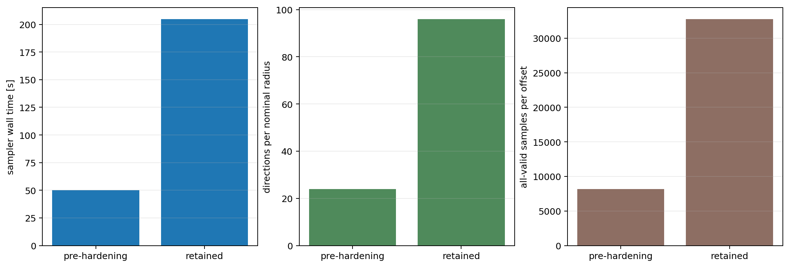

*Figure 2.1: Before-versus-after hardening comparison. The retained campaign
uses a denser direction census and matched all-valid sampling depth. Runtime
increases for a known reason rather than from an unexplained regression.*

## 2.8 Retained smoke results

| Cube | Sampler wall time | Peak RSS KiB | Median mode difference | Maximum mode difference |
|---|---:|---:|---:|---:|
| `L640_sub00370` | `204.874 s` | `22,416,028` | `0.2604` | `0.5878` |
| `L640_sub03942` | `206.618 s` | `22,420,616` | `0.0884` | `0.2326` |
| `L640_sub00579` | `205.018 s` | `22,420,640` | `0.0478` | `0.2823` |
| `L640_sub00738` | `207.122 s` | `22,419,080` | `0.1441` | `0.2833` |

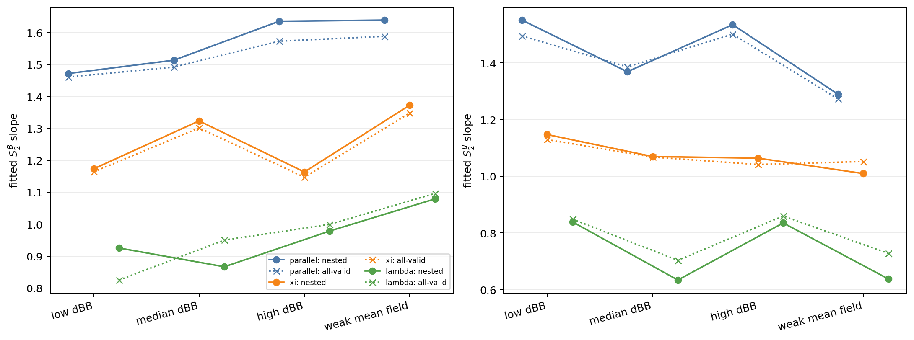

*Figure 2.2: Nominal $8 \le \ell \le 96$ fitted slopes for nested-core and
all-valid modes. The differences are diagnostic only. This plot must be read
together with the fit-window sensitivity figure.*

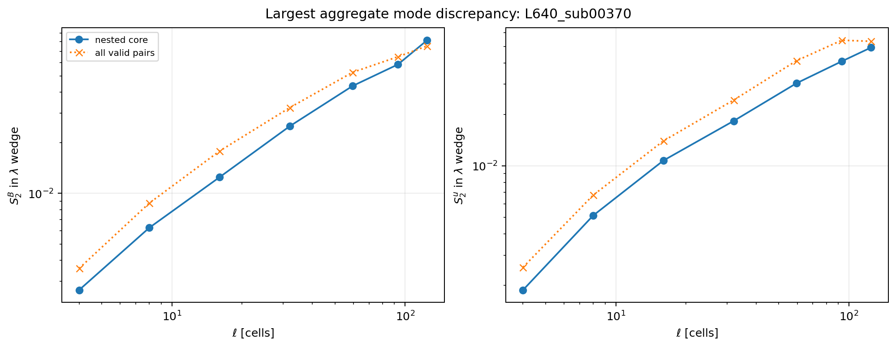

*Figure 2.3: Directional curves for the cube with the largest aggregate mode
difference. This matters because the support sensitivity is not hidden inside
one summary number.*

Robust conclusions:

- non-periodic endpoint handling is explicit and tested;
- optimized and reference calculations agree on bounded cases;
- all four retained cubes pass source-bound restart verification;
- offset-resolved support is retained;
- representative-cube matched-depth repeat-seed noise is much smaller than the
  mode discrepancy;
- fixed-frame parallel occupancy is usable for these four cubes;
- runtime, RSS, output size, and compute budget are bounded.

Likely conclusions:

- `nested_core` should remain the primary estimator because it fixes spatial
  support across directions;
- `all_valid_pairs` should remain an explicit sensitivity diagnostic;
- the largest separations contribute to fit instability.

Open scientific questions:

- which fit ranges remain stable after spatial block resampling?
- how much of the mode discrepancy reflects boundary support versus genuine
  spatial inhomogeneity?
- should some slopes be removed while retaining slope-free directional
  comparisons?
- do additional selected cubes preserve fixed-frame occupancy?

## 2.9 Failures and discarded approaches

| Attempt or issue | What happened | Resolution |
|---|---|---|
| First provisional smoke | used `152` offsets, unequal nested/all-valid depths, and one seed | superseded by retained `622`-offset matched-depth smoke |
| Fixed-frame parallel diagnostic | zero accepted pairs with sparse displacement census | increased census to `96` directions per nominal radius and added campaign gate |
| Per-shell support only | could not audit support versus angle | added per-offset support arrays and orientation figure |
| SEM accumulator overflow risk | sums-squared could overflow silently | reject non-finite batch and cumulative accumulators |
| Geometry helper truncation risk | exported helpers could truncate fractional offsets | strict finite-integer validation |
| NPZ object metadata | complete NPZ inspection required pickle | serialize metadata as JSON strings |
| Repeat-seed provenance gap | robustness verifier did not rehash base all-valid NPZ | added base-result checksum verification and regression |
| Control-profile reuse gap | reuse path did not revalidate Phase 2 identity | added schema, cube, source, and input identity checks |
| Accidental patch placement | slope diagnostic initialization landed in wrong function during development | full suite caught it before Slurm submission |
| Broken SGS path | user identified it as unusable | excluded throughout Phase 3 |

Historical provisional artifacts remain on Lustre for audit context but are
not release evidence.

## 2.10 Remaining risks and next steps

| Risk | Evidence | Required action |
|---|---|---|
| Fit-window instability | only `15/24` primary slopes pass bounded screen | add block uncertainty and define defensible scale policy |
| Material finite-support sensitivity | maxima reach `0.5878` | quantify support dependence before Phase 4 |
| Sampling SEM is not physical uncertainty | spatial pairs correlate | implement spatial block resampling |
| Repeat seeds cover one representative cube | two extra seeds only for `L640_sub00370` | expand only if needed after scale-policy work |
| Oracle shares helper code | possible common-mode defect | retain direct geometry tests; consider a more independent geometry oracle |
| Fixed-frame coverage is empirical | four cubes pass, arbitrary future cubes are not guaranteed | preserve campaign gate in future stages |
| CPU core scaling is unmeasured | launcher timing does not expose worker utilization | profile core scaling before optimization claims |
| Repository remains dirty | Phase 1/2 rename work and Phase 3 additions are uncommitted | review and commit intentionally before future production |

Prioritized next steps:

1. Do not launch the 21-region Phase 4 science pilot.
2. Reuse the retained four-cube NPZ and JSON outputs to test reduced fit
   intervals and add spatial block uncertainty.
3. Decide whether Phase 4 needs slope claims, slope-free directional
   comparisons, or a revised displacement design.
4. Rerun only the bounded smoke if the science configuration or run-critical
   source changes.
5. Commit the reviewed repository state before any production launch.

# Tier 3: Reproducibility, audit trail, and handoff

## 3.1 Repository state

| Item | Value |
|---|---|
| Repository path | `/autofs/nccs-svm1_home2/dfielding/SFunctor` |
| Branch | `cleanup/cpu-production` |
| Base commit | `ad76e866574b90430335cd351c876f6464fc5283` |
| Run-critical implementation hash | `6e57c12d0e254a5f2a6976bfb9d2f14734d57abbaa4835eaf3e2559adb7cb198` |
| Worktree | dirty; inherited Phase 1/2 renames plus Phase 3 additions remain uncommitted |
| Report | `PHASE3_STATUS_UPDATE.md` |
| Figures | `figures/phase3_status_update/` |

Phase 3 files created or materially modified:

```text
PHASE3_STATUS_UPDATE.md
docs/PHASE3_FINITE_DOMAIN.md
figures/phase3_status_update/
job_scripts/phase3/run_phase3_sampler_andes.sh
scripts/phase3/__init__.py
scripts/phase3/generate_phase3_status_figures.py
scripts/phase3/run_phase3_sampler.py
sfunctor/analysis/finite_domain.py
sfunctor/core/__init__.py
sfunctor/core/directional.py
sfunctor/core/finite_domain.py
sfunctor/reference_3d.py
tests/test_finite_domain.py
tests/test_phase3_sampler.py
```

Repository-level Slurm stdout and stderr are under:

```text
logs/
```

Detailed retained smoke logs are under:

```text
/lustre/orion/ast207/proj-shared/dfielding/Production_plm/phase3_sampler/runs/smoke_remediated_verified_20260531T001131Z/logs/
```

## 3.2 Environment and commands

Environment:

```bash
cd /ccs/home/dfielding/SFunctor
module reset
module load gcc/9.3.0 python/.3.11-anaconda3
source venv_sfunctor/bin/activate
export PYTHONPATH="$PWD:${PYTHONPATH:-}"
```

Local validation:

```bash
python -m py_compile \
  sfunctor/core/finite_domain.py \
  sfunctor/reference_3d.py \
  sfunctor/analysis/finite_domain.py \
  scripts/phase3/run_phase3_sampler.py \
  scripts/phase3/generate_phase3_status_figures.py

python -m pytest -q
```

Definitive control profile:

```bash
sbatch \
  --time=00:15:00 \
  --export=ALL,\
ACTION=profile_controls,\
RUN_DIR=/lustre/orion/ast207/proj-shared/dfielding/Production_plm/phase3_sampler/runs/control_profile_final_20260531T000742Z,\
OUTPUT_ROOT=/lustre/orion/ast207/proj-shared/dfielding/Production_plm/phase3_sampler/control_profile_final_release_20260531T000742Z \
  job_scripts/phase3/run_phase3_sampler_andes.sh
```

Definitive smoke:

```bash
sbatch \
  --time=01:00:00 \
  --export=ALL,\
ACTION=smoke_final,\
RUN_DIR=/lustre/orion/ast207/proj-shared/dfielding/Production_plm/phase3_sampler/runs/smoke_remediated_verified_20260531T001131Z,\
OUTPUT_ROOT=/lustre/orion/ast207/proj-shared/dfielding/Production_plm/phase3_sampler/smoke_remediated_verified_release_primary_20260531T001131Z \
  job_scripts/phase3/run_phase3_sampler_andes.sh
```

Figure regeneration:

```bash
python scripts/phase3/generate_phase3_status_figures.py \
  --smoke-root /lustre/orion/ast207/proj-shared/dfielding/Production_plm/phase3_sampler/smoke_remediated_verified_release_primary_20260531T001131Z \
  --phase2-root /lustre/orion/ast207/proj-shared/dfielding/Production_plm/phase2_extract/benchmark_verified_release_primary_20260530 \
  --prehardening-profile-root /lustre/orion/ast207/proj-shared/dfielding/Production_plm/phase3_sampler/profile_final_hardened_release_20260530T233331Z \
  --phase2-montage figures/phase2_status_update/phase2_midplane_inspection_montage.png \
  --output-dir figures/phase3_status_update
```

The figure manifest binds the generator, campaign completion marker, synthetic
gate, fully verified repeat-seed chain, Phase 2 montage, pre-hardening profile
summary used for comparison, and every PNG checksum.

## 3.3 Compute accounting

The persistent ledger remains:

```text
/lustre/orion/ast207/proj-shared/dfielding/Production_plm/prompt1_catalog/compute_ledger.csv
```

Final ledger summary:

| Metric | Node-hours |
|---|---:|
| Workflow budget | `5000` |
| Consumed allocated runtime | `3.457222` |
| Remaining budget | `4996.542778` |
| Pending maximum exposure | `0` |
| Accounting-flagged records | `0` |

Relevant Phase 3 allocations:

| Job | State | Elapsed | Node-hours | Role |
|---:|---|---:|---:|---|
| `3314835` | cancelled before allocation | `00:00:00` | `0` | overly broad initial synthetic cap |
| `3314836` | completed | `00:00:09` | `0.002500` | synthetic gate |
| `3314837` | cancelled | `00:00:21` | `0.005833` | source changed during profile |
| `3314838` | completed | `00:00:40` | `0.011111` | reduced clean profile |
| `3314839` | completed | `00:01:17` | `0.021389` | pre-hardening final profile |
| `3314840` | completed | `00:01:16` | `0.021111` | SEM-hardened profile |
| `3314841` | completed | `00:05:44` | `0.095556` | superseded provisional smoke |
| `3314842` | completed | `00:03:47` | `0.063056` | denser matched-depth planning profile |
| `3314843` | completed | `00:02:41` | `0.044722` | superseded control profile |
| `3314845` | completed | `00:02:42` | `0.045000` | final-source control profile |
| `3314846` | completed | `00:20:46` | `0.346111` | definitive smoke |

The 21-cube sampler forecast is operationally acceptable, but it is not
authorization to launch Phase 4 while the science gate is NO-GO.

## 3.4 Output inventory

| Output path | Description | Status | Size | Keep? | Regenerable? |
|---|---|---|---:|---|---|
| `.../smoke_remediated_verified_release_primary_20260531T001131Z/` | definitive four-cube smoke | retained | `13 MiB` allocated | yes | yes, but do not rerun unnecessarily |
| `.../control_profile_final_release_20260531T000742Z/` | final-source one-factor control profile | retained | `324 KiB` allocated | yes | yes |
| `.../profile_remediated_release_20260530T235400Z/` | planning profile before final restart hardening | historical | `2.7 MiB` allocated | optional audit context | yes |
| `figures/phase3_status_update/` | report figures and manifest | retained | repository files | yes | yes |
| `PHASE3_STATUS_UPDATE.md` | final report | retained | repository file | yes | yes |

Definitive smoke inventory:

```text
L640_sub00370/{nested_core.npz,all_valid_pairs.npz,summary.json,COMPLETE.json}
L640_sub03942/{nested_core.npz,all_valid_pairs.npz,summary.json,COMPLETE.json}
L640_sub00579/{nested_core.npz,all_valid_pairs.npz,summary.json,COMPLETE.json}
L640_sub00738/{nested_core.npz,all_valid_pairs.npz,summary.json,COMPLETE.json}
seed_robustness/{all_valid_pairs_seed20260531.npz,all_valid_pairs_seed20260532.npz,seed_robustness_summary.json,ROBUSTNESS_COMPLETE.json}
synthetic_validation.json
phase3_smoke_summary.json
phase3_smoke_summary.md
PHASE3_SMOKE_COMPLETE.json
```

Top completion marker:

```text
summary_sha256 = 2643a8960ef130084f3c0f1b453053d8b19734cba4e38960bf7c030539462462
synthetic_validation_sha256 = 28938b20a91aecbe73047b395efbf636eff42b5964111969e454881f4f54c105
seed_robustness_marker_sha256 = c93eca57da8d6d8a270bcac75e56f599bb267cf24c1f5e041fa625c5109f1e9b
```

## 3.5 Known issues

1. The current nominal slope interval is not stable enough for physical
   scaling claims. Treat all smoke slopes as diagnostics.
2. Finite-support sensitivity remains material even with matched sampling
   depth.
3. Sampling SEM does not replace spatial block uncertainty.
4. Repeat-seed evidence covers one representative cube.
5. The slow oracle shares some helpers with the optimized path.
6. The repository is not committed yet.
7. Historical provisional Lustre roots remain for audit context and should
   not be mistaken for the retained release.

## 3.6 Continuation instructions

Read these first:

```text
phase0.md
phase3.md
PHASE3_STATUS_UPDATE.md
docs/PHASE3_FINITE_DOMAIN.md
```

Then inspect:

```text
/lustre/orion/ast207/proj-shared/dfielding/Production_plm/phase3_sampler/smoke_remediated_verified_release_primary_20260531T001131Z/PHASE3_SMOKE_COMPLETE.json
/lustre/orion/ast207/proj-shared/dfielding/Production_plm/phase3_sampler/smoke_remediated_verified_release_primary_20260531T001131Z/phase3_smoke_summary.json
/lustre/orion/ast207/proj-shared/dfielding/Production_plm/phase3_sampler/control_profile_final_release_20260531T000742Z/control_profile.json
```

Do not rerun:

- the Phase 1 census;
- Phase 2 extraction;
- the four-cube smoke merely to regenerate plots;
- any SGS path;
- the 21-region Phase 4 pilot;
- any $L_{\rm sub}=1280$ work.

Reuse the retained NPZ and JSON files for the next bounded analysis. Before a
future production launch:

1. define and validate a stable fit policy;
2. add spatial block uncertainty;
3. rerun the repository suite;
4. preserve the fixed-frame occupancy gate;
5. preserve matched-depth and repeat-seed provenance checks;
6. register every nontrivial Slurm allocation before submission;
7. write Slurm stdout and stderr under `logs/`;
8. do not add email-notification directives;
9. commit the reviewed source state intentionally.

# Appendix A: Figure index

| Figure | File | Purpose |
|---|---|---|
| 0.1 | `phase3_workflow_schematic.png` | workflow overview |
| 0.2 | `phase3_synthetic_validation_gate.png` | synthetic checks |
| 0.3 | `phase3_input_cube_midplane_montage.png` | representative inputs |
| 0.4 | `phase3_conditioning_basis_coverage.png` | pair-local and fixed-frame occupancy |
| 0.5 | `phase3_fit_window_slope_sensitivity.png` | fit-window instability |
| 0.6 | `phase3_nested_vs_all_valid_difference.png` | matched-depth mode sensitivity |
| 1.1 | `phase3_pair_modes_schematic.png` | pair-mode geometry |
| 1.2 | `phase3_finite_support_by_ell.png` | support versus separation |
| 1.3 | `phase3_all_valid_support_by_separation_and_orientation.png` | offset-resolved support |
| 1.4 | `phase3_directional_perpendicular_curves_nested_core.png` | primary directional curves |
| 1.5 | `phase3_repeat_seed_robustness.png` | repeat-seed variation |
| 1.6 | `phase3_resource_summary_and_forecast.png` | runtime and RSS |
| 2.1 | `phase3_before_after_hardening.png` | audit-driven configuration change |
| 2.2 | `phase3_slope_comparison_nested_vs_all_valid.png` | nominal slope comparison |
| 2.3 | `phase3_outlier_mode_comparison.png` | largest mode discrepancy |

# Appendix B: Final decision

Phase 3 is complete as a bounded implementation and validation phase. The
sampler is numerically validated, source-bound, restartable, and affordable.
The Phase 4 science pilot is **NO-GO** because slope fits remain unstable
across plausible intervals and finite-support sensitivity is material. The
next work should remain on the retained four-cube products until that
scientific interpretation problem is resolved.
