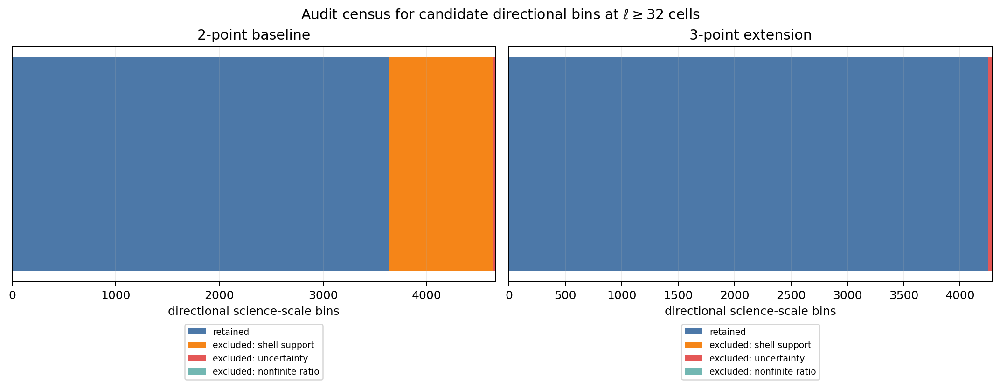
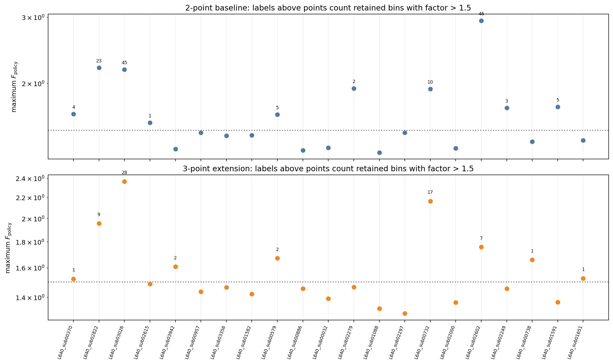

# Phase 4 Batch A2 status update: all-21-cube 3-point extension review

| Item | Value |
| --- | --- |
| Date | 2026-06-01 |
| Repository | `SFunctor` |
| Branch | `cleanup/cpu-production` |
| Acquisition launch commit | `98e3d063b98f9997da9c4b91c215da9b6159af1e` |
| Scope | All `21` retained `L_sub = 640` pilot cubes; labeled 3-point extension |
| Baseline | Retained all-21-cube 2-point Phase 4 Batch A release |
| Compute environment | Andes CPU Slurm allocations, account `AST207`, partition `batch` |
| Status | **Operational PASS. Hold Batch B until the all-21 sensitivity tail is reviewed explicitly. Keep 5-point bounded.** |

## Decision Point

The guarded all-21-cube 3-point acquisition completed successfully. It used
the previously approved configuration:

```text
q = B, u
p = 2
stencil = labeled 3-point
ell_max = 160 cells
separation bins = 64
directions per bin = 24
primary curve-level policy = all_valid_origins
directional robustness overlay = shell_local
```

The operational result is a PASS. All `168/168` shards and `42/42` reductions
passed strict verification. The extension is restartable, source-bound, and
small enough to retain.

The scientific result is more nuanced. Most supported primary-versus-shell
differences remain modest, but the all-21 census exposes several real
policy-sensitivity tails consistent with finite-subvolume spatial
nonstationarity that the four representative cubes did not cover. These are
not software failures and are not weak-support artifacts. They are reasons to
keep the analysis curve-first, avoid correction factors, withhold fitted
directional exponents, and review Batch B scope before launch.

This checkpoint does **not** authorize Batch B automatically. It also does not
authorize a 5-point expansion or Phase 5.

## What Was Measured

For every retained directional science-scale bin, define

$$
F_{\rm policy}
=
\max\left(
\frac{S_{\rm primary}}{S_{\rm shell}},
\frac{S_{\rm shell}}{S_{\rm primary}}
\right).
$$

Here, `primary` is `all_valid_origins` and `shell` is `shell_local`.
$F_{\rm policy}$ is a sensitivity diagnostic, not a correction factor. The
census retains only bins with $\ell \geq 32$ cells, at least `5%` shell-local
eligible-origin support, and the uncertainty-support gates inherited from
Phase 3a.

| Product | Retained directional bins | Median $F_{\rm policy}$ | 90th percentile | Maximum |
| --- | ---: | ---: | ---: | ---: |
| 2-point baseline | `3638` | `1.096` | `1.325` | `2.939` |
| 3-point extension | `4248` | `1.083` | `1.257` | `2.366` |

The pooled 3-point median and 90th percentile are slightly smaller than the
2-point baseline values. These are descriptive statistics: adjacent bins are
correlated, and the two labeled products cover different scale ranges. They
support retaining the labeled 3-point curves as an informative robustness
product, but do not establish that the 3-point estimator is intrinsically more
stable than the 2-point baseline. They do not erase the supported tail.


## Support Coverage

| Product | Candidate bins at $\ell \geq 32$ | Retained | Excluded by shell support | Excluded by uncertainty gates | Excluded by nonfinite ratio |
| --- | ---: | ---: | ---: | ---: | ---: |
| 2-point baseline | `4662` | `3638` | `1008` | `16` | `0` |
| 3-point extension | `4284` | `4248` | `0` | `36` | `0` |

The shorter 3-point range keeps every candidate science-scale bin above the
`5%` shell-local geometry threshold. Only `36/4284` candidate bins are
excluded by uncertainty gates. The 2-point baseline reaches farther into the
finite-domain tail and therefore excludes `1008` bins on shell support.




## Supported Tail Cases

Selected supported 3-point tail highlights are:

| Cube | Field | Direction | $\ell$ [cells] | $F_{\rm policy}$ | Shell-local eligible-origin fraction |
| --- | --- | --- | ---: | ---: | ---: |
| `L640_sub03026` | `B` | `parallel` | `71.229` | `2.366` | `48.1%` |
| `L640_sub00732` | `B` | `parallel` | `120.219` | `2.165` | `25.4%` |
| `L640_sub02822` | `B` | `lambda` | `125.964` | `1.956` | `23.2%` |
| `L640_sub02602` | `u` | `parallel` | `152.704` | `1.758` | `15.1%` |

These four cases remain well above the shell-local geometry floor. They are
supported observed policy sensitivities consistent with finite-subvolume
spatial nonstationarity. The cause is not isolated. Some occur at moderate
separations with substantial shell-local support, so they are not merely weak
outer-boundary tails. This is not a claim that one policy is universally
correct, that the difference is statistically established by a paired-ratio
test, or that it can be corrected away.

The two policies also use different deterministic origin schedules.
Therefore, $F_{\rm policy}$ is not a controlled estimate of boundary bias.
Matched-origin comparisons or origin-seed variation are required before
attaching a physical explanation to the tail or publishing directional
exponents.

The sensitivity is direction-dependent. For the 3-point extension:

| Channel | Median $F_{\rm policy}$ | 90th percentile | Maximum | Bins above `1.5` |
| --- | ---: | ---: | ---: | ---: |
| `B:parallel` | `1.120` | `1.335` | `2.366` | `26` |
| `u:parallel` | `1.107` | `1.317` | `2.308` | `23` |
| `B:lambda` | `1.078` | `1.222` | `1.956` | `12` |

`L640_sub03026` requires explicit scrutiny before Batch B. It contributes `28`
retained 3-point bins with $F_{\rm policy} > 1.5$ and `32/36` of the 3-point
uncertainty-gate exclusions. The retained tail is supported, but the
curve-level audit remains incomplete precisely where sensitivity is
strongest.

The earlier 2-point `L640_sub02602` velocity-`xi` sensitivity remains the
strongest baseline case: $F_{\rm policy} = 2.939$ at
$\ell = 171.170$ cells with `10.9%` shell-local support. The 3-point extension
does not reproduce that exact tail because it is a distinct labeled filter
with a shorter range. It does show a smaller supported velocity sensitivity
in the same cube.




## Interpretation

The all-21 extension supports three conclusions.

1. The labeled 3-point product is informative enough to retain. Its pooled
   policy sensitivity is modest and its configured range has strong support.
2. The four-cube representative review was not a complete science-tail
   census. The all-21 extension correctly exposed additional finite-subvolume
   cases, especially `L640_sub03026`, `L640_sub00732`, `L640_sub02822`, and
   `L640_sub02602`.
3. A curve-first Phase 4 policy remains appropriate. No fitted directional
   exponent is published here, and no primary-versus-shell difference is
   converted into a correction.

The current hold is therefore a scientific review gate, not an operational
blocker. A reasonable next bounded step is a representative higher-order
2-point probe for $p = 1, 2, 3, 4$ before deciding whether the full all-21
Batch B matrix is justified. Higher orders, especially $p = 4$, can amplify
tail sensitivity and should not be launched across all cubes blindly.

Batch B retains the equal-origin, volume-weighted `B,u` estimators. No density
weighting is applied, and `rho0` is not applicable. Pointwise-density versus
reference-density conventions remain deferred Batch C scope.

## Operational Validation

| Check | Result |
| --- | --- |
| Frozen membership | Passed: exact `21` approved `L_sub = 640` cubes |
| Matrix guard | Passed: exact 3-point, two-policy, $q = B,u$, $p = 2$ extension |
| Staged predecessor binding | Passed: immutable Batch A and representative A2 release identities |
| Work completion | Passed: `168/168` shard markers |
| Reduction completion | Passed: `42/42` reduction markers |
| Strict release verification | Passed |
| Release publication marker | Passed: `PHASE4_BATCH_A2_3POINT_EXTENSION_COMPLETE.json` |
| Four-cube overlap audit | Passed: non-runtime results match representative A2; uncertainty files are byte-identical |
| Direct retained-artifact checksum audit | Passed |
| Compute ledger | Passed: zero pending exposure and zero accounting flags |
| Future-run sidecar replay guard | Hardened after release; focused mutation regression passes |

The retained release is:

```text
/lustre/orion/ast207/proj-shared/dfielding/Production_plm/phase4/batch_a2_3point_all21_primary_20260601T153832Z
```

The immutable review package is:

```text
figures/phase4_batch_a2_3point_extension_review/
```

### Publication metadata caveat

The frozen campaign plan records `dirty: false`. The summary publication
records `dirty: true` because the shared repository had concurrent local edits
while the summary allocation was running. The retained metadata does not
identify which non-bound file changes triggered that worktree-level flag. The
campaign, summary, and marker retain the same implementation digest:

```text
5a1389d58358a5e8ba64a6b6145a3c34c353824f9f953840e7d82c57ff910f17
```

Their implementation-source hash maps are identical. This is a metadata
caveat, not an implementation mismatch. Future publication jobs should run
without concurrent repository edits to keep the summary metadata clean.

## Compute Accounting

| Allocation | Job ID | Nodes | Elapsed | Node-hours |
| --- | ---: | ---: | ---: | ---: |
| Extension plan | `3315224` | `1` | `207 s` | `0.057500` |
| Extension work | `3315226` | `8` | `575 s` | `1.277778` |
| Extension reduce | `3315229` | `1` | `426 s` | `0.118333` |
| Extension verify | `3315232` | `1` | `234 s` | `0.065000` |
| Extension summarize | `3315233` | `1` | `232 s` | `0.064444` |
| **Extension subtotal** |  |  |  | **`1.583055`** |

The work-stage Slurm record reports a peak RSS of approximately `21.5 GiB`;
the retained per-process resource audit reports a conservative parent peak of
approximately `23.7 GiB`. The current extension release uses approximately
`1.6G` of allocated storage (`1.515 GiB` before decimal-unit rounding).

The refreshed workflow ledger reports:

| Metric | Node-hours |
| --- | ---: |
| Workflow budget | `5000` |
| Consumed allocated runtime | `17.451944` |
| Remaining budget | `4982.548056` |
| Pending maximum additional exposure | `0` |

## Audit Follow-Up Before Batch B

Before any Batch B Slurm launch:

1. Record an explicit human decision on whether the supported sensitivity tail
   is acceptable for a bounded representative higher-order probe.
2. Keep the 5-point product bounded to the four representative cubes.
3. Add a Batch B-specific adapter that freezes $p = 1, 2, 3, 4$ explicitly
   while retaining $q = B,u$, the 2-point stencil, and both support policies.
4. Strengthen plan verification so the complete frozen campaign configuration
   must match the active adapter configuration. Strengthen shard verification
   so `q_names`, `p_values`, and `density_conventions` match that frozen
   campaign.
5. Begin with representative cubes and inspect $p = 4$ uncertainty and tail
   behavior before expanding Batch B to all 21 cubes. Include the supported
   sensitivity cases `L640_sub03026`, `L640_sub00732`, `L640_sub02822`, and
   `L640_sub02602` beside ordinary low-, median-, high-`dBB`, and
   weak-mean-field controls. Report signed primary-over-shell ratios as well
   as symmetric factors.
6. Inspect the complete `L640_sub03026` tail and run matched-origin comparisons
   or origin-seed variation before attaching a physical explanation to policy
   differences or publishing directional exponents.

This report is the exact review point for that decision.

## Reproducibility

The initial immutable publication command was:

```bash
/ccs/home/dfielding/SFunctor/venv_sfunctor/bin/python \
  scripts/phase4/generate_phase4_batch_a2_3point_extension_review.py \
  --batch-a-root \
  /lustre/orion/ast207/proj-shared/dfielding/Production_plm/phase4/batch_a_2point_primary_20260531T154117Z \
  --representative-a2-root \
  /lustre/orion/ast207/proj-shared/dfielding/Production_plm/phase4/batch_a2_stencils_representative_primary_20260601T151309Z \
  --extension-root \
  /lustre/orion/ast207/proj-shared/dfielding/Production_plm/phase4/batch_a2_3point_all21_primary_20260601T153832Z \
  --ledger-summary \
  /lustre/orion/ast207/proj-shared/dfielding/Production_plm/prompt1_catalog/compute_budget_summary.md \
  --output-dir figures/phase4_batch_a2_3point_extension_review
```

The generator refuses to overwrite an existing review directory. Its
`figure_manifest.json` binds every figure and every direct retained reduction,
release marker, and ledger snapshot used by this checkpoint.

To replay the generator, use the same command with a fresh output directory,
for example:

```bash
--output-dir "/tmp/phase4_batch_a2_3point_extension_review_replay_$(date -u +%Y%m%dT%H%M%SZ)"
```
