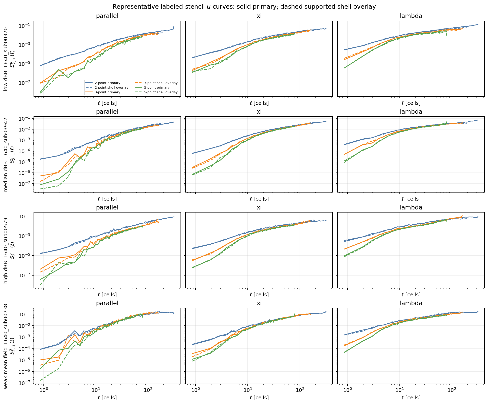
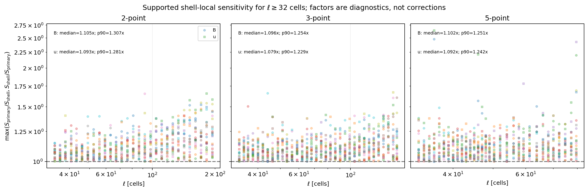
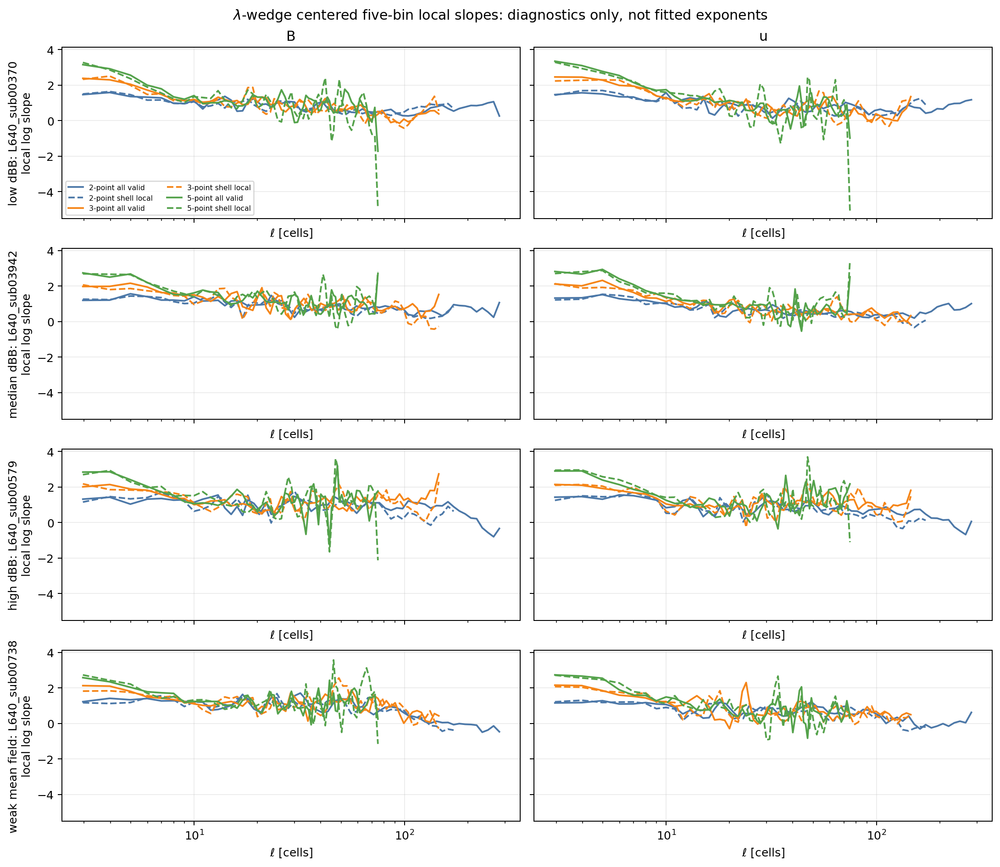

# Phase 4 Batch A2 status update: representative 3-point and 5-point stencil review

| Item | Value |
| --- | --- |
| Date | 2026-06-01 |
| Repository | `SFunctor` |
| Branch | `cleanup/cpu-production` |
| Launch checkpoint commit | `405aac383311b09133f0bfd627289162a93450e3` |
| Scope | Four retained `L_sub = 640` representative cubes; labeled 3-point and 5-point filters |
| Baseline | Retained 21-cube 2-point Phase 4 Batch A release |
| Compute environment | Andes CPU Slurm allocations, account `AST207`, partition `batch` |
| Status | **Representative Batch A2 PASS. The guarded 21-cube 3-point acquisition subsequently ran under explicit human authorization. Keep 5-point bounded.** |

## Decision

The bounded Phase 4 Batch A2 complement completed successfully. It adds
3-point and 5-point structure-function products for the four previously
selected representative cubes:

| Cube | Representative role |
| --- | --- |
| `L640_sub00370` | Low `dBB` |
| `L640_sub03942` | Median `dBB` |
| `L640_sub00579` | High `dBB` |
| `L640_sub00738` | Weak mean magnetic field |

The matrix uses $q = B, u$, $p = 2$, `all_valid_origins` as the primary
curve-level policy, and `shell_local` as the stricter directional robustness
overlay. The filters remain explicitly labeled. A 3-point or 5-point value is
not presented as a higher-accuracy replacement for a 2-point value.

The 3-point comparison is informative and sufficiently stable for the
previously approved conditional next acquisition: extend the labeled 3-point
product to all 21 retained cubes. That acquisition subsequently ran after
explicit human authorization; this representative report did not
automatically authorize expansion. The 5-point product remains bounded to the
four representative cubes. Its curves are useful robustness diagnostics, but
a few localized support-policy sensitivities are stronger than for the
2-point and 3-point products.

No directional fitted exponent is published by this checkpoint. Centered
five-bin local slopes remain diagnostics only.

## Configuration

| Stencil | Separation bins | Directions per bin | Maximum separation | Representative cubes | Support policies |
| --- | ---: | ---: | ---: | ---: | --- |
| 2-point baseline | `64` | `24` | $\ell_{\max} = 320$ cells | `21`, with four reused here | `all_valid_origins`, `shell_local` |
| 3-point complement | `64` | `24` | $\ell_{\max} = 160$ cells | `4` | `all_valid_origins`, `shell_local` |
| 5-point complement | `64` | `24` | $\ell_{\max} = 80$ cells | `4` | `all_valid_origins`, `shell_local` |

All extracted cubes remain non-periodic. The estimator explicitly accounts
for valid origin support rather than wrapping a displacement across an
extracted cube boundary.

## Support Geometry

The shell-local policy requires a common interior origin region for all
displacement directions in a separation shell. It is deliberately stricter
than the primary all-valid-origin estimator.

| Stencil | Minimum shell-local eligible-origin fraction | Largest shell center at `5%` support | Largest shell center at `10%` support |
| --- | ---: | ---: | ---: |
| 2-point | `0.0501%` | `194.149` cells | `171.170` cells |
| 3-point | `15.0768%` | `158.487` cells | `158.487` cells |
| 5-point | `14.8127%` | `79.494` cells | `79.494` cells |

The wider filters use shorter maximum separations. That keeps their
shell-local comparison above the `10%` slope-candidate geometry threshold
through their full configured ranges.


## Representative Curves

The magnetic and velocity curves show coherent labeled-filter comparisons
across low-`dBB`, median-`dBB`, high-`dBB`, and weak-mean-field environments.
Differences among stencil widths are expected because the filters are
different observables. The relevant robustness question is whether each
primary curve remains interpretable beside its own shell-local overlay.




## Policy Sensitivity

For scales $\ell \geq 32$ cells that pass the `5%` shell-local geometry
threshold and the retained uncertainty-support gates, define the diagnostic
factor

$$
F_{\rm policy}
=
\max\left(
\frac{S_{\rm primary}}{S_{\rm shell}},
\frac{S_{\rm shell}}{S_{\rm primary}}
\right).
$$

This factor measures support-policy sensitivity. It is not a correction
factor.

| Stencil | Retained directional points | Median $F_{\rm policy}$ | 90th percentile | Maximum |
| --- | ---: | ---: | ---: | ---: |
| 2-point | `696` | `1.097` | `1.296` | `1.658` |
| 3-point | `816` | `1.090` | `1.250` | `1.671` |
| 5-point | `766` | `1.098` | `1.250` | `2.648` |

The 3-point census is comparable to the retained 2-point baseline and supports
the 21-cube extension. The 5-point median and 90th percentile are also modest,
but several localized outliers justify keeping that filter bounded. The
largest retained 5-point factor is `2.648` for `L640_sub00370`, velocity
`parallel`, at $\ell = 35.997$ cells with `47.7%` shell-local eligible-origin
support. This is a supported finite-subvolume sensitivity, not a weak-tail
masking artifact.



## Slope Diagnostics

Local logarithmic slopes fluctuate with separation, policy, stencil, cube,
and field. The plots are useful for identifying stable windows and unstable
regions. They do not justify a universal directional exponent.



## Operational Validation

| Check | Result |
| --- | --- |
| Frozen representative membership | Passed: exact four approved cubes |
| Matrix guard | Passed: exact 3-point and 5-point, two-policy matrix |
| Extraction binding | Passed: A2 hashes bind to immutable Batch A source identities |
| Work completion | Passed: `64/64` shard markers |
| Reduction completion | Passed: `16/16` reduction markers |
| Strict release verification | Passed |
| Release publication marker | Passed: `PHASE4_BATCH_A2_COMPLETE.json` |
| Local regression suite after adapter addition | Passed: `409` tests |
| Review-package figure hashes | Passed: `5/5` figures |
| Compute ledger | Passed: zero pending exposure and zero accounting flags |

The A2 release is:

```text
/lustre/orion/ast207/proj-shared/dfielding/Production_plm/phase4/batch_a2_stencils_representative_primary_20260601T151309Z
```

The immutable review package is:

```text
figures/phase4_batch_a2_review/
```

## Compute Accounting

| Allocation | Job ID | Nodes | Elapsed | Node-hours |
| --- | ---: | ---: | ---: | ---: |
| A2 plan | `3315218` | `1` | `49 s` | `0.013611` |
| A2 work | `3315219` | `4` | `372 s` | `0.413333` |
| A2 reduce | `3315221` | `1` | `137 s` | `0.038056` |
| A2 verify | `3315222` | `1` | `60 s` | `0.016667` |
| A2 summarize | `3315223` | `1` | `61 s` | `0.016944` |
| **A2 subtotal** |  |  |  | **`0.498611`** |

The refreshed workflow ledger reports:

| Metric | Node-hours |
| --- | ---: |
| Workflow budget | `5000` |
| Consumed allocated runtime | `15.868889` |
| Remaining budget | `4984.131111` |
| Pending maximum additional exposure | `0` |

The settled A2 release uses `554M` of allocated storage. The retained Batch A
baseline uses `1.6G`.

## Next Step

Review the completed guarded all-21-cube 3-point extension using
`PHASE4_BATCH_A2_3POINT_EXTENSION_STATUS_UPDATE.md`. Keep the 5-point product
bounded to these four cubes. Return to the staged Phase 4 review gate before
higher-order 2-point Batch B work.

## Reproducibility

Generate the immutable review package with:

```bash
/ccs/home/dfielding/SFunctor/venv_sfunctor/bin/python \
  scripts/phase4/generate_phase4_batch_a2_review.py \
  --batch-a-root \
  /lustre/orion/ast207/proj-shared/dfielding/Production_plm/phase4/batch_a_2point_primary_20260531T154117Z \
  --batch-a2-root \
  /lustre/orion/ast207/proj-shared/dfielding/Production_plm/phase4/batch_a2_stencils_representative_primary_20260601T151309Z \
  --ledger-summary \
  /lustre/orion/ast207/proj-shared/dfielding/Production_plm/prompt1_catalog/compute_budget_summary.md \
  --output-dir figures/phase4_batch_a2_review
```

The generator refuses to overwrite an existing review directory. Its
`figure_manifest.json` binds every figure and direct retained input used by
the review.
