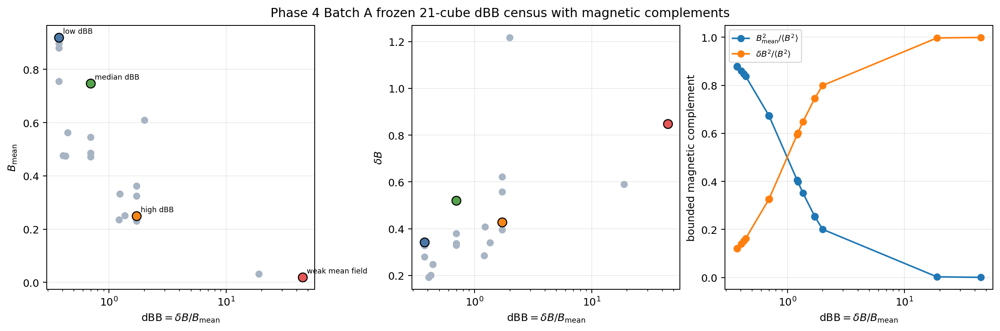
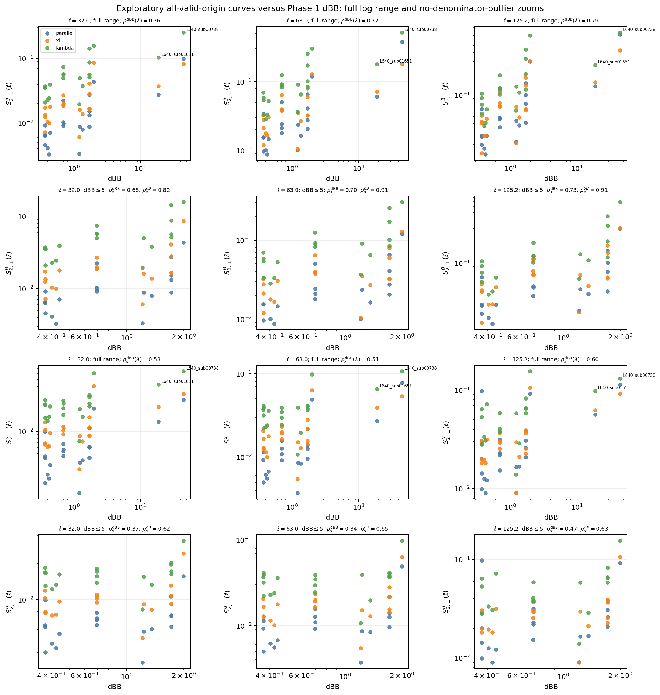
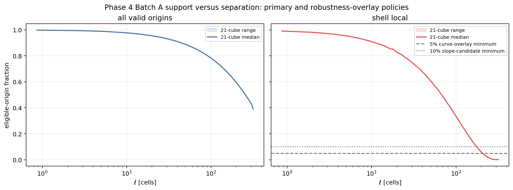
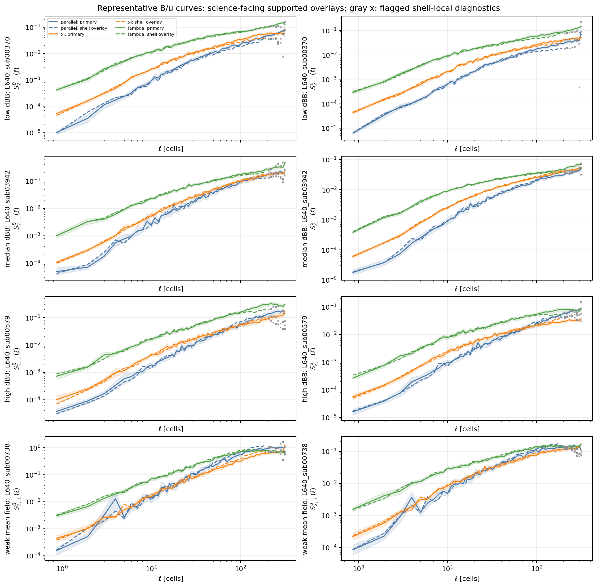
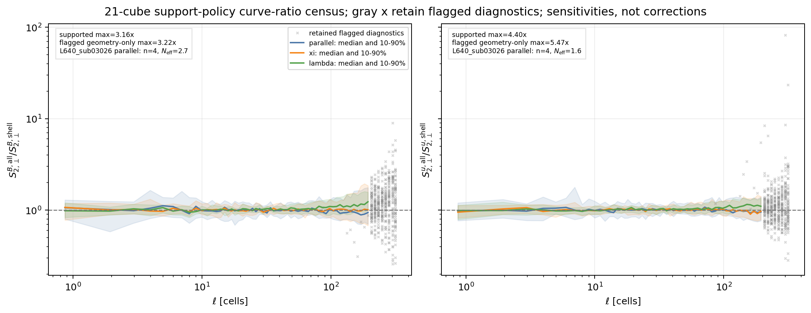
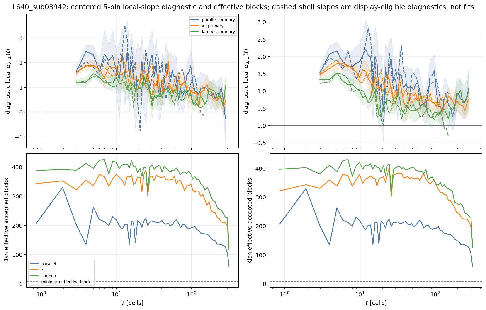
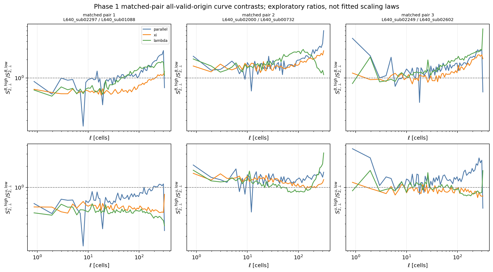
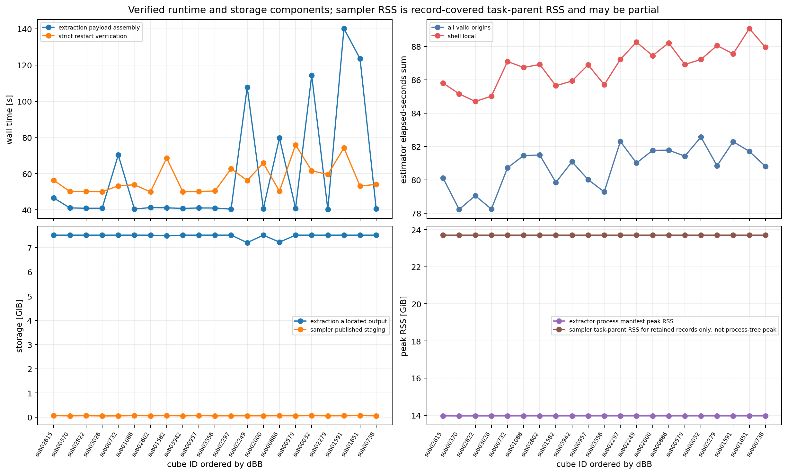

# Project status update: Phase 4 Batch A 21-cube curve-first pilot checkpoint

| Item | Value |
| --- | --- |
| Date | 2026-05-31 UTC |
| Repository | `SFunctor` |
| Repository path | `/autofs/nccs-svm1_home2/dfielding/SFunctor` |
| Branch | `cleanup/cpu-production` |
| Frozen Batch A source commit | `0c8a7ab0d9dd2c10b125af610d25c6c2fbd1fe5a` |
| Frozen Batch A implementation SHA-256 | `65f90d23f8bb9022ee07af9fa2c82036a94ac7cb25a7ce2a4456f148b2d0f388` |
| Agent | Codex |
| Data analyzed | Exact Phase 1 pilot: 21 freshly extracted $L_{\rm sub}=640$ cubes |
| Compute environment | Andes CPU Slurm, account `AST207`, partition `batch`, QoS `normal` |
| Status | **Retained Batch A sampler and immutable review package complete and independently verified; science checkpoint is a HOLD pending targeted human review.** |

# Tier 0: What happened and why it matters

Phase 4 Batch A asked whether the structure-function pipeline that was tested
on four cubes in Phase 3a could be used on the complete 21-region pilot
without overstating what the finite cubes can tell us. The answer is yes for
the planned curve-level baseline. This is not yet approval for the next
stencil batch or for a broader Phase 5 campaign.

The calculation used the exact 21 $640^3$ regions selected in Phase 1. Each
region was freshly extracted from the primitive simulation output, checked
against the supported `cbin` summaries, restart-verified, and then processed
with the approved 2-point sampler for magnetic-field and velocity increments.


*Figure 0.1: Schematic of the retained Phase 4 Batch A workflow. The important
point is that the result is a bounded, hash-verified pilot publication rather
than an open-ended production campaign.*

The 21 cubes deliberately span low, intermediate, and high `dBB` conditions,
plus denominator-driven edge cases where the mean magnetic field is small.
The extraction slices show that this is not a collection of interchangeable
regions. Different cubes contain visibly different density structures.



*Figure 0.2: Phase 1 magnetic-environment census for the exact Batch A
selection. The selected cubes cover the intended `dBB` range and retain two
weak-mean-field edge cases. This matters because extreme `dBB` can reflect a
small denominator as well as a large fluctuating field.*


*Figure 0.3: Representative full-resolution density slices from the freshly extracted
cubes. The selected environments differ visibly. This matters because the
reported trends are measured across realistic spatial variation, not imposed
by a synthetic test.*

The main scientific result is that the primary 2-point curves are measurable
for all 21 cubes with explicit spatial-block uncertainty. Across the selected
pilot, magnetic curve amplitudes show positive exploratory rank associations
with `dBB` at several large scales. The same amplitudes correlate more
strongly with `deltaB`, so Batch A does not identify a `dBB`-specific effect
or separate numerator, denominator, and residual-environment contributions.
Velocity amplitudes show a weaker positive association. Extreme `dBB` can
also be driven by a small denominator.



*Figure 0.4: Primary curve values at selected large scales versus Phase 1
`dBB`. Magnetic trends are clearer than velocity trends. The figure supports
continued staged analysis, not a universal scaling-law claim.*

The most important caveat remains the extracted-cube boundary. The primary
`all_valid_origins` product uses every non-periodic valid origin for each
displacement. The `shell_local` overlay is deliberately stricter: each
direction in a shell uses one shared interior region. That makes directional
comparisons spatially fair, but the usable shell-local volume collapses near
the largest separations. A shell-local point is science-facing only when it
also has enough accepted measurements, contributing blocks, effective blocks,
valid bootstrap resamples, and a finite bootstrap interval. Other values
remain visible as flagged diagnostics.



*Figure 0.5: Eligible-origin support for the primary and robustness-overlay
policies. Shell-local support drops below `5%` after about $\ell=194$ cells
and below `10%` after about $\ell=171$ cells. Weak outer shells remain visible
as flagged diagnostics, but they should not anchor physical slope claims.*

The code and output chain passed the Batch A integrity gate. The retained
publication contains `168` restartable shards and `42` reduced products:

$$
21\ {\rm cubes}
\times
2\ {\rm support\ policies}
=
42\ {\rm reductions}.
$$

Each reduction contains `64` separation bins, spatial block bootstrap
intervals, effective-block counts, support counts, exclusions, and diagnostic
local slopes. No fitted exponent is promoted automatically.

One operational failure was useful. The first extraction attempt was stopped
after an unrelated report-helper edit made the working tree dirty during the
run. Its partial root was quarantined rather than adopted. The clean
replacement extraction completed successfully, and the adapter now has a
durable plan-to-manifest core-provenance guard so future materialization
sidecars fail closed if the frozen plan and cube manifest do not attest to the
same clean extractor inventory.

The correct next step is the explicit post-Batch-A review requested in
`phase4.md`. Batch A exposed avoidable repeated cube loading in the multi-node
work assignment and larger support-policy sensitivities than the four-cube
launch diagnostic. The future-run scheduler has been corrected locally and
regression-tested, but it has not yet been profiled on Andes. The immutable
review package now verifies. Hold the representative Batch A2 science matrix
while `L640_sub03026`, `L640_sub02602`, and `L640_sub02822` are inspected. A
smallest-useful corrected-scheduler smoke/profile may be authorized separately.
Return for explicit approval before launching representative 3-point or
5-point science products.

# Tier 1: How the analysis works

## 1.1 Objective and bounded scope

Phase 4 inherited the curve-first policy frozen in
`PHASE4_LAUNCH_GO_DECISION.md`. Batch A was intentionally limited to:

```text
L_sub = 640
cubes = exact frozen Phase 1 pilot of 21 regions
q = B, u
p = 2
stencil = 2-point
ell_max = 320
separation bins = 64
requested directions per bin = 24
primary policy = all_valid_origins
directional robustness overlay = shell_local
```

The retained displacement manifest contains `1484` realized integer-grid
offsets. It has no empty separation bins. Wider 3-point and 5-point filters,
higher orders, compressible-MHD variable variants, $L_{\rm sub}=1280$, SGS
channels, and any broader campaign remain outside this checkpoint.

## 1.2 Fresh extraction and data products

The approved Phase 4 adapter freshly materialized all 21 cubes under:

```text
/lustre/orion/ast207/proj-shared/dfielding/Production_plm/phase4/
    extract_primary_20260531T140042Z
```

Each cube contains eight primitive `float32` arrays with array axes ordered
`(k, j, i)`:

| Field | Meaning |
| --- | --- |
| `dens` | Density |
| `velx`, `vely`, `velz` | Velocity components |
| `eint` | Internal-energy density |
| `bcc1`, `bcc2`, `bcc3` | Cell-centered magnetic-field components |

Each field has shape `(640, 640, 640)`. The eight arrays occupy about
`7.813 GiB` per cube before filesystem allocation overhead. The clean
extraction root occupies about `162 GiB`.

For every cube, the retained manifest records:

- exact half-open global bounds;
- source rank coverage;
- copied-cell count with zero holes and zero overlaps;
- output-array hashes;
- direct extraction-versus-`cbin` comparisons;
- catalog comparisons;
- exact and position checks;
- source identity;
- performance and memory summaries.

## 1.3 Structure functions

For field $q$, displacement $\mathbf{r}$, and separation
$\ell=|\mathbf{r}|$, the Batch A statistic is

$$
S_2^q(\ell)
=
\left\langle
\left|
q(\mathbf{x}+\mathbf{r})-q(\mathbf{x})
\right|^2
\right\rangle.
$$

Directional products use stencil-local magnetic conditioning and retain the
`parallel`, `xi`, and `lambda` channels. The report focuses on curve-level
products with uncertainty rather than forcing a single power-law slope
through all scales.

For `q = u`, Batch A uses increments of the primitive `velx`, `vely`, and
`velz` fields with equal accepted-origin weighting. These are volume-sampled
primitive-velocity structure functions, not mass-weighted or Favre-weighted
statistics. They remain distinct from the Phase 1 catalog fields named
`u_mass_weighted_mean_*`.

The non-periodic policies answer related but distinct questions:

| Policy | Role | Meaning |
| --- | --- | --- |
| `all_valid_origins` | Primary curve product | For each offset, use all origins whose stencil remains inside the extracted cube. |
| `shell_local` | Directional robustness overlay | For every offset in one shell, use a common interior origin region. |

The policies should not be interpreted as a correction pair. Their
differences measure sensitivity to the finite-domain sampling choice.



*Figure 1.1: Representative magnetic-field and velocity 2-point curves with
spatial-block uncertainty bands. The primary curves are measurable across the
retained scale range, while sparse outer shell-local values remain visibly
flagged. This is why Batch A supports curve-level reporting but not an
automatic universal-slope claim.*

## 1.4 Support-policy census

The geometry is the same for every cube. For the 2-point shell-local overlay:

| Shell-local threshold | Retained bins | Largest retained shell center |
| --- | ---: | ---: |
| At least `1%` | `60 / 64` | `249.129` cells |
| At least `5%` | `56 / 64` | `194.149` cells |
| At least `10%` | `54 / 64` | `171.170` cells |

The minimum shell-local eligible-origin fraction is `0.0005009765625`, or
about `0.0501%`. The minimum all-valid-origin fraction is about `39.10%`.
Raw outer-shell and sparse directional values remain published as visibly
flagged diagnostics.

Across all 21 cubes, fields `B` and `u`, directions `parallel`, `xi`, and
`lambda`, and scales $\ell \geq 32$ cells, the multiplicative sensitivity
factor

$$
f_{\rm policy}
=
\max
\left(
\frac{S_2^{\rm all}}{S_2^{\rm shell}},
\frac{S_2^{\rm shell}}{S_2^{\rm all}}
\right)
$$

has the following geometry-only census before the additional
uncertainty-support reporting gate:

| Required shell-local support | Median factor | 90th-percentile factor | Maximum factor |
| --- | ---: | ---: | ---: |
| At least `1%` | `1.105` | `1.388` | `8.407` |
| At least `5%` | `1.096` | `1.331` | `5.471` |
| At least `10%` | `1.092` | `1.306` | `3.409` |



*Figure 1.2: Ratios of primary all-valid-origin curves to shell-local
robustness curves. Gray crosses retain flagged diagnostics that fail geometry
or uncertainty-support reporting gates. Supported policy differences remain
visible and must be reported as sensitivities rather than corrections.*

## 1.5 Uncertainty and slope diagnostics

The reducer retains fixed-layout spatial blocks of shape `(80, 80, 80)` and
publishes deterministic spatial-block bootstrap intervals. Across scales
$32 \leq \ell \leq 192$ cells, the median conditional 95% interval
half-width divided by the curve value is approximately:

| Policy | Median | 90th percentile |
| --- | ---: | ---: |
| `all_valid_origins` | `0.121` | `0.179` |
| `shell_local` | `0.137` | `0.215` |

The uncertainty remains useful, but the shell-local overlay becomes weaker
at the outer scales. A centered five-bin local-slope value is retained only
as a diagnostic. A later slope-table candidate must additionally pass the
`10%` shell-local geometry threshold, block-count gates, bootstrap-validity
gates, curvature review, nearby-window review, and support-policy comparison.
The strict centered five-bin shell-local slope ceiling at the `10%` geometry
threshold is only $\ell=151.175$ cells. Outer-scale curve values remain
policy-sensitivity diagnostics.



*Figure 1.3: Local logarithmic slopes and Kish effective accepted blocks.
Dashed shell-local slopes are display-eligible diagnostics under the
automatic masks. They are not fit candidates, reported exponents, or evidence
for a common scaling interval. This protects the analysis from manufacturing
a precise exponent where the finite cube does not support one.*

## 1.6 Exploratory environmental trends

The primary all-valid-origin curves show positive rank associations between
Phase 1 `dBB` and magnetic curve amplitude. For example:

| Shell center | `B:parallel` | `B:xi` | `B:lambda` |
| --- | ---: | ---: | ---: |
| `31.984` cells | `+0.71` | `+0.62` | `+0.76` |
| `62.968` cells | `+0.70` | `+0.64` | `+0.77` |
| `125.194` cells | `+0.73` | `+0.72` | `+0.79` |
| `194.149` cells | `+0.74` | `+0.74` | `+0.72` |

These are 21-cube exploratory Spearman coefficients, not fitted laws.
Excluding the two `dBB > 5` weak-mean-field denominator outliers lowers the
magnetic correlations modestly but does not remove them. At the shell near
$\ell=125$ cells, `B:lambda` has Spearman $\rho=+0.792$ versus `dBB` and
$\rho=+0.932$ versus `deltaB`; after excluding the denominator cases, those
become `+0.733` and `+0.912`. Batch A therefore does not isolate a
`dBB`-specific effect. Velocity correlations are positive but weaker and less
consistent.

The three Phase 1 matched low/high-`dBB` comparisons provide a useful caution.
At the shell nearest $\ell=128$ cells, all-valid-origin high-to-low ratios vary
materially by pair and direction. Magnetic ratios are generally elevated,
while velocity ratios are mixed. These are descriptive sensitivity checks.
Because both `deltaB` and `B_mean` vary within each pair, they do not isolate
a `dBB`-specific effect. Pair-to-pair and directional variation demonstrate
residual confounding.



*Figure 1.4: High-to-low `dBB` curve ratios for the three Phase 1 matched
pairs. Pair-to-pair and direction-to-direction variation remains visible.
The pilot can motivate a staged follow-up, but it does not eliminate
confounding.*

## 1.7 Full-resolution primitive diagnostics

Batch A now reports more than the Phase 1 magnetic census. The review package
includes newly computed full-resolution primitive diagnostics derived from
the extracted `dens`, velocity, `eint`, and magnetic arrays. These include
density, velocity, sound-speed, Mach-number, kinetic-energy, magnetic-energy,
and magnetic-to-kinetic-energy summaries where the retained convention is
supported.

These quantities are explicitly labeled as post-extraction exploratory
covariates. The Phase 1 `cbin` census does not independently validate
primitive velocity dispersion, pressure, sound speed, sonic Mach number,
pointwise-density Alfvén speed or Mach number, kinetic energy,
magnetic-to-kinetic energy ratio, or mixed-field statistics. Retrospective
correlations in 21 selected cubes do not remove confounding.

## 1.8 Mandatory gate decision

The retained Batch A sampler publication passes its integrity gate. Its
science checkpoint remains conditional because several directional products
show materially larger support-policy sensitivity than the four-cube launch
diagnostic. Review `L640_sub03026`, `L640_sub02602`, and `L640_sub02822`
before authorizing the representative Batch A2 matrix.

The immutable report package now exists and verifies. At most, authorize a
scheduler-only smoke/profile for the corrected cube-grouped assignment after
the targeted support-policy review. Return for explicit human approval before launching any
representative 3-point or 5-point science products.

Batch A does not authorize Phase 5, Batch B higher orders, or Batch C
compressible-MHD variants.

# Tier 2: Detailed methods, implementation, and validation

## 2.1 Problem definition

The Phase 4 Batch A software task was to execute the approved exact-21
selected-cube extraction and the Phase 3a displacement-distributed 3-D
finite-domain sampler under production conditions. The scientific task was
to determine whether the curve-first 2-point baseline is stable and useful
enough to justify the separately gated stencil comparison.

Intentionally deferred:

- 3-point and 5-point Batch A2 products;
- higher-order $p=1,3,4$ products;
- compressible-MHD derived structure-function variables;
- slope-table publication;
- $L_{\rm sub}=1280$ work;
- any SGS-derived quantity;
- any Phase 5 expansion.

## 2.2 Frozen data model

The exact selection membership is inherited from:

```text
/lustre/orion/ast207/proj-shared/dfielding/Production_plm/prompt1_catalog/
    t6_final_primary_20260530/analysis/pilot_sample.csv
```

The clean extraction root is:

```text
/lustre/orion/ast207/proj-shared/dfielding/Production_plm/phase4/
    extract_primary_20260531T140042Z
```

The clean Batch A release root is:

```text
/lustre/orion/ast207/proj-shared/dfielding/Production_plm/phase4/
    batch_a_2point_primary_20260531T154117Z
```

The Batch A configuration is:

| Parameter | Value |
| --- | --- |
| Cube count | `21` |
| Cube shape | `(640, 640, 640)` |
| Coordinate convention | Array axes `(k, j, i)`; catalog bounds half-open in global `(i, j, k)` |
| Periodicity inside extracted cube | None |
| Fields sampled | `B`, `u` |
| Orders | `p = 2` |
| Stencil | labeled `2-point` |
| Nominal maximum separation | `320` cells |
| Separation bins | `64` |
| Requested directions per bin | `24` |
| Realized offsets | `1484` |
| Offsets per shard | `480` |
| Shards per cube-policy group | `4` |
| Sampled origins per displacement | `2048` |
| Pair batch size | `1024` |
| Spatial block shape | `(80, 80, 80)` |
| Block assignment | `stencil_midpoint` |
| Production seed | `20260530` |
| Bootstrap seed | `20260531` |

The sampler publication contains:

$$
21\ {\rm cubes}
\times
2\ {\rm policies}
\times
4\ {\rm shards}
=
168\ {\rm shard\ products}.
$$

## 2.3 Mathematical definitions

For vector-valued $q$, the 2-point increment is:

$$
\delta_2 q(\mathbf{x},\mathbf{r})
=
q(\mathbf{x}+\mathbf{r})-q(\mathbf{x}).
$$

The reported second-order structure function is:

$$
S_2^q(\ell)
=
\left\langle
\left|
\delta_2 q(\mathbf{x},\mathbf{r})
\right|^2
\right\rangle_{
|\mathbf{r}|\in{\rm shell}(\ell)
}.
$$

The Phase 1 magnetic environment ratio is:

$$
\mathrm{dBB}
=
\frac{\delta B}{B_{\rm mean}}.
$$

Extreme `dBB` is reported beside `B_mean`, `deltaB`, and bounded magnetic
complements because a small denominator can produce a large ratio even when
the fluctuating field is not exceptionally large.

For `shell_local`, the eligible-origin support fraction is:

$$
f_{\rm shell}(\ell)
=
\frac{
N_{\rm eligible,shell}(\ell)
}{
N_{\rm cube,candidate}(\ell)
}.
$$

The approved reporting thresholds are:

| Use | Required shell-local support |
| --- | --- |
| Science-facing curve overlay | $f_{\rm shell}(\ell) \geq 0.05$, at least `2` accepted measurements, at least `2` contributing blocks, at least `8` Kish-effective blocks, at least `90%` valid bootstrap resamples, and a finite bootstrap interval |
| Slope-table geometry candidate | $f_{\rm shell}(\ell) \geq 0.10$ across every bin in the centered fit window, plus the existing local-slope block and bootstrap gates |

These thresholds gate interpretation. They do not rescale the measured curve.

The exploratory full-resolution primitive diagnostics use AthenaK simulation
code units. No cgs conversion is supplied. The magnetic normalization is the
AthenaK convention used by the reconstruction checks:

$$
E_B = \frac{B^2}{2},
\qquad
v_A = \frac{B}{\sqrt{\rho}}.
$$

The reported aggregate primitive-only variants are:

$$
\delta u_V
=
\sqrt{
\left\langle
|\mathbf{u}|^2
\right\rangle_V
-
\left|
\left\langle
\mathbf{u}
\right\rangle_V
\right|^2
},
$$

$$
v_{A,V,\mathrm{rms}}
=
\sqrt{
\left\langle
\frac{B^2}{\rho}
\right\rangle_{V,\rho>0}
},
\qquad
M_A^{\rm agg}
=
\frac{\delta u_V}{v_{A,V,\mathrm{rms}}},
$$

$$
\frac{E_B}{E_K}
=
\frac{
\left\langle
B^2/2
\right\rangle_V
}{
\left\langle
\rho |\mathbf{u}|^2/2
\right\rangle_V
}.
$$

The energy denominator includes bulk kinetic energy. This is not a
bulk-subtracted turbulent-energy ratio and not a mean of pointwise ratios.

The extracted fields remain in Athena code units:

| Field or derived quantity | Convention used here |
| --- | --- |
| `dens` | Code density |
| `velx`, `vely`, `velz` | Code velocity components |
| `eint` | Internal-energy density in code units |
| `bcc1`, `bcc2`, `bcc3` | Cell-centered magnetic components in the retained Athena normalization |
| Magnetic-energy density | $B^2/2$ in the retained Athena normalization |
| Kinetic-energy density | $\rho |\mathbf{u}|^2/2$ |
| Reported Mach and energy ratios | Dimensionless aggregate diagnostics; no cgs conversion is applied |

Where the retained Athena input file hash and ideal-EOS metadata remain
available, the generator uses:

$$
\gamma = 1.00001,
\qquad
p = (\gamma - 1)e_{\rm int},
\qquad
c_{s,V,\mathrm{rms}}
=
\sqrt{
\left\langle
\frac{\gamma p}{\rho}
\right\rangle_{V,\rho>0,e_{\rm int}\geq0}
},
\qquad
M_s^{\rm agg}
=
\frac{\delta u_V}{c_{s,V,\mathrm{rms}}}.
$$

These are ratios of aggregate RMS quantities, not RMS pointwise Mach
numbers. Pressure is a primitive-only derived diagnostic. The published
pressure mean is conditional on the valid-cell mask used above.

Phase 1 and Phase 4 keep related but non-identical Alfvén quantities
separate:

| Quantity | Definition | Classification |
| --- | --- | --- |
| Phase 1 `vA_rms_like_proxy` | $\sqrt{\langle B^2\rangle_V/\langle\rho\rangle_V}$ | Coarse reconstructable catalog proxy |
| Phase 4 `alfven_speed_volume_rms` | $\sqrt{\langle B^2/\rho\rangle_{V,\rho>0}}$ | Full-resolution primitive-only exploratory diagnostic |

## 2.4 Algorithm and implementation

The extractor path is:

```text
job_scripts/phase4/run_phase4_extract_andes.sh
    -> scripts/phase4/run_phase4_extraction.py
    -> sfunctor/io/cube_extract.py
```

The sampler path is:

```text
job_scripts/phase4/run_phase4_batch_a_sampler_andes.sh
    -> scripts/phase4/run_phase4_batch_a_sampler.py
    -> scripts/phase3a/run_phase3a_sampler.py
    -> sfunctor/core/phase3a.py
    -> sfunctor/core/finite_domain.py
    -> sfunctor/analysis/phase3a.py
```

The report path is:

```text
job_scripts/phase4/run_phase4_batch_a_report_andes.sh
    -> scripts/phase4/generate_phase4_batch_a_status_figures.py
```

The sampler freezes the displacement manifest, partitions the `1484` offsets
into stable shards, memory-maps the extracted arrays, accumulates additive
partial statistics, publishes each shard exactly once, and reduces the
canonical shard inventory. The reducer publishes per-shell support,
exclusion, moment, block-count, block-bootstrap, and local-slope diagnostics.

The report generator verifies frozen historical artifacts rather than
replaying the current adapter. This distinction matters because a later
hardening patch intentionally source-retires older extraction roots under the
current adapter while preserving the validity of already published,
historically hash-bound artifacts.

## 2.5 Validation

### 2.5.1 Clean extraction publication

The clean extraction root contains:

| Check | Result |
| --- | --- |
| Materialization sidecars | `21 / 21` |
| Residual extraction locks | `0` |
| Frozen commit in manifests | `0c8a7ab0d9dd2c10b125af610d25c6c2fbd1fe5a` |
| Manifest dirty flag | `False` for all retained cubes |
| Core implementation hash | identical across all retained cubes |
| Extraction-versus-`cbin` validation | passed for all retained cubes |
| Extraction-versus-catalog validation | passed for all retained cubes |
| Exact validation | passed for all retained cubes |
| Position validation | passed for all retained cubes |

### 2.5.2 Batch A publication

The clean Batch A release contains:

| Check | Result |
| --- | --- |
| Planned shards | `168` |
| Published shards | `168` |
| Fresh resource claims | `168`, all unique |
| Reduced cube-policy groups | `42` |
| Missing shards | none |
| Missing reductions | none |
| Independent strict verification | passed |
| Strictly verified shards | `168` |
| Strictly verified reductions | `42` |
| Frozen completion-marker summary hash | matched |
| Settled release storage | about `1.6 GiB` allocated |

### 2.5.3 Provenance incident and permanent guard

The first extraction attempt was interrupted after an unrelated report-helper
edit dirtied the working tree while extraction was active. The rejected root
is quarantined:

```text
/lustre/orion/ast207/proj-shared/dfielding/Production_plm/phase4/
    extract_rejected_dirty_interrupted_20260531T134640Z
```

It contains partial publications and one interrupted stale lock. It is not a
valid input and must not be repaired or adopted. The clean replacement root
was generated from a clean checkout.

The permanent guard adds `CORE_EXTRACTOR_SOURCE_PATHS` in
`sfunctor/io/cube_extract.py` and requires
`scripts/phase4/run_phase4_extraction.py` to prove that the frozen plan and
published cube manifest bind the same clean core extractor inventory before
publishing a Phase 4 materialization record. New tests reject malformed
digests, missing source keys, dirty plan or manifest state, source-map
differences, and coherent repinning after publication.

The report verifier independently binds the exact trusted Phase 1 pilot-row
projection: cube ID, role, bounds, and required rank IDs. It also requires
the frozen clean source commit and matching shared historical source hashes
across the extraction plan, cube manifests, and sampler campaign.

### 2.5.4 Local verification

The retained hardening patch passed:

```text
python -m pytest -q tests/test_phase4_launch.py tests/test_cube_extract.py
56 passed

python -m pytest -q
403 passed

python -m py_compile \
    scripts/phase4/generate_phase4_batch_a_status_figures.py \
    scripts/phase4/run_phase4_extraction.py \
    sfunctor/io/cube_extract.py
passed

bash -n job_scripts/phase4/run_phase4_batch_a_report_andes.sh
passed

git diff --check HEAD^ HEAD -- . \
    ':(exclude)figures/phase4_batch_a_status/*.csv'
passed
```

The two immutable generated CSV tables use standard CRLF record terminators.
A full `git show --check` reports those record endings as trailing-whitespace
diagnostics. Byte inspection confirms that they contain no spaces or tabs
before newline. They are preserved byte-for-byte so their published SHA-256
hashes remain valid.

## 2.6 Results

### 2.6.1 Curve coverage and support

The primary `all_valid_origins` product remains well supported through the
full nominal 2-point range. The shell-local overlay is intentionally more
conservative and loses common interior volume rapidly at the largest scales.
This is expected geometry, not a sampler failure.

The report package includes a shell-resolved machine-readable table for every
cube, support mode, field, direction, and separation bin. It preserves:

- shell edges and centers;
- realized displacement count;
- sampled, eligible, and candidate origin counts;
- boundary and support-policy exclusions;
- eligible-origin fraction;
- weak shell-local flags;
- science-facing shell-local overlay flags;
- accepted measurement samples;
- curve values;
- pair-sampling error;
- block-bootstrap error and interval;
- contributing and effective block counts;
- bootstrap-validity counts;
- diagnostic local slopes;
- directional exclusion counts.

### 2.6.2 Environment dependence

The positive magnetic `dBB` trend is robust enough to motivate continued
staged analysis. It is not sufficient to claim that `dBB` alone controls the
curves. The pilot selection was not prospectively matched on full-resolution
velocity, sound speed, Mach number, pressure, or energy ratios.

The support-policy sensitivity is materially larger than in the original
four-cube launch diagnostic. Under the geometry-only `5%` gate, the 21-cube
maximum multiplicative sensitivity is `5.471`, versus `1.658` in the launch
diagnostic. The `5.471` row is a flagged `L640_sub03026` velocity-parallel
diagnostic at $\ell=194.149$ cells with only `4` accepted measurements and
`1.6` effective blocks. Under the geometry-only `10%` gate, the corresponding
maximum is `3.409`, versus `1.655`; that row is also flagged with only `3`
accepted measurements and `1.8` effective blocks.

After requiring enough accepted measurements, contributing blocks, effective
blocks, valid bootstrap resamples, and a finite bootstrap interval, the
largest large-scale supported factor is still `2.939` in `L640_sub02602`
velocity-`xi` at $\ell=171.170$ cells. Review the flagged `L640_sub03026`
rows and the supported `L640_sub02602` discrepancy before authorizing Batch
A2. This remains a stop-and-investigate result for the science checkpoint.

| Large-scale census for $\ell \geq 32$ cells | Median factor | 90th-percentile factor | Maximum factor |
| --- | ---: | ---: | ---: |
| Geometry-only `5%` gate | `1.096` | `1.331` | `5.471` |
| Science-facing overlay gate | `1.096` | `1.325` | `2.939` |

The weak-mean-field outliers remain especially important. Their large `dBB`
values can be denominator-driven. Figures and tables therefore keep
`B_mean`, `deltaB`, and bounded magnetic complements adjacent to `dBB`.

### 2.6.3 Runtime, memory, and storage

Before the final report-generation read pass, Phase 4 consumed:

| Category | Allocated node-hours |
| --- | ---: |
| Extraction planning, rejected attempt, clean extraction, strict verification, and inspection | `1.8250` |
| Batch A sampler plan | `0.6750` |
| Batch A 12-node work allocation | `5.1600` |
| Batch A reduction | `0.5189` |
| Batch A independent verification | `0.4878` |
| Batch A summary publication | `0.5297` |
| **Phase 4 subtotal before final report pass** | **`9.1964`** |

The measured Batch A work allocation exceeded the `1.411` node-hour
estimator-only planning proxy:

| Quantity | Value |
| --- | ---: |
| Work allocation charge | `5.160` node-hours |
| Estimator elapsed-seconds sum | `3519.4` seconds |
| Estimator elapsed-seconds sum in hours | `0.978` hours |
| Maximum task-local work wall time | `1540.2` seconds |

The retained timings do not isolate an estimator-path regression from the
planning proxy. They do show that estimator arithmetic alone cannot explain
the end-to-end allocation charge. The work path also performs repeated strict
source verification and avoidable cube reloads across the 12 one-worker
tasks. The retained worker assigned shards round-robin while caching only the
current cube, causing `168` cube cache transitions for `168` shards instead
of a `21`-cube minimum.

The post-run scheduler hardening assigns complete cube groups
deterministically to tasks. For the retained 21-cube layout it preserves
exactly `168 / 168` shards while projecting only `21` cube-cache transitions.
The focused regression suite passes. Profile the corrected path on the
smallest useful representative Batch A2 case before expanding.

The same grouping change also reduces the inferred strict-verification count
for one complete plan-work-reduce-verify-summarize workflow:

| Workflow path | Inferred strict source-verification passes |
| --- | ---: |
| Retained round-robin work assignment | about `252` |
| Corrected cube-grouped work assignment | about `105` |

These are code-path counts, not a corrected-path Andes timing measurement.

The report-generation I/O path was also profiled before the full review
package was submitted. One representative cube traversed its eight retained
primitive arrays twice: once for hash verification and once for exploratory
primitive diagnostics.

| Report-I/O profile quantity | Value |
| --- | ---: |
| Profile cube | `L640_sub00370` |
| Hash-scan bytes | `8,388,609,024` |
| Primitive-diagnostic traversal bytes | `8,388,609,024` |
| Two-pass profile wall time | `18.012` seconds |
| Full 21-cube two-pass payload projection | `352,321,579,008` bytes |
| Linear full-payload wall-time projection | `378.260` seconds |
| Profile peak RSS | `8,715,196 KiB` |

This is an I/O-focused lower-bound projection. The profiler omitted pressure,
sound-speed, and sonic-Mach arithmetic by passing no pressure convention. The
full report generator resolves the retained convention where supported.

Storage and RSS values have deliberately narrow scopes:

| Resource quantity | Value | Scope |
| --- | ---: | --- |
| Extraction logical primitive payload | `164.063 GiB` | Eight `float32` arrays for each of 21 cubes |
| Clean extraction allocated storage | `161.240 GiB` | Current allocated `du` footprint |
| Clean extraction apparent storage | `164.087 GiB` | Current apparent `du` footprint |
| Clean Batch A release allocated storage | `1.545 GiB` | Current allocated `du` footprint |
| Quarantined rejected extraction allocated storage | `46.061 GiB` | Current allocated `du` footprint |
| Extractor peak RSS | `13.962 GiB` | Recorded extractor manifest process, not a full node peak |
| Sampler peak RSS | `23.704 GiB` | Maximum retained task-parent process, not a process-tree peak |
| Report-I/O profile peak RSS | `8.311 GiB` | Python `ru_maxrss` for the representative lower-bound profiler |



*Figure 2.1: Verified extraction and estimator timing components, storage,
extractor-process peak RSS, and retained sampler task-parent RSS. Sampler RSS
is intentionally labeled partial because it is not a complete process-tree
peak.*

## 2.7 Failures and discarded approaches

| Attempt | Outcome | Resolution |
| --- | --- | --- |
| First extraction root | Rejected after active-run worktree contamination made some manifests dirty | Cancelled job `3314917`, quarantined root, clean replacement extraction |
| First full report submission | Failed in `9` allocated seconds because the mutable live ledger summary correctly showed the newly registered job as pending | Archive a refreshed zero-pending summary before registration and pass the immutable snapshot explicitly |
| First report-profile submission | Cancelled while pending because the wrapper's default `02:30:00` limit overrode the intended `00:30:00` profile cap | Resubmit with explicit `sbatch --time=00:30:00`; zero node-hour charge |
| Second full report submission | Failed in `7` allocated seconds because the historical verifier compared JSON source-object key order instead of exact membership | Require exact set-plus-count equality and add ordering-regression coverage |
| Third full report submission | Failed in `15` allocated seconds because the report verifier assumed retained `cbin` inputs lived under a literal `data_root/cbin` directory | Accept trusted-root children only when their first component has the retained `cbin*` prefix; add containment regression coverage |
| Fourth full report submission | Failed in `185` allocated seconds after extraction-array hashing because the report verifier compared the retained five-direction sampler axis with the three-direction plotting subset | Separate retained-result and selected-plot direction constants; add sampler-axis regression coverage |
| Structural report preflight | Passed in `57` allocated seconds without extraction-array SHA-256 recomputation or primitive-array traversal; reduction payload bindings remained verified | Use this compatibility check before the next full report publication |
| First post-preflight report publication | Cancelled after `168` allocated seconds before atomic publication when an independent integrity review found report-layer gating and attestation gaps | Harden sparse-row presentation and historical attestation, rerun structural preflight, then publish once |
| First hardened report publication | Failed after `621` allocated seconds during late ratio-figure rendering because one new annotation dereferenced an already loaded result as a group wrapper | Fix the narrow renderer bug and extend structural preflight to render every non-primitive figure before another full traversal |
| Render-aware structural preflight | Passed in `70` allocated seconds and rendered all `9` non-primitive figures in a temporary directory | Use this preflight to cover the late renderer path before full publication |
| Final immutable report publication | Passed in `631` allocated seconds and atomically published `10` figures plus JSON/CSV audit tables | Retain package; do not rerun |
| Adopting historical cubes into the new Phase 4 root | Intentionally unsupported | Fresh exact-21 extraction preserved root-bound provenance |
| Promoting outer shell-local tails into slope claims | Rejected as scientifically weak | Preserve values as flagged diagnostics; require explicit thresholds |
| Treating support-policy ratios as bias corrections | Rejected | Report ratios as sensitivities |
| Publishing a universal exponent from Batch A | Deferred | Keep local slopes diagnostic-only until fit windows are reviewed |
| SGS-derived channels | Excluded | Broken SGS path remains unused |

## 2.8 Remaining risks

1. Batch A contains only the labeled 2-point stencil. The planned 3-point and
   5-point comparisons remain unexecuted.
2. The pilot has 21 selected cubes, not an unbiased environmental survey.
3. Full-resolution primitive diagnostics are exploratory post-selection
   covariates.
4. Shell-local support becomes poor at large 2-point separations.
5. The support policies use different deterministic origin schedules; their
   differences are sensitivities, not isolated edge-bias measurements.
6. No universal slope or fitted exponent has been approved.
7. Sampler task-parent RSS records are partial memory evidence rather than
   full process-tree maxima.
8. The quarantined rejected extraction root occupies about `47 GiB` and can
   be removed after the checkpoint audit if its retained incident record is
   considered sufficient.
9. Batch C has no frozen `rho0` convention yet. Do not launch compressible-MHD
   variants until that convention is reviewed explicitly.

## 2.9 Recommended next steps

1. Inspect the support-policy discrepancies in `L640_sub03026`,
   `L640_sub02602`, and `L640_sub02822`.
2. Decide separately whether to authorize a corrected-scheduler smoke/profile
   on the smallest useful Batch A2 case.
3. Return for explicit human approval before launching representative
   3-point or 5-point science products.
4. Keep all-21 3-point expansion and any 5-point expansion separately gated.
5. Profile the repeated source-verification overhead before any materially
   larger campaign.
6. Decide whether to delete the quarantined `47 GiB` rejected extraction
   root after preserving the incident description.

# Tier 3: Reproducibility, audit trail, and handoff

## 3.1 Repository state

The Batch A release was generated from clean commit:

```text
0c8a7ab0d9dd2c10b125af610d25c6c2fbd1fe5a
```

The current checkout additionally contains retained post-run hardening and
reporting changes:

| Path | Purpose |
| --- | --- |
| `sfunctor/io/cube_extract.py` | Shared core extractor inventory |
| `scripts/phase4/run_phase4_extraction.py` | Durable clean plan-to-manifest provenance guard |
| `tests/test_phase4_launch.py` | Guard regression tests |
| `scripts/phase3a/run_phase3a_sampler.py` | Future-run cube-grouped shard assignment |
| `tests/test_phase3a_runner.py` | Exact-coverage and cache-transition scheduler regression test |
| `scripts/phase4/generate_phase4_batch_a_status_figures.py` | Frozen-artifact report verification and figure generator |
| `scripts/phase4/profile_phase4_batch_a_report_io.py` | Representative-cube report-I/O profiler |
| `scripts/phase4/preflight_phase4_batch_a_report.py` | Structural compatibility preflight without extraction-array reads |
| `job_scripts/phase4/run_phase4_batch_a_report_andes.sh` | Andes report-generation wrapper |
| `tests/phase4_wrapper_test.py` | Report wrapper regression tests |
| `tests/phase4_report_test.py` | Historical-verifier and sparse-row reporting-gate regression tests |
| `PHASE4_BATCH_A_STATUS_UPDATE.md` | This checkpoint report |
| `figures/phase4_batch_a_status/` | Immutable Batch A review package |

## 3.2 Commands and scripts

The retained Phase 4 wrappers are:

```text
job_scripts/phase4/run_phase4_extract_andes.sh
job_scripts/phase4/run_phase4_batch_a_sampler_andes.sh
job_scripts/phase4/run_phase4_batch_a_report_andes.sh
```

Representative environment variables for the report publication:

```bash
EXTRACTION_ROOT=/lustre/orion/ast207/proj-shared/dfielding/Production_plm/phase4/extract_primary_20260531T140042Z
RELEASE_ROOT=/lustre/orion/ast207/proj-shared/dfielding/Production_plm/phase4/batch_a_2point_primary_20260531T154117Z
OUTPUT_DIR=/autofs/nccs-svm1_home2/dfielding/SFunctor/figures/phase4_batch_a_status
```

The heavy report-generation pass was submitted through Slurm. Do not rerun it
if `figures/phase4_batch_a_status/figure_manifest.json` exists and verifies.

## 3.3 Compute accounting

The shared ledger is:

```text
/lustre/orion/ast207/proj-shared/dfielding/Production_plm/prompt1_catalog/
    compute_ledger.csv
```

The human-readable summary is:

```text
/lustre/orion/ast207/proj-shared/dfielding/Production_plm/prompt1_catalog/
    compute_budget_summary.md
```

The published package hash-binds the archived zero-pending pre-registration
snapshot with `15.195` consumed node-hours. After final report job `3315092`
settled, the live ledger records:

| Metric | Node-hours |
| --- | ---: |
| Workflow budget | `5000` |
| Consumed allocated runtime | `15.370278` |
| Remaining budget | `4984.629722` |
| Pending maximum additional exposure | `0` |

The report package copies and hash-binds an archived zero-pending ledger
summary created before its own Slurm allocation is registered. The live ledger
was refreshed separately after the report allocation settled, so the table
above includes the final publication cost.

| Accounting scope | Node-hours |
| --- | ---: |
| Settled Phase 4 total | `9.708333` |
| Settled Phase 4 failed or cancelled work, retained in ledger | `0.486389` |
| Full-workflow failed or cancelled work, retained in ledger | `1.670277` |

## 3.4 Output inventory

| Output | Description | Status | Required later? |
| --- | --- | --- | --- |
| `extract_primary_20260531T140042Z` | Clean 21-cube primitive extraction | Retain | Yes |
| `batch_a_2point_primary_20260531T154117Z` | Clean 2-point Batch A release | Retain | Yes |
| `figures/phase4_batch_a_status/` | Immutable mandatory-review package, `40 MiB` allocated | Retain | Yes |
| `extract_rejected_dirty_interrupted_20260531T134640Z` | Quarantined partial extraction attempt | Never reuse | Delete after human cleanup decision |

The immutable review package contains:

```text
phase4_batch_a_report_summary.json
phase4_batch_a_environmental_table.json
phase4_batch_a_environmental_table.csv
phase4_batch_a_scale_resolved_diagnostics.json
phase4_batch_a_scale_resolved_diagnostics.csv
phase4_batch_a_compute_ledger_summary_snapshot.md
figure_manifest.json
*.png
```

Published package anchors:

| Artifact | SHA-256 |
| --- | --- |
| `figures/phase4_batch_a_status/figure_manifest.json` | `e77813c6f3cd6cb00e143be2796c4e50228160bc436e99a82914853b0e24a487` |
| `figures/phase4_batch_a_status/phase4_batch_a_report_summary.json` | `9dfda05de219baab25f92b7d6a5f9dc611f101c925ca9b4a5cb9fc6794a25a53` |

## 3.5 Known issues

- Historical clean extraction artifacts predate the new materialization
  attestation field. They remain valid frozen artifacts but are intentionally
  source-retired under the newly hardened current adapter.
- Do not call the current extraction adapter to rewrite or adopt the historical
  clean root.
- Do not reuse or repair the quarantined dirty interrupted root.
- The two hash-published CSV tables use CRLF record terminators. Git reports
  those endings as whitespace diagnostics; do not normalize them in place.
- Do not publish shell-local values as science-facing overlays unless they
  pass the `5%` geometry gate plus the accepted-measurement,
  contributing-block, effective-block, bootstrap-validity, and finite-interval
  gates. Retain unsupported values only as flagged diagnostics.
- Do not publish a directional slope table without the separately reviewed
  fit-window gate.
- Do not launch Batch C compressible-MHD variants until a `rho0` convention is
  frozen explicitly.
- Do not launch SGS-derived channels.
- Do not add Slurm email directives.

## 3.6 Continuation instructions

The next agent should read, in order:

1. `phase0.md`
2. `PHASE4_LAUNCH_GO_DECISION.md`
3. `phase4.md`
4. `PHASE4_BATCH_A_STATUS_UPDATE.md`
5. `figures/phase4_batch_a_status/phase4_batch_a_report_summary.json`
6. `figures/phase4_batch_a_status/figure_manifest.json`

The next safe action is not an automatic science submission. First inspect
the targeted support-policy discrepancies. A corrected-scheduler Batch A2
smoke/profile may be proposed separately. Return for explicit human approval
before launching representative 3-point or 5-point science products. Before
any submission, freeze a unique output root, register the smallest useful
Slurm allocation in the shared compute ledger, and preserve the no-SGS and
no-email constraints.

# Appendix A: Figure index

| Figure | Purpose |
| --- | --- |
| `phase4_batch_a_workflow_schematic.png` | Bounded workflow overview |
| `phase4_batch_a_21cube_dbb_census.png` | Phase 1 magnetic-environment census |
| `phase4_batch_a_representative_extraction_slice_montage.png` | Full-resolution representative slices |
| `phase4_batch_a_support_vs_ell.png` | Support-policy geometry |
| `phase4_batch_a_representative_B_u_curves_with_block_bands.png` | Representative magnetic and velocity curves |
| `phase4_batch_a_support_policy_curve_ratio_census.png` | Policy sensitivity with flagged rows retained |
| `phase4_batch_a_matched_pair_curve_comparison.png` | Matched low/high-`dBB` comparisons |
| `phase4_batch_a_local_slope_effective_block_diagnostic.png` | Local-slope and effective-block diagnostics |
| `phase4_batch_a_environment_trend_summary.png` | Exploratory `dBB` trends |
| `phase4_batch_a_runtime_storage_summary.png` | Runtime, partial RSS, and storage |

# Appendix B: Explicit checkpoint decision

The retained Phase 4 Batch A sampler publication is complete and
independently verified. The immutable review package exists and verifies. The
science decision is a **HOLD on representative Batch A2 stencil products**
until the targeted support-policy discrepancies are reviewed. A corrected-scheduler
smoke/profile may be proposed separately. No Batch A2 job has been launched.
No Phase 5 GO is claimed.
