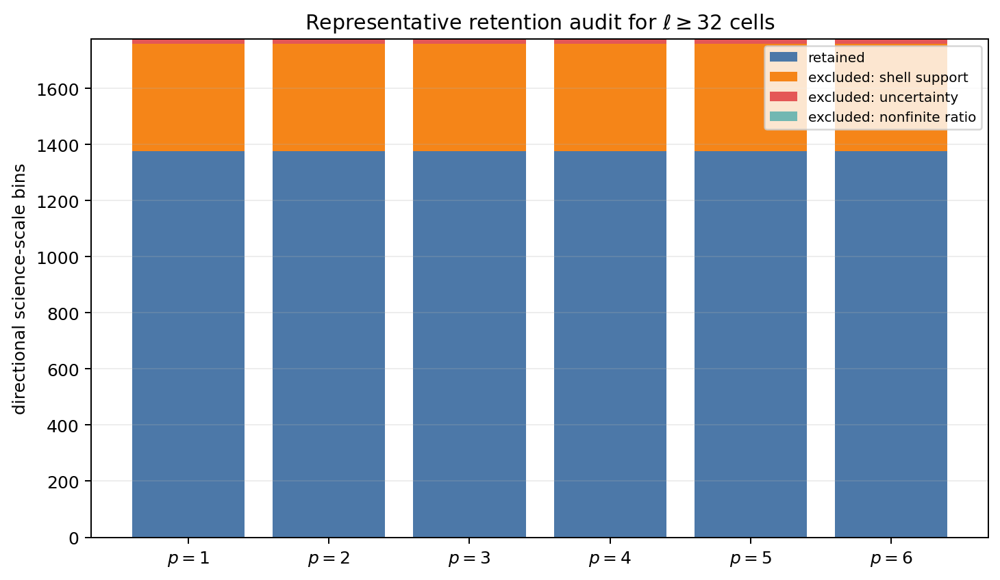
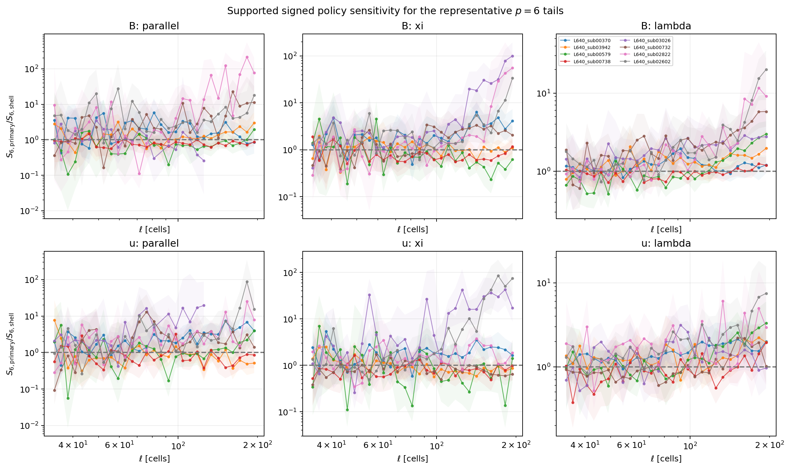
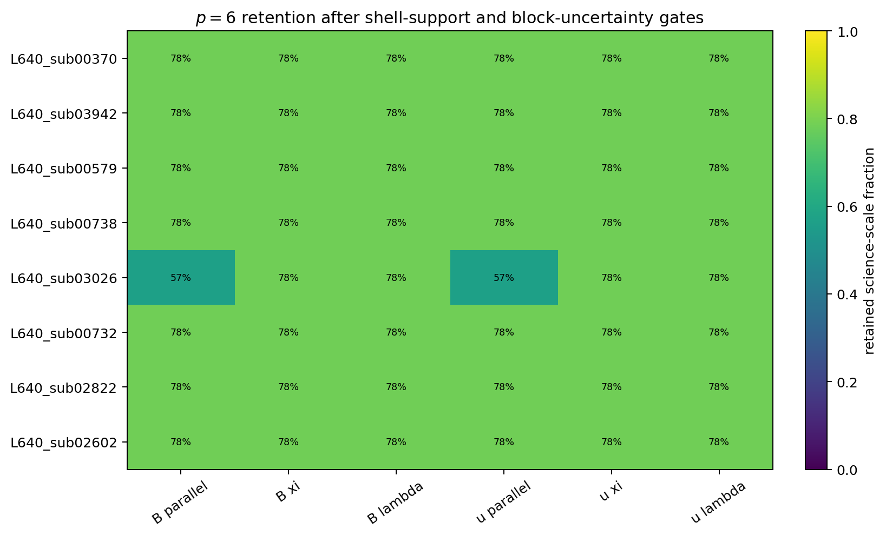
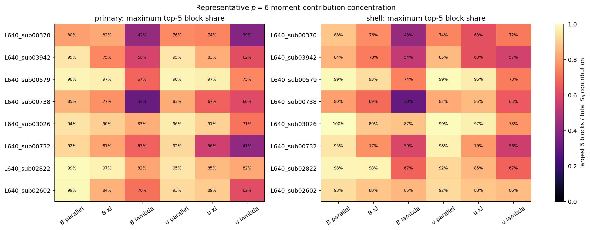
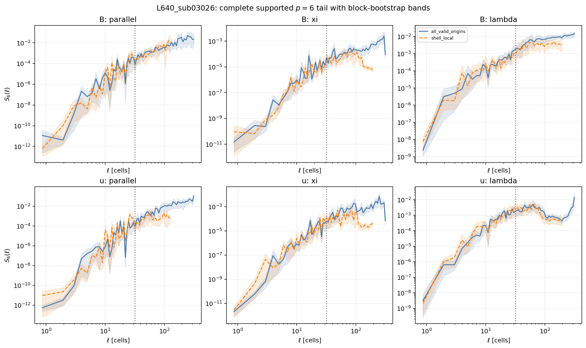

# Phase 4 Batch B representative-probe status update

| Item | Value |
| --- | --- |
| Date | 2026-06-01 |
| Repository | `SFunctor` |
| Branch | `cleanup/cpu-production` |
| Probe source commit | `dab800e2401896fab30544ebcc0f4c66bcf7e906` |
| Review-tool source commit | `323da9c9c050035f368201ca2fc1bea4621ddf29` |
| Retained release | `/lustre/orion/ast207/proj-shared/dfielding/Production_plm/phase4/batch_b_representative_primary_20260601T185131Z` |
| Status | **Bounded representative probe complete. HOLD the all-21 Batch B expansion pending a bounded matched-origin or origin-seed tail diagnostic.** |

## What Was Run

The approved Batch B representative probe measured the labeled 2-point
structure functions for eight retained `L_sub = 640` cubes:

```text
q = B, u
p = 1, 2, 3, 4, 5, 6
stencil = labeled 2-point
ell_max = 320 cells
separation bins = 64
directions per bin = 24
support policies = all_valid_origins, shell_local
```

The exact cubes were:

```text
L640_sub00370
L640_sub03942
L640_sub00579
L640_sub00738
L640_sub03026
L640_sub00732
L640_sub02822
L640_sub02602
```

No all-21 Batch B expansion ran. The 5-point stencil remains bounded to the
previous representative Batch A2 cases. Batch C, SGS-derived channels, fitted
directional exponents, and `L_sub = 1280` remain unauthorized.

## Operational Result

The staged Andes run completed successfully:

| Stage | Slurm job | Nodes | Elapsed seconds | Node-hours |
| --- | ---: | ---: | ---: | ---: |
| Plan | `3315368` | 1 | 78 | 0.021667 |
| Work | `3315369` | 8 | 273 | 0.606667 |
| Reduce | `3315372` | 1 | 532 | 0.147778 |
| Verify | `3315474` | 1 | 195 | 0.054167 |
| Summarize | `3315486` | 1 | 203 | 0.056389 |
| Initial review report | `3315491` | 1 | 28 | 0.007778 |
| Strengthened review report | `3315494` | 1 | 29 | 0.008056 |
| **Total** |  |  |  | **0.902502** |

The release marker replayed successfully. Verification passed for `64`
displacement shards and `16` reductions. The immutable release occupies about
`2.6 GiB`. The refreshed cumulative ledger reports `18.354446` node-hours
consumed, `4981.645554` node-hours remaining, no pending jobs, and no accounting
flags.

## Review Result

The representative review package is in
`figures/phase4_batch_b_representative_review/`.



**Figure 1.** Retained and excluded science-scale bins for each order. The
same `1376 / 1776 = 77.48%` bins remain operationally supported for every
order. This confirms that the order dependence below is not caused by a
changing support mask. Operational support does not by itself establish
scientific stability.



**Figure 2.** Signed primary-over-shell ratios for supported $p = 6$ bins,
with coupled spatial-block bootstrap bands. Several channels separate
strongly at large scales. The policies use different deterministic origin
schedules and different eligible domains, so these ratios are sensitivity
diagnostics. The bands quantify spatial-block ratio uncertainty conditional
on the retained schedules; they do not measure schedule-to-schedule
variability. The ratios are not bias corrections and cannot yet be assigned a
physical boundary-effect interpretation.



**Figure 3.** Supported $p = 6$ fraction by cube and channel. Most cells
retain `78%` of candidate bins. `L640_sub03026` retains only `57%` for
`B/parallel` and `u/parallel`, which makes it an important diagnostic case.



**Figure 4.** Maximum fraction of a retained $S_6$ sum supplied by its five
largest spatial blocks, evaluated across supported scales. High-order moments
are often strongly concentrated in a few blocks. This is why a row that
passes geometric, count, effective-block, and bootstrap-availability gates
must be called operationally supported, not statistically converged.



**Figure 5.** Complete supported $p = 6$ tail for `L640_sub03026`, including
block-bootstrap bands. The policies broadly agree at smaller separations and
diverge in multiple large-scale channels. The full-tail view is why the next
step must isolate policy and origin-schedule effects before expansion.

For each retained row, define the signed policy ratio

$$
R_p =
\frac{S_p^{\mathrm{all\_valid\_origins}}}
     {S_p^{\mathrm{shell\_local}}}
$$

and the symmetric policy factor

$$
F_p = \max\left(R_p, R_p^{-1}\right).
$$

Across supported rows, the policy-factor distribution broadens systematically
with order:

| Order | Supported rows | Median $F_p$ | 90th percentile | 95th percentile | Maximum | Rows with $F_p > 1.5$ |
| ---: | ---: | ---: | ---: | ---: | ---: | ---: |
| 1 | 1376 | 1.058 | 1.193 | 1.249 | 1.548 | 4 |
| 2 | 1376 | 1.134 | 1.486 | 1.695 | 2.939 | 133 |
| 3 | 1376 | 1.231 | 1.871 | 2.496 | 6.431 | 299 |
| 4 | 1376 | 1.346 | 2.441 | 3.619 | 14.818 | 501 |
| 5 | 1376 | 1.480 | 3.310 | 5.414 | 48.920 | 673 |
| 6 | 1376 | 1.603 | 4.622 | 9.169 | 215.367 | 751 |

The strongest supported $p = 6$ examples are:

| Cube | Channel | $\ell$ cells | Signed $R_6$ | Primary count | Shell count | Primary effective blocks | Shell effective blocks |
| --- | --- | ---: | ---: | ---: | ---: | ---: | ---: |
| `L640_sub02822` | `B/parallel` | 182.159 | 215.367 | 2449 | 2532 | 229.27 | 71.65 |
| `L640_sub03026` | `B/xi` | 194.149 | 100.474 | 1741 | 1654 | 244.30 | 69.70 |
| `L640_sub02602` | `u/parallel` | 182.159 | 88.488 | 1563 | 2141 | 202.95 | 64.05 |
| `L640_sub02602` | `u/xi` | 171.170 | 85.616 | 1707 | 1596 | 268.09 | 74.54 |

These rows are not removed by count, effective-block, or bootstrap filters:
each listed row has `200 / 200` valid bootstrap resamples under both policies.
A direct retained-`NPZ` cross-check also reproduced the large ratios. For
example, `L640_sub02822 B/parallel` at $\ell = 182.159$ cells grows from
$R_1 = 1.179$ to $R_6 = 215.367$. The corresponding sixth-root amplitude
factor is $R_6^{1/6} = 2.448$. Its coupled spatial-block bootstrap median is
`213.50`, with a 95% interval of `[42.63, 556.47]`. The largest block supplies
`49.8%` of the primary $S_6$ sum, and the largest five blocks supply `87.5%`.
This is a meaningful but imprecise tail sensitivity, not a report-generation
or indexing artifact.

## Decision

This is a **HOLD** for an all-21 Batch B expansion, not a software failure.
The bounded probe did what it was intended to do: it found that high-order
moments, especially $p = 6$, are sensitive to the policy-specific origin
sampling at large scales. Scaling the same matrix to all cubes before
isolating that sensitivity would spend compute without resolving the
interpretation.

The next task is a bounded diagnostic on the existing representative cases:

1. Run a matched-origin decomposition using the same 2-point displacement
   census: measure the common `shell_local` interior origins, the
   intrinsic-valid origins outside that shared interior, and their
   population-weighted recomposition into the `all_valid_origins` estimate.
2. Run a small deterministic origin-seed sensitivity sweep at increased
   sample depth for $p = 2,4,6$. Record cumulative $p = 6$ contribution curves
   or top-contributor diagnostics so rare increments can be inspected
   directly.
3. Prioritize `L640_sub02822 B/parallel`, `L640_sub03026 B/xi`, and
   `L640_sub02602 u/parallel,u/xi`. Include `L640_sub00738` as a comparatively
   stable control.
4. Review the complete large-scale tails and sixth-root amplitude factors.
5. Keep the 5-point product bounded and do not launch any all-21 Batch B
   expansion until that review is complete.

## Reproducibility

The retained release is immutable:

```text
/lustre/orion/ast207/proj-shared/dfielding/Production_plm/phase4/batch_b_representative_primary_20260601T185131Z
```

The release marker is:

```text
PHASE4_BATCH_B_REPRESENTATIVE_COMPLETE.json
```

The review package includes:

```text
figures/phase4_batch_b_representative_review/figure_manifest.json
figures/phase4_batch_b_representative_review/phase4_batch_b_representative_review_summary.json
figures/phase4_batch_b_representative_review/phase4_batch_b_representative_compute_ledger_summary_snapshot.md
figures/phase4_batch_b_representative_review/phase4_batch_b_order_retention_audit.png
figures/phase4_batch_b_representative_review/phase4_batch_b_p6_moment_concentration.png
figures/phase4_batch_b_representative_review/phase4_batch_b_p6_retention_heatmap.png
figures/phase4_batch_b_representative_review/phase4_batch_b_p6_signed_policy_ratios.png
figures/phase4_batch_b_representative_review/phase4_batch_b_sub03026_p6_tail.png
```

The review summary SHA-256 is:

```text
46517e4f082249c4c7fb59638374b547bb8b68b33dec424e6ec9d61ab193d8f9
```

The figure manifest SHA-256 is:

```text
ebec0a33d15fb420d340fe24cfb29e3663b88b0756e4aa672c9923878681ed0e
```

Use `scripts/phase4/generate_phase4_batch_b_representative_review.py` to
recreate the report package from the immutable release. Do not rerun the
representative campaign merely to regenerate figures.
