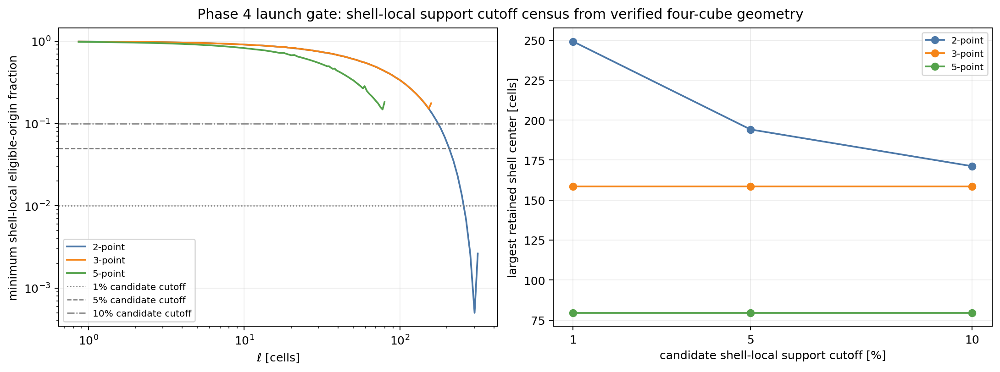
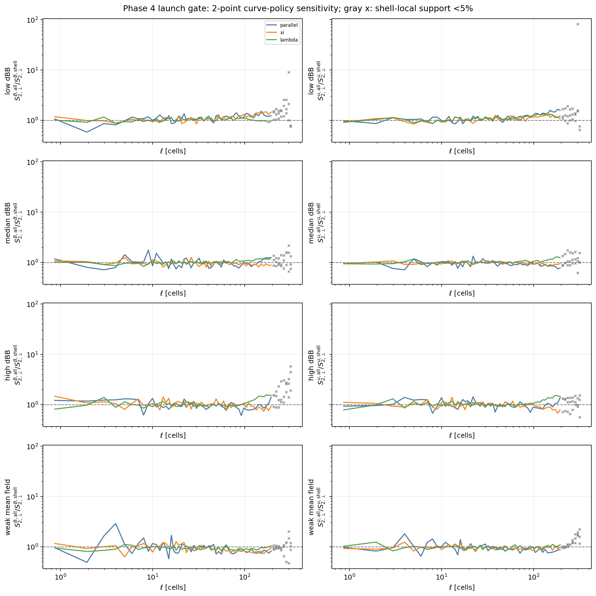
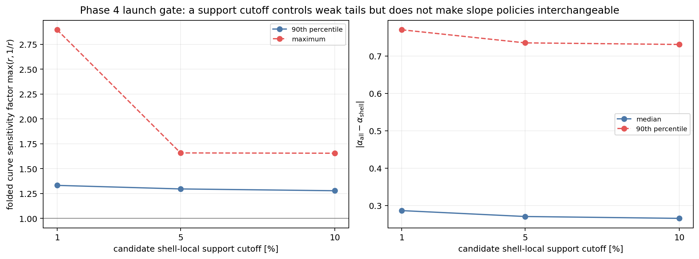
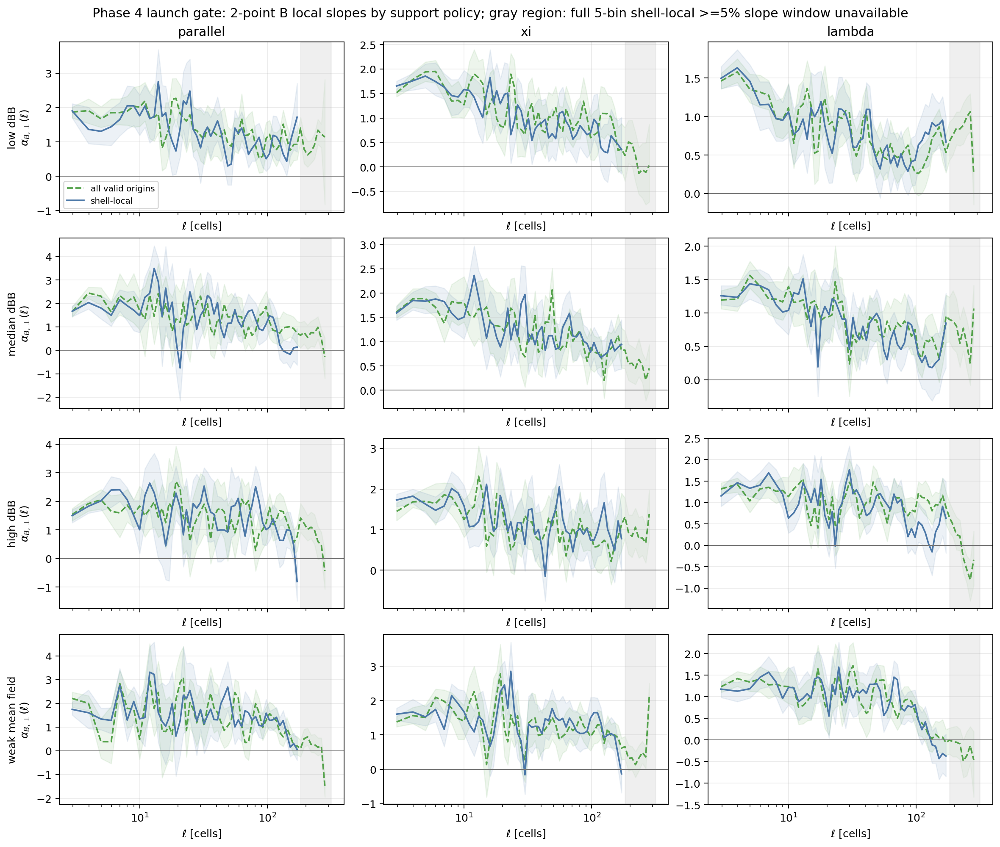
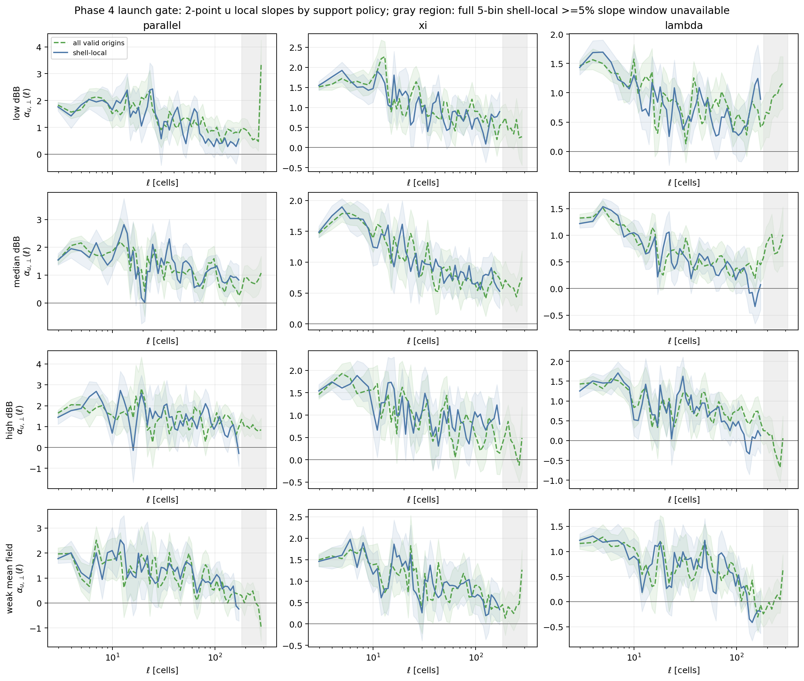

# Phase 4 launch GO decision: staged curve-first `L_sub = 640` pilot

| Item | Value |
| --- | --- |
| Date | 2026-05-31 |
| Repository | `SFunctor` |
| Branch | `cleanup/cpu-production` |
| Decision scope | Phase 4 Batch A launch and bounded downstream staging |
| Trusted pilot | `/lustre/orion/ast207/proj-shared/dfielding/Production_plm/prompt1_catalog/t6_final_primary_20260530/analysis/pilot_sample.csv` |
| Retained Phase 3a release | `/lustre/orion/ast207/proj-shared/dfielding/Production_plm/phase3a_sampler/release_clean_primary_20260531T033614Z` |
| Status | **GO for the staged Phase 4 launch defined below.** |

## Decision

Phase 4 is approved to launch as a staged, curve-first `L_sub = 640` pilot.
This decision supersedes the pre-adjudication Phase 3a report-level NO-GO. It
does not revise the historical Phase 3a report, authorize an unbounded
campaign, authorize `L_sub = 1280`, or authorize Phase 5.

The Phase 3a estimator and four-cube release passed their software gates. The
remaining question was how to report non-periodic finite-domain structure
functions without overclaiming weak outer-scale directional slopes. The
retained four-cube reductions answer that question well enough to begin a
bounded pilot without rerunning the sampler.

The primary Phase 4 product is a curve, not a forced exponent. A cube or
direction may have a useful structure-function curve without having a
defensible fitted slope.

The machine-readable retained-evidence summary is
`figures/phase4_go_decision/phase4_go_policy_summary.json`. The exact-21
extraction guard is implemented by `scripts/phase4/run_phase4_extraction.py`;
the bounded Batch A sampler adapter is
`scripts/phase4/run_phase4_batch_a_sampler.py`.

## Frozen Pilot

The trusted Phase 1 pilot contains exactly `21` selections and every selection
has `L_sub = 640`. Preserve this exact membership. Do not silently add or
remove cubes.

The Phase 4 operational adapter must reject any extraction or Batch A plan that
does not bind this exact trusted pilot list.

## Approved Support-Policy Roles

| Mode | Phase 4 role | Reporting rule |
| --- | --- | --- |
| `all_valid_origins` | Primary curve-level product | Use every non-periodic valid origin for each displacement. Retain explicit support and uncertainty diagnostics. |
| `shell_local` | Required directional robustness overlay | Use the shell-shared interior region. Show science-facing curve overlays only where the eligible-origin fraction is at least `5%`. Preserve weaker values as visibly flagged diagnostics. |
| `nested_core` | Regression diagnostic only | Do not promote to a Phase 4 science product. |

`all_valid_origins` is the closest non-periodic analogue of the historical
periodic 2-D calculation. `shell_local` is deliberately more restrictive: it
tests whether directional differences remain visible when every displacement
direction in a shell samples the same interior region.

The support-policy curves answer related but distinct questions. Their ratios
are sensitivities, not boundary-bias correction factors, because the two modes
also use different deterministic origin schedules.

## Shell-Local Cutoff Census

The retained geometry is identical across the four Phase 3a cubes. Candidate
cutoffs give the following largest retained shell centers:

| Stencil | Minimum retained shell-local support | At least `1%` | At least `5%` | At least `10%` |
| --- | ---: | ---: | ---: | ---: |
| 2-point | `0.0501%` | `249.129` | `194.149` | `171.170` |
| 3-point | `15.0768%` | `158.487` | `158.487` | `158.487` |
| 5-point | `14.8127%` | `79.494` | `79.494` | `79.494` |



*Figure 1: Verified shell-local support fractions and the resulting retained
outer shell for candidate cutoffs. The 2-point outer tail collapses; the wider
stencils retain more than `10%` support through their shorter nominal ranges.*

For a centered five-bin local slope, every contributing bin must pass the
geometric cutoff. The strict geometric ceilings are therefore shorter:

| Stencil | Five-bin slope ceiling at `1%` | Five-bin slope ceiling at `5%` | Five-bin slope ceiling at `10%` |
| --- | ---: | ---: | ---: |
| 2-point | `220.147` | `171.170` | `151.175` |
| 3-point | `145.458` | `145.458` | `145.458` |
| 5-point | `74.740` | `74.740` | `74.740` |

These are geometric ceilings, not approved fit windows.

## Policy Sensitivity

Across the four cubes, fields `B` and `u`, directions `parallel`, `xi`, and
`lambda`, and scales $\ell \geq 32$ cells, the 2-point curve-policy sensitivity
is:

| Shell-local cutoff | Median multiplicative factor | 90th-percentile factor | Maximum factor |
| --- | ---: | ---: | ---: |
| `1%` | `1.102` | `1.332` | `2.895` |
| `5%` | `1.097` | `1.296` | `1.658` |
| `10%` | `1.095` | `1.278` | `1.655` |

The `5%` shell-local curve-overlay threshold removes the most extreme weak-tail
sensitivity while retaining a useful outer-scale comparison. Moving to `10%`
changes the aggregate curve sensitivity only modestly, so `10%` is retained as
the stricter minimum geometric eligibility threshold for any later directional
slope-table candidate.

These are conservative reporting-policy choices from the bounded retained
diagnostic, not empirically established physical admissibility boundaries. The
census pools equally weighted bins from the four retained cubes, fields `B`
and `u`, and the directional channels `parallel`, `xi`, and `lambda`; it is
not uncertainty-weighted.



*Figure 2: Ratios of primary `all_valid_origins` curves to `shell_local`
robustness curves. Gray crosses mark shells below the approved `5%`
shell-local curve-overlay threshold. The retained differences are
cube-, field-, and direction-dependent sensitivities, not corrections.*



*Figure 3: Candidate cutoffs control the weak shell-local tail but do not make
the two support policies interchangeable. This is why Phase 4 is curve-first.*

## Slope Policy

Directional slope tables are **not** mandatory Phase 4 Batch A products.
Publish local-slope plots as diagnostics. Promote a directional slope-table
entry only after a separate review confirms:

1. every bin in the centered five-bin regression window has at least `10%`
   `shell_local` eligible-origin support;
2. the existing contributing-block and Kish-effective-block gates pass;
3. at least `90%` of spatial-block bootstrap slope replicates remain finite;
4. the interval excludes grid-adjacent dissipative bins;
5. nearby-window sensitivity is acceptable;
6. the `all_valid_origins` and `shell_local` comparison is explicitly shown;
7. the fit interval is recorded with the reported value.



*Figure 4: Two-point magnetic local slopes under both support policies. Gray
regions lack a complete centered five-bin `shell_local >= 5%` slope window.
The curves expose real policy sensitivity, so a universal directional
exponent is not a Batch A requirement.*



*Figure 5: Two-point velocity local slopes under both support policies. Gray
regions lack a complete centered five-bin `shell_local >= 5%` slope window. As
for the magnetic field, slope claims remain conditional products.*

## Approved Staged Matrix

### Batch A: authorized launch baseline

Run all `21` frozen cubes:

```text
q = B, u
p = 2
stencil = 2-point
primary curve-level policy = all_valid_origins
directional robustness overlay = shell_local
```

Stop after Batch A reduction, verification, and reporting for an intermediate
review.

### Batch A2: planned representative-cube stencil review after a separate decision

Stop after Batch A reporting. Only after a separate post-Batch-A review and
explicit human approval, run the retained representative low-, median-,
high-`dBB`, and weak-mean-field cubes:

```text
q = B, u
p = 2
stencils = 3-point, 5-point
support policies = all_valid_origins, shell_local
```

Expand the 3-point product to all `21` cubes only if the representative-cube
review finds an informative and stable labeled comparison. Keep the 5-point
product bounded to representative cases during the initial launch. Any
5-point expansion requires a separate reviewed decision.

### Later batches: not automatically authorized

Higher-order `p` work and compressible-MHD variable comparisons remain staged
behind intermediate reviews. Broken SGS-derived channels remain excluded.

## Planning Inputs

| Item | Planning value | Interpretation |
| --- | ---: | --- |
| 21-cube extraction conservative wrapper proxy | `1.7558` node-hours | Linear extrapolation of the complete retained Phase 2 extraction wrapper |
| 21-cube 2-point `all_valid_origins` estimator proxy | `0.684` node-hours | Allocation-share proxy from the retained Phase 3a release |
| 21-cube 2-point `shell_local` estimator proxy | `0.727` node-hours | Allocation-share proxy from the retained Phase 3a release |
| 21-cube two-policy 2-point estimator proxy | `1.411` node-hours | Batch A estimator subtotal before fixed overhead |

These are planning inputs, not guaranteed end-to-end costs. Extraction restart
verification, planning, reduction, bootstrap uncertainty, final verification,
scheduler behavior, storage, and cache state add overhead. Refresh the ledger
before each nontrivial submission and stop if observed cost or coverage differs
materially from the forecast.

## Operational Preconditions

Before submitting Phase 4 Batch A:

1. use `scripts/phase4/run_phase4_extraction.py` through
   `job_scripts/phase4/run_phase4_extract_andes.sh` for the exact-21
   extraction guard;
2. preserve the trusted Phase 1 tree read-only;
3. use a unique restartable Phase 4 extraction root;
4. extract, validate, and restart-verify newly materialized cubes;
5. materialize all `21` cubes under the fresh Phase 4 extraction root; the
   root path is frozen into the plan, the adapter publishes plan-bound
   per-cube materialization records, and historical-cube reuse is unsupported;
6. plan the exact Batch A sampler matrix with
   `scripts/phase4/run_phase4_batch_a_sampler.py` through
   `job_scripts/phase4/run_phase4_batch_a_sampler_andes.sh` before work
   submission;
7. use Andes CPU Slurm allocations with account `AST207`, partition `batch`,
   no Slurm email directives, and stdout/stderr under `logs/`;
8. refresh the compute ledger and require zero pending exposure;
9. never launch `L_sub = 1280`;
10. never use broken SGS-derived channels.

## Deferred Hardening

The following tasks remain useful but do not block the curve-first Batch A
launch:

- a fully independent brute-force coordinate enumerator for geometry;
- independent re-reduction audit modes;
- replay-resource completion markers bound into the release schema;
- rotated angular-census tests before fine directional slope claims;
- matched-origin policy comparisons if a later claim depends on interpreting
  a support-policy difference as more than a sensitivity;
- multiworker process-tree memory accounting before changing the retained
  one-worker-per-node publication layout.

The Slurm wrappers recover owner-tagged stale action locks only after confirming
that the recorded Slurm job is absent. An ownerless lock is deliberately
fail-closed because it cannot be attributed safely; inspect it manually before
removal.

The extractor also fails closed if a complete cube exists without its Phase 4
materialization record. This can occur in the narrow interval between core cube
publication and sidecar-record publication after an abrupt termination.
Inspect and remove that unrecorded cube before freshly re-extracting it; do not
adopt it automatically.

## Final Authorization

The project is **GO** to prepare and submit Phase 4 Batch A under the exact
curve-first policy and operational preconditions above. This authorization is
bounded: stop after Batch A reporting for review before Batch A2, higher-order
work, additional variables, `L_sub = 1280`, or Phase 5.
