# Project status update: Phase 4 bounded $L_{\rm sub}=640$ structure-function pilot

| Item | Value |
| --- | --- |
| Date | 2026-06-02 UTC |
| Project | `SFunctor` |
| Repository path | `/autofs/nccs-svm1_home2/dfielding/SFunctor` |
| Branch | `cleanup/cpu-production` |
| Closeout-package generator source checkpoint | `6c0ad16e03945b34632174912e47344a7a7da66d` |
| Closeout-package repository retention checkpoint | `08252db3592a9f8bc0935f61d32f00c4588c1c48` |
| Agent | Codex |
| Simulation analyzed | AthenaK turbulence snapshot `00024`; selected Phase 1 primary-only catalog regions |
| Primary scale | $L_{\rm sub}=640$ cells |
| Compute environment | Andes CPU Slurm, account `AST207`, partition `batch` |
| Status | **Phase 4 bounded pilot complete. Prepare a staged Phase 5 proposal for human review; do not execute Phase 5 automatically.** |

# Tier 0: What happened and why it matters

Phase 4 asked a deliberately bounded question: can the 3-D structure-function
pipeline measure magnetic and velocity fluctuations across a scientifically
useful set of $21$ extracted $640^3$ regions without hiding finite-cube
boundary effects or overstating what the curves say?

The answer is yes, with important limits. All $21$ selected regions were
materialized from primitive fields, checked against the trusted Phase 1
catalog and the supported coarse-bin reader products, and processed through
restartable displacement-sharded calculations. The extraction includes
density, velocity, magnetic field, and internal energy. No SGS-derived or
dynamo-derivative channels were used.

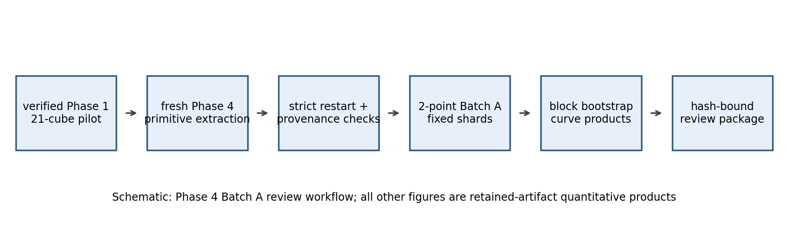

*Figure 0.1: Schematic of the Phase 4 baseline workflow. The important point
is that the analysis begins with verified selected cubes and ends with
hash-bound review packages. The schematic is explanatory; the later figures
are generated from retained quantitative outputs.*

The cubes span visibly different density structures and magnetic
environments. That matters because this is not a synthetic code-only test:
the estimator was exercised on heterogeneous regions selected to include
low, intermediate, and high `dBB` cases, matched comparisons, and weak-mean-
field outliers.

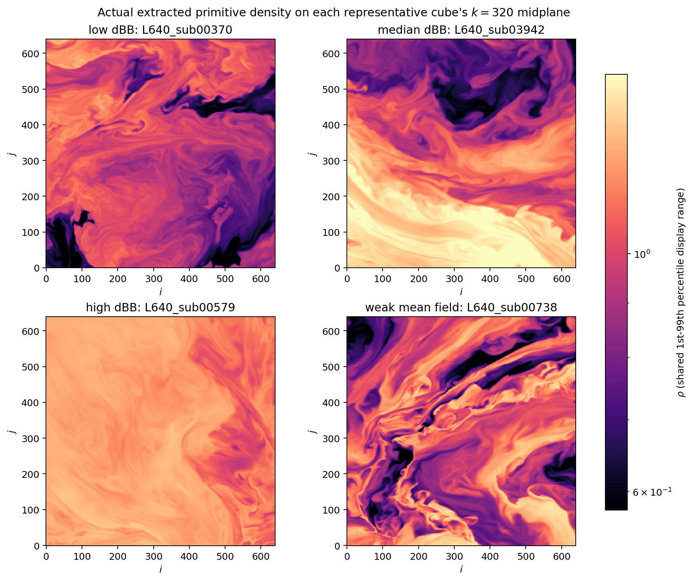

*Figure 0.2: Primitive density on the $k=320$ midplane for four representative
extracted cubes. The shared display range makes the morphological differences
visible. These differences are why spatial-block uncertainty and explicit
finite-domain support accounting are necessary.*

The baseline Batch A product measures 2-point magnetic and velocity
structure functions at $p=2$ through $\ell_{\max}=320$ cells. The primary
curve product uses every valid non-periodic origin available to each
displacement. A second `shell_local` product restricts each shell to a common
interior region so directional comparisons can be checked on fair spatial
support. Those products are intentionally compared, not silently merged.

Phase 4 also retained labeled 3-point and 5-point comparisons. The 3-point
product was expanded to all $21$ cubes after a representative review. The
5-point product remained bounded to representative cases. These wider
filters are distinct observables, not higher-accuracy replacements for the
2-point statistic.

The final user-authorized Batch B extension measured the 2-point statistic
for both magnetic field and velocity, both support policies, and
$p=1,2,3,4,5,6$ on all $21$ cubes. This expansion passed strict integrity
checks. Its $p=2$ slice reproduces the earlier Batch A baseline exactly for
all $42$ cube-policy groups, excluding timing and staging metadata only.

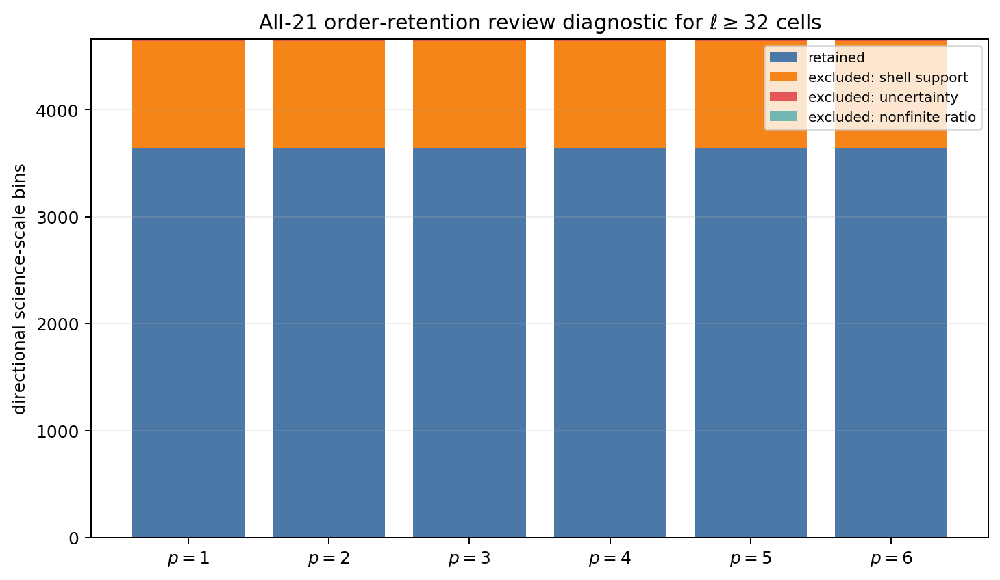

*Figure 0.3: Retained and excluded science-scale bins for each order. Every
order retains the same $3638/4662=78.04\%$ bins. The important point is that
the high-order behavior below is not caused by a changing support mask.*

The main scientific warning is real: higher-order moments are increasingly
sensitive to finite-domain support policy and sampled origins. At $p=6$, the
typical support-policy difference is modest but no longer small: the median
symmetric policy factor is $1.504$ and its $90$th percentile is $3.520$. A few
channels are much more sensitive, reaching a maximum factor of $215.367$.

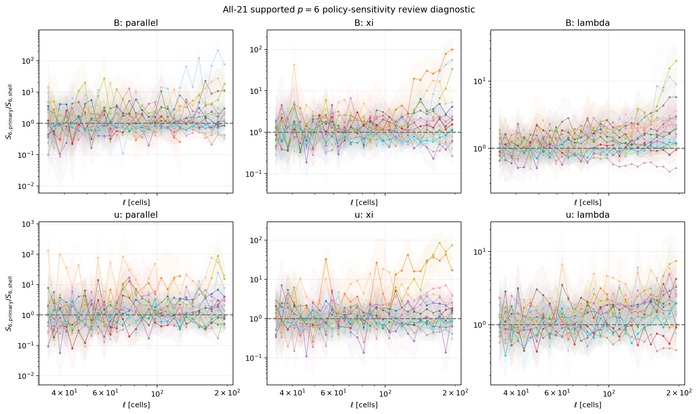

*Figure 0.4: Supported $p=6$ primary-over-shell ratios across all $21$ cubes.
Most values remain near unity, while selected magnetic and velocity channels
broaden strongly. This matters because operational support is not the same
thing as statistical convergence.*

A corrected bounded tail diagnostic pushed this from several angles:
increased sample depth, changed deterministic origin seeds, a production-
equivalent direct intrinsic partition, a separately labeled shell schedule,
and a separately labeled stratified overlay. The typical ratios remain near
unity. Sparse rare-event tails remain imperfect, especially at $p=6$. This
is not a software failure; it is exactly the kind of finite-subvolume and
rare-increment sensitivity that the bounded pilot was supposed to expose.

The closeout therefore withholds fitted directional slopes, fitted
exponents, and directional $\zeta_p$ claims. It also withholds any automatic
Phase 5 launch. The pilot is useful enough to justify preparing a staged
cross-scale Phase 5 proposal, beginning with a small $L_{\rm sub}=320$ 2-point
$p=2$ smoke product. That proposal still requires explicit human approval of
its scientific scope, storage forecast, and maximum node-hour exposure.

# Tier 1: How the analysis works

## 1.1 Objective and retained inputs

The Phase 4 objective was to run the Phase 3a finite-domain 3-D estimator on a
frozen $21$-region pilot and determine what could be reported robustly before
any cross-scale production campaign.

The trusted environmental catalog is:

```text
/lustre/orion/ast207/proj-shared/dfielding/Production_plm/prompt1_catalog/t6_final_primary_20260530
```

The clean Phase 4 primitive extraction is:

```text
/lustre/orion/ast207/proj-shared/dfielding/Production_plm/phase4/extract_primary_20260531T140042Z
```

Each extracted cube contains eight `float32` primitive arrays:

| Field files | Meaning |
| --- | --- |
| `dens.npy` | density $\rho$ |
| `velx.npy`, `vely.npy`, `velz.npy` | primitive velocity $\mathbf{u}$ |
| `bcc1.npy`, `bcc2.npy`, `bcc3.npy` | cell-centered magnetic field $\mathbf{B}$ |
| `eint.npy` | internal energy |

Each field has shape $(640,640,640)$ in `KJI` order:
array axes are $(k=x_3,j=x_2,i=x_1)$. The extracted cubes are finite
subvolumes. They do not wrap periodically.

## 1.2 Environmental notation

The coarse-grained magnetic fluctuation measure is

$$
\mathrm{dBB}
=
\frac{\delta B}{B_{\rm mean}}
=
\frac{
\sqrt{
\left\langle
\left|
\mathbf{B}
-
\left\langle
\mathbf{B}
\right\rangle_V
\right|^2
\right\rangle_V
}
}{
\left|
\left\langle
\mathbf{B}
\right\rangle_V
\right|
}.
$$

Here $V$ is the $640^3$ environmental subvolume,
$B_{\rm mean}=|\langle\mathbf{B}\rangle_V|$, and $\delta B$ is the RMS
magnetic fluctuation around that volume mean. `dBB` is useful, but a large
value can be numerator-driven, denominator-driven, or both. For that reason,
the report always keeps `dBB`, `B_mean`, `deltaB`, `B_rms`, and bounded
magnetic complements visible together.

The bounded magnetic complements are

$$
\frac{B_{\rm mean}^2}{\left\langle B^2\right\rangle_V},
\qquad
\frac{\delta B^2}{\left\langle B^2\right\rangle_V}.
$$

They separate the mean-field and fluctuating-field contributions while
remaining bounded fractions of the magnetic-energy-like denominator.

Two weak-mean-field examples deserve special attention:

| Cube | `dBB` | `B_mean` | Interpretation |
| --- | ---: | ---: | --- |
| `L640_sub00738` | $44.73$ | $0.01895$ | extreme `dBB` driven substantially by a weak denominator |
| `L640_sub01651` | $18.89$ | $0.03124$ | second weak-mean-field outlier |

They are retained because they are informative edge cases. They must not be
treated as ordinary high-`dBB` points.

## 1.3 Structure functions and rooted amplitudes

For a field $q$, order $p$, and displacement $\mathbf{r}$, the retained
curves measure perpendicular increment amplitudes:

$$
S_{p,\perp}^{q}(\ell)
=
\left\langle
\left|
\Delta q_{\perp}(\mathbf{x},\mathbf{r})
\right|^p
\right\rangle,
\qquad
\ell=|\mathbf{r}|.
$$

The rooted amplitude used for cross-order visual comparisons is

$$
A_{p,\perp}^{q}(\ell)
=
\left[
S_{p,\perp}^{q}(\ell)
\right]^{1/p}.
$$

The labels `parallel`, `xi`, and `lambda` describe the separation-direction
wedges. They do not mean that the plotted increment component is parallel to
the local field.

The local conditioning field is stencil-local. For the 2-point statistic it
is pair-local; for wider stencils it is evaluated over the corresponding
stencil. The report therefore uses `stencil-local` as the general term.

## 1.4 Labeled stencil matrix

The retained increment filters are

$$
\Delta_2 q
=
q(\mathbf{x}+\mathbf{r})-q(\mathbf{x}),
$$

$$
\Delta_3 q
=
\frac{
q(\mathbf{x}+\mathbf{r})-2q(\mathbf{x})+q(\mathbf{x}-\mathbf{r})
}{
\sqrt{3}
},
$$

and

$$
\Delta_5 q
=
\frac{
q(\mathbf{x}-2\mathbf{r})
-4q(\mathbf{x}-\mathbf{r})
+6q(\mathbf{x})
-4q(\mathbf{x}+\mathbf{r})
+q(\mathbf{x}+2\mathbf{r})
}{
\sqrt{35}
}.
$$

The approved scale limits follow each filter footprint:

| Stencil | Phase 4 role | $\ell_{\max}$ | Separation bins | Status |
| --- | --- | ---: | ---: | --- |
| labeled 2-point | baseline and Batch B | $320$ | $64$ | all $21$ cubes |
| labeled 3-point | comparison | $160$ | $64$ | all $21$ cubes |
| labeled 5-point | comparison | $80$ | $64$ | representative cubes only |

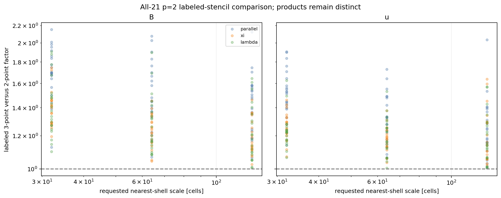

*Figure 1.1: Supported labeled 3-point-to-2-point factors at selected scales.
The products differ by order-unity factors and remain explicitly labeled.
This matters because wider stencils must not be described as interchangeable
accuracy upgrades.*

## 1.5 Finite-domain support policies

Each extracted cube is finite. Every stencil point must remain in bounds.
Phase 4 compares two non-periodic support policies:

| Policy | Definition | Reporting role |
| --- | --- | --- |
| `all_valid_origins` | Each displacement uses all in-domain origins available to it | primary curve product |
| `shell_local` | All directions in one shell use one common interior origin region | directional robustness overlay |

For a shared row, define

$$
R_p
=
\frac{
S_p^{\mathrm{all\_valid\_origins}}
}{
S_p^{\mathrm{shell\_local}}
},
\qquad
F_p
=
\max\left(R_p,R_p^{-1}\right).
$$

$F_p$ is a symmetric sensitivity factor. It is not a correction factor.

## 1.6 Computational workflow

The full bounded campaign was staged:

| Stage | Scope | Shards | Reductions | Result |
| --- | --- | ---: | ---: | --- |
| Extraction | $21$ primitive $640^3$ cubes | N/A | N/A | passed |
| Batch A | 2-point, $p=2$, `B,u`, both policies | $168$ | $42$ | passed |
| Batch A2 representative | 3-point and 5-point comparisons | $64$ | $16$ | passed |
| Batch A2 extension | all-21 labeled 3-point, $p=2$ | $168$ | $42$ | passed |
| Batch B representative | 2-point, $p=1,\ldots,6$, eight cubes | $64$ | $16$ | passed with tail warning |
| Corrected tail diagnostic | four representative cubes | N/A | N/A | passed; sensitivity remains real |
| Batch B all-21 | 2-point, $p=1,\ldots,6$, both policies | $168$ | $42$ | passed |
| Completion supplement v2 | retained-data strict replay and figures | N/A | N/A | passed |

Each heavy sampler run builds deterministic displacement manifests, splits
work into stable displacement shards, writes additive partials, reduces only
complete shards, computes spatial-block uncertainty, and verifies the
published graph before exposing a completion marker.

The inherited retained production constants are:

| Setting | Value |
| --- | --- |
| production seed | `20260530` |
| bootstrap seed | `20260531` |
| pair batch size | `1024` |
| spatial block shape | $(80,80,80)$ cells |

## 1.7 Validation strategy

The closeout supplement strictly replays retained artifact chains without
rereading live primitive source files. That is an important distinction:
the replay verifies the retained hash-bound graph and decoded semantic
content; it is not a second extraction from the live simulation tree.

| Validation | Result |
| --- | --- |
| Clean extraction manifests | $21$ cube markers, $21$ materialization records, and $21$ restart checks passed |
| Batch A chain | $168/168$ shards and $42/42$ reductions passed |
| All-21 labeled 3-point chain | $168/168$ shards and $42/42$ reductions passed |
| All-21 Batch B chain | $168/168$ shards and $42/42$ reductions passed |
| Batch A versus Batch B $p=2$ | exact array reproduction for $42/42$ groups; timing and staging metadata excluded |
| Completion supplement v2 manifest | $20/20$ artifacts and $6/6$ figures match SHA-256 |
| Local Python suite | `510 passed, 1 warning` |

The one local warning is a Matplotlib `constrained_layout` warning in a
synthetic rendering test. The earlier zero-only log-axis warning was fixed.

## 1.8 Main results

The all-21 Batch B retention mask is stable across order:

| $p$ | Candidate science-scale bins | Retained | Excluded for shell support | Excluded for uncertainty | Nonfinite ratio |
| ---: | ---: | ---: | ---: | ---: | ---: |
| $1$ | $4662$ | $3638$ | $1008$ | $16$ | $0$ |
| $2$ | $4662$ | $3638$ | $1008$ | $16$ | $0$ |
| $3$ | $4662$ | $3638$ | $1008$ | $16$ | $0$ |
| $4$ | $4662$ | $3638$ | $1008$ | $16$ | $0$ |
| $5$ | $4662$ | $3638$ | $1008$ | $16$ | $0$ |
| $6$ | $4662$ | $3638$ | $1008$ | $16$ | $0$ |

At $p=6$, the supported policy-factor census is:

| Statistic | Value |
| --- | ---: |
| supported rows | $3638$ |
| median $F_6$ | $1.503644$ |
| $90$th percentile $F_6$ | $3.519713$ |
| maximum $F_6$ | $215.366957$ |
| rows with $F_6>1.5$ | $1825$ |

The strongest supported example is
`L640_sub02822 B/parallel` at $\ell=182.159$ cells. Its signed ratio is
$R_6=215.367$, with a coupled spatial-block bootstrap median of $213.50$ and
a $95\%$ interval of $[42.63,556.47]$. The largest five blocks supply
$87.5\%$ of its primary $S_6$ sum.

The sensitivity is not solely an outer-boundary effect. For example,
`L640_sub02615 u/parallel` at $\ell=33.985$ cells has
$F_6=133.745$ while the shell-local eligible-origin fraction remains
$71.9\%$.

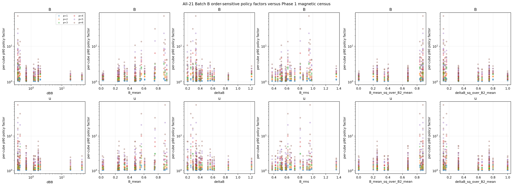

*Figure 1.2: Per-cube $90$th-percentile policy factors versus Phase 1 magnetic
environment. Higher orders broaden visibly. The plots are exploratory:
the selected $21$-cube pilot is not an unbiased environmental survey.*

The completion supplement also compares rooted amplitudes against Phase 1
magnetic properties. Magnetic amplitudes visibly track magnetic complements;
velocity trends are weaker. The retained rank checks are exploratory and do
not eliminate residual confounding.

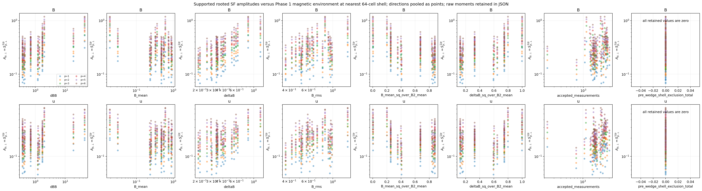

*Figure 1.3: Supported rooted amplitudes near the $64$-cell shell versus Phase
1 magnetic properties. The last panels show that all retained pre-wedge shell
exclusion counts are zero. This is a census view, not a causal fit.*

The strict equal-SF inverse-scale diagnostic is intentionally sparse:
only $2/80$ quality-census rows retain unique central and bootstrap-envelope
crossings. Those rows are useful examples, not a fitted anisotropy law.

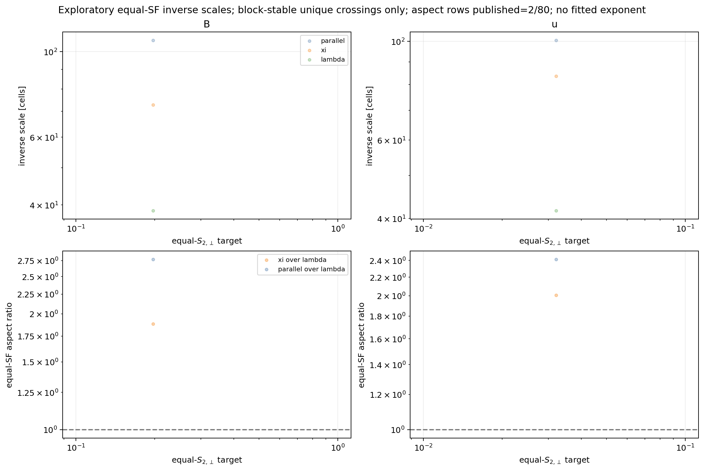

*Figure 1.4: Equal-$S_{2,\perp}$ inverse scales and aspect ratios for the only
two rows passing the strict crossing gate. The sparse result is the result:
Phase 4 does not fit an exponent from these points.*

## 1.9 Primary caveats and next step

The bounded pilot supports a staged Phase 5 proposal, not a Phase 5 launch.
The next proposal should begin at $L_{\rm sub}=320$ with a small, matched
2-point $p=2$ smoke sample. It must preserve both support policies, exact
baseline-reproduction checks, spatial-block uncertainty, and explicit
stopping rules. Higher orders should remain staged. The 3-point product
should remain separately labeled. Any 5-point expansion, Batch C work, or
$L_{\rm sub}=1280$ extraction requires a separate reviewed decision.

# Tier 2: Detailed methods, implementation, and validation

## 2.1 Problem definition

The scientific question was whether selected magnetic environments at
$L_{\rm sub}=640$ exhibit measurable differences in finite-domain 3-D
structure-function curves, and whether those differences survive explicit
support-policy and uncertainty review.

The software task was to execute the validated Phase 3a estimator at the
bounded $21$-cube pilot scale, retain restartable and auditable artifacts,
expand cautiously from $p=2$ to $p=1,\ldots,6$, and stop before any
unreviewed cross-scale campaign.

The intentionally deferred work is substantial:

| Deferred scope | Reason |
| --- | --- |
| cross-scale production | requires a separately approved Phase 5 plan |
| $L_{\rm sub}=1280$ extraction | expensive and separately gated |
| all-21 5-point expansion | representative comparison only |
| Batch C variants | no frozen `rho0` convention; scientific value not yet adjudicated |
| fitted directional slopes, exponents, and $\zeta_p$ | support and tail sensitivity do not justify publication |
| SGS-derived and dynamo-derivative channels | explicitly excluded as untrusted |
| shifted tilings and additional snapshots | optional later investigations |

## 2.2 Data model and assumptions

The selected catalog contains $21$ $L_{\rm sub}=640$ regions. Each region is
identified by a cube ID and half-open global bounds
$[i_0,i_1,j_0,j_1,k_0,k_1)$. Extraction writes eight primitive arrays in
`KJI` order and binds each cube to:

- its source paths and SHA-256 values;
- global bounds and cell coverage;
- catalog comparisons;
- supported coarse-bin comparisons;
- field shapes and dtypes;
- materialization records;
- completion markers;
- restart checks.

The source simulation is periodic, but the extracted cubes are not allowed
to wrap. The estimator therefore treats finite support explicitly.

The `cbin` comparison reader is based on the supported reader implementation
at:

```text
/ccs/home/dfielding/athenak-df/vis/python/bin_convert.py
```

Catalog comparisons validate reconstructable coarse quantities such as
`B_mean`, `B_rms`, `deltaB`, `dBB`, density summaries, conserved-momentum
summaries, magnetic components, magnetic energy, and supported proxies.
Primitive velocity, pressure, Mach numbers, kinetic summaries, and mixed
ratios are computed post-extraction and remain exploratory covariates rather
than independent Phase 1 validation targets.

The primitive-only pressure convention is

$$
p=(\gamma-1)e_{\rm int},
\qquad
\gamma=1.00001,
$$

with

$$
c_{s,V,\mathrm{rms}}
=
\sqrt{
\left\langle
\gamma p/\rho
\right\rangle_V
}.
$$

These quantities are useful for exploratory post-extraction comparisons.
They are not promoted to frozen catalog controls.

## 2.3 Mathematical definitions

Measured quantities:

| Quantity | Definition |
| --- | --- |
| $B_{\rm mean}$ | $|\langle\mathbf{B}\rangle_V|$ |
| $\delta B$ | $\sqrt{\langle|\mathbf{B}-\langle\mathbf{B}\rangle_V|^2\rangle_V}$ |
| `dBB` | $\delta B/B_{\rm mean}$ |
| $S_{p,\perp}^q(\ell)$ | mean $p$th power of the retained perpendicular stencil increment |
| $A_{p,\perp}^q(\ell)$ | $[S_{p,\perp}^q(\ell)]^{1/p}$ |
| $R_p$ | $S_p^{\mathrm{all\_valid\_origins}}/S_p^{\mathrm{shell\_local}}$ |
| $F_p$ | $\max(R_p,R_p^{-1})$ |

Derived diagnostics:

| Diagnostic | Scope |
| --- | --- |
| local slopes | retained for visual sensitivity checks only |
| equal-SF inverse scales | exploratory crossing diagnostics only |
| equal-SF aspect ratios | published only when central and bootstrap-envelope crossings are unique |
| Phase 1 rank correlations | exploratory selected-sample diagnostics only |
| tail schedule ratios | sensitivity diagnostics only; never corrections |

Quantities not reconstructed or promoted:

| Quantity | Status |
| --- | --- |
| universal fitted directional exponent | withheld |
| directional $\zeta_p$ | withheld |
| frozen Batch C `rho0` convention | not defined |
| physical correction from one support policy to the other | not defined |

## 2.4 Algorithm and implementation

The Phase 4 adapter layer is under `scripts/phase4/` and
`job_scripts/phase4/`.

| Code path | Responsibility |
| --- | --- |
| `scripts/phase4/run_phase4_extraction.py` | freeze and materialize the exact $21$-cube extraction |
| `scripts/phase4/run_phase4_batch_a_sampler.py` | guarded all-21 2-point $p=2$ baseline |
| `scripts/phase4/run_phase4_batch_a2_sampler.py` | representative labeled 3-point and 5-point matrix |
| `scripts/phase4/run_phase4_batch_a2_3point_extension.py` | guarded all-21 labeled 3-point extension |
| `scripts/phase4/run_phase4_batch_b_representative_sampler.py` | bounded representative $p=1,\ldots,6$ probe |
| `scripts/phase4/run_phase4_batch_b_tail_diagnostic.py` | corrected matched-origin, depth, seed, and rare-tail diagnostics |
| `scripts/phase4/run_phase4_batch_b_all21_extension.py` | user-authorized all-21 2-point $p=1,\ldots,6$ extension |
| `scripts/phase4/generate_phase4_completion_supplement.py` | strict retained-data closeout replay and final figures |

The estimator inherits the displacement-distributed Phase 3a implementation:

1. Generate integer-grid displacement manifests with explicit shell bins.
2. Deduplicate offsets after integer rounding.
3. Compute stencil-specific non-periodic origin boxes.
4. Split displacement offsets into stable restartable shards.
5. Memory-map extracted arrays.
6. Accumulate additive statistics and spatial-block contributions.
7. Publish one-time shard partials.
8. Reduce only complete, manifest-matching shards.
9. Compute conditional block-jackknife and block-bootstrap diagnostics.
10. Verify the retained graph and expose completion markers.

The wider stencils have smaller $\ell_{\max}$ limits because their endpoint
spans are larger: $\ell$, $2\ell$, and $4\ell$ for the 2-, 3-, and 5-point
filters.

## 2.5 Validation

### 2.5.1 Local tests

The final local test run after the completion-supplement presentation fix was:

```text
venv_sfunctor/bin/python -m pytest -q
510 passed, 1 warning in 38.04s
```

The warning is the known synthetic-figure `constrained_layout` warning. The
test explicitly checks that the previous zero-only log-scale warning is
absent.

### 2.5.2 Retained-chain verification

| Test | Purpose | Expected | Actual | Status |
| --- | --- | --- | --- | --- |
| extraction frozen-artifact replay | verify cube provenance and supported comparisons | exact retained graph | $21$ cubes, $1$ plan, $21$ materializations, $21$ restart records | passed |
| Batch A replay | verify all-21 2-point baseline | $168$ shards, $42$ reductions | exact counts | passed |
| all-21 3-point replay | verify separately labeled comparison chain | $168$ shards, $42$ reductions | exact counts | passed |
| all-21 Batch B replay | verify user-authorized higher-order chain | $168$ shards, $42$ reductions | exact counts | passed |
| exact $p=2$ baseline reproduction | prevent Batch B drift | $42$ exact groups | $42$ exact groups | passed |
| v2 package manifest | verify final package bytes | zero mismatches | $20$ artifact hashes and $6$ figure hashes match | passed |

The exact $p=2$ comparator treats array dtype and signed zero as meaningful,
while permitting equal-position `NaN` values. Only timing and staging
metadata are excluded.

### 2.5.3 Narrow historical compatibility

The all-21 3-point release predates explicit density-convention and
quantity-axis schedule fields. The closeout verifier does not broadly waive
those checks. It reconstructs the legacy base schedule only where the
historical omission is expected, then revalidates every retained shard and
reduction. Modern Batch B artifacts must carry explicit metadata.

### 2.5.4 Corrected tail diagnostic

The first exploratory tail decomposition was discarded because its
population-weighted offset recomposition changed the production estimand.
The corrected diagnostic uses an equal-displacement, production-equivalent
direct intrinsic partition and separately labels shell-schedule and
stratified-overlay comparisons.

| Diagnostic | Retained rows | Median factor | $90$th percentile factor | Maximum factor |
| --- | ---: | ---: | ---: | ---: |
| depth sensitivity | $5472$ | $1.0499$ | $1.3161$ | $173.45$ |
| seed sensitivity | $5472$ | $1.0553$ | $1.3294$ | $7.058$ |
| stratified overlay over direct intrinsic | $13680$ | $1.0501$ | $1.3166$ | $237.08$ |
| shell schedule over direct interior schedule | $13341$ | $1.0859$ | $1.5769$ | $28423967.34$ |

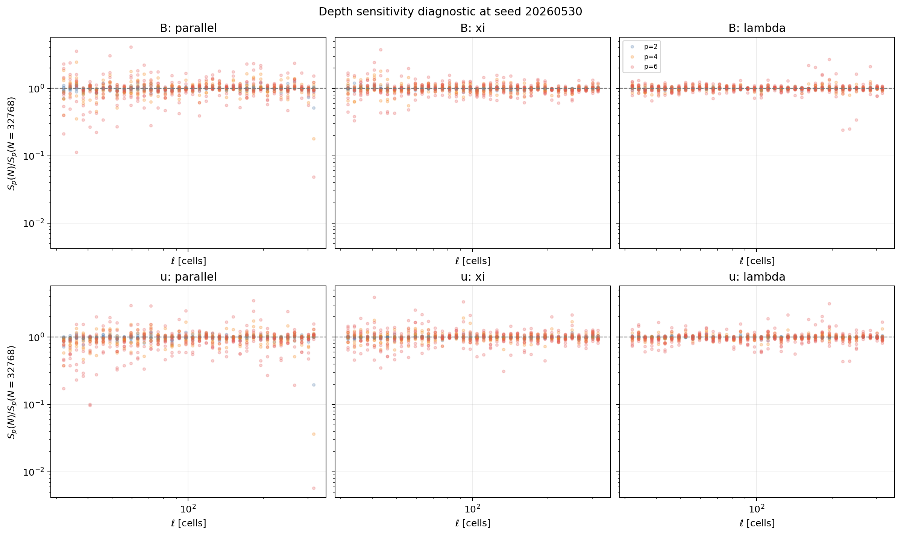

*Figure 2.1: Direct-intrinsic moments at shallower sample counts divided by
the corresponding $32768$-sample moments. Typical ratios remain near unity.
Sparse tails, especially at $p=6$, remain sensitive.*

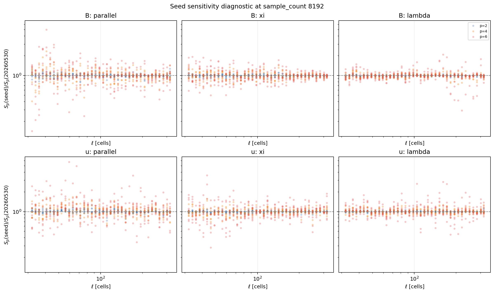

*Figure 2.2: Direct-intrinsic moments for alternate deterministic seeds
divided by the reference-seed moments at sample count $8192$. The median is
stable, while rare high-order deviations remain visible.*

The corrected tail diagnostic supports bounded acquisition and honest
caveats. It does not establish $p=6$ convergence.

The extreme shell-schedule factor of $28423967.34$ is a schedule-only
diagnostic row for `L640_sub00738 B/parallel` at $\ell=301$ cells and $p=6$.
Its direct-interior denominator count is only $2$, while the shell-schedule
numerator count is $4512$. It is a deliberately visible sparse-count warning,
not a physical correction factor or a converged science result.

### 2.5.5 Independent reviews

Independent read-only reviews checked:

- artifact integrity, completion markers, schedule bindings, and strict
  semantic shard decoding;
- scientific overclaim risk, weak-mean-field outliers, and residual
  confounding;
- variable conventions, including perpendicular increment labels and the
  meaning of stencil-local conditioning;
- performance evidence, storage, ledger accounting, wrapper email
  directives, and future wrapper requirements;
- the closeout report boundaries.

One independent audit recomputed SHA-256 values for $74$ artifacts across
eight retained Phase 4 figure packages and found zero mismatches.

## 2.6 Results

### 2.6.1 Robust conclusions

The following statements are supported directly by retained artifacts:

1. All $21$ selected $640^3$ cubes were extracted and validated.
2. The 2-point $p=2$ Batch A baseline is restartable and strictly verified.
3. The labeled 3-point $p=2$ comparison is complete for all $21$ cubes.
4. The labeled 5-point product remains bounded and available for
   representative comparison.
5. The all-21 2-point $p=1,\ldots,6$ Batch B matrix is complete and strictly
   verified.
6. Batch B reproduces Batch A exactly at $p=2$.
7. High-order origin-policy sensitivity is real and grows with $p$.
8. No fitted directional exponent is justified by the retained pilot.

### 2.6.2 Likely conclusions

The selected-sample evidence suggests:

- magnetic structure-function amplitudes vary meaningfully with the magnetic
  environment;
- `deltaB` often tracks magnetic amplitudes more directly than `dBB`;
- velocity trends are weaker and more vulnerable to residual confounding;
- support-policy sensitivity is influenced by finite-subvolume structure and
  rare increments, not only by the outermost shell geometry.

These are likely or suggestive statements, not universal laws.

### 2.6.3 Conditioning comparison

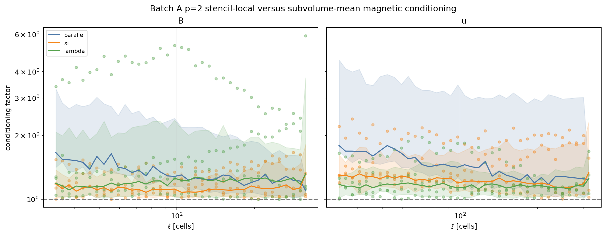

*Figure 2.3: Batch A $p=2$ stencil-local-to-subvolume-mean magnetic
conditioning factors. The conditioning choice can alter directional curves
by order-unity factors, especially in selected magnetic channels. This is a
robustness comparison, not a correction.*

### 2.6.4 Runtime and storage behavior

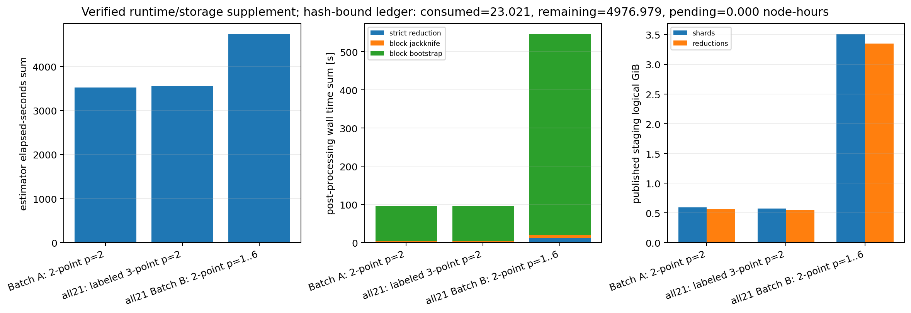

*Figure 2.4: Measured estimator, post-processing, and logical staging
summaries for the baseline, all-21 3-point comparison, and all-21 Batch B
matrix. The frozen figure uses the pre-publication zero-pending ledger
snapshot; the final settled workflow ledger is reported in Tier 3.*

The all-21 Batch B acquisition used about $2.474445$ node-hours before its
review job. The final retained Batch B release occupies about $7.06$ GiB of
allocated filesystem storage.

## 2.7 Failures and discarded approaches

| Failure or discarded approach | Resolution |
| --- | --- |
| interrupted first extraction | quarantined; never reused |
| first exploratory tail decomposition | discarded because population weighting changed the estimand |
| completion publication `3316101` | failed closed on historical all-21 3-point replay metadata |
| completion publication `3316108` | failed closed on legacy Batch A uncertainty metadata |
| completion publication `3316110` | intentionally cancelled during additional verifier hardening |
| completion publication `3316112` | hardened replay passed and published hash-bound, one-time-published v1 supplement |
| v1 zero-only log panel | preserved as an audit artifact; corrected by versioned v2 publication `3316114` |

The final closeout publisher validates historical omissions narrowly and
decodes retained shard semantics before publication. It does not overwrite
the earlier artifact packages.

## 2.8 Remaining risks

| Risk | Current treatment |
| --- | --- |
| high-order rare-event tails remain sensitive | do not call $p=6$ converged; stage any later use |
| selected $21$-cube sample is not an unbiased survey | report residual confounding and limited sample size |
| weak-mean-field `dBB` outliers can dominate ratio views | always show `B_mean`, `deltaB`, and magnetic complements |
| equal-SF crossing census is sparse | keep aspect ratios exploratory; withhold fitted anisotropy law |
| 5-point product is representative only | require separate decision before expansion |
| Batch C `rho0` convention is not frozen | keep Batch C deferred |
| retained roots are logically immutable, not permission-immutable | rely on one-time publication, overwrite refusal, and hashes |
| replay does not reread live primitive files | state retained-data replay scope explicitly |
| historical producer wrappers lack a universal pre-write `RUN_DIR` rejection | require explicit rejection in every new Phase 5 wrapper |
| quarantined dirty extraction still consumes storage | never reuse; delete only after a separate human cleanup decision |

## 2.9 Recommended next steps

Phase 4 supports presenting a bounded Phase 5 plan. It does not authorize
execution. The following preliminary ceilings are conservative planning
forecasts derived from the measured Phase 4 footprint and volume scaling.
They are not Phase 5 measurements:

| Priority | Proposed Phase 5 step | Scope | Node-hour cap | Temporary-storage ceiling | Decision rule |
| ---: | --- | --- | ---: | ---: | --- |
| 1 | $L_{\rm sub}=320$ smoke | six matched cubes, 2-point $p=2$, both policies, $64$ bins, $\ell_{\max}=160$ | $5$ | $12$ GiB | stop if provenance, support, uncertainty, or value degrades |
| 2 | $L_{\rm sub}=320$ baseline extension | add up to the selected $21$-cube scale-specific sample | $8$ additional | $32$ GiB cumulative | require smoke review and exact replay |
| 3 | staged higher orders | add 2-point $p=1,\ldots,6$ only where the baseline is informative | $10$ additional | $12$ GiB additional | inspect high-order tails before expansion |
| 4 | optional deeper work | $L_{\rm sub}=160$, shifted tilings, snapshots, 5-point expansion, or Batch C | not estimated here | not estimated here | separate proposal and approval |

The combined planning cap for the first three proposed stages is
$23$ node-hours. This is a proposal ceiling, not an authorization. Each stage
must be separately reviewed before launch. $L_{\rm sub}=1280$ remains
separately gated.

# Tier 3: Reproducibility, audit trail, and handoff

Phase 4 completed the bounded $L_{\rm sub}=640$ pilot from extraction through
the user-authorized all-21 2-point Batch B matrix. The exact $p=2$ Batch A to
Batch B replay gate passed for all $42$ cube-policy groups. The retained
$p=6$ tails remain support-policy and sampled-origin sensitivity diagnostics,
so fitted directional exponents remain withheld. Phase 5 is not authorized:
the next step is to present a separate bounded campaign plan for human review.

## 3.1 Repository state

The retained closeout package was generated and then added to the repository
at two distinct checkpoints:

```text
repository: /autofs/nccs-svm1_home2/dfielding/SFunctor
branch: cleanup/cpu-production
generator source checkpoint: 6c0ad16e03945b34632174912e47344a7a7da66d
repository retention checkpoint: 08252db3592a9f8bc0935f61d32f00c4588c1c48
```

The status-report commit is necessarily newer than the package checkpoint.
Use `git log -n 3 --oneline` and `git status --short` to inspect the final
documentation state after checkout.

Documentation added or modified at closeout:

| Path | Purpose |
| --- | --- |
| `PHASE4_STATUS_UPDATE.md` | this standalone report |
| `phase4.md` | completion checkpoint and Phase 5 boundary |
| `phase5.md` | explicit requirement to read the final Phase 4 report |

The frozen extraction order is:

```text
L640_sub00370
L640_sub02822
L640_sub03026
L640_sub02615
L640_sub03942
L640_sub00957
L640_sub03356
L640_sub01582
L640_sub00579
L640_sub00886
L640_sub00032
L640_sub02279
L640_sub01088
L640_sub02297
L640_sub00732
L640_sub02000
L640_sub02602
L640_sub02249
L640_sub00738
L640_sub01591
L640_sub01651
```

The retained repository deliverables span:

| Repository paths | Purpose |
| --- | --- |
| `scripts/phase4/` | guarded Phase 4 extraction, sampler, review, diagnostic, and closeout adapters |
| `job_scripts/phase4/` | Andes Slurm wrappers with logs under `logs/` and no email directives |
| `tests/*phase4*` | Phase 4 launch, wrapper, report, diagnostic, extension, and closeout regression tests |
| `config/phase4_*` | machine-readable staged decision artifacts |
| `PHASE4_*` Markdown checkpoints | human-readable staged decisions and status reports |
| `figures/phase4_*` | hash-bound review and closeout packages |

Final closeout package:

```text
figures/phase4_completion_supplement_v2/
```

The earlier package remains intentionally retained:

```text
figures/phase4_completion_supplement/
```

It is a valid hardened replay artifact with a presentation-only zero-panel
warning. Do not delete or overwrite it.

## 3.2 Commands and scripts

Environment used by Slurm wrappers:

```bash
module reset
module load gcc/9.3.0 python/.3.11-anaconda3
source /ccs/home/dfielding/SFunctor/venv_sfunctor/bin/activate
export PYTHONPATH=/ccs/home/dfielding/SFunctor:${PYTHONPATH:-}
export OMP_NUM_THREADS=1
export OPENBLAS_NUM_THREADS=1
export MKL_NUM_THREADS=1
```

Representative all-21 Batch B commands are routed through:

```text
job_scripts/phase4/run_phase4_batch_b_all21_extension_andes.sh
scripts/phase4/run_phase4_batch_b_all21_extension.py
```

The following operator-safe template supplies explicit hash-bound input roots,
a unique output root, and a unique `RUN_DIR` for each allocation. Historical
producer wrappers rely on the operator choosing those unique directories;
every new Phase 5 wrapper must reject an existing `RUN_DIR` before any write.

```bash
export PHASE2_ROOT=/lustre/orion/ast207/proj-shared/dfielding/Production_plm/phase4/extract_primary_20260531T140042Z
export BATCH_A_ROOT=/lustre/orion/ast207/proj-shared/dfielding/Production_plm/phase4/batch_a_2point_primary_20260531T154117Z
export REPRESENTATIVE_A2_ROOT=/lustre/orion/ast207/proj-shared/dfielding/Production_plm/phase4/batch_a2_stencils_representative_primary_20260601T151309Z
export ALL21_3POINT_EXTENSION_ROOT=/lustre/orion/ast207/proj-shared/dfielding/Production_plm/phase4/batch_a2_3point_all21_primary_20260601T153832Z
export REPRESENTATIVE_BATCH_B_ROOT=/lustre/orion/ast207/proj-shared/dfielding/Production_plm/phase4/batch_b_representative_primary_20260601T185131Z
export TAIL_DIAGNOSTIC_ROOT=/lustre/orion/ast207/proj-shared/dfielding/Production_plm/phase4/batch_b_tail_diagnostic_v2_primary_20260602T003701Z
export OUTPUT_ROOT=/lustre/orion/ast207/proj-shared/dfielding/Production_plm/phase4/batch_b_all21_extension_primary_20260602T005633Z

ACTION=plan      RUN_DIR=/lustre/orion/ast207/proj-shared/dfielding/Production_plm/phase4/runs/${UNIQUE_PLAN_RUN_DIR}      sbatch job_scripts/phase4/run_phase4_batch_b_all21_extension_andes.sh
ACTION=work      RUN_DIR=/lustre/orion/ast207/proj-shared/dfielding/Production_plm/phase4/runs/${UNIQUE_WORK_RUN_DIR}      sbatch -N 8 job_scripts/phase4/run_phase4_batch_b_all21_extension_andes.sh
ACTION=reduce    RUN_DIR=/lustre/orion/ast207/proj-shared/dfielding/Production_plm/phase4/runs/${UNIQUE_REDUCE_RUN_DIR}    sbatch job_scripts/phase4/run_phase4_batch_b_all21_extension_andes.sh
ACTION=verify    RUN_DIR=/lustre/orion/ast207/proj-shared/dfielding/Production_plm/phase4/runs/${UNIQUE_VERIFY_RUN_DIR}    sbatch job_scripts/phase4/run_phase4_batch_b_all21_extension_andes.sh
ACTION=summarize RUN_DIR=/lustre/orion/ast207/proj-shared/dfielding/Production_plm/phase4/runs/${UNIQUE_SUMMARIZE_RUN_DIR} sbatch job_scripts/phase4/run_phase4_batch_b_all21_extension_andes.sh
```

The final report-only publication used:

```bash
sbatch \
  --export=ALL,PHASE1_ROOT=/lustre/orion/ast207/proj-shared/dfielding/Production_plm/prompt1_catalog/t6_final_primary_20260530,EXTRACTION_ROOT=/lustre/orion/ast207/proj-shared/dfielding/Production_plm/phase4/extract_primary_20260531T140042Z,BATCH_A_ROOT=/lustre/orion/ast207/proj-shared/dfielding/Production_plm/phase4/batch_a_2point_primary_20260531T154117Z,ALL21_3POINT_EXTENSION_ROOT=/lustre/orion/ast207/proj-shared/dfielding/Production_plm/phase4/batch_a2_3point_all21_primary_20260601T153832Z,ALL21_BATCH_B_ROOT=/lustre/orion/ast207/proj-shared/dfielding/Production_plm/phase4/batch_b_all21_extension_primary_20260602T005633Z,LEDGER_SUMMARY=/lustre/orion/ast207/proj-shared/dfielding/Production_plm/phase4/ledger_snapshots/compute_budget_summary_before_completion_supplement_v2_20260602T024138Z.md,OUTPUT_DIR=/autofs/nccs-svm1_home2/dfielding/SFunctor/figures/phase4_completion_supplement_v2,RUN_DIR=/lustre/orion/ast207/proj-shared/dfielding/Production_plm/phase4/runs/report_completion_supplement_v2_20260602T024138Z \
  job_scripts/phase4/run_phase4_completion_supplement_andes.sh
```

Final local verification:

```bash
venv_sfunctor/bin/python -m pytest -q
```

## 3.3 Compute accounting

The final refreshed shared workflow ledger is:

| Metric | Node-hours |
| --- | ---: |
| workflow budget | $5000.000000$ |
| consumed allocated runtime | $23.147225$ |
| remaining budget | $4976.852775$ |
| pending maximum additional exposure | $0.000000$ |
| accounting-flagged records | $0$ |

Phase 4 alone accounts for:

| State | Records | Node-hours |
| --- | ---: | ---: |
| completed | $45$ | $16.768613$ |
| failed | $8$ | $0.433334$ |
| cancelled | $4$ | $0.283333$ |
| total | $57$ | $17.485280$ |

Key all-21 Batch B acquisition jobs:

| Stage | Slurm job | Nodes | Elapsed | Node-hours |
| --- | ---: | ---: | ---: | ---: |
| plan | `3316085` | $1$ | `00:03:09` | $0.052500$ |
| work | `3316086` | $8$ | `00:13:28` | $1.795556$ |
| reduce | `3316087` | $1$ | `00:23:09` | $0.385833$ |
| verify | `3316092` | $1$ | `00:07:09` | $0.119167$ |
| summarize | `3316097` | $1$ | `00:07:17` | $0.121389$ |
| **acquisition total** |  |  |  | **$2.474445$** |

Final supplement jobs:

| Job | Outcome | Elapsed | Slurm-step peak RSS |
| --- | --- | ---: | ---: |
| `3316112` | hash-bound, one-time-published hardened v1 package | `00:08:53` | about $11.34$ GiB |
| `3316114` | hash-bound, one-time-published versioned v2 package | `00:07:33` | about $11.27$ GiB |

The v2 package embeds the zero-pending ledger snapshot taken before its own
report-only allocation. The table above reports the later settled workflow
ledger after `3316114`.

## 3.4 Output inventory

| Output path | Description | Status | Allocated size | Needed later | Regenerable |
| --- | --- | --- | ---: | --- | --- |
| `/lustre/orion/ast207/proj-shared/dfielding/Production_plm/phase4/extract_primary_20260531T140042Z` | clean $21$-cube primitive extraction | retained | $161.24$ GiB | yes | expensive |
| `/lustre/orion/ast207/proj-shared/dfielding/Production_plm/phase4/batch_a_2point_primary_20260531T154117Z` | all-21 2-point $p=2$ baseline | retained | $1.545$ GiB | yes | yes, but reuse |
| `/lustre/orion/ast207/proj-shared/dfielding/Production_plm/phase4/batch_a2_stencils_representative_primary_20260601T151309Z` | representative 3-point and 5-point products | retained | $0.541$ GiB | yes | yes, but reuse |
| `/lustre/orion/ast207/proj-shared/dfielding/Production_plm/phase4/batch_a2_3point_all21_primary_20260601T153832Z` | all-21 labeled 3-point product | retained | $1.515$ GiB | yes | yes, but reuse |
| `/lustre/orion/ast207/proj-shared/dfielding/Production_plm/phase4/batch_b_representative_primary_20260601T185131Z` | representative higher-order probe | retained | $2.584$ GiB | yes | yes, but reuse |
| `/lustre/orion/ast207/proj-shared/dfielding/Production_plm/phase4/batch_b_tail_diagnostic_v2_primary_20260602T003701Z` | corrected matched-origin tail diagnostic | retained | $0.456$ GiB | yes | yes, but reuse |
| `/lustre/orion/ast207/proj-shared/dfielding/Production_plm/phase4/batch_b_all21_extension_primary_20260602T005633Z` | all-21 2-point $p=1,\ldots,6$ matrix | retained | $7.058$ GiB | yes | yes, but reuse |
| `figures/phase4_completion_supplement_v2/` | final closeout package | retained | about $25$ MiB | yes | yes |
| `/lustre/orion/ast207/proj-shared/dfielding/Production_plm/phase4/extract_rejected_dirty_interrupted_20260531T134640Z` | interrupted extraction quarantine | never reuse | $46.06$ GiB | no | no |
| `/lustre/orion/ast207/proj-shared/dfielding/Production_plm/phase4/batch_b_tail_diagnostic_primary_20260602T002906Z` | discarded exploratory tail diagnostic | audit only | about $4.4$ MiB | audit only | no need |

The complete Phase 4 tree currently occupies about $221.03$ GiB. The reusable
tree excluding quarantine and the discarded first tail diagnostic occupies
about $174.97$ GiB.

## 3.5 Known issues

1. $p=6$ tails remain imperfect. Proceed only with staged higher-order
   interpretation and explicit tail review.
2. The $21$-cube pilot is selected, not statistically representative.
3. Weak-mean-field cubes require denominator-aware interpretation.
4. Equal-SF aspect-ratio rows are sparse: only $2/80$ pass the strict gate.
5. The 5-point product is representative only.
6. Batch C remains deferred because its scientific value and `rho0`
   convention are not frozen.
7. Historical Phase 4 producer wrappers use action locks but do not all reject
   an existing `RUN_DIR` before any write. Every new Phase 5 wrapper must do
   so explicitly.
8. Hash-bound publication and overwrite refusal provide logical immutability;
   filesystem permissions do not enforce immutable storage.
9. The quarantined interrupted extraction must not be reused.

## 3.6 Continuation instructions

A future agent should:

1. Read `phase0.md`, `phase2.md`, `phase3.md`, `phase3a.md`, `phase4.md`,
   this report, and `phase5.md`.
2. Reuse all retained Phase 4 outputs. Do not rerun the clean extraction or
   the all-21 matrices merely to redraw figures.
3. Treat `figures/phase4_completion_supplement_v2/` as the final closeout
   figure package. Preserve the earlier v1 package as an audit artifact.
4. Keep SGS-derived and dynamo-derivative channels excluded.
5. Keep 2-point, 3-point, and 5-point products explicitly labeled.
6. Begin any approved Phase 5 campaign with the smallest useful 2-point
   $p=2$ smoke product and exact replay validation.
7. Inspect finite support, accepted and excluded counts, effective blocks,
   block uncertainty, and high-order tails before expanding.
8. Require an explicit bounded plan and human approval before submitting any
   Phase 5 production job.
9. Require a separate human decision before 5-point expansion, Batch C work,
   or $L_{\rm sub}=1280$ extraction.
10. Register every nontrivial Andes allocation before submission, keep Slurm
    logs under `logs/`, and do not add email notification directives.

# Appendix A: Figure index

| Figure | Purpose |
| --- | --- |
| `figures/phase4_batch_a_status/phase4_batch_a_workflow_schematic.png` | workflow overview schematic |
| `figures/phase4_batch_a_status/phase4_batch_a_representative_extraction_slice_montage.png` | representative primitive-density slices |
| `figures/phase4_batch_b_all21_review/phase4_batch_b_all21_order_retention_diagnostic.png` | support-mask census by order |
| `figures/phase4_batch_b_all21_review/phase4_batch_b_all21_p6_policy_sensitivity_diagnostic.png` | all-21 $p=6$ policy ratios |
| `figures/phase4_completion_supplement_v2/phase4_completion_labeled_3point_vs_2point.png` | labeled stencil comparison |
| `figures/phase4_completion_supplement_v2/phase4_completion_batch_b_order_sensitivity_vs_magnetic_census.png` | order sensitivity versus environment |
| `figures/phase4_completion_supplement_v2/phase4_completion_rooted_sf_environment.png` | rooted amplitudes versus environment |
| `figures/phase4_completion_supplement_v2/phase4_completion_equal_sf_inverse_scale_aspect_ratio.png` | sparse exploratory equal-SF rows |
| `figures/phase4_batch_b_tail_diagnostic_review/phase4_batch_b_tail_diagnostic_depth_sensitivity.png` | tail sample-depth diagnostic |
| `figures/phase4_batch_b_tail_diagnostic_review/phase4_batch_b_tail_diagnostic_seed_sensitivity.png` | tail deterministic-seed diagnostic |
| `figures/phase4_completion_supplement_v2/phase4_completion_pair_local_vs_subvolume_mean_conditioning.png` | conditioning robustness comparison |
| `figures/phase4_completion_supplement_v2/phase4_completion_runtime_storage_supplement.png` | runtime and storage summary |

# Appendix B: Final package identity

```text
package: figures/phase4_completion_supplement_v2/
summary SHA-256: 80a8ed7d0eb0c27d0e0871b7acb550ba1c5941044688bf320f28152083609c38
manifest SHA-256: b2093e759dc6ab3b19069a07676e4abd39e605b69e74d392e7f882704a52ce32
manifest-bound artifacts: 20
manifest-bound figures: 6
hash mismatches: 0
```

The v2 package differs from v1 only where expected: generator-bound metadata,
the frozen ledger snapshot and runtime rendering, the completion summary
bindings, and the corrected zero-valued environmental panel. Scientific CSV
and JSON tables are unchanged.
