# Project status update: Phase 5 cross-scale lineage campaign

| Field | Value |
|---|---|
| Date | 2026-06-03 EDT |
| Project | `SFunctor` / Phase 5 cross-scale finite-domain structure functions |
| Repository | `/autofs/nccs-svm1_home2/dfielding/SFunctor` |
| Branch | `cleanup/cpu-production` |
| Acquisition config commit | `7c86d20be1f9dcc0952e6f43652406edc66e4c91` |
| Final report-code commit before closeout | `4481fa3` |
| Frozen campaign-config SHA-256 | `e6dd8e0b9249a43b05425ae7dabdb452133f8fdd99c3fdf40765d47a81157712` |
| Agent | Codex |
| Simulation analyzed | `Turb_10240_beta25_dedt025_plm`, nonrelativistic MHD snapshot at $t=6.0$, cycle `799945` |
| Compute environment | Andes CPU partition `batch`, account `AST207`, QoS `normal` |
| Retained Phase 5 root | `/lustre/orion/ast207/proj-shared/dfielding/Production_plm/phase5_cross_scale_20260602` |
| Final Git-retained figure package | `figures/phase5_status_update_v5/` |
| Full immutable report archive | `/lustre/orion/ast207/proj-shared/dfielding/Production_plm/phase5_cross_scale_20260602/report/phase5_status_update_v5_20260603T153717Z` |
| Final report Slurm allocation | `3317998`, completed `0:0` in `00:06:57` |
| Final cumulative workflow ledger | `28.387218` node-hours consumed; `4971.612782` node-hours remaining; zero pending exposure |
| Status | **Phase 5 bounded acquisition and operational validation complete. The retained results support a lineage-conditioned cross-scale diagnostic assessment, not a population-level cross-scale law or fitted-exponent claim.** |

This report is layered. Tier 0 gives the collaborator-level story. Tier 1
explains the analysis and interpretation. Tier 2 records the expert methods,
validation, failures, and limitations. Tier 3 is the reproducibility and
continuation handoff.

# Tier 0: What happened and why it matters

Phase 5 asked whether the Phase 4 $L_{\rm sub}=640$ finite-domain structure
function results persist when the environmental averaging cube becomes
smaller. The practical question is not whether one can make more plots. It is
whether the same physical regions continue to look similar when environment,
finite support, and spatial uncertainty are all measured at
$L_{\rm sub}=320$, $160$, and $80$ cells.

The campaign is complete at the bounded scope that was actually run. It
materialized selected primitive cubes at $L_{\rm sub}=320$, $160$, and $80$,
reused the retained $L_{\rm sub}=640$ Phase 4 baseline, and published
two-point magnetic and velocity structure functions with explicit
non-periodic support accounting. It also retained exploratory higher-order,
matched-control, 3-point, and bounded 5-point products.

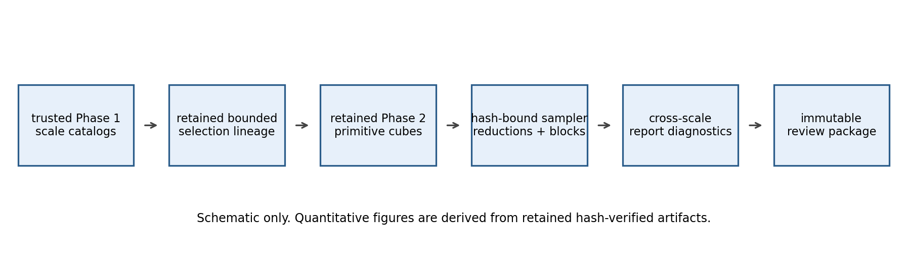

*Figure 0.1: Schematic of the retained Phase 5 workflow. Trusted Phase 1
catalogs lead to explicit descendant selections, extracted primitive cubes,
hash-bound sampler reductions, and an immutable review package. The figure is
a schematic; the quantitative figures below come from retained artifacts.*

The most important limitation is also the most important interpretation
result: this is a lineage study, not a fresh population census at every scale.
The main $L_{\rm sub}=320$ sample contains descendants rooted in the frozen
$L_{\rm sub}=640$ pilot. The $L_{\rm sub}=160$ and $80$ smoke samples trace
six recursively selected lineages chosen to remain close in `dBB` to their
parents where possible. That design is useful for asking whether known
regions persist or break down. It cannot prove a population-level scale law.

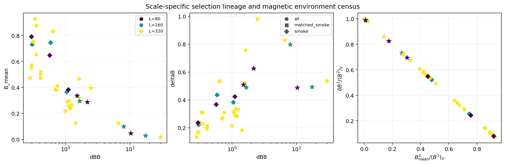

*Figure 0.2: Scale-specific magnetic environments for the retained selections.
Colors mark $L_{\rm sub}$ and marker shapes mark distinct cohorts. Notice that
`dBB`, `B_mean`, `deltaB`, and the bounded magnetic complements are presented
together. This matters because an extreme `dBB` value can be driven by a
small denominator rather than an unusually large fluctuation amplitude.*

The primary retained Phase 5 diagnostic release is the 21-region
`L320_lineage_all_baseline` product. Its support-gate census is:
`8062/8064` all-valid curve bins and `7736/8064` shell-local curve bins pass
the retained curve-support gate. For supported bins, the all-valid versus
shell-local policy factor has median `1.0862`, 95th percentile `1.4139`, and
maximum `2.7836`. The curves are retained as a finite-domain diagnostic
cohort, with explicit tail masking and policy sensitivity retained.

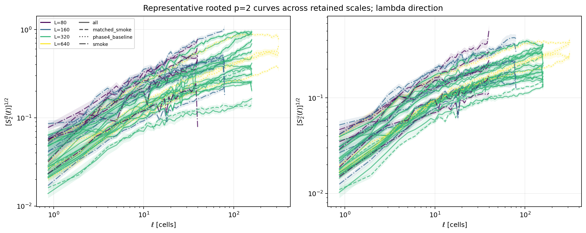

*Figure 0.3: Representative rooted two-point $p=2$ magnetic and velocity
curves across the retained scales. Color marks environmental scale and line
style marks cohort. The curves populate a wide dynamic range, but their
differences remain conditional on the selected lineages and support masks.*

Finite support remains a real scientific caution rather than a bookkeeping
detail. Every extracted cube is non-periodic. The primary
`all_valid_origins` estimator uses every in-domain origin available to each
offset. The `shell_local` overlay forces the offsets in a shell to use one
common in-domain region. Their difference diagnoses the interaction between
boundaries and spatial inhomogeneity; it is not a correction factor.

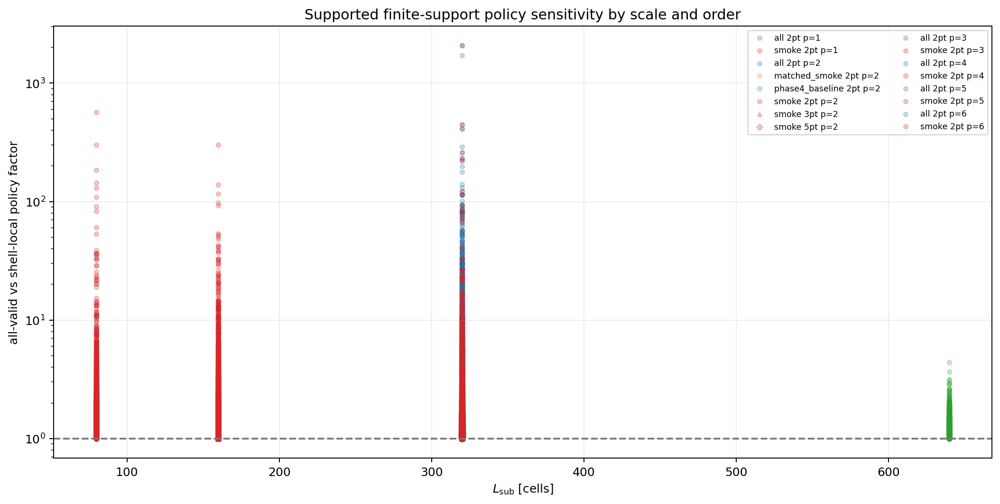

*Figure 0.4: Supported all-valid versus shell-local policy factors across
scale and structure-function order. Most primary two-point values remain
moderate, while tails grow substantially for some exploratory high-order and
wider-stencil products. This is why those products remain diagnostics rather
than promoted science claims. Stencil width is explicit in the legend so the
bounded 3-point and 5-point tails remain distinguishable from the 2-point
baseline.*

The high-order and wider-stencil products are informative but not
interchangeable with the primary baseline. The supported median
3-point-to-2-point ratio is `0.7105` at $L_{\rm sub}=320$ and `0.7124` at
$L_{\rm sub}=160$, with broad tails. The bounded $L_{\rm sub}=320$ 5-point
product reaches a maximum supported shell-policy factor of `26.639`. The
3-point and 5-point filters should remain visibly labeled comparisons, not
higher-accuracy replacements for the 2-point statistic.

The illustrated visually extreme `dBB` trajectory is substantially
denominator-driven. For the weak-mean-field lineage rooted at
`L640_sub00738`, the $L_{\rm sub}=320$ descendant has
`dBB=6.6381`, `B_mean=0.1250`, and `deltaB=0.8295`; the
$L_{\rm sub}=80$ descendant has `dBB=2.1737`, `B_mean=0.2880`, and
`deltaB=0.6261`. Interpreting `dBB` alone as fluctuation amplitude would be
misleading.

The campaign executed a bounded scope, although its pre-launch
machine-readable approval artifact was not retained. It consumed a small
fraction of the available workflow budget, preserved zero pending exposure at
closeout, and left no sampler locks, recovery claims, temporary files, or
incomplete-output residue under the retained Phase 5 root beyond the
intentional verified shard `partial.npz` files. The full immutable report
package binds `3585` input hashes and validates all `28` generated artifacts.

The sensible next step is not an automatic scale expansion. Before spending
more compute, decide which scientific question matters most:

1. build a balanced $L_{\rm sub}=320$ environmental census if population
   statements are required;
2. run shifted tilings if tiling sensitivity is the priority;
3. add snapshots if temporal variation is the priority;
4. keep $L_{\rm sub}=1280$ extraction deferred until its distinct cost and
   value are approved.

# Tier 1: How the analysis works

## 1.1 Objective and scope

Phase 5 extends the validated Phase 3a and Phase 4 finite-domain sampler to a
bounded cross-scale campaign. It keeps three quantities distinct:

$$
L_{\rm sub},
\qquad
\ell,
\qquad
p.
$$

Here $L_{\rm sub}$ is the environmental cube size, $\ell$ is the
point-separation scale inside that cube, and $p$ is the structure-function
order.

The executed environmental scales are:

| Environmental scale | Executed role | Unique selected cubes | Interpretation |
|---|---|---:|---|
| $L_{\rm sub}=640$ | Retained Phase 4 baseline | `21` | Validated parent baseline |
| $L_{\rm sub}=320$ | Main descendant cohort | `21` | Primary Phase 5 lineage-persistence diagnostic |
| $L_{\rm sub}=320$ | Matched observational controls | `6` | Separately labeled low/high contrast |
| $L_{\rm sub}=160$ | Descendant smoke | `6` | Exploratory lineage diagnostic |
| $L_{\rm sub}=80$ | Descendant smoke | `6` | Narrow-window resolution diagnostic |
| $L_{\rm sub}=1280$ | Deferred | `0` | Requires separate approval |

The complete Phase 5 report binds `45` cohort-scoped selected records and
`102` release-matrix cube bindings across `12` Phase 5 sampler releases.
Here a selected record is unique in `(L_sub, selection_set, cube_id)`, not
necessarily an independent physical observation: cohorts deliberately reuse
some physical cubes. The retained Phase 4 baseline is loaded as a thirteenth
report source.

## 1.2 Environmental definitions

For one environmental cube volume $V$, define

$$
\delta B
=
\sqrt{
\left\langle
\left|
\mathbf{B}
-
\left\langle
\mathbf{B}
\right\rangle_V
\right|^2
\right\rangle_V
},
$$

$$
B_{\rm mean}
=
\left|
\left\langle
\mathbf{B}
\right\rangle_V
\right|,
\qquad
B_{\rm rms}
=
\sqrt{
\left\langle
\left|
\mathbf{B}
\right|^2
\right\rangle_V
},
$$

and

$$
\mathrm{dBB}
=
\frac{\delta B}{B_{\rm mean}}.
$$

Phase 5 always reports two bounded magnetic complements beside `dBB`:

$$
f_{\rm mean}
=
\frac{B_{\rm mean}^2}{\left\langle B^2\right\rangle_V},
\qquad
f_{\rm fluct}
=
\frac{\delta B^2}{\left\langle B^2\right\rangle_V}.
$$

Up to roundoff,

$$
f_{\rm mean}+f_{\rm fluct}=1.
$$

These complements make the numerator-versus-denominator interpretation
visible. Large `dBB` can mean large fluctuations, weak mean field, or both.

## 1.3 Structure functions and stencils

For field $q$, order $p$, and displacement $\mathbf{r}$ with
$\ell=|\mathbf{r}|$, the sampler evaluates moments of explicitly labeled
increments:

$$
S_{p,s}^q(\ell,d)
=
\left\langle
\left|
\delta_s q(\mathbf{x},\mathbf{r})
\right|^p
\right\rangle_{\mathcal{A}_{s,\ell,d}},
$$

where $s$ labels the stencil, $d$ labels the directional wedge, and
$\mathcal{A}_{s,\ell,d}$ is the accepted non-periodic sampled set.

The retained normalized increments are:

$$
\delta_2 q
=
q(\mathbf{x}+\mathbf{r})-q(\mathbf{x}),
$$

$$
\delta_3 q
=
\frac{
q(\mathbf{x}+\mathbf{r})-2q(\mathbf{x})+q(\mathbf{x}-\mathbf{r})
}{
\sqrt{3}
},
$$

$$
\delta_5 q
=
\frac{
q(\mathbf{x}-2\mathbf{r})-4q(\mathbf{x}-\mathbf{r})+6q(\mathbf{x})
-4q(\mathbf{x}+\mathbf{r})+q(\mathbf{x}+2\mathbf{r})
}{
\sqrt{35}
}.
$$

The wider filters are distinct statistics. They are not silently merged with
the 2-point baseline.

## 1.4 Scale-specific sampling design

Every Phase 5 product measures `B` and `u`, uses `2048` sampled origins per
displacement, assigns blocks by stencil midpoint, runs `200` bootstrap
replicates, and retains both `all_valid_origins` and `shell_local` support
policies.

| Product class | $L_{\rm sub}$ | Stencil | $\ell_{\max}$ | Separation bins | Block shape |
|---|---:|---:|---:|---:|---|
| Main baseline | `320` | 2-point | `160` | `64` | `(40,40,40)` |
| Main orders | `320` | 2-point | `160` | `64` | `(40,40,40)` |
| Smoke baseline | `160` | 2-point | `80` | `48` | `(20,20,20)` |
| Smoke orders | `160` | 2-point | `80` | `48` | `(20,20,20)` |
| Smoke baseline | `80` | 2-point | `40` | `32` | `(10,10,10)` |
| Smoke orders | `80` | 2-point | `40` | `32` | `(10,10,10)` |
| Bounded stencil comparison | `320` | 3-point | `80` | `64` | `(40,40,40)` |
| Bounded stencil comparison | `160` | 3-point | `40` | `40` | `(20,20,20)` |
| Bounded stencil comparison | `320` | 5-point | `40` | `40` | `(40,40,40)` |

Baseline products use $p=2$. Order matrices use $p=1,2,3,4,5,6$. The 3-point
and 5-point comparisons remain $p=2$ only.

## 1.5 Selection strategy

The $L_{\rm sub}=320$ lineage cohort descends from the frozen
$L_{\rm sub}=640$ Phase 1 pilot. Smaller-scale smoke selections recurse
through the catalog and choose a magnetic-valid child minimizing the
child-parent absolute `dBB` difference, with an explicit tie-break on child
subvolume ID.

This is a persistence-oriented design. It intentionally follows known
physical lineages. It does not sample independent environmental populations
at each scale.

The separately labeled `L320_matched_smoke_baseline` cohort contains three
low and three high observational controls. It is useful for contrast. It
does not prove covariate balance or remove scale-environment confounding. Its
six IDs are distinct within the named control set, but `L320_sub17363` also
appears in the nearest-lineage cohort. The controls are not six additional
independent observations.

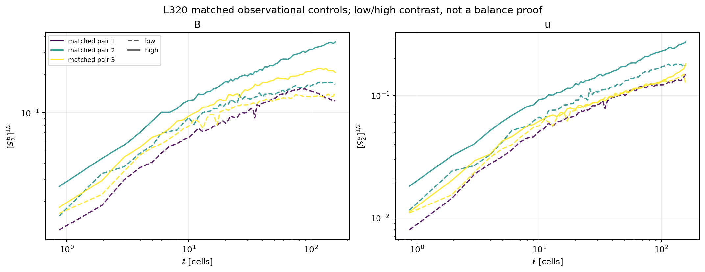

*Figure 1.1: Three separately labeled low/high observational-control pairs at
$L_{\rm sub}=320$. Color marks matched pair and line style marks low or high
role. The figure is a bounded contrast, not evidence that the pairs remove
all covariate imbalance.*

## 1.6 Non-periodic support and uncertainty

Extracted cubes cannot wrap. For every stencil and offset, all required
sample points must remain inside the cube.

| Support policy | Definition | Use |
|---|---|---|
| `all_valid_origins` | Use each offset's complete in-domain valid-origin box | Primary estimator |
| `shell_local` | Intersect valid-origin boxes for every offset in one shell | Robustness overlay with common shell support |

The shell-local eligible fraction is

$$
f_{\rm support}(\ell)
=
\frac{
N_{\rm eligible}(\ell)
}{
N_{\rm candidate}(\ell)
}.
$$

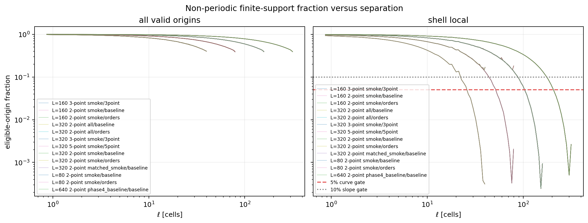

*Figure 1.2: Eligible-origin fractions versus separation for the retained
support policies. Shell-local support falls sharply in outer shells,
especially for small cubes. Outer-shell values exist numerically but should
not be promoted without their support masks.*

Spatial blocks make uncertainty sensitive to independent spatial support,
not merely raw pair count. The Kish effective-block count is

$$
N_{\rm eff}
=
\frac{
\left(\sum_b n_b\right)^2
}{
\sum_b n_b^2
},
$$

where $n_b$ is the accepted sample count assigned to block $b$.

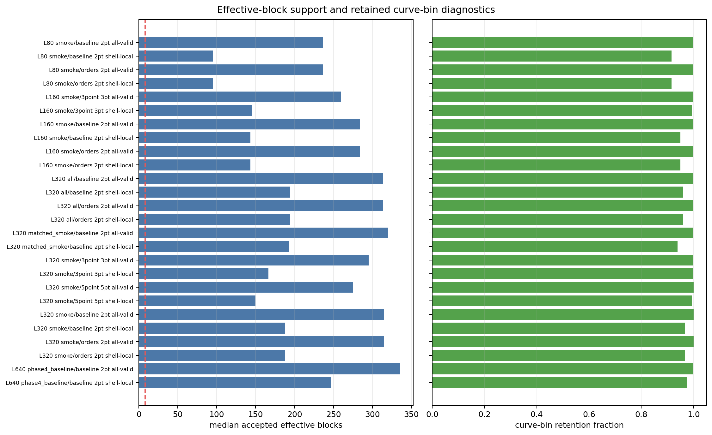

*Figure 1.3: Median effective-block support and retained curve-bin fractions
for the supplied matrices. The figure connects nominal sampling depth to the
number of spatial regions actually contributing to the diagnostic.*

Local slopes are centered-window diagnostics with block-bootstrap intervals.
They are not fitted inertial-range exponents.

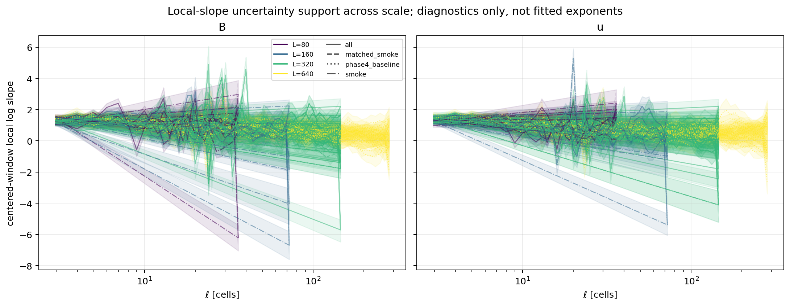

*Figure 1.4: Centered-window local slopes with bootstrap bands for magnetic
and velocity diagnostics. Color marks $L_{\rm sub}$ and line style marks
cohort. The wide and irregular bands in some regions are the reason no fitted
exponent claim is made.*

## 1.7 Main results

The primary `L320_lineage_all_baseline` release has:

| Diagnostic | Value |
|---|---:|
| Unique cubes | `21` |
| Verified shards | `168` |
| Verified reductions | `42` |
| `all_valid_origins` curve bins passing support gate | `8062/8064` |
| `shell_local` curve bins passing support gate | `7736/8064` |
| Supported policy-factor median | `1.0862` |
| Supported policy-factor 95th percentile | `1.4139` |
| Supported policy-factor maximum | `2.7836` |

The bounded stencil comparison gives:

| Comparison | Supported rows | Median ratio | Minimum | Maximum |
|---|---:|---:|---:|---:|
| $L_{\rm sub}=320$, 3-point / 2-point | `2302` | `0.7105` | `0.00676` | `4.8972` |
| $L_{\rm sub}=160$, 3-point / 2-point | `1438` | `0.7124` | `0.00763` | `2.8297` |

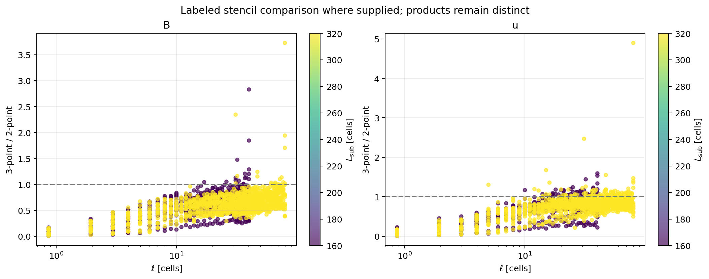

*Figure 1.5: Supported 3-point-to-2-point ratios where both products exist.
The ratio is not one, and the tails are broad. For the retained supported
rows, this shows that the stencils behave as distinct filters rather than
interchangeable implementations.*

The outlier panel makes the denominator issue concrete.

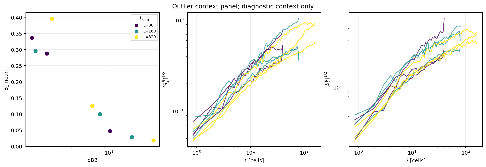

*Figure 1.6: Outlier contexts with corresponding magnetic and velocity curves.
Color marks $L_{\rm sub}$; the companion CSV and JSON tables retain cube IDs
and roles. This is diagnostic context, not a population-level outlier model.*

## 1.8 What is robust and what remains open

Robust conclusions:

- The bounded acquisition completed and published restartable retained
  products.
- The non-periodic 3-D sampler works for the acquired bounded matrices at
  $L_{\rm sub}=320$, $160$, and $80$.
- The $L_{\rm sub}=320$ 21-region descendant baseline is a usable
  lineage-persistence diagnostic with explicit support masking.
- `dBB` interpretation must remain joint with `B_mean`, `deltaB`, `B_rms`,
  and the bounded complements.
- 2-point, 3-point, and 5-point products are distinct labeled statistics.

Likely conclusions:

- Some extreme `dBB` behavior is substantially denominator-driven.
- Finite-domain sensitivity grows in outer shells and can become severe for
  wider stencils or high-order tails.
- $L_{\rm sub}=80$ is useful mainly as a breakdown diagnostic rather than a
  general scaling-law scale.

Suggestive trends:

- The representative rooted curves change visibly across retained
  environmental scales, but the lineage-conditioned design prevents a
  population-level scale-law interpretation.
- The separately labeled matched low/high controls show useful contrast, but
  a dedicated covariate-balance analysis would be required before attributing
  that contrast to `dBB` alone.
- Some outer-scale local-slope structure may be physical, but current
  shell-local support loss makes it inappropriate to promote that structure
  to fitted exponents.

Open questions:

- Would a balanced $L_{\rm sub}=320$ census tell the same story as the
  descendant cohort?
- How sensitive are conclusions to shifted tilings?
- How much time variation appears across additional snapshots?
- Is a separately approved $L_{\rm sub}=1280$ extraction worth its cost?

# Tier 2: Detailed methods, implementation, and validation

## 2.1 Problem definition

The scientific task was to test persistence of the validated Phase 4
$L_{\rm sub}=640$ diagnostics under selected changes in environmental scale.
The software task was to build a source-bound cross-scale extractor, reuse the
validated parallel finite-domain sampler, and publish an immutable report
package.

The intentionally deferred scope is:

- $L_{\rm sub}=1280$ extraction;
- shifted tilings;
- additional snapshots;
- SGS-derived channels;
- dynamo-derivative channels;
- all-21 3-point expansion;
- all-21 5-point expansion;
- fitted exponent claims.

The user explicitly directed the work to continue through non-catastrophic
uncertainty and preferred bounded acquisition now over stopping for avoidable
reruns. Because some staged science-review gates were intentionally bypassed,
this report distinguishes operationally verified acquisition from accepted
scientific interpretation.

One procedural audit gap remains: the active conversation contained the
human launch directive, but a machine-readable bounded-plan approval artifact
was not retained before submission. The closeout decision record honestly
records this fact. This report does not retroactively claim that the
pre-launch approval artifact existed.

## 2.2 Data model and assumptions

The trusted snapshot identity is:

| Item | Value |
|---|---|
| Data root | `/lustre/orion/ast207/proj-shared/dfielding/Production_plm/data/data_Turb_10240_beta25_dedt025_plm` |
| Full primitive basename | `Turb.full_mhd_w_bcc.00024.bin` |
| Supported primary `cbin` basename | `Turb.mhd_u_bcc.00024.cbin` |
| Full grid | $10240^3$ |
| Primitive fields | `dens velx vely velz eint bcc1 bcc2 bcc3` |
| Analysis fields | `B u` |
| Snapshot time | `6.0` |
| Snapshot cycle | `799945` |
| Array order | KJI: `array[k,j,i] = field[x3,x2,x1]` |
| Extracted-cube periodicity | Non-periodic; no wrapping permitted |

Only trusted Phase 1 primary-only catalogs are used. Broken `mhd_sgs` and
`mhd_dynamo_ks` products remain excluded.

The frozen Phase 5 campaign config is:

```text
config/phase5_cross_scale_campaign.json
SHA-256 e6dd8e0b9249a43b05425ae7dabdb452133f8fdd99c3fdf40765d47a81157712
```

The closeout decision record is:

```text
config/phase5_execution_decision.json
```

That record was retained during closeout after the human launch directive. It
is an honest machine-readable record of the acquired bounded matrix, not a
claim that the artifact existed before submission.

## 2.3 Mathematical definitions

Environmental definitions and stencil increments are given in Tier 1. For a
stencil $s$, offset $\mathbf{r}$, field $q$, directional bin $d$, and order
$p$, the measured estimator is

$$
S_{p,s}^q(\ell,d)
=
\frac{
\sum_{(\mathbf{x},\mathbf{r})\in\mathcal{A}_{s,\ell,d}}
\left|\delta_s q(\mathbf{x},\mathbf{r})\right|^p
}{
\left|\mathcal{A}_{s,\ell,d}\right|
}.
$$

Measured quantities:

- sampled moments and accepted counts;
- eligible and candidate origins;
- accepted contributing and effective blocks;
- bootstrap intervals;
- local centered-window slopes;
- catalog `B_mean`, `deltaB`, `B_rms`, `dBB`, and bounded complements.

Derived diagnostic quantities:

- `all_valid_origins / shell_local` policy factors;
- 3-point / 2-point ratios where both labeled products are supported;
- scale-specific lineage trajectories.

Not reconstructed or not claimed:

- fitted inertial-range exponents;
- population-level scale laws;
- tiling robustness;
- temporal generalization;
- validated SGS or dynamo-derived quantities.

## 2.4 Algorithm and implementation

The Phase 5 code path is:

| Path | Responsibility |
|---|---|
| `scripts/phase5/build_phase5_campaign_config.py` | Freeze and verify trusted cross-scale catalog selections |
| `scripts/phase5/run_phase5_extraction.py` | Plan, materialize, verify, and inspect selected primitive cubes |
| `scripts/phase5/run_phase5_sampler.py` | Adapt Phase 3a plan, work, reduce, verify, and summarize stages to Phase 5 |
| `scripts/phase5/generate_phase5_status_figures.py` | Rehash retained artifact graph and publish report tables and figures atomically |
| `job_scripts/phase5/run_phase5_extract_andes.sh` | Andes extraction allocation wrapper |
| `job_scripts/phase5/run_phase5_sampler_andes.sh` | Andes sampler allocation wrapper |
| `job_scripts/phase5/run_phase5_report_andes.sh` | Andes immutable-report wrapper |

The extraction adapter is intentionally closed to $L_{\rm sub}=320$, $160$,
and $80$. It retains $L_{\rm sub}=640$ only as ancestry metadata and rejects
new $L_{\rm sub}=640$ materialization through this Phase 5 path. It rejects
$L_{\rm sub}=1280$ because that scale still requires separate approval.

The sampler adapter requires exact policy keys and requires
`sgs_channels_authorized` to be false. This fail-closed behavior was tightened
after acquisition so future reruns cannot silently widen scope.

Every heavy wrapper:

- runs only on Andes CPU Slurm allocations;
- writes scheduler stdout and stderr under `logs/`;
- rejects an existing `RUN_DIR` before writes;
- uses a unique output directory;
- archives Slurm resource records;
- registers nontrivial allocations in the shared compute ledger.

The sampler retains deterministic displacement manifests and splits work into
restartable displacement shards. Reduction refuses mixed manifests, hashes,
stencils, seeds, support modes, and block layouts.

## 2.5 Validation

### Repository and config validation

| Test | Method | Result |
|---|---|---|
| Full repository regression suite | `venv_sfunctor/bin/python -m pytest -q` | `557 passed`, one pre-existing Phase 4 plotting warning |
| Focused Phase 5 suite after report fix | `pytest -q tests/test_phase5_report.py tests/test_phase5_extraction.py tests/test_phase5_sampler.py` | `47 passed` |
| Frozen config verification | `build_phase5_campaign_config.py verify` against trusted Phase 1 root | Passed; config SHA-256 unchanged |
| Shell syntax | `bash -n job_scripts/phase5/*.sh` | Passed |
| Python syntax | `python -m py_compile scripts/phase5/*.py` | Passed |
| Diff whitespace | `git diff --check` | Passed after compact-package staging |
| Forbidden active Phase 5 references | Search wrappers and config for mail directives, `mhd_sgs`, and `mhd_dynamo_ks` | No active wrapper or config use found |

### Artifact validation

| Test | Method | Result |
|---|---|---|
| Extraction completion | Verify published cube completion markers | Passed for all extracted sets |
| Sampler completion | Verify `PHASE5_SAMPLER_COMPLETE.json` for each release | Passed for `12/12` Phase 5 releases |
| Shard graph | Rehash retained partials and completion markers | Passed for `696` Phase 5 shards |
| Reduction graph | Rehash result, uncertainty, manifest, and completion records | Passed for `204` Phase 5 reductions |
| Report input graph | Rehash report-bound retained inputs | Passed for `3585` bindings |
| Generated report artifacts | Rehash generated files against report manifest | Passed for `28/28` artifacts |
| Residual temporary state | Scan Phase 5 root for lock, recovery-claim, temporary, and incomplete-output residue | No residual residue found; verified shard `partial.npz` files are intentional retained products |
| Queue settlement | Inspect user Slurm queue at closeout | No queued or running jobs after final report settlement |

### Independent reviews

Independent subagents reviewed:

| Review | Main finding | Reconciled action |
|---|---|---|
| Campaign design | The $L_{\rm sub}=320$ all-lineage cohort is a descendant persistence cohort, not a balanced census | Narrowed claims throughout this report |
| Compute budget | No missing registrations or accounting flags; Slurm step `MaxRSS` can be fork-inclusive and inflated | Do not claim physical RAM headroom from step `MaxRSS` |
| Cross-scale interpretation | Smaller-scale selection is persistence-oriented; `dBB` outliers can be denominator-driven; high-order tails remain exploratory | Report joint magnetic quantities and preserve diagnostic labels |
| Final review | V5 passes final closeout audit: exact archive closure, `28/28` generated hashes, `3585/3585` independently rehashed inputs, LF-only CSVs, resolved figure attribution/readability, settled accounting, and no residual temporary state; archive immutability is publisher-guarded and hash-detectable rather than filesystem WORM. | Commit the staged compact v5 package and close Phase 5 without automatically expanding deferred work. |

## 2.6 Results

### Release inventory

| Release | $L_{\rm sub}$ | Cohort | Matrix | Cubes | Verified shards | Allocated release size |
|---|---:|---|---|---:|---:|---:|
| `L160_lineage_smoke_3point` | 160 | `smoke` | `3point` | 6 | 24 | 0.220 GiB |
| `L160_lineage_smoke_baseline` | 160 | `smoke` | `baseline` | 6 | 36 | 0.284 GiB |
| `L160_lineage_smoke_orders` | 160 | `smoke` | `orders` | 6 | 36 | 1.358 GiB |
| `L320_lineage_all_baseline` | 320 | `all` | `baseline` | 21 | 168 | 1.383 GiB |
| `L320_lineage_all_orders` | 320 | `all` | `orders` | 21 | 168 | 6.703 GiB |
| `L320_lineage_smoke_3point` | 320 | `smoke` | `3point` | 6 | 48 | 0.385 GiB |
| `L320_lineage_smoke_5point` | 320 | `smoke` | `5point` | 6 | 24 | 0.224 GiB |
| `L320_lineage_smoke_baseline` | 320 | `smoke` | `baseline` | 6 | 48 | 0.244 GiB |
| `L320_lineage_smoke_orders` | 320 | `smoke` | `orders` | 6 | 48 | 1.891 GiB |
| `L320_matched_smoke_baseline` | 320 | `matched_smoke` | `baseline` | 6 | 48 | 0.437 GiB |
| `L80_lineage_smoke_baseline` | 80 | `smoke` | `baseline` | 6 | 24 | 0.187 GiB |
| `L80_lineage_smoke_orders` | 80 | `smoke` | `orders` | 6 | 24 | 0.828 GiB |

The Phase 5 releases total `696` verified shards and `204` verified
reductions. The report also revalidates the retained Phase 4 baseline as a
comparison source, bringing the displayed report totals to `864` shards and
`246` reductions.

### Scale and regime interpretation

The configured smaller-scale cohorts are biased toward persistence by design.
Relative to the full Phase 1 catalog quintile bands, the independent
interpretation review found:

| Scale and cohort | Low | Median band | Intermediate | High |
|---|---:|---:|---:|---:|
| $L_{\rm sub}=640$ retained parents | 7 | 4 | 0 | 10 |
| $L_{\rm sub}=320$ lineage descendants | 0 | 0 | 11 | 10 |
| $L_{\rm sub}=160$ lineage smoke | 0 | 0 | 2 | 4 |
| $L_{\rm sub}=80$ lineage smoke | 0 | 1 | 0 | 5 |
| $L_{\rm sub}=320$ matched controls | 3 | 0 | 0 | 3 |

This does not invalidate the data. It bounds the claim: these are
lineage-conditioned diagnostics.

### Finite-support sensitivity

The baseline support-gate census is:

| Release | `all_valid_origins` passing bins | `shell_local` passing bins |
|---|---:|---:|
| `L320_lineage_all_baseline` | `8062/8064` | `7736/8064` |
| `L320_lineage_smoke_baseline` | `2304/2304` | `2231/2304` |
| `L160_lineage_smoke_baseline` | `1726/1728` | `1640/1728` |
| `L80_lineage_smoke_baseline` | `1150/1152` | `1055/1152` |

The smallest shell-local eligible fractions reach:

| Scale | Minimum shell-local eligible fraction |
|---|---:|
| $L_{\rm sub}=320$ | `0.0002444` |
| $L_{\rm sub}=160$ | `0.0003281` |
| $L_{\rm sub}=80$ | `0.0003125` |

Outer shells can therefore exist numerically while retaining very little
common support. Support masks and policy overlays remain mandatory.

### Runtime and storage

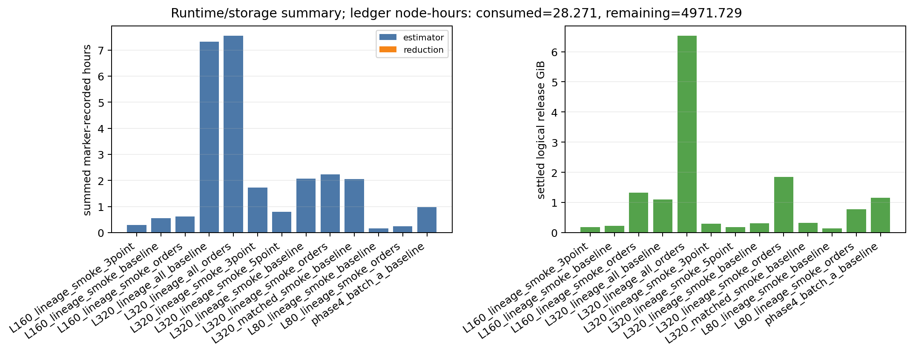

*Figure 2.1: Marker-recorded sampler time and settled logical release size.
These are release diagnostics. The title reports the bound pre-report
allocation ledger snapshot; scheduler node-hours after report settlement are
reported separately in Tier 3.*

At the first settled report snapshot, the retained Phase 5 root used about
`48G` of allocated storage excluding report archives. The final compact Git
package uses `8.9M` allocated storage and excludes the six largest row-level
CSV and JSON tables; full immutable packages are retained under the Phase 5
Lustre report directory.

## 2.7 Failures and discarded approaches

### Report normalization failure

The first report allocation, Slurm job `3317285`, failed before publication.
The report normalizer recursively discovered both complete catalog selection
records and lightweight `selected_parent_link` references. A parent link then
overwrote a full record with the same cube ID and lacked an `environment`
object.

The fix in commit `71ab03e` restricts recursive selection discovery to
catalog-backed rows containing `catalog_magnetic_values`. A regression test
covers nested parent links. The retry, Slurm job `3317388`, completed and
published the first immutable package.

### Report readability and publication refinement

Visual inspection of that valid package found oversized legends obscuring
three technical figures. Commit `c282034` deduplicates outlier bindings and
uses compact scale/cohort legends. Commit `d430476` writes CSV products with
LF-only line endings so the compact Git subset passes whitespace checks.

The superseded `v3` publication, Slurm job `3317916`, then failed when a new
full report package exhausted the home-directory quota. This was a packaging
location problem, not a sampler or science-data failure. The archived earlier
packages remained intact on Lustre. The superseded `v4` publication writes its full
immutable package directly under the Lustre report directory, retains only a
compact Git subset locally, adds the matched-control comparison, and lays out
the effective-block diagnostic horizontally. Commit `56095b2` contains those
last two figure refinements.

The first direct-to-Lustre `v4` submission, Slurm job `3317939`, failed in four
seconds because its wrapper referenced the wrong timestamped ledger snapshot.
The corrected submission uses one fresh timestamp consistently for its run
directory, ledger snapshot, and immutable archive. This was a submission
wiring error and did not read or alter sampler products. Its pre-registered
ledger row points to the empty retained run directory
`20260603T151751Z_phase5_cross_scale_report_v4`, while its actual Slurm logs
live in `20260603T152025Z_phase5_cross_scale_report_v4`.

The corrected direct-to-Lustre `v4` publication, Slurm job `3317947`, is a
technically sound audit artifact. Its independent review found three remaining
presentation ambiguities: combined policy-factor points did not expose stencil
width, the workflow schematic said `approved` despite the documented
pre-launch approval-artifact gap, and the outlier figure title overstated its
plot-level labels. Commit `4481fa3` corrects those labels. The final `v5`
publication regenerates the same quantitative package with that clearer
presentation.

### Intentionally discarded expansions

The campaign did not launch $L_{\rm sub}=1280$, shifted tilings, additional
snapshots, excluded SGS channels, dynamo-derived channels, or all-21
wider-stencil matrices. Those extensions remain unresolved, not failed.

## 2.8 Remaining risks

| Risk | Consequence | Current treatment |
|---|---|---|
| Pre-launch machine-readable bounded-plan approval was not retained | The strict procedural gate is not fully auditable from repository artifacts | Preserve the honest closeout record and require retained approval evidence before future submission |
| Descendant selection favors `dBB` persistence | Scale and environment remain partly confounded | Restrict claims to selected lineages |
| $L_{\rm sub}=320$ cohort is not balanced | Population-level trends are unsupported | Treat as persistence diagnostic |
| High-order tail stability is not established | $p=3$ through $6$ exponents could be misleading | Retain as exploratory reductions only |
| Shell-local support collapses in outer shells | Outer-scale turnover can be boundary-sensitive | Preserve masks and policy overlays |
| 3-point and 5-point filters differ materially from 2-point | Stencil invariance is unsupported | Keep labels and bounded scope |
| Matched controls do not prove covariate balance | Residual confounding remains | Describe as observational contrasts |
| Slurm step `MaxRSS` can be fork-inclusive | Physical memory headroom is uncertain | Require cgroup or node-level measurement before increasing concurrency |
| Shifted tilings and additional snapshots were not run | Tiling and time sensitivity remain unknown | Defer claims and require separate decisions |

## 2.9 Recommended next steps

1. Treat the current Phase 5 package as the retained lineage-conditioned
   diagnostic baseline.
2. Decide whether the next scientific priority is a balanced
   $L_{\rm sub}=320$ census, shifted tilings, or additional snapshots.
3. If high-order claims are desired, design a separate tail-convergence
   review before fitting exponents.
4. Keep 5-point products bounded until their finite-support sensitivity has a
   specific scientific use.
5. Keep $L_{\rm sub}=1280$ deferred until a separate costed plan is approved.

# Tier 3: Reproducibility, audit trail, and handoff

## 3.1 Repository state

Repository path:

```text
/autofs/nccs-svm1_home2/dfielding/SFunctor
```

Branch:

```text
cleanup/cpu-production
```

Relevant Phase 5 commits:

| Commit | Purpose |
|---|---|
| `84b94b8` | Add Phase 5 cross-scale campaign adapters |
| `7c86d20` | Freeze Phase 5 cross-scale campaign config |
| `22600de` | Harden report allocation directory creation |
| `00f28bf` | Bind report to retained execution decision |
| `5818950` | Tighten future extraction and sampler policy |
| `71ab03e` | Fix report selection normalization and add regression test |
| `c282034` | Improve report figure readability |
| `d430476` | Publish report CSV tables with LF-only line endings |
| `56095b2` | Add matched-control diagnostic and improve effective-block layout |
| `4481fa3` | Clarify diagnostic figure attribution and retained-scope wording |
| Closeout commit containing this document | Retain final Phase 5 status report and compact figure package; inspect with `git log --max-count=1 --oneline` |

The full row-level report package is archived under Lustre. Git retains the
Markdown report, readable figures, compact tables, summary JSON, snapshots,
and hash manifest. Six large row-level CSV and JSON files remain intentionally
ignored in Git because their complete copies live in the immutable Lustre
archive and can be regenerated from the retained release graph.

Here `immutable` means that the publisher refuses a nonempty target directory
and the retained hash manifest makes mutation detectable. The Lustre archive
is not a filesystem WORM store.

## 3.2 Commands and scripts

Environment:

```bash
cd /ccs/home/dfielding/SFunctor
module reset
module load gcc/9.3.0 python/.3.11-anaconda3
source venv_sfunctor/bin/activate
export PYTHONPATH=/ccs/home/dfielding/SFunctor:${PYTHONPATH:-}
```

Verify the frozen campaign config:

```bash
TRUSTED_RUN=/lustre/orion/ast207/proj-shared/dfielding/Production_plm/prompt1_catalog/t6_final_primary_20260530
venv_sfunctor/bin/python scripts/phase5/build_phase5_campaign_config.py verify \
  --trusted-run "${TRUSTED_RUN}" \
  --output config/phase5_cross_scale_campaign.json
```

Representative extraction wrapper invocation:

```bash
export CAMPAIGN_CONFIG=/ccs/home/dfielding/SFunctor/config/phase5_cross_scale_campaign.json
export OUTPUT_ROOT=/lustre/orion/ast207/proj-shared/dfielding/Production_plm/phase5_cross_scale_20260602/extraction/L320_all_lineage
export RUN_DIR=/lustre/orion/ast207/proj-shared/dfielding/Production_plm/phase5_cross_scale_20260602/runs/<unique-run-dir>
export ACTION=verify
export SCALE=320
export SUBSET=all
sbatch job_scripts/phase5/run_phase5_extract_andes.sh
```

Representative sampler wrapper invocation:

```bash
export CAMPAIGN_CONFIG=/ccs/home/dfielding/SFunctor/config/phase5_cross_scale_campaign.json
export SCALE=320
export SELECTION_SET=all
export MATRIX=baseline
export PHASE2_ROOT=/lustre/orion/ast207/proj-shared/dfielding/Production_plm/phase5_cross_scale_20260602/extraction/L320_all_lineage
export OUTPUT_ROOT=/lustre/orion/ast207/proj-shared/dfielding/Production_plm/phase5_cross_scale_20260602/sampler/L320_all_lineage_baseline
export RUN_DIR=/lustre/orion/ast207/proj-shared/dfielding/Production_plm/phase5_cross_scale_20260602/runs/<unique-run-dir>
export ACTION=verify
sbatch job_scripts/phase5/run_phase5_sampler_andes.sh
```

Local verification:

```bash
venv_sfunctor/bin/python -m pytest -q
bash -n job_scripts/phase5/*.sh
venv_sfunctor/bin/python -m py_compile scripts/phase5/*.py
git diff --check
```

## 3.3 Compute accounting

The shared ledger is:

```text
/lustre/orion/ast207/proj-shared/dfielding/Production_plm/prompt1_catalog/compute_ledger.csv
```

Final accounting:

| Metric | Value |
|---|---:|
| Workflow budget | `5000` node-hours |
| Final consumed allocated runtime | `28.387218` node-hours |
| Remaining budget | `4971.612782` node-hours |
| Pending maximum additional exposure | `0` node-hours |
| Phase 5 consumed allocated runtime | `5.239993` node-hours |
| Tracked ledger records | `210` |
| Phase 5 ledger rows | `87` |
| Accounting-flagged records | `0` |

The retained `36.0` node-hour planning number was a forecast, not an enforced
submission cap. The exact peak queued exposure was observed during live audit
but was not retained as a source-bound snapshot, so this report does not quote
it as a durable metric. Actual settled consumption remained small. The accounting
audit found no missing registrations, cancellations, OOM records, or nonzero
exit codes among the sampler acquisitions. The report-only publication
failures are documented above and were rerun safely.

The report-allocation lineage is:

| Job | State | Runtime | Node-hours |
|---|---|---:|---:|
| `3317285` initial report | `FAILED 1:0` | `534 s` | `0.148333` |
| `3317388` report retry | `COMPLETED 0:0` | `905 s` | `0.251389` |
| `3317880` report `v2` | `COMPLETED 0:0` | `535 s` | `0.148611` |
| `3317916` superseded report `v3` | `FAILED 1:0` | `474 s` | `0.131667` |
| `3317939` first direct-to-Lustre `v4` submission | `FAILED 1:0` | `4 s` | `0.001111` |
| `3317947` superseded direct-to-Lustre `v4` publication | `COMPLETED 0:0` | `514 s` | `0.142778` |
| `3317998` final direct-to-Lustre `v5` publication | `COMPLETED 0:0` | `417 s` | `0.115833` |

The ledger audit found `88` physical Phase 5 run directories for `87` ledger
rows because failed job `3317939` left the split empty-directory/log-directory
pair described above. All `87/87` ledger rows are accounted, but failed job
`3317939` is the exception to one-to-one ledger/log-directory mapping: its
actual logs live under the extra unregistered run directory. PSV coverage is
`84/87`: manual `sbatch --wrap` report jobs `3317939`, `3317947`, and
`3317998` bypassed the standard wrapper trap, but all three are retained in
`sacct` and the shared ledger.

## 3.4 Output inventory

| Output path | Description | Status | Required for continuation | Regenerable |
|---|---|---|---|---|
| `config/phase5_cross_scale_campaign.json` | Frozen selection config | Retained | Yes | Rebuildable from trusted Phase 1 root, but do not replace in place |
| `config/phase5_execution_decision.json` | Closeout scope record | Retained | Yes | Should remain immutable |
| `.../phase5_cross_scale_20260602/extraction/L320_all_lineage` | 21 main descendant cubes | Complete | Yes | Yes, expensive |
| `.../extraction/L320_smoke_lineage` | 6 $L_{\rm sub}=320$ smoke cubes | Complete | Useful | Yes |
| `.../extraction/L320_matched_smoke` | 6 matched-control cubes | Complete | Useful | Yes |
| `.../extraction/L160_smoke_lineage` | 6 $L_{\rm sub}=160$ smoke cubes | Complete | Useful | Yes |
| `.../extraction/L80_smoke_lineage` | 6 $L_{\rm sub}=80$ smoke cubes | Complete | Diagnostic | Yes |
| `.../sampler/` | 12 retained Phase 5 sampler releases | Complete | Yes | Yes, reuse before rerun |
| `figures/phase5_status_update_v5/` | Git-retained compact final report package | Complete | Yes | Yes |
| `/lustre/orion/ast207/proj-shared/dfielding/Production_plm/phase5_cross_scale_20260602/report/phase5_status_update_v5_20260603T153717Z` | Full immutable row-level report package | Complete | Yes for audit | Yes |

The retained Phase 5 root occupies `48G` allocated storage (`47G` apparent)
when report archives are excluded. The final full report package occupies
`557M` allocated storage (`549M` apparent). The Git subset occupies `8.9M`
allocated storage and intentionally omits the six largest row-level tables.

## 3.5 Known issues

- The first report allocation `3317285` failed on the fixed nested-parent
  normalization bug.
- The superseded report allocation `3317916` failed after exhausting the home
  quota while writing a full local package. Final publication writes the full
  package directly to Lustre.
- The first direct-to-Lustre submission `3317939` failed because its wrapper
  referenced the wrong timestamped ledger snapshot. The corrected wrapper
  used one fresh timestamp consistently.
- Manual `sbatch --wrap` report jobs `3317939`, `3317947`, and `3317998` do
  not have the PSV archives written by the standard wrapper trap. Their
  `sacct` and ledger records remain authoritative.
- The final report package records a planning forecast of `36.0` node-hours;
  this is not an enforcement cap.
- `sacct` step `MaxRSS` values can be fork-inclusive and should not be
  interpreted as physical node-memory high-water marks.
- Smaller-scale selection is lineage-conditioned and persistence-oriented.
- Pre-launch bounded-plan approval is recorded only by the honest post-hoc
  closeout decision record; future campaigns must retain approval evidence
  before submission.
- The high-order matrix is acquired but not accepted as exponent evidence.
- `L80` is a narrow-window diagnostic.
- Shifted tilings, extra snapshots, and $L_{\rm sub}=1280$ remain deferred.
- SGS and dynamo-derived channels remain prohibited.

## 3.6 Continuation instructions

Read first:

```text
phase0.md
phase5.md
PHASE5_STATUS_UPDATE.md
config/phase5_cross_scale_campaign.json
config/phase5_execution_decision.json
figures/phase5_status_update_v5/phase5_cross_scale_report_summary.json
figures/phase5_status_update_v5/phase5_hash_manifest.json
```

Reuse before rerunning:

```text
/lustre/orion/ast207/proj-shared/dfielding/Production_plm/phase5_cross_scale_20260602/extraction
/lustre/orion/ast207/proj-shared/dfielding/Production_plm/phase5_cross_scale_20260602/sampler
```

Do not rerun or expand automatically:

- $L_{\rm sub}=1280$ extraction;
- shifted tilings;
- additional snapshots;
- all-21 3-point or 5-point matrices;
- SGS-derived or dynamo-derived channels;
- in-place regeneration of trusted catalogs.

Before any new heavy campaign:

1. define the scientific question narrowly;
2. choose whether the design is lineage-conditioned or population-balanced;
3. forecast incremental storage and node-hours;
4. retain explicit human approval of the bounded plan and maximum node-hour
   exposure before submission;
5. register every allocation;
6. require unique `RUN_DIR` and output paths;
7. retain non-periodic support masks and block uncertainty;
8. inspect a smoke product before expansion.

# Appendix A: Figure index

| Figure | Purpose |
|---|---|
| `phase5_workflow_schematic.png` | Schematic pipeline overview |
| `phase5_scale_selection_lineage_environment_census.png` | Scale-specific magnetic environment census |
| `phase5_representative_p2_rooted_sf_curves.png` | Representative two-point $p=2$ curves |
| `phase5_support_fraction_vs_ell.png` | Non-periodic support versus separation |
| `phase5_effective_block_retention_diagnostics.png` | Effective-block and retained-bin diagnostics |
| `phase5_policy_factor_by_scale_order.png` | Finite-support policy factors |
| `phase5_local_slope_uncertainty_across_scale.png` | Local-slope uncertainty diagnostics |
| `phase5_2point_vs_3point_comparison.png` | Labeled stencil comparison |
| `phase5_runtime_storage_summary.png` | Runtime and release-storage summary |
| `phase5_outlier_panel.png` | Outlier diagnostic context |
| `phase5_matched_control_low_high_comparison.png` | Matched low/high observational-control contrast |

# Appendix B: Generated package files

The final package generator is:

```text
scripts/phase5/generate_phase5_status_figures.py
```

The compact Git-retained package includes:

```text
README.md
phase5_2point_vs_3point_comparison.csv
phase5_2point_vs_3point_comparison.json
phase5_2point_vs_3point_comparison.png
phase5_compute_ledger_summary_snapshot.md
phase5_cross_scale_report_summary.json
phase5_effective_block_retention_diagnostics.png
phase5_execution_decision_snapshot.json
phase5_hash_manifest.json
phase5_local_slope_uncertainty_across_scale.png
phase5_matched_control_low_high_comparison.png
phase5_outlier_panel.csv
phase5_outlier_panel.json
phase5_outlier_panel.png
phase5_policy_factor_by_scale_order.png
phase5_representative_p2_rooted_sf_curves.png
phase5_runtime_storage_summary.csv
phase5_runtime_storage_summary.json
phase5_runtime_storage_summary.png
phase5_scale_selection_lineage_environment_census.csv
phase5_scale_selection_lineage_environment_census.json
phase5_scale_selection_lineage_environment_census.png
phase5_support_fraction_vs_ell.png
phase5_workflow_schematic.png
```

The full Lustre archive additionally includes the large row-level diagnostics:

```text
phase5_all_valid_vs_shell_local_policy_factor.csv
phase5_all_valid_vs_shell_local_policy_factor.json
phase5_local_slope_uncertainty_across_scale.csv
phase5_local_slope_uncertainty_across_scale.json
phase5_shell_support_effective_block_diagnostics.csv
phase5_shell_support_effective_block_diagnostics.json
```
