# Project status update: Validated primary-only magnetic-environment census and extraction pilot

| Field | Value |
|---|---|
| Date | 2026-05-30 |
| Project | `SFunctor` / Prompt 1 environmental census |
| Repository | `git@github.com:dfielding14/SFunctor.git` |
| Branch | `cleanup/cpu-production` |
| Implementation commit | `58a3606c33082892e0b4ab4ebf1b45979e4f9b8b` |
| Agent | Codex |
| Simulation analyzed | `Turb_10240_beta25_dedt025_plm`, nonrelativistic MHD snapshot at $t=6.0$, cycle `799945` |
| Compute environment | Andes CPU partition `batch`, allocation `AST207`, QoS `normal`, one node per Prompt 1 job |
| Status | **Census complete; extraction pilot proposed:** the domain-wide primary-only census is validated and second-pass verified; full-resolution extraction has not yet been run. |

This document is intentionally layered. Tier 0 is the short colleague-level
story. Tier 1 explains the workflow and the main results. Tier 2 gives the
expert methods and validation record. Tier 3 is the reproducibility and
handoff guide.

# Tier 0: What happened and why it matters

The goal was to turn one very large turbulent MHD snapshot into a reliable map
of magnetic environments before spending substantial compute on
full-resolution structure functions. The central environmental quantity is

$$
\mathrm{dBB}
=
\frac{\delta B}{B_{\rm mean}},
$$

which compares magnetic fluctuations inside a subvolume with that
subvolume's mean magnetic-field strength. Large $\mathrm{dBB}$ can arise
because fluctuations are genuinely strong, because the local mean field is
weak through cancellation, or through both effects.

Here $B_{\rm mean}=|\langle\mathbf{B}\rangle_V|$ is the magnitude of the
vector-averaged field, while $\delta B$ is the RMS amplitude of fluctuations
around that vector average.

The completed work builds a domain-wide census from trusted coarsened binary
(`cbin`) primary-moment products only. It validates those products directly
against full-resolution primitive data, assembles a strict streamed cache,
builds exactly tiled catalogs at
$L_{\rm sub}/\Delta x = 80, 160, 320, 640, 1280$, runs a structured
second-pass verification of the resulting outputs, and proposes a candidate
21-region extraction pilot.

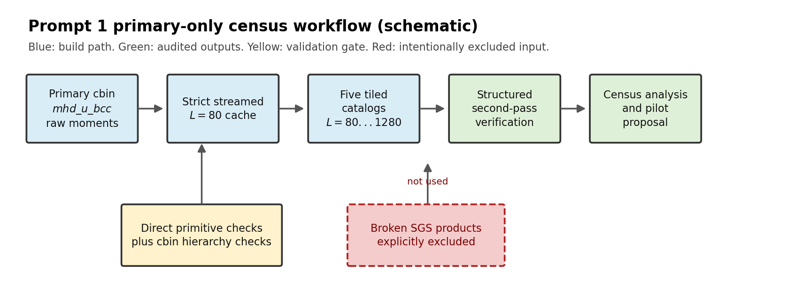

*Figure 0.1: Schematic of the completed Prompt 1 workflow. The reader should
notice the explicit validation gate before catalog construction and the
intentional exclusion of broken SGS-derived products. This matters because
the final scientific census is based only on reconstructable primary
moments.*

One important correction happened during the work. An earlier path used
`mhd_sgs` products that the user identified as broken in a separate
data-quality finding. Those products were removed from the workflow, the
in-flight hardened job was cancelled, the trusted catalogs were rebuilt from
the primary `mhd_u_bcc` moments only, and the superseded artifact directories
were deleted after audit. This reduced the set of available physical
diagnostics, but it made the retained results defensible. The current report
does not claim an independent root-cause diagnosis of the SGS failure.

The census is visibly nonuniform. Even on the displayed $L_{\rm sub}=80$
catalog layer, $\mathrm{dBB}$ varies strongly across the domain, with visually
coherent low- and high-$\mathrm{dBB}$ regions.

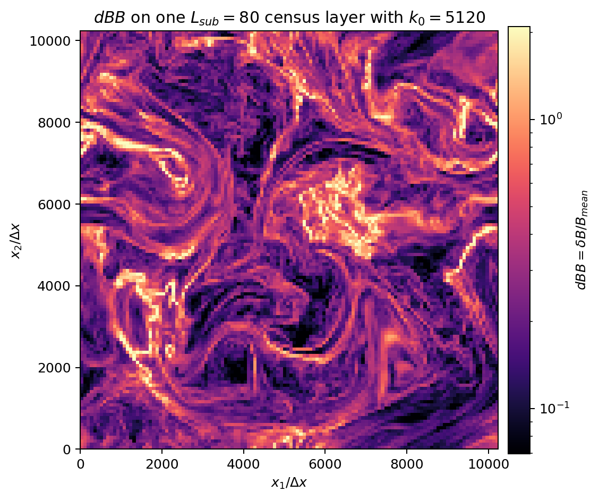

*Figure 0.2: Actual $\mathrm{dBB}$ values in the $L_{\rm sub}=80$ catalog
layer whose lower $x_3$ cell edge is `5120`. Bright regions have larger
fluctuation-to-mean ratios. The visible spatial organization motivates
selecting representative and outlier regions rather than extracting
arbitrary cubes.*

The main quantitative result is that the typical $\mathrm{dBB}$ increases
steadily with averaging scale. The median rises from about `0.25` at
$L_{\rm sub}=80$ to `0.99` at $L_{\rm sub}=1280$, a factor of about `3.91`.
The upper tail also shifts upward. The ratio increase does not, by itself,
show whether numerator growth, mean-field cancellation, or both drive the
trend.

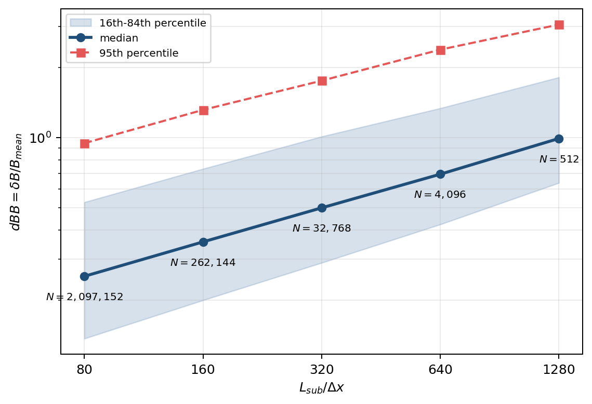

*Figure 0.3: Measured $\mathrm{dBB}$ quantiles at all five census scales.
The median and upper tail both rise with $L_{\rm sub}$. The labels show how
the number of non-overlapping subvolumes decreases as the cubes become
larger.*

At the proposed pilot scale, $L_{\rm sub}=640$, high $\mathrm{dBB}$ is
associated with both smaller $B_{\rm mean}$ and larger $\delta B$. The
domain-wide Spearman rank correlations are about `-0.86` for $\mathrm{dBB}$
versus $B_{\rm mean}$ and `0.70` for $\mathrm{dBB}$ versus $\delta B$.
These are descriptive associations for this snapshot and exact tiling. They
are not a causal decomposition, and their persistence across snapshots,
simulation parameters, or shifted tilings remains untested.

The census is broader than those headline magnetic plots. It also retains
density moments, conserved-momentum moments, total-energy moments, exact
coarse mass-weighted mean velocity components, magnetic energy, and two
explicitly labeled Alfvén-speed-like proxies. Density and conserved-momentum
diagnostics were used in the pilot matching. They are not substitutes for the
primitive velocity dispersion and Mach numbers that the trusted schema cannot
reconstruct.

Confidence is high that the retained catalogs are internally consistent and
faithful to the trusted primary `cbin` schema for this snapshot. Sampled
direct reconstruction checks passed `603 / 603` comparisons, the cache
covered all `65,536` expected source files with zero holes and overlaps,
second-pass verification passed at all five scales, and the repository test
suite passed `164` tests. The primitive comparisons are targeted checks, not
an exhaustive readback of every fine cell.

The main limitation is scientific rather than procedural: the trusted
primary products store conserved momenta, not primitive velocity moments.
They cannot reconstruct velocity dispersion, Mach numbers, kinetic
partitions, pressure, mixed velocity-magnetic statistics, or off-diagonal
covariances. Those quantities must remain unavailable until a separately
validated source exists.

The next sensible step is to implement and validate a selected-cube 3-D
extractor, because the existing production path extracts 2-D slices. After
that gate passes, run a cold-read benchmark for four proposed
$L_{\rm sub}=640$ regions: one low case, one near-median case, one high case,
and one weak-mean-field outlier. That benchmark should measure end-to-end
wall time, peak memory, output size, and the projected resource cost for all
21 regions before launching any full structure-function campaign.

# Tier 1: How the analysis works

## 1.1 Objective and scope

The immediate scientific objective was to characterize how the magnetic
environment varies across a $10240^3$ turbulent MHD domain and how that
environment changes with subvolume size. The practical objective was to make
the later structure-function stage selective: identify a small number of
well-characterized cubes before reading large full-resolution volumes.

The completed Prompt 1 scope is:

1. inspect and validate the available `cbin` products;
2. determine which quantities are reconstructable without hidden
   approximations;
3. build non-overlapping environmental catalogs at five exact scales;
4. quantify $\mathrm{dBB}$ distributions, correlations, and cross-scale
   persistence;
5. propose a candidate full-resolution extraction pilot;
6. leave structure-function extraction and calculation for the next stage.

The work intentionally does **not** claim a completed structure-function
analysis.

## 1.2 Data products

The full domain is periodic and contains $10240^3$ fine cells. Full-resolution
rank files are partitioned into `65,536` shards on a `64 x 32 x 32` logical
rank lattice. Each shard owns a `160 x 320 x 320` fine-cell block.

The trusted primary `cbin` product is `mhd_u_bcc`. For each scalar field

```text
dens mom1 mom2 mom3 ener bcc1 bcc2 bcc3
```

the files store first through fourth raw moments. That gives `32` float32
arrays. Here `mom1..3` are conserved momentum components and `ener` is total
MHD energy. They are not primitive velocities or pressure.

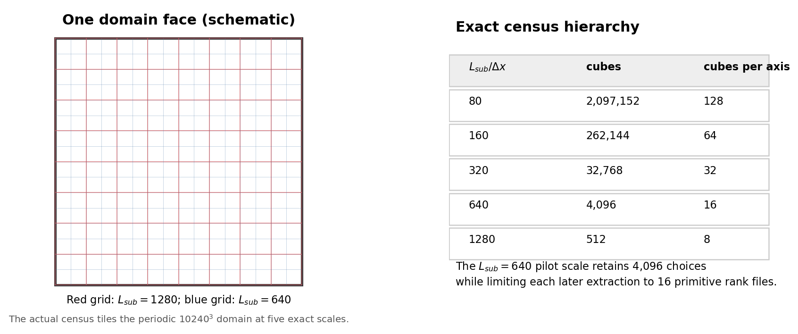

*Figure 1.1: Schematic of one domain face and the exact census hierarchy.
Every listed scale tiles the periodic domain without overlap. The
$L_{\rm sub}=640$ scale is a candidate compromise: it preserves 4,096
candidate cubes while limiting the later extraction footprint relative to
larger scales. A cold-read benchmark is still required.*

The production census streams the factor-80 primary product into a strict
global cache. Factor-40 and factor-160 source trees remain available outside
the retained run as validation oracles. Snapshot discovery starts from
rank-zero header time, then enforces cycle and identity checks rather than
assuming that output suffixes align across product trees.

## 1.3 Core definitions

For any scalar $q$, the code starts from raw moments

$$
m_n(q) = \left\langle q^n \right\rangle_V.
$$

It reconstructs central moments only after raw moments from child cells or
child cubes have been averaged. For example,

$$
\mu_2(q)
=
m_2(q) - m_1(q)^2,
$$

and

$$
\sigma_q
=
\sqrt{\mu_2(q)}.
$$

For magnetic fields,

$$
\mathbf{B}_{\rm mean}
=
\left\langle \mathbf{B} \right\rangle_V,
$$

$$
B_{\rm mean}
=
\left| \mathbf{B}_{\rm mean} \right|,
$$

$$
B_{\rm rms}
=
\sqrt{\left\langle \left| \mathbf{B} \right|^2 \right\rangle_V},
$$

and

$$
\delta B
=
\sqrt{
\left\langle
\left|
\mathbf{B} - \left\langle \mathbf{B} \right\rangle_V
\right|^2
\right\rangle_V
}.
$$

The central census variable is

$$
\mathrm{dBB}
=
\frac{\delta B}{B_{\rm mean}}.
$$

The catalogs also retain the bounded complements

$$
\frac{B_{\rm mean}^2}{\left\langle B^2 \right\rangle_V}
\quad \mathrm{and} \quad
\frac{\delta B^2}{\left\langle B^2 \right\rangle_V},
$$

whose sum should be one. These complements validate the magnetic partition,
but they are algebraic restatements of $\mathrm{dBB}$ and do not independently
separate numerator- and denominator-driven behavior. The absolute
$B_{\rm mean}$, $\delta B$, and $B_{\rm rms}$ distributions provide the
descriptive comparison.

## 1.4 Computational workflow

The workflow has four guarded stages:

| Stage | Purpose | Main output |
|---|---|---|
| Validate | Compare limited primitive-data regions directly against primary `cbin` reconstructions | `validation/VALIDATION_COMPLETE.json` |
| Build | Stream all trusted factor-80 shards, construct a rank map, and derive five tiled catalogs | `BUILD_COMPLETE.json`, cache, catalogs |
| Verify | Recalculate grid mappings, formulas, flags, and graph hashes in a structured second pass | `verification/VERIFY_COMPLETE.json` |
| Analyze | Produce distributions, correlations, cross-scale summaries, figures, and a pilot proposal | `analysis/ANALYSIS_COMPLETE.json` |

The final graph hash is:

```text
0504464a4fa967bb5fb037c4283fa38dde533638bdd80c2e0e79182c2a7f0742
```

The earlier SGS-backed route was discarded after its data-quality issue was
identified:

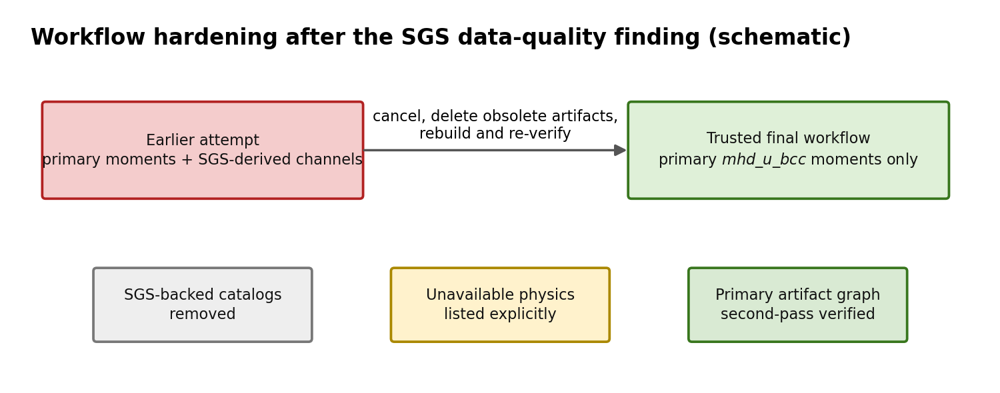

*Figure 1.2: Schematic of the hardening step. The obsolete SGS-backed route
was cancelled and deleted; the final route uses only trusted primary raw
moments. The cost is an explicit reduction in the physical quantities that
can be reported.*

## 1.5 Validation strategy

Direct validation compared full-resolution primitive data with reconstructed
primary `cbin` quantities. It included single factor-40, factor-80, and
factor-160 cells; rank-boundary crossings in all three directions; a merged
region crossing rank boundaries in all three directions; and hierarchy
comparisons.

| Validation fact | Result |
|---|---:|
| Direct and hierarchy comparisons | `603` |
| Failed comparisons | `0` |
| Precision-limited standardized moments reported unavailable | `3` |
| Finite standardized comparisons evaluated with propagated writer uncertainty | `109` |
| Comparisons requiring expanded allowance beyond baseline tolerance | `3` |
| Primary factor-80 source shards assembled | `65,536` |
| Cache coverage holes | `0` |
| Cache coverage overlaps | `0` |
| Missing logical rank locations | `0` |

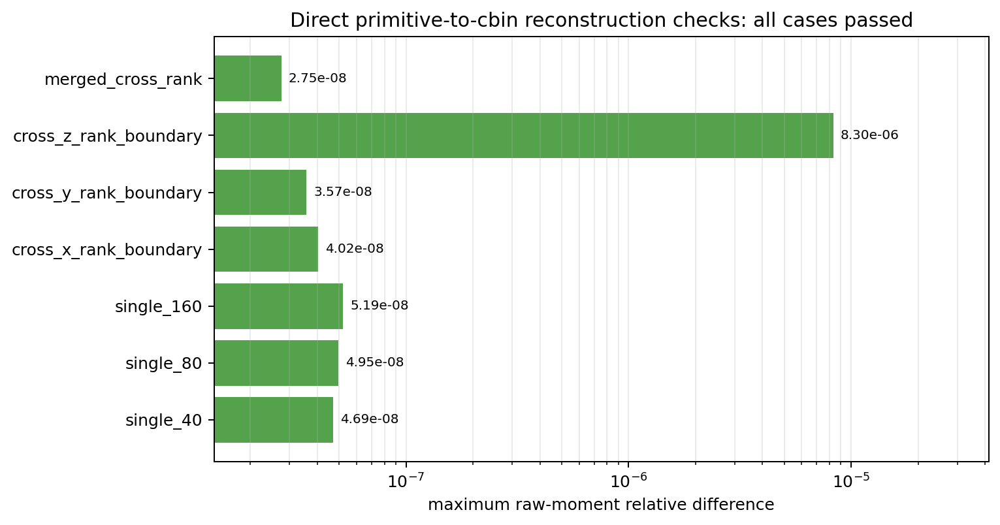

*Figure 1.3: Maximum raw-moment relative difference for each direct
primitive-to-`cbin` validation case. All cases passed. The larger
`cross_z_rank_boundary` value remains within the documented raw-moment
tolerances; row-level details remain available in `validation_results.json`.*

The structured second-pass verifier then recalculated exact grids,
source-rank mappings, foundational statistics, derived formulas, validity
flags, magnetic complements, and provenance hashes for every catalog scale.
It duplicates important grid and formula checks, but it shares low-level
aggregation, uncertainty, and hashing helpers with the build path. That
shared code remains a common-mode limitation.

## 1.6 Main outputs and trends

The census contains `2,396,672` scale-specific rows:

| $L_{\rm sub}/\Delta x$ | Rows | $\mathrm{dBB}$ q16 | Median | q84 | q99 |
|---:|---:|---:|---:|---:|---:|
| `80` | `2,097,152` | `0.136693` | `0.253268` | `0.527346` | `1.97883` |
| `160` | `262,144` | `0.199861` | `0.356112` | `0.733763` | `2.79686` |
| `320` | `32,768` | `0.289501` | `0.498766` | `1.01018` | `3.68184` |
| `640` | `4,096` | `0.423410` | `0.695996` | `1.33717` | `4.82099` |
| `1280` | `512` | `0.638682` | `0.991299` | `1.81578` | `5.35717` |

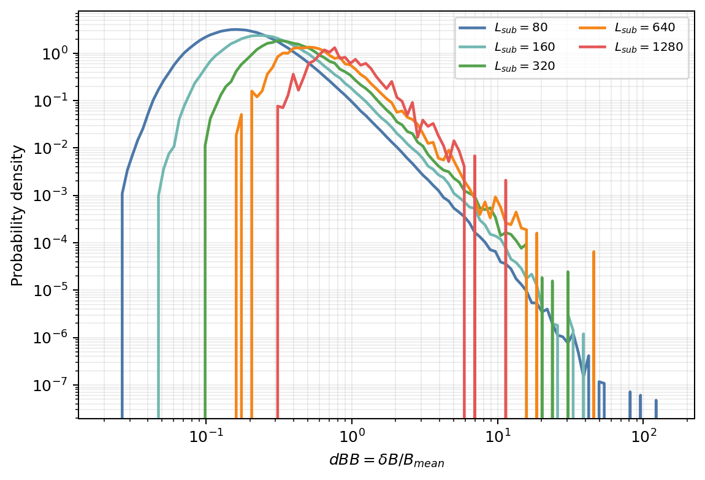

*Figure 1.4: Measured $\mathrm{dBB}$ probability densities across all five
scales. The upper quantiles shift toward larger ratios as subvolumes become
larger. Detailed tail-shape comparisons are sample-size limited at the
coarsest scales.*

At $L_{\rm sub}=640$, the relation to magnetic terms is visible directly:

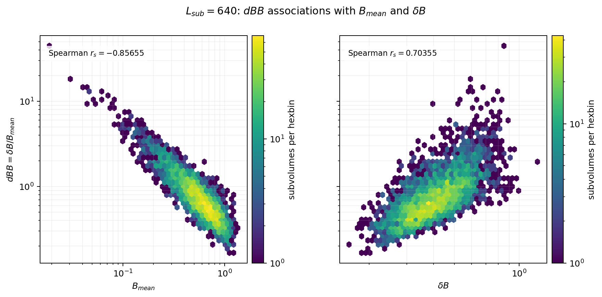

*Figure 1.5: Actual $L_{\rm sub}=640$ census hexbins. Larger $\mathrm{dBB}$
is associated with weaker $B_{\rm mean}$ and larger $\delta B$. These are
ratio associations, not a causal decomposition, but they show that neither
magnetic ingredient can be ignored when selecting environments.*

The catalog also retains supported non-magnetic summaries:

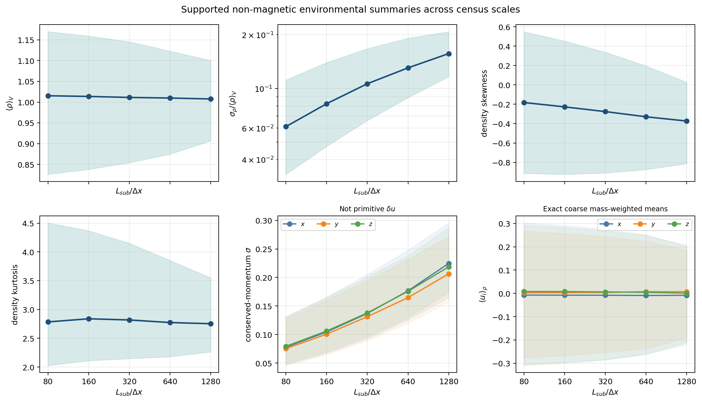

*Figure 1.6: Median and 16th-84th percentile trends for supported density,
conserved-momentum, and exact coarse mass-weighted velocity summaries. Density
contrast and conserved-momentum widths increase with $L_{\rm sub}$. The
momentum-width panel is explicitly not primitive $\delta u$, and the velocity
panel contains coarse mass-weighted means rather than a dispersion.*

The scale-dependent rank correlations are:

| $L_{\rm sub}/\Delta x$ | $\mathrm{dBB}$ vs. $B_{\rm mean}$ | $\mathrm{dBB}$ vs. $\delta B$ | $\mathrm{dBB}$ vs. $\sigma_\rho/\langle\rho\rangle$ |
|---:|---:|---:|---:|
| `80` | `-0.72721` | `0.76540` | `-0.02681` |
| `160` | `-0.76705` | `0.75105` | `-0.09112` |
| `320` | `-0.81110` | `0.73413` | `-0.15707` |
| `640` | `-0.85655` | `0.70355` | `-0.22172` |
| `1280` | `-0.89345` | `0.65630` | `-0.28456` |

These are associations. The arithmetic identity
$\mathrm{dBB}=\delta B/B_{\rm mean}$ explains why both magnetic terms
matter, but the census does not establish a causal turbulent mechanism.

Aligned cross-scale comparisons retain substantial but imperfect rank
ordering: coarse-versus-constituent-$L_{\rm sub}=80$-mean Spearman
correlation decreases from `0.97953` at $L_{\rm sub}=160$ to `0.81648` at
$L_{\rm sub}=1280$.

## 1.7 Proposed pilot and caveats

The proposed extraction pilot uses $L_{\rm sub}=640$ because it balances
environmental contrast, a domain-wide pool of `4,096` cubes, and a later
read footprint of `16` primitive rank files per region. The proposal contains:

| Role | Rows |
|---|---:|
| Representative low, near-median, and high $\mathrm{dBB}$ regions | `12` |
| Three accepted low/high matched pairs | `6` |
| Targeted outliers | `3` |
| Total | `21` |

No full-resolution pilot cube has been extracted. No structure function has
been calculated for these regions.

The primary caveat is that the trusted schema does not reconstruct primitive
velocity dispersion, pressure, Mach numbers, kinetic partitions, or
mixed-field statistics. A second caveat is numerical: float32 serialization
limits some cancellation-dominated higher moments. Aggregate catalog flags
therefore occur in `227,706 / 2,097,152` rows at $L_{\rm sub}=80$, falling
to `0 / 512` rows at $L_{\rm sub}=1280$. Those flags primarily concern
higher moments: all retained $\mathrm{dBB}$ values are finite and unflagged,
although $\mathrm{dBB}$ would be unavailable if $B_{\rm mean}$ were
numerically unresolved. A third caveat is scope: this is one snapshot and one
origin-aligned tiling family. Temporal persistence, parameter dependence,
shifted-tiling sensitivity, and quarantined `mhd_dynamo_ks` derivative
channels remain untested.

The next stage should first implement and validate a selected-cube 3-D
extractor and finite-domain pair samplers. It should then benchmark a few
$L_{\rm sub}=640$ cold reads, compare extracted moments with the catalog,
and only then decide whether the full 21-region structure-function pilot is
affordable and scientifically useful.

# Tier 2: Detailed methods, implementation, and validation

## 2.1 Problem definition

### Scientific question

How does the local magnetic fluctuation ratio
$\mathrm{dBB}=\delta B/B_{\rm mean}$ vary across a large turbulent MHD
domain, how does its distribution depend on averaging scale, and which
well-characterized regions should be extracted for a later high-resolution
structure-function study?

### Software task

Build a strict, auditable cataloging workflow that:

1. reads AthenaK `cbin` outputs correctly;
2. validates reconstructed quantities against primitive files;
3. streams all expected trusted shards exactly once into a reusable cache;
4. derives tiled catalogs at five requested scales;
5. rejects stale caches, schema drift, missing shards, and invalid geometry;
6. runs a structured second-pass verification of the built graph;
7. publishes hashed analysis outputs and a deterministic pilot proposal.

### Scope boundary

The completed task is a census and extraction proposal. It does not include
high-resolution cube extraction or structure-function computation. Broken
`mhd_sgs` products and suspicious `mhd_dynamo_ks` derivative channels are
excluded. They are not silently approximated.

## 2.2 Data model and assumptions

### Snapshot and domain

| Parameter | Value |
|---|---|
| Simulation | `Turb_10240_beta25_dedt025_plm` |
| Snapshot time | $t=6.0$ |
| Cycle | `799945` |
| Full domain | $10240^3$ fine cells |
| Boundary condition | periodic global domain |
| Full-resolution shard block | `160 x 320 x 320` cells |
| Rank lattice | `64 x 32 x 32` |
| Expected rank shards | `65,536` |
| MHD adiabatic index read from input | $\gamma=1.00001$ |

Full-resolution primitive files expose:

```text
dens velx vely velz eint bcc1 bcc2 bcc3
```

Trusted primary-moment `cbin` files expose first through fourth raw moments
for:

```text
dens mom1 mom2 mom3 ener bcc1 bcc2 bcc3
```

The array order in payloads is `[k,j,i] = [x3,x2,x1]`. Logical mesh-block
coordinates are represented as `(x1,x2,x3)`. Rank IDs are Morton ordered, so
production code constructs and hashes a logical-coordinate-to-rank map from
metadata instead of assuming Cartesian rank numbering.

Reported values remain in simulation code units. The implementation evaluates
magnetic energy as $0.5\langle B^2\rangle_V$, corresponding to the code-unit
convention with $4\pi$ absorbed. No conversion to physical units was applied.

### Coarsening hierarchy

| `cbin` kernel | Global coarse grid | Rank-local payload shape `[k,j,i]` | Role |
|---:|---:|---:|---|
| `40` | `256^3` | `(8,8,4)` | validation oracle |
| `80` | `128^3` | `(4,4,2)` | production cache source |
| `160` | `64^3` | `(2,2,1)` | validation oracle |

The five catalogs tile the domain without periodic wrapping inside any row:

| $L_{\rm sub}/\Delta x$ | Catalog rows | Required primitive rank files per row |
|---:|---:|---:|
| `80` | `2,097,152` | `1` |
| `160` | `262,144` | `1` |
| `320` | `32,768` | `2` |
| `640` | `4,096` | `16` |
| `1280` | `512` | `128` |

The global domain is periodic, but later extracted cubes must remain
nonperiodic internally when forming structure-function pairs.

## 2.3 Mathematical definitions

### Raw and central moments

For scalar $q$, define:

$$
m_1 = \left\langle q \right\rangle_V,
$$

$$
m_2 = \left\langle q^2 \right\rangle_V,
$$

$$
m_3 = \left\langle q^3 \right\rangle_V,
$$

$$
m_4 = \left\langle q^4 \right\rangle_V.
$$

The implementation merges these raw moments before evaluating central
statistics. It uses:

$$
\mu_2 = m_2 - m_1^2,
$$

$$
\mu_3 = m_3 - 3m_2m_1 + 2m_1^3,
$$

$$
\mu_4 = m_4 - 4m_3m_1 + 6m_2m_1^2 - 3m_1^4.
$$

When numerically resolved,

$$
\sigma = \sqrt{\mu_2},
$$

$$
\mathrm{skewness} = \frac{\mu_3}{\sigma^3},
$$

and

$$
\mathrm{kurtosis} = \frac{\mu_4}{\sigma^4}.
$$

Float32 serialization, writer summation, and merge rounding are propagated
into uncertainty bounds. Cancellation-dominated standardized moments remain
`NaN` with explicit flags when their numerators or variance denominators are
not resolved. The stored `*_kurtosis` value is Pearson kurtosis; the catalogs
also store `*_excess_kurtosis = *_kurtosis - 3`.

### Magnetic quantities

For magnetic components $B_i$:

$$
B_{\rm mean}
=
\sqrt{
\left\langle B_1 \right\rangle_V^2
+
\left\langle B_2 \right\rangle_V^2
+
\left\langle B_3 \right\rangle_V^2
},
$$

$$
\left\langle B^2 \right\rangle_V
=
\sum_{i=1}^{3}
\left(
\left\langle B_i \right\rangle_V^2
+
\mathrm{Var}(B_i)
\right),
$$

$$
B_{\rm rms}
=
\sqrt{\left\langle B^2 \right\rangle_V},
$$

$$
\delta B^2
=
\left\langle B^2 \right\rangle_V
-
B_{\rm mean}^2,
$$

and

$$
\mathrm{dBB}
=
\frac{\delta B}{B_{\rm mean}}.
$$

The catalogs retain:

$$
f_{\rm mean}
=
\frac{B_{\rm mean}^2}{\left\langle B^2 \right\rangle_V},
$$

$$
f_{\delta B}
=
\frac{\delta B^2}{\left\langle B^2 \right\rangle_V},
$$

with:

$$
f_{\rm mean} + f_{\delta B} = 1.
$$

### Other retained quantities

The exact coarse mass-weighted mean velocity components are:

$$
\left\langle u_i \right\rangle_{\rho}
=
\frac{\left\langle \rho u_i \right\rangle_V}
{\left\langle \rho \right\rangle_V}.
$$

These do not provide a velocity dispersion.

The two explicitly labeled Alfvén-speed-like proxies are:

$$
v_{A,\mathrm{mean}}^{\mathrm{proxy}}
=
\frac{B_{\rm mean}}{\sqrt{\left\langle \rho \right\rangle_V}},
$$

and

$$
v_{A,\mathrm{rms}}^{\mathrm{proxy}}
=
\sqrt{
\frac{\left\langle B^2 \right\rangle_V}
{\left\langle \rho \right\rangle_V}
}.
$$

These are coarse summaries, not full local Alfvén-speed statistics.

### Reconstructability boundary

| Quantity class | Status | Reason |
|---|---|---|
| Raw moments of density, conserved momentum, total energy, and magnetic components | reconstructable from trusted serialized payload | stored directly as float32 arrays |
| Variance and standard deviation | algebraically reconstructable subject to writer precision, catalog compaction, and validity flags | derived from raw moments |
| Skewness and kurtosis | available when resolved | cancellation can dominate float32 uncertainty |
| $B_{\rm mean}$, $B_{\rm rms}$, $\delta B$, $\mathrm{dBB}$ | algebraically reconstructable subject to serialized precision and denominator flags | magnetic first and second moments are sufficient |
| $\langle \rho u_i\rangle/\langle\rho\rangle$ | reconstructable coarse statistic | conserved momenta and density are available |
| Primitive velocity dispersion and Mach numbers | unavailable | primitive velocity moments are absent |
| Pressure and kinetic partitions | unavailable | total energy cannot be separated reliably without kinetic terms |
| Off-diagonal covariance tensors and mixed-field statistics | unavailable | required cross moments are absent |

## 2.4 Algorithm and implementation

### Reader and strict assembly

`scripts/prompt1/cbin_tools.py` provides the binary reader and numerical
utilities:

| Function | Responsibility |
|---|---|
| `parse_binary_shard()` | Parse AthenaK metadata, validate payload accounting, and record offsets without eagerly loading all fields |
| `read_record_fields()` | Memory-map and read selected payload arrays |
| `discover_snapshot()` | Match rank-zero products by header time |
| `assemble_product()` | Stream every expected rank shard into global arrays with schema, geometry, coverage, and finiteness checks |
| `aggregate_blocks()` | Average aligned child raw moments |
| `source_raw_moment_error_bounds()` | Bound source float32 and writer-summation uncertainty |
| `aggregate_raw_moment_error_bounds()` | Propagate uncertainty through block aggregation |
| `raw_moment_statistics()` | Calculate central moments and explicit precision flags |
| `required_rank_ids()` | Derive expected primitive rank IDs from the verified `cbin` rank map |

The production assembly in `assemble_product()` rejects missing shards,
duplicate logical owners, time or cycle disagreement, schema drift, geometry
disagreement, payload truncation, non-finite values, coverage holes,
coverage overlaps, and missing rank locations.

### Catalog build

`scripts/prompt1/run_prompt1_catalog.py` orchestrates build and analysis:

| Function | Responsibility |
|---|---|
| `_require_validation_token()` | Refuse builds without a passing, source-bound validation token |
| `ensure_raw_caches()` | Build or validate the strict factor-80 primary cache |
| `derive_catalog()` | Aggregate raw moments and derive one scale-specific catalog |
| `artifact_graph()` | Hash cache, rank map, validation token, source hashes, and all catalogs |
| `_analysis_preflight()` | Audit finiteness, ranges, flags, and constant columns |
| `_make_summary_rows()` | Publish distribution quantiles |
| `_cross_scale_rows()` | Compare each coarse cube with its child distribution |
| `_cross_scale_transition_rows()` | Track low, middle, and high regime transitions |
| `_conditional_quantile_rows()` | Publish conditional $\mathrm{dBB}$ bands |
| `_pilot_rows()` | Select representative, matched, and outlier regions |
| `_require_analysis_completion()` | Verify the analysis manifest before declaring completion |

The memory strategy is conservative: one streamed factor-80 assembly produces
a reusable compressed cache. Larger catalogs are generated by aligned
aggregation of cached raw moments. The workflow does not reread all
full-resolution data during the domain-wide census.

The Prompt 1 Slurm jobs reserve one Andes node and `32` CPUs. The current
implementation relies primarily on streamed I/O and NumPy operations; no
CPU-scaling benchmark was performed. The `/usr/bin/time` resident-set values
in wrapper logs describe the `srun` wrapper and should not be interpreted as
full child-process memory measurements.

### Structured second-pass verifier

`scripts/prompt1/verify_prompt1_outputs.py` is a structured second path. It
does not mutate source shards, the raw cache, or catalog inputs, but it does
write verification artifacts to its selected output directory. Its
`verify()` function:

1. rejects SGS provenance;
2. validates external and embedded manifests;
3. recalculates the source-shard metadata fingerprint;
4. checks the rank-map permutation;
5. rebuilds exact grid columns and parent mappings;
6. reconstructs foundational statistics from the raw cache;
7. recalculates derived formulas and validity flags;
8. checks magnetic complements;
9. recomputes the artifact graph hash.

This separation matters because duplicated grid and derived-formula checks
can catch build errors. It is not fully independent: aggregation,
uncertainty, raw-statistic, nonnegative-clamping, and graph-hash helpers are
shared low-level dependencies and remain a common-mode limitation.

The all-shard inventory digest covers rank, basename, byte size, nanosecond
modification time, and nanosecond change time. It detects source replacement
without rereading all payload bytes, but it is a metadata fingerprint rather
than a full content hash. A source-to-cache reassembly comparison would be
required for stronger end-to-end independence.

### Compute ledger

`scripts/prompt1/update_compute_ledger.py` maintains persistent CSV and
Markdown accounting. It registers planned jobs before submission, refreshes
top-level allocations from Slurm, excludes child steps such as `.batch` and
`.extern`, and calculates consumed node-hours as:

$$
\mathrm{node\ hours}
=
\mathrm{allocated\ nodes}
\times
\mathrm{elapsed\ wall\ hours}.
$$

## 2.5 Validation

### Direct reconstruction validation

`scripts/prompt1/validate_reconstruction.py` converts limited primitive-data
regions into conserved variables, compares first through fourth raw moments
before derived statistics, and checks retained primary-only diagnostics.
The reported relative-difference column is normalized as

$$
\frac{|\mathrm{cbin}-\mathrm{direct}|}
{\max(|\mathrm{direct}|,\mathrm{atol})},
$$

so it is a tolerance-stabilized diagnostic rather than a conventional
relative error near zero.

| Case | Scale | Direct cells | `cbin` voxels | Maximum raw-moment relative difference | Result |
|---|---:|---:|---:|---:|---|
| `single_40` | `40` | `64,000` | `1` | `4.69272e-08` | pass |
| `single_80` | `80` | `512,000` | `1` | `4.95460e-08` | pass |
| `single_160` | `160` | `4,096,000` | `1` | `5.19277e-08` | pass |
| `cross_x_rank_boundary` | `80` | `1,024,000` | `2` | `4.02045e-08` | pass |
| `cross_y_rank_boundary` | `80` | `2,048,000` | `4` | `3.57130e-08` | pass |
| `cross_z_rank_boundary` | `80` | `2,048,000` | `4` | `8.30388e-06` | pass |
| `merged_cross_rank` | `40` | `32,768,000` | `512` | `2.74987e-08` | pass |

Across direct and hierarchy checks, `603 / 603` comparisons passed. Three
cancellation-dominated standardized moments were explicitly unavailable.
Another `109` finite standardized comparisons were evaluated with
field-specific interval-normalized float32 writer-uncertainty bounds,
including numerator and variance-denominator uncertainty. Three of those
comparisons required expanded allowance beyond the baseline retained-
diagnostic tolerance.
Raw-moment and hierarchy comparisons use `atol=2.0e-5` and `rtol=2.0e-4`.
Retained derived diagnostics use `atol=5.0e-4` and `rtol=5.0e-3`, with the
additional propagated uncertainty term applied only to supported
standardized moments.

### Full-graph structured second-pass verification

Structured second-pass verification passed at all scales:

| $L_{\rm sub}/\Delta x$ | Rows | Aggregate flagged rows | Flagged fraction | Required ranks | Float64 magnetic-partition self-check |
|---:|---:|---:|---:|---:|---:|
| `80` | `2,097,152` | `227,706` | `10.8579%` | `1` | `2.98e-8` |
| `160` | `262,144` | `7,435` | `2.8362%` | `1` | `2.98e-8` |
| `320` | `32,768` | `116` | `0.3540%` | `2` | `2.98e-8` |
| `640` | `4,096` | `2` | `0.0488%` | `16` | `2.98e-8` |
| `1280` | `512` | `0` | `0%` | `128` | `2.98e-8` |

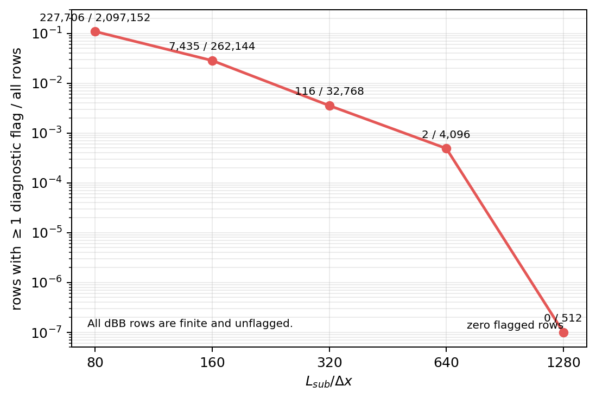

*Figure 2.1: Aggregate catalog flagged-row fraction by scale. Flags become
rarer after larger-scale averaging. The flags primarily track less stable
higher-order moments; all retained $\mathrm{dBB}$ values are finite and
unflagged.*

An aggregate flagged row is any row with at least one per-field diagnostic
or proxy flag. It does not imply invalid $\mathrm{dBB}$. The verifier's
stored report shows a zero magnetic-complement residual because it sums two
float32 columns; casting both terms to float64 before summing gives the
`2.98e-8` self-consistency values above. See
`docs/PROMPT1_RECONSTRUCTABILITY.md` for the moment-flag bit mapping.

### Repository tests and report generation checks

The repository test suite passed:

```text
164 passed in 33.79s
```

The Prompt 1-focused subset passed:

```text
36 passed in 3.32s
```

Python compilation and Bash syntax checks also passed. The report-specific
figure helper executed successfully and generated `16` figures plus a
SHA256 manifest. No scientific synthetic-recovery plot is claimed here:
the strongest scientific checks are direct primitive-to-`cbin`
reconstructions and structured second-pass graph verification.

During report review, a read-only pilot-input header preflight checked all
`336` primitive rank references implied by the 21 proposed regions. All
references were unique, all files existed, and every parsed header matched
time `6.0`, cycle `799945`, the expected eight primitive fields, and a
one-record layout. Their total file-read volume is `164.0828 GiB`. This is a
useful report-time audit, but it is not yet a retained automated extraction
preflight artifact.

### Independent report reviews

Five independent subagent reviews were requested after the report draft:
Tier 0 readability, Tier 1 technical readability, Tier 2 expert audit,
Tier 3 reproducibility audit, and a full adversarial review. Their reconciled
findings are recorded in Appendix B.

## 2.6 Results

### Scale dependence

The median $\mathrm{dBB}$ increases monotonically:

| $L_{\rm sub}/\Delta x$ | Median $\mathrm{dBB}$ | Relative to $L_{\rm sub}=80$ |
|---:|---:|---:|
| `80` | `0.253268` | `1.000` |
| `160` | `0.356112` | `1.406` |
| `320` | `0.498766` | `1.969` |
| `640` | `0.695996` | `2.748` |
| `1280` | `0.991299` | `3.914` |

This result is robust as a descriptive census statement. A physical
interpretation requires care: larger regions allow more cancellation in the
vector mean, and they also aggregate fluctuation structure differently.

### Magnetic ratio associations

At $L_{\rm sub}=640$, the magnetic conditional census describes how the two
terms covary with their ratio:

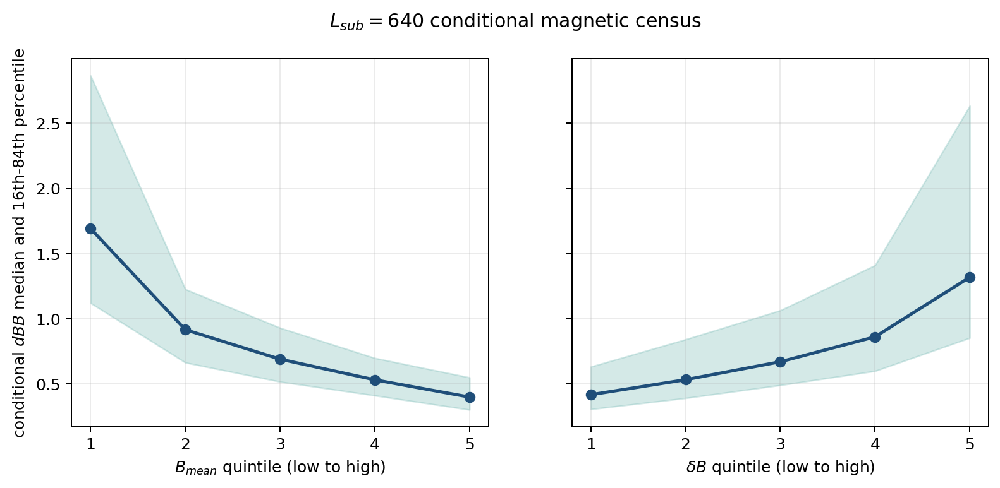

*Figure 2.2: Conditional $\mathrm{dBB}$ medians and 16th-84th percentile
bands across magnetic-property quintiles at $L_{\rm sub}=640$. Weak
$B_{\rm mean}$ and strong $\delta B$ are associated with larger typical
$\mathrm{dBB}$. These partly definitional ratio associations are not a
causal decomposition.*

The bottom $B_{\rm mean}$ quintile has median $\mathrm{dBB}=1.69239$, while
the top quintile has `0.400478`. The bottom and top $\delta B$ quintiles have
median $\mathrm{dBB}=0.418670$ and `1.31951`, respectively.

### Supported non-magnetic associations

The comprehensive catalog does not stop at magnetic quantities. It stores
raw-moment-derived summaries for density, conserved momenta, total energy, and
magnetic components, plus exact coarse mass-weighted velocity means and
explicitly labeled Alfvén-speed-like proxies. The trusted analysis directory
retains scale-dependent distributions, $\mathrm{dBB}$ comparisons, and
Spearman matrices for these supported properties.

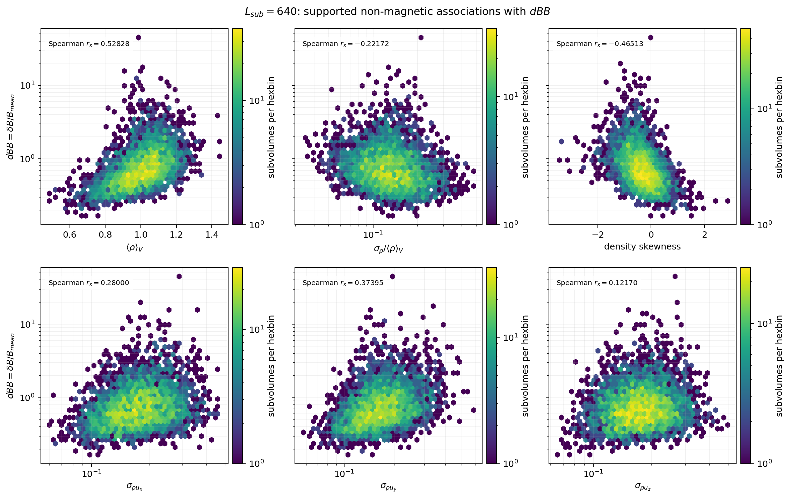

*Figure 2.3: Actual $L_{\rm sub}=640$ census hexbins for supported
non-magnetic associations with $\mathrm{dBB}$. Mean density, density contrast,
density skewness, and conserved-momentum widths all structure the census.
The lower-row widths are $\sigma_{\rho u_i}$, not primitive velocity
dispersion.*

At $L_{\rm sub}=640$, selected domain-wide Spearman correlations are:

| Property | Spearman $r_s$ with $\mathrm{dBB}$ | Interpretation boundary |
|---|---:|---|
| $\langle\rho\rangle_V$ | `0.52828` | exact coarse density mean |
| $\sigma_\rho/\langle\rho\rangle_V$ | `-0.22172` | exact subject to denominator flags |
| density skewness | `-0.46513` | use only resolved rows |
| $\sigma_{\rho u_x}$ | `0.28000` | conserved-momentum width, not $\delta u_x$ |
| $\sigma_{\rho u_y}$ | `0.37395` | conserved-momentum width, not $\delta u_y$ |
| $\sigma_{\rho u_z}$ | `0.12170` | conserved-momentum width, not $\delta u_z$ |

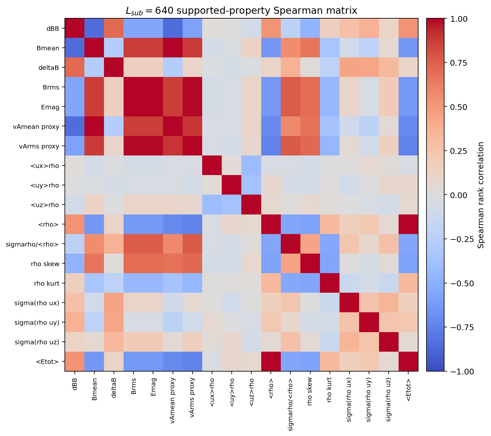

*Figure 2.4: Spearman matrix for the `18` supported correlation properties at
$L_{\rm sub}=640$. It exposes the broader environmental covariance structure
while preserving the distinction between exact quantities, labeled proxies,
and conserved-momentum diagnostics. Correlation is descriptive, not causal.*

The audit attempted the additional Prompt 1 quantities but did not manufacture
them from insufficient inputs. Primitive $\langle u_i\rangle_V$, $u_{\rm rms}$,
$\delta u$, $M_s$, Alfvén Mach numbers, kinetic-energy partitions, pressure,
cross helicity, Elsasser imbalance, residual energy, alignment statistics,
and off-diagonal covariance tensors remain unavailable from the trusted
primary-only schema. The exact reconstructability boundary is tabulated in
`docs/PROMPT1_RECONSTRUCTABILITY.md`.

### Nested-grid persistence

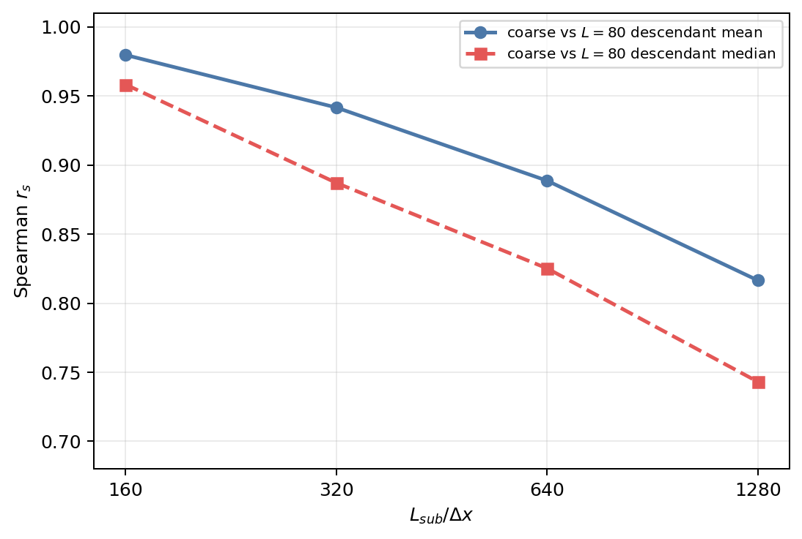

*Figure 2.5: Spearman correlation of coarse $\mathrm{dBB}$ with the mean and
median of its constituent $L_{\rm sub}=80$ descendants. Environmental rank
ordering persists across scales but weakens as the separation from the
factor-80 census grows. This is a targeting diagnostic on nested data, not
independent evidence for a physical persistence mechanism.*

| Coarse $L_{\rm sub}/\Delta x$ | Coarse vs. constituent-$80$ mean $r_s$ | Coarse vs. constituent-$80$ median $r_s$ |
|---:|---:|---:|
| `160` | `0.97953` | `0.95816` |
| `320` | `0.94152` | `0.88700` |
| `640` | `0.88860` | `0.82517` |
| `1280` | `0.81648` | `0.74312` |

This supports a practical conclusion: small-scale census information is
useful for targeting larger environments, but it is not interchangeable with
the larger-scale catalog.

### Pilot selection

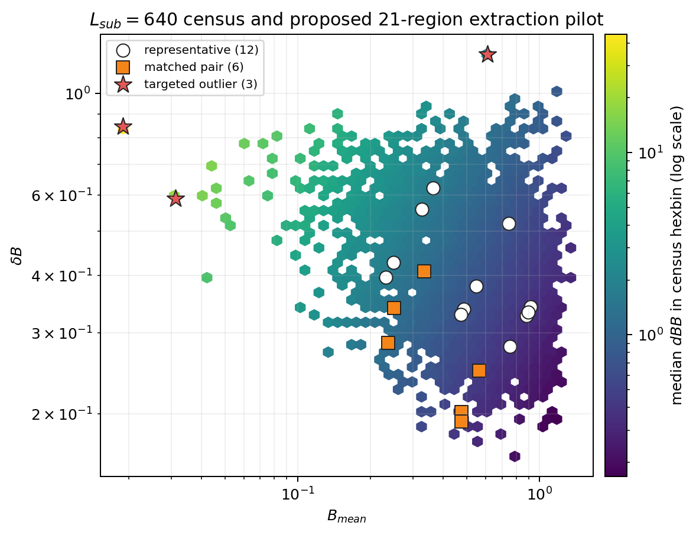

*Figure 2.6: The actual $L_{\rm sub}=640$ magnetic census with the proposed
21 extraction targets overlaid. Representatives cover common regimes,
matched pairs support approximate observational contrasts, and outliers
deliberately probe weak-mean-field and large-fluctuation edges.*

Selected examples:

| Role | ID | $\mathrm{dBB}$ | $B_{\rm mean}$ | $\delta B$ |
|---|---|---:|---:|---:|
| Representative low | `L640_sub00370` | `0.371858` | `0.919586` | `0.341956` |
| Representative near median | `L640_sub03942` | `0.695911` | `0.747029` | `0.519866` |
| Representative high | `L640_sub00579` | `1.71470` | `0.249248` | `0.427385` |
| Outlier: small $B_{\rm mean}$ | `L640_sub00738` | `44.7257` | `0.0189531` | `0.847690` |
| Outlier: large $\delta B$ | `L640_sub01591` | `1.99603` | `0.609986` | `1.21755` |
| Outlier: additional large $\mathrm{dBB}$ | `L640_sub01651` | `18.8876` | `0.0312428` | `0.590101` |

The three matched-pair robust scores range from `0.536289` to `0.646773`,
below the documented `1.0` RMS-MAD-unit threshold.

The matching selector compares:

```text
dens_mean
rho_sigma_over_mean
B_rms
deltaB
mom1_sigma
mom2_sigma
mom3_sigma
```

For each feature, it subtracts the combined low/high candidate-pool median and
divides by $\max(\mathrm{MAD},10^{-12})$. For a low/high pair, the score is:

$$
s
=
\sqrt{
\frac{1}{7}
\sum_{j=1}^{7}
\left(z_{j,\mathrm{low}}-z_{j,\mathrm{high}}\right)^2
}.
$$

The deterministic selector considers at most `1,000` evenly sampled
candidates from each low/high pool and requires every selected center to stay
at least `1280` cells from prior selections under periodic distance. These
pairs reduce obvious environmental differences but remain approximate
observational matches with residual confounding. In particular, the trusted
schema cannot match on primitive velocity dispersion, pressure, sonic or
Alfvenic Mach number, kinetic partitions, or mixed-field statistics.

### Extraction planning

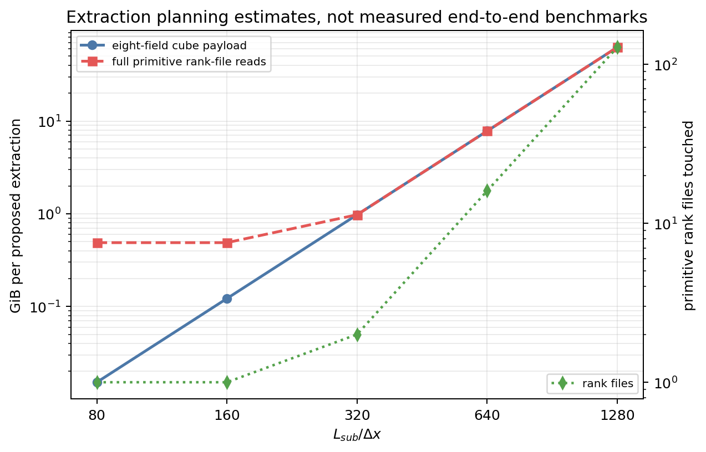

*Figure 2.7: Planning estimates for later primitive-data extraction. These are
not measured end-to-end benchmarks. At $L_{\rm sub}=640$, one eight-field
cube payload is `7.8125 GiB` and touches `16` primitive rank files.*

The proposed 21-region $L_{\rm sub}=640$ pilot would contain `164.0625 GiB`
of eight-field cube payload before any derived structure-function products.
The selected primitive rank files total `164.0828 GiB` including headers.
The later stage must measure cold-read runtime, write amplification, and peak
memory rather than extrapolating only from ideal bandwidth.

### Confidence categories

| Confidence level | Conclusions |
|---|---|
| Robust for this snapshot and origin-aligned tiling | The retained primary-only artifact graph is internally consistent; all expected shards are represented; $\mathrm{dBB}$ is finite and unflagged; median $\mathrm{dBB}$ rises across the five census scales. Shifted origins, sliding windows, and additional snapshots remain untested. |
| Likely and useful | Both weak $B_{\rm mean}$ and elevated $\delta B$ materially structure the high-$\mathrm{dBB}$ population; $L_{\rm sub}=640$ is a sensible first extraction scale. |
| Suggestive only | The observed associations may reflect specific turbulent mechanisms. The census alone does not establish causality. |
| Open | Whether the proposed cubes produce distinct structure-function behavior, and whether the extraction campaign is I/O-efficient in practice. |

## 2.7 Failures and discarded approaches

### Broken SGS route

An earlier implementation included `mhd_sgs` products. The user identified
those products as broken while a hardened census was running. The active job
was cancelled, SGS-dependent code paths were removed from the trusted
workflow, final artifacts were rebuilt from primary `mhd_u_bcc` inputs only,
and both superseded artifact directories were deleted:

```text
/lustre/orion/ast207/proj-shared/dfielding/Production_plm/prompt1_catalog/t6_final_20260530
/lustre/orion/ast207/proj-shared/dfielding/Production_plm/prompt1_catalog/t6_final_hardened_20260530
```

This was not merely a cleanup change. It narrowed the scientific claim set.
A source audit found a concrete reason to keep the channels quarantined:
`/ccs/home/dfielding/athenak-df/src/outputs/derived_variables.cpp` treats
`IEN` as `eint` in pressure-like SGS terms near line `531`. Restoration
requires a source correction, regeneration, and direct primitive-data
validation.

### Float32 standardized-moment failures

Two primary-only validation iterations failed before the accepted
uncertainty treatment:

| Job | Outcome | Lesson |
|---:|---|---|
| `3314767` | rejected | finite float32 standardized-moment discrepancies required explicit treatment |
| `3314768` | rejected | numerator-only standardized bounds were insufficient |
| `3314769` | passed | interval-normalized numerator and variance-denominator uncertainty was accepted |

The final choice is preferable because unresolved moments are flagged or
reported unavailable instead of being silently forced into finite values.

### Scale typo

The requested top scale was corrected from `1240` to `1280`. The corrected
value tiles the $10240^3$ domain exactly:

$$
\frac{10240}{1280} = 8.
$$

The catalogs and both future-stage prompts now use `1280`.

### Deferred dynamo derivative channels

`mhd_dynamo_ks` derivative channels remain excluded because the available
source contains a suspicious derivative-index expression. They were not
needed for the primary magnetic census. The suspect expression is in
`/ccs/home/dfielding/athenak-df/src/outputs/derived_variables.cpp` near line
`975`, where one magnetic access appears to use `i` where `k` is expected.
Use the channels only after source-level review, correction if needed,
regeneration, and dedicated primitive-data validation.

## 2.8 Remaining risks

| Risk | Current mitigation | Remaining action |
|---|---|---|
| Full-resolution extraction may be I/O-bound or memory-heavy | Pilot sizes and rank-file lists are recorded | benchmark cold reads on a small subset |
| Primitive rank references need a retained extraction preflight | report-time audit confirmed `336` unique selected files exist and match expected headers | add automated preflight output before extracting cubes |
| Higher-order moments can be precision-limited | propagated error bounds and explicit flags | inspect any downstream selection that depends on skewness or kurtosis |
| Large-$\mathrm{dBB}$ outliers can be denominator-driven | retain bounded magnetic complements and outlier roles | inspect extracted outliers physically before generalizing |
| Trusted schema omits primitive velocity diagnostics | explicit reconstructability table | obtain a separately fixed and validated source before restoring those quantities |
| `mhd_dynamo_ks` derivative products are suspicious | excluded | dedicated primitive-data validation if needed later |
| Primitive-to-`cbin` fidelity checks are targeted rather than exhaustive | seven direct regions plus hierarchy checks passed | add held-out probes at remote Morton ranks, domain edges, extreme outliers, and randomized stratified regions; test that deliberate corruption is rejected |
| Origin-aligned tiling may affect scale trends and pilot membership | report bounds claims to one tiling family | compare shifted-grid catalogs at least for $L_{\rm sub}=160,320,640$ |
| CPU and memory scaling of later structure functions is unmeasured | no production launch yet | benchmark before scaling |
| Only one snapshot is cataloged | claims are snapshot-specific | repeat census at additional times only if the scientific question requires it |

## 2.9 Recommended next steps

1. Implement or audit a selected-cube 3-D primitive extractor. The existing
   production extraction path is for 2-D slices, not this Prompt 2 cube
   benchmark.
2. Add an automated primitive-bin preflight that records existence, header
   identity, unique rank references, and expected read volume.
3. Extract a very small cold-read benchmark subset from the proposed
   $L_{\rm sub}=640$ list: `L640_sub00370`, `L640_sub03942`,
   `L640_sub00579`, and `L640_sub00738`.
4. Measure end-to-end read time, peak memory, output size, and restart
   behavior. Register each Slurm allocation in the compute ledger before
   submission.
5. Compare extracted-cube moments against the catalog and inspect primitive
   cubes visually for coordinate or rank-map errors.
6. Implement nested-core and all-valid-pairs finite-domain samplers. Validate
   them against a slow 3-D oracle and synthetic boundary edge cases; visual
   cube inspection is not a substitute for pair-sampler tests.
7. Run the smallest scientifically useful structure-function smoke test.
8. Expand to the full 21-region pilot only after the benchmark and smoke test
   pass.
9. Treat restoration of SGS-derived or dynamo-derivative quantities as a
   separate validation project.

# Tier 3: Reproducibility, audit trail, and handoff

## 3.0 Handoff snapshot

Prompt 1 addressed a practical prerequisite for a later structure-function
study: map magnetic environments across the $10240^3$ snapshot before
extracting expensive full-resolution cubes. The completed primary-only
workflow validated `mhd_u_bcc` raw moments against primitive data, assembled
all `65,536` expected factor-80 shards, built and second-pass verified five
exactly tiled catalogs, quantified $\mathrm{dBB}$ scale dependence, and
proposed a deterministic 21-region $L_{\rm sub}=640$ extraction pilot.

The main descriptive result is that median $\mathrm{dBB}$ rises monotonically
from `0.253268` at $L_{\rm sub}=80$ to `0.991299` at
$L_{\rm sub}=1280$. At the pilot scale, both weak $B_{\rm mean}$ and larger
$\delta B$ are associated with elevated $\mathrm{dBB}$. Confidence is high
in the retained primary-only catalog graph: direct validation passed
`603 / 603` comparisons, structured second-pass verification passed every
scale, and
the repository suite passed `164` tests.

The main incomplete work is the full-resolution stage. No approved
selected-cube 3-D extractor exists, no pilot cube has been extracted, and no
structure function has been calculated. The next safe action is to implement
and validate that extractor and the finite-domain pair samplers, then run a
short, ledger-registered cold-read benchmark for a minimal $L_{\rm sub}=640$
subset. Do not restore broken SGS products and do not mutate the trusted
final run while preparing that benchmark.

## 3.1 Repository state

### Repository and implementation baseline

```text
Repository path:
  /autofs/nccs-svm1_home2/dfielding/SFunctor

Remote:
  git@github.com:dfielding14/SFunctor.git

Branch:
  cleanup/cpu-production

Implementation commit:
  58a3606c33082892e0b4ab4ebf1b45979e4f9b8b
  Add Prompt 1 catalog census workflow
```

The implementation baseline was pushed and synchronized with
`origin/cleanup/cpu-production`. This Prompt 1 status report, its figures, its
figure manifest, its reproducible generator, and the repository-level Slurm-log
cleanup are included in the follow-up publication commit containing this file.

Ignored local runtime artifacts remain outside the report deliverables,
including virtual environments, Python caches, pytest caches, and Slurm
`.out` and `.err` files under `logs/`.

### Implementation files added in commit `58a3606`

```text
docs/PROMPT1_DATA_LAYOUT.md
docs/PROMPT1_EXECUTION_REPORT.md
docs/PROMPT1_RECONSTRUCTABILITY.md
docs/PROMPT1_UNRESOLVED.md
job_scripts/prompt1/README.md
job_scripts/prompt1/run_prompt1_andes.sh
job_scripts/prompt1/run_prompt1_verify_andes.sh
scripts/prompt1/__init__.py
scripts/prompt1/cbin_tools.py
scripts/prompt1/run_prompt1_catalog.py
scripts/prompt1/update_compute_ledger.py
scripts/prompt1/validate_reconstruction.py
scripts/prompt1/verify_prompt1_outputs.py
tests/test_compute_ledger.py
tests/test_prompt1_analysis.py
tests/test_prompt1_cbin_tools.py
```

### Existing files modified in commit `58a3606`

```text
.gitignore
job_scripts/production/run_distributed_analysis_andes_generic.sh
job_scripts/production/run_distributed_analysis_andes_restart.sh
prompt1.md
prompt2.md
```

The prompt edits corrected every stale `1240` reference to `1280`. The two
production Slurm templates were updated to remove email notifications.

The archived validation token retains the compute-stage validator source
hash. The current validator template differs only by a documented Markdown
heading clarification made after the final artifact audit. The artifact graph
is still the authoritative record for the completed run. Any replay must use
a fresh unique directory and generate a fresh validation token.

### External artifacts deleted after audit

```text
/lustre/orion/ast207/proj-shared/dfielding/Production_plm/prompt1_catalog/t6_final_20260530
/lustre/orion/ast207/proj-shared/dfielding/Production_plm/prompt1_catalog/t6_final_hardened_20260530
```

The first was obsolete and SGS-backed. The second was an aborted intermediate
attempt. Historical accounting remains in the ledger.

## 3.2 Commands and scripts

### Environment

Use the same environment as the Andes wrappers:

```bash
module reset
module load gcc/9.3.0 python/.3.11-anaconda3
source /ccs/home/dfielding/SFunctor/venv_sfunctor/bin/activate
export PYTHONPATH=/ccs/home/dfielding/SFunctor:${PYTHONPATH:-}
```

Bare `/usr/bin/python` is Python `3.6.8` on this host and is incompatible
with the Prompt 1 scripts. Use the activated Python `3.11` environment.

### Regenerate this report's figures

From the repository root:

```bash
python scripts/prompt1/generate_prompt1_status_update_figures.py
```

To override paths explicitly:

```bash
python scripts/prompt1/generate_prompt1_status_update_figures.py \
  --run-dir /lustre/orion/ast207/proj-shared/dfielding/Production_plm/prompt1_catalog/t6_final_primary_20260530 \
  --output-dir figures/prompt1_status_update
```

The helper writes `16` PNG files and
`figures/prompt1_status_update/figure_manifest.json`. It does not modify the trusted
run directory.

### Test commands

Run the full suite through the project interpreter:

```bash
python -m pytest -q
```

Run the focused Prompt 1 tests:

```bash
python -m pytest -q \
  tests/test_compute_ledger.py \
  tests/test_prompt1_analysis.py \
  tests/test_prompt1_cbin_tools.py
```

Check Python and Bash syntax:

```bash
python -m compileall -q \
  scripts/prompt1 \
  tests/test_compute_ledger.py \
  tests/test_prompt1_analysis.py \
  tests/test_prompt1_cbin_tools.py

bash -n \
  job_scripts/production/run_distributed_analysis_andes_generic.sh \
  job_scripts/production/run_distributed_analysis_andes_restart.sh \
  job_scripts/prompt1/run_prompt1_andes.sh \
  job_scripts/prompt1/run_prompt1_verify_andes.sh
```

### Prompt 1 Slurm entry points

Use a unique `RUN_DIR` for any new workflow. Register the planned allocation
in the compute ledger before submission.

Do **not** point `validate`, `build`, `verify`, `analyze`, the wrappers, or
direct foreground commands at the trusted final run directory merely to test
replay. Those actions manage completion markers or write stage outputs and
can modify their target directory. The trusted tree is group-writable on the
shared filesystem, so treat it as read-only operationally and preserve a
write-protected archival copy when practical.

Set a unique run directory:

```bash
RUN_DIR=/lustre/orion/ast207/proj-shared/dfielding/Production_plm/prompt1_catalog/t6_repro_UNIQUE
```

Validation:

```bash
sbatch --export=ALL,ACTION=validate,RUN_DIR="$RUN_DIR" \
  job_scripts/prompt1/run_prompt1_andes.sh
```

Build, after validation passes:

```bash
sbatch --export=ALL,ACTION=build,RUN_DIR="$RUN_DIR" \
  job_scripts/prompt1/run_prompt1_andes.sh
```

Structured second-pass verification, after build passes:

```bash
sbatch --export=ALL,RUN_DIR="$RUN_DIR" \
  job_scripts/prompt1/run_prompt1_verify_andes.sh
```

To replay verification against an existing run without modifying its
verification directory, direct the verifier output to a temporary directory:

```bash
TRUSTED_RUN=/lustre/orion/ast207/proj-shared/dfielding/Production_plm/prompt1_catalog/t6_final_primary_20260530
python scripts/prompt1/verify_prompt1_outputs.py \
  --run-dir "$TRUSTED_RUN" \
  --output-dir "$(mktemp -d)"
```

Analysis, after verification passes:

```bash
sbatch --export=ALL,ACTION=analyze,RUN_DIR="$RUN_DIR" \
  job_scripts/prompt1/run_prompt1_andes.sh
```

For a direct foreground replay on an approved compute allocation, the
equivalent command sequence is:

```bash
mkdir -p "$RUN_DIR"
python scripts/prompt1/run_prompt1_catalog.py probe \
  --output "$RUN_DIR/data_layout_probe.json"
python scripts/prompt1/validate_reconstruction.py \
  --output-dir "$RUN_DIR/validation"
python scripts/prompt1/run_prompt1_catalog.py build \
  --run-dir "$RUN_DIR"
python scripts/prompt1/verify_prompt1_outputs.py \
  --run-dir "$RUN_DIR"
python scripts/prompt1/run_prompt1_catalog.py analyze \
  --run-dir "$RUN_DIR"
```

### Compute ledger

The retained ledger lives at:

```text
/lustre/orion/ast207/proj-shared/dfielding/Production_plm/prompt1_catalog/compute_ledger.csv
/lustre/orion/ast207/proj-shared/dfielding/Production_plm/prompt1_catalog/compute_budget_summary.md
```

Refresh accounting:

```bash
python scripts/prompt1/update_compute_ledger.py \
  --results-dir /lustre/orion/ast207/proj-shared/dfielding/Production_plm/prompt1_catalog
```

Register a planned benchmark before submission:

No approved selected-cube 3-D extraction script exists yet. The existing
production extractor is for 2-D slices. Implement and validate the Prompt 2
cube extractor before replacing the placeholder below or allocating
benchmark compute.

```bash
python scripts/prompt1/update_compute_ledger.py \
  --results-dir /lustre/orion/ast207/proj-shared/dfielding/Production_plm/prompt1_catalog \
  --no-refresh \
  --register-planned \
  --job-name prompt2_extract_smoke_L640 \
  --purpose "Cold-read benchmark for a minimal L_sub=640 extraction subset" \
  --script-path PATH_TO_APPROVED_EXTRACTION_SCRIPT \
  --partition batch \
  --qos normal \
  --nodes 1 \
  --cpus 32 \
  --wall-time 00:30:00 \
  --expected-node-hours 0.5 \
  --output-dir UNIQUE_OUTPUT_DIR
```

After submission, link the planned record to its Slurm allocation and refresh
accounting:

```bash
python scripts/prompt1/update_compute_ledger.py \
  --results-dir /lustre/orion/ast207/proj-shared/dfielding/Production_plm/prompt1_catalog \
  --link-planned PLANNED_RECORD_ID \
  --job-id SLURM_JOB_ID

python scripts/prompt1/update_compute_ledger.py \
  --results-dir /lustre/orion/ast207/proj-shared/dfielding/Production_plm/prompt1_catalog
```

No random seed is used by the Prompt 1 census or pilot selector. The catalogs
tile the domain deterministically, and pilot selection is deterministic for
the retained catalog.

## 3.3 Compute accounting

### Final primary-only jobs

| Slurm job | Stage | State | Runtime | Node-hours | Notes |
|---:|---|---|---:|---:|---|
| `3314767` | validation iteration 1 | rejected | `00:00:51` | `0.014167` | exposed finite float32 standardized-moment discrepancies |
| `3314768` | validation iteration 2 | rejected | `00:00:49` | `0.013611` | proved numerator-only bounds were insufficient |
| `3314769` | final validation | completed | `00:00:49` | `0.013611` | passed interval-normalized uncertainty validation |
| `3314770` | primary cache and catalogs | completed | `00:18:06` | `0.301667` | built fresh primary-only cache and five catalogs |
| `3314771` | structured second-pass verification | completed | `00:01:49` | `0.030278` | rebuilt grids, formulas, flags, and graph |
| `3314772` | analysis and pilot proposal | completed | `00:06:19` | `0.105278` | published hashed analysis outputs |

The primary-only rerun consumed `0.478612` node-hours including rejected
validation iterations.

### Persistent workflow ledger

| Metric | Value |
|---|---:|
| Workflow budget | `5000` node-hours |
| Tracked top-level allocations | `18` |
| Cumulative consumed allocated runtime | `1.783056` node-hours |
| Remaining budget | `4998.216944` node-hours |
| Pending maximum additional exposure | `0` node-hours |
| Accounting-flagged records | `0` |

The cumulative ledger includes superseded SGS-era work. It intentionally
preserves that historical cost even though obsolete artifact directories were
deleted.

| Ledger group | Top-level allocations | Node-hours | Status |
|---|---:|---:|---|
| Superseded pre-final work | `12` | `1.304444` | retained for accounting; includes SGS-era attempts, hardening iterations, build failures, and restarts |
| Final primary-only rerun | `6` | `0.478612` | retained trusted workflow |
| Total | `18` | `1.783056` | reconciled with ledger summary |

The historical ledger rows record the repository version available before
the final implementation commit. For compute-stage provenance, use the
artifact graph and embedded script hashes in the trusted run rather than
treating the ledger's code-version field as the sole authority.

The cost of the next extraction stage is not yet measured. A small cold-read
benchmark should be registered with a short wall limit before estimating the
full pilot campaign.

## 3.4 Output inventory

### Trusted retained run

Trusted run root:

```text
/lustre/orion/ast207/proj-shared/dfielding/Production_plm/prompt1_catalog/t6_final_primary_20260530
```

The retained run occupies approximately `1.3G` on disk (`1.22118 GiB` exact
sum across retained files).

Preserve the entire trusted run tree, not only the large `.npz` files. The
artifact graph and stage gates depend on sidecars including
`BUILD_COMPLETE.json`, `run_metadata.json`, cache manifests, catalog
manifests, catalog `.complete` markers, validation tokens, verification
tokens, analysis manifests, and logs.

| Output path relative to trusted run | Description | Status | Approximate size | Required for future work | Regenerable |
|---|---|---|---:|---|---|
| `validation/` | direct primitive-to-`cbin` checks and token | passed | `613K` | yes, as provenance | yes, with primitive reads |
| `cache/raw_mhd_u_bcc_80.npz` | strict factor-80 primary raw-moment cache | passed | `231M` | yes | yes, expensive full shard scan |
| `cache/rank_map.npy` | verified logical-coordinate-to-rank map | passed | `386K` | yes | yes |
| `catalogs/catalog_L80.npz` | finest environmental catalog | verified | `869M` | yes | yes |
| `catalogs/catalog_L160.npz` | environmental catalog | verified | `110M` | yes | yes |
| `catalogs/catalog_L320.npz` | environmental catalog | verified | `16M` | yes | yes |
| `catalogs/catalog_L640.npz` | pilot-scale environmental catalog | verified | `2.1M` | yes | yes |
| `catalogs/catalog_L1280.npz` | coarsest environmental catalog | verified | `386K` | yes | yes |
| `verification/` | structured second-pass graph-verification results | passed | `292K` | yes, as provenance | yes |
| `analysis/` | summaries, retained figures, manifest, and pilot proposal | passed | `5.7M` | yes | yes |

### Report deliverables

| Path | Description |
|---|---|
| `PROMPT1_STATUS_UPDATE.md` | standalone multi-tier status report |
| `scripts/prompt1/generate_prompt1_status_update_figures.py` | reproducible report-figure generator |
| `figures/prompt1_status_update/figure_manifest.json` | report metrics plus SHA256 hashes for the generator, quantitative inputs, and all new figures |
| `figures/prompt1_status_update/*.png` | `16` new report figures |

## 3.5 Known issues

1. `mhd_sgs` products are broken and must remain excluded until separately
   repaired and directly validated.
2. `mhd_dynamo_ks` derivative channels remain excluded pending a dedicated
   validation of the suspicious derivative indexing.
3. Primitive velocity dispersion, Mach numbers, kinetic partitions,
   pressure, mixed-field statistics, and off-diagonal covariances cannot be
   recovered from the trusted schema.
4. Higher-order standardized moments can become cancellation-dominated after
   float32 serialization. Downstream work must respect flags.
5. Extraction runtime and memory scaling remain planning estimates, not
   measured end-to-end benchmarks.
6. This census covers one snapshot. Time variability remains unmeasured.
7. The full-resolution structure-function stage remains unstarted.
8. Historical ledger rows predate implementation commit `58a3606`; the
   trusted artifact graph and embedded script hashes are the authoritative
   compute-stage provenance.
9. No approved selected-cube 3-D extractor or finite-domain 3-D pair sampler
   exists yet. The current production extractor is for 2-D slices.
10. The second-pass verifier shares low-level helpers with the builder, and
    `VERIFY_COMPLETE.json` does not bind the verifier source hash. Add the
    verifier hash, commit, and dirty-worktree state to future tokens.
11. The source-shard inventory digest is a metadata fingerprint rather than
    a full payload-byte hash. Add payload hashing during full assembly if
    stronger source provenance is required.
12. The trusted run tree is group-writable on the shared filesystem. Preserve
    a write-protected archival copy or remove write permissions after
    confirming access requirements.
13. This report, its figure generator, and `figures/prompt1_status_update/`
    were added after implementation baseline `58a3606`. Use the branch tip,
    rather than that baseline alone, when continuing from the published
    report.

## 3.6 Continuation instructions

The next agent or researcher should:

1. Read `PROMPT1_STATUS_UPDATE.md`, `docs/PROMPT1_EXECUTION_REPORT.md`, and
   `docs/PROMPT1_RECONSTRUCTABILITY.md` first. Then define:

   ```bash
   TRUSTED_RUN=/lustre/orion/ast207/proj-shared/dfielding/Production_plm/prompt1_catalog/t6_final_primary_20260530
   ```

   Read `$TRUSTED_RUN/analysis/pilot_sample_metadata.json` and
   `$TRUSTED_RUN/analysis/pilot_sample.csv`.
2. Treat only
   `/lustre/orion/ast207/proj-shared/dfielding/Production_plm/prompt1_catalog/t6_final_primary_20260530`
   as the trusted Prompt 1 run. Treat it as read-only.
3. Reuse its verified cache, catalogs, rank map, and pilot table. Do not rerun
   the full census merely to begin extraction benchmarking.
4. Do not use SGS or dynamo-derivative channels.
5. Register every new Slurm allocation before submission and inspect the
   refreshed ledger summary.
6. Implement and validate the selected-cube 3-D extractor, then begin with
   the four-ID $L_{\rm sub}=640$ cold-read extraction benchmark documented in
   Tier 2.
7. Implement and validate nested-core and all-valid-pairs finite-domain
   samplers against a slow 3-D oracle and synthetic edge cases before
   calculating production structure functions.
8. Require the full repository test suite and the smallest structure-function
   smoke test to pass before scaling to the 21-region pilot.
9. Ask for human input before expanding beyond the pilot, adding snapshots,
   restoring excluded channels, or launching expensive $L_{\rm sub}=1280$
   extraction work.
10. Use a fresh unique `RUN_DIR` for any replay. The archived validation token
    records the compute-stage validator hash; the current template contains a
    documented presentation-only heading correction.

# Appendix A: Figure index

| Figure | File | Type | Main purpose |
|---|---|---|---|
| 0.1 | `figures/prompt1_status_update/workflow_overview_schematic.png` | schematic | explain the validated primary-only workflow |
| 0.2 | `figures/prompt1_status_update/dBB_L80_midplane_map.png` | quantitative | show spatial structure in the actual census |
| 0.3 | `figures/prompt1_status_update/dBB_quantile_trend_by_Lsub.png` | quantitative | summarize the main scale trend |
| 1.1 | `figures/prompt1_status_update/domain_tiling_schematic.png` | schematic | explain exact tiling and pilot-scale choice |
| 1.2 | `figures/prompt1_status_update/primary_only_workflow_change_schematic.png` | schematic | explain the SGS exclusion and rebuild |
| 1.3 | `figures/prompt1_status_update/validation_raw_moment_residuals.png` | quantitative | show direct validation residuals |
| 1.4 | `figures/prompt1_status_update/dBB_distribution_by_Lsub.png` | quantitative | show scale-dependent distributions |
| 1.5 | `figures/prompt1_status_update/dBB_magnetic_correlations_L640.png` | quantitative | show weak-mean-field and elevated-fluctuation ratio associations |
| 1.6 | `figures/prompt1_status_update/environmental_quantile_trends_by_Lsub.png` | quantitative | show supported density, conserved-momentum, and coarse mass-weighted velocity trends |
| 2.1 | `figures/prompt1_status_update/catalog_flagged_fraction_by_Lsub.png` | quantitative | show precision-flag prevalence |
| 2.2 | `figures/prompt1_status_update/conditional_dBB_magnetic_quintiles_L640.png` | quantitative | show conditional magnetic trends |
| 2.3 | `figures/prompt1_status_update/dBB_nonmagnetic_correlations_L640.png` | quantitative | show supported density and conserved-momentum associations with $\mathrm{dBB}$ |
| 2.4 | `figures/prompt1_status_update/spearman_correlation_matrix_L640.png` | quantitative | show the broader supported-property covariance structure |
| 2.5 | `figures/prompt1_status_update/cross_scale_dBB_persistence.png` | quantitative | quantify cross-scale persistence |
| 2.6 | `figures/prompt1_status_update/pilot_selection_L640.png` | quantitative | show representative, matched, and outlier targets |
| 2.7 | `figures/prompt1_status_update/pilot_extraction_scaling_estimates.png` | estimate | plan later extraction benchmarking |

# Appendix B: Report quality-control record

This appendix is completed after independent review. It records only
report-review findings and reconciliations; it does not alter the trusted
artifact graph.

| Review | Result | Reconciliation |
|---|---|---|
| Tier 0 colleague-level review | completed | Bounded claims to one snapshot and exact tiling, expanded the intuitive $\mathrm{dBB}$ definition, labeled primitive checks as targeted, softened visual and tail claims, and made the next decision outputs explicit. |
| Tier 1 technically engaged review | completed | Recast magnetic complements as algebraic partition checks, qualified the structured verifier's shared-helper limitation, separated `109` evaluated standardized comparisons from the `3` needing expanded allowance, clarified nested-grid comparisons, and expanded Tier 1 caveats. |
| Tier 2 expert audit | completed | Documented metadata fingerprints versus payload hashes, verifier writes versus input immutability, tolerance-stabilized residuals, serialized-precision limits, float64 complement self-checks, aggregate flag semantics, selector details, and the report-time `336`-file primitive-header preflight. |
| Tier 3 reproducibility audit | completed | Warned against all mutating replay stages on the trusted tree, added temporary-output verification, corrected trusted-run paths and inventory size, required preservation of sidecars, added ledger linking, and stated that no approved selected-cube 3-D extractor exists yet. |
| Full adversarial review | completed | Renamed the status to census complete with pilot proposed, added Prompt 2 extractor and sampler validation gates, recorded superseded-run accounting, expanded shifted-grid and held-out validation risks, aligned the execution report, and bound generator plus input hashes into the figure manifest. |

# Appendix C: Current concise status

The Prompt 1 primary-only environmental census is complete, validated, and
second-pass verified. The most important result is the monotonic increase
in typical $\mathrm{dBB}$ with averaging scale, together with the finding
that both weak $B_{\rm mean}$ and elevated $\delta B$ structure the
high-$\mathrm{dBB}$ population. The most important remaining uncertainty is
the correctness, measured cost, and scientific payoff of full-resolution
extraction and finite-domain structure-function analysis. The recommended
next action is to implement and validate a selected-cube 3-D extractor plus
finite-domain pair samplers, then run a small ledger-registered
$L_{\rm sub}=640$ cold-read extraction benchmark.
